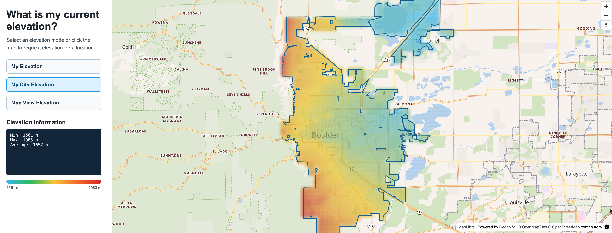

# What Is My Current Elevation? Create an Elevation Finder with Geoapify and MapLibre

Use Geoapify APIs and MapLibre GL JS to build an interactive elevation finder for the user's location, a selected city, or the current map view.

To get the current elevation, get coordinates from the browser Geolocation API or Geoapify IP Geolocation API, then send those coordinates to the Geoapify Elevation API. The API returns the elevation value for each requested location, which you can display as text, a map marker, or a map overlay.

## Quick Summary

- Problem: You need to show elevation for a user's location, a selected city, or the current map area.
- Solution: Use Geoapify Elevation API with MapLibre GL JS and Geoapify map tiles, then visualize elevation results as a point marker or map overlay.
- Stack: HTML, CSS, JavaScript, [MapLibre GL JS](https://maplibre.org/maplibre-gl-js/docs/).
- APIs: [Geoapify Elevation API](https://apidocs.geoapify.com/docs/elevation/), [IP Geolocation API](https://apidocs.geoapify.com/docs/ip-geolocation/), [Boundaries API](https://apidocs.geoapify.com/docs/boundaries/), [Geometry Operations API](https://apidocs.geoapify.com/docs/geometry-operations/), [Map Tiles API](https://apidocs.geoapify.com/docs/maps/map-tiles/).

## What This Example Includes

- Initial map centering with Geoapify IP Geolocation API
- `My Elevation` mode for browser location or IP-based fallback location
- `My City Elevation` mode that gets city boundaries and builds an elevation grid
- `Map View Elevation` mode that samples elevation points across the visible map area
- Map click handling for location and city selection
- Circle-based elevation overlay with dynamic colors and radius
- Elevation summary with minimum, maximum, and average values

## Live Demo

[](https://codepen.io/geoapify/pen/EaZgMeJ)

## Screenshot



## Quick Start

Open [`src/index.html`](./src/index.html) in your browser.

No build step is required.

This example includes a demo Geoapify API key. For your own project, create a free API key at [myprojects.geoapify.com](https://myprojects.geoapify.com/) and replace the `apiKey` value in [`src/script.js`](./src/script.js).

## Project Structure

| File | Purpose |
|------|---------|
| `src/index.html` | Source HTML |
| `src/script.js` | Source JavaScript for map setup, API requests, elevation modes, and rendering |
| `src/style.css` | Source CSS |

## Key Code Samples

### Get My Current Location

This example shows two ways to get a current location before requesting elevation:

- Geoapify IP Geolocation: works without user permission and is good for an initial map center or fallback location, but it returns an approximate location.
- Browser Geolocation: can return a more accurate device/browser location, but it requires user consent and may be unavailable or denied.

Get an approximate location with Geoapify IP Geolocation API:

```js
const apiKey = "YOUR_API_KEY";

async function getLocationFromIp() {
  const response = await fetch(`https://api.geoapify.com/v1/ipinfo?apiKey=${apiKey}`);

  if (!response.ok) {
    throw new Error(`IP Geolocation request failed with status ${response.status}`);
  }

  const result = await response.json();

  return {
    latitude: result.location.latitude,
    longitude: result.location.longitude,
  };
}
```

Request browser location first and use IP geolocation as a fallback:

```js
function getBrowserLocation() {
  return new Promise((resolve, reject) => {
    navigator.geolocation.getCurrentPosition(
      (position) => {
        resolve({
          latitude: position.coords.latitude,
          longitude: position.coords.longitude,
        });
      },
      reject,
      {
        enableHighAccuracy: true,
        timeout: 10000,
        maximumAge: 0,
      },
    );
  });
}

async function getCurrentLocation() {
  if (!("geolocation" in navigator)) {
    return getLocationFromIp();
  }

  return new Promise((resolve) => {
    getBrowserLocation().then(resolve, () => {
      getLocationFromIp().then(resolve);
    });
  });
}
```

Use the returned `latitude` and `longitude` as input for the Elevation API request. In the full example, the same location is also used to center the map and show a circle marker.

### Request Elevation for Locations

Send an array of latitude/longitude pairs in the request body to get elevation for one or more locations:

```js
const apiKey = "YOUR_API_KEY";

async function fetchElevation(locations) {
  const response = await fetch(`https://api.geoapify.com/v1/geodata/elevation?apiKey=${apiKey}`, {
    method: "POST",
    headers: {
      "Content-Type": "application/json",
    },
    body: JSON.stringify({
      format: "json",
      units: "metric",
      locations,
    }),
  });

  if (!response.ok) {
    const responseText = await response.text();
    throw new Error(`Elevation request failed with status ${response.status}. ${responseText}`);
  }

  return response.json();
}
```

For a current-location elevation request, send one location in the `locations` array:

```js
const location = await getCurrentLocation();

const elevationResult = await fetchElevation([
  {
    lat: location.latitude,
    lon: location.longitude,
  },
]);
```

### Get City Boundaries from Coordinates and Create a Point Grid Inside a City Boundary

For city elevation, first get the administrative boundaries for a coordinate, choose the smallest polygon boundary, then create grid points inside that boundary.

```js
async function fetchBoundaries(latitude, longitude) {
  const params = new URLSearchParams({
    lat: latitude,
    lon: longitude,
    geometry: "geometry_1000",
    apiKey,
  });

  const response = await fetch(`https://api.geoapify.com/v1/boundaries/part-of?${params}`);

  if (!response.ok) {
    const responseText = await response.text();
    throw new Error(`Boundaries request failed with status ${response.status}. ${responseText}`);
  }

  return response.json();
}

async function getSmallestBoundary(boundaries) {
  const polygons = boundaries.features.filter((feature) => {
    return feature.geometry.type === "Polygon" || feature.geometry.type === "MultiPolygon";
  });

  const boundariesWithArea = await Promise.all(
    polygons.map(async (feature) => ({
      feature,
      area: (await geometryOperation({
        operation: "area",
        polygon: feature.geometry,
      })).data,
    })),
  );

  return boundariesWithArea.sort((a, b) => a.area - b.area)[0].feature;
}
```

Use Geoapify Geometry Operations API to create a point grid and keep only points inside the selected boundary:

```js
async function createGridInsideBoundary(boundary) {
  const bboxResult = await geometryOperation({
    operation: "bbox",
    geometry: boundary.geometry,
  });

  const gridResult = await geometryOperation({
    operation: "grid",
    bbox: getBboxFromGeoJson(bboxResult.data),
    type: "point",
    cellSide: 0.2,
    params: {
      units: "kilometers",
    },
  });

  const pointsInside = await geometryOperation({
    operation: "pointsWithinPolygon",
    points: gridResult.data.features.map((feature) => feature.geometry),
    polygon: boundary.geometry,
  });

  return pointsInside.data.features.map((feature) => ({
    latitude: feature.geometry.coordinates[1],
    longitude: feature.geometry.coordinates[0],
  }));
}

function getBboxFromGeoJson(geoJson) {
  const coordinates = geoJson.coordinates[0];
  const longitudes = coordinates.map((position) => position[0]);
  const latitudes = coordinates.map((position) => position[1]);

  return [
    Math.min(...longitudes),
    Math.min(...latitudes),
    Math.max(...longitudes),
    Math.max(...latitudes),
  ];
}
```

The geometry calculations use the [Geoapify Geometry Operations API](https://apidocs.geoapify.com/docs/geometry-operations/). In the snippets above, `geometryOperation()` means a `POST` request to `/v1/geometry/operation` with different `operation` values: `area`, `bbox`, `grid`, and `pointsWithinPolygon`.

```js
async function geometryOperation(body) {
  const response = await fetch(`https://api.geoapify.com/v1/geometry/operation?apiKey=${apiKey}`, {
    method: "POST",
    headers: {
      "Content-Type": "application/json",
    },
    body: JSON.stringify(body),
  });

  if (!response.ok) {
    const responseText = await response.text();
    throw new Error(`Geometry operation failed with status ${response.status}. ${responseText}`);
  }

  return response.json();
}
```

The resulting grid points can be passed to the Elevation API as the `locations` array. The full example chunks grid points because Geoapify Geometry Operations and Elevation API requests have per-request point limits; send no more than 1000 points per request.

### Render Elevation Results as Colored Circles

Convert Elevation API results to GeoJSON point features and render them with a MapLibre `circle` layer. Each circle stores the elevation value in feature properties, then MapLibre styles the circle color with an expression.

```js
function createElevationFeatures(elevationResult) {
  return {
    type: "FeatureCollection",
    features: elevationResult.results.map((result) => ({
      type: "Feature",
      geometry: {
        type: "Point",
        coordinates: [result.location.lon, result.location.lat],
      },
      properties: {
        elevation: result.elevation,
      },
    })),
  };
}

function renderElevationCircles(map, elevationFeatures, stats) {
  map.getSource("elevation-points").setData(elevationFeatures);

  map.setPaintProperty("elevation-circles", "circle-color", [
    "interpolate",
    ["linear"],
    ["get", "elevation"],
    stats.min, "#38bdf8",
    stats.average, "#facc15",
    stats.max, "#dc2626",
  ]);
}
```

The full example initializes the source and circle layer once, then updates the source data after each elevation request:

```js
map.addSource("elevation-points", {
  type: "geojson",
  data: {
    type: "FeatureCollection",
    features: [],
  },
});

map.addLayer({
  id: "elevation-circles",
  type: "circle",
  source: "elevation-points",
  paint: {
    "circle-radius": [
      "interpolate",
      ["linear"],
      ["zoom"],
      8, 4,
      12, 12,
      16, 32,
    ],
    "circle-blur": 0.85,
    "circle-opacity": 0.55,
  },
});
```

This is a heatmap-style circle overlay, not a true MapLibre heatmap. A MapLibre heatmap layer aggregates point density with `heatmap-density`; this example keeps every sampled elevation point visible and colors each circle by its actual elevation value.

MapLibre documentation:

- [Circle layer](https://maplibre.org/maplibre-style-spec/layers/#circle)
- [Heatmap layer](https://maplibre.org/maplibre-style-spec/layers/#heatmap)
- [Style expressions](https://maplibre.org/maplibre-style-spec/expressions/)

## APIs and Libraries

| API / Library | Used For | Documentation |
|---------------|----------|---------------|
| [Geoapify Elevation API](https://www.geoapify.com/elevation-api/) | Get elevation for location points | [Docs](https://apidocs.geoapify.com/docs/elevation/) |
| [Geoapify IP Geolocation API](https://www.geoapify.com/ip-geolocation-api/) | Center the map and provide fallback location | [Docs](https://apidocs.geoapify.com/docs/ip-geolocation/) |
| [Geoapify Boundaries API](https://www.geoapify.com/boundaries-api/) | Get city boundaries from coordinates | [Docs](https://apidocs.geoapify.com/docs/boundaries/) |
| Geoapify Geometry Operations API | Calculate area, bounding boxes, grids, and points inside polygons | [Docs](https://apidocs.geoapify.com/docs/geometry-operations/) |
| [Geoapify Map Tiles API](https://www.geoapify.com/map-tiles/) | Display Geoapify map tiles in MapLibre | [Docs](https://apidocs.geoapify.com/docs/maps/map-tiles/) |
| [MapLibre GL JS](https://maplibre.org/) | Render the interactive map and circle layers | [Docs](https://maplibre.org/maplibre-gl-js/docs/) |

## Related Code Samples

| Code Sample | Why It Is Related |
|-------------|-------------------|
| [MapLibre + Geoapify Map Tiles Starter](https://github.com/geoapify/geoapify-quickstart-examples/tree/main/maps/maplibre-geoapify-map-tiles-starter) | Basic MapLibre setup with Geoapify map tiles |
| [Reverse Geocoding City Boundaries Size Comparison Drag](https://github.com/geoapify/geoapify-quickstart-examples/tree/main/geocoding-api/reverse-geocoding-city-boundaries-size-comparison-drag) | Works with city boundary geometry on an interactive map |
| [BBox Width/Height Calculator in Web Mercator](https://github.com/geoapify/geoapify-quickstart-examples/tree/main/maps/bbox-width-height-calculator-in-web-mercator-maplibre-geoapify) | Shows how map bounds and zoom affect map-based calculations |
| [Visualizing GeoJSON Polygons with Leaflet and Geoapify Isoline API](https://github.com/geoapify/geoapify-quickstart-examples/tree/main/isoline-api/visualizing-geojson-polygons-with-leaflet-and-geoapify-isoline-api) | Demonstrates rendering GeoJSON polygon data returned by a Geoapify API |

## License

MIT
