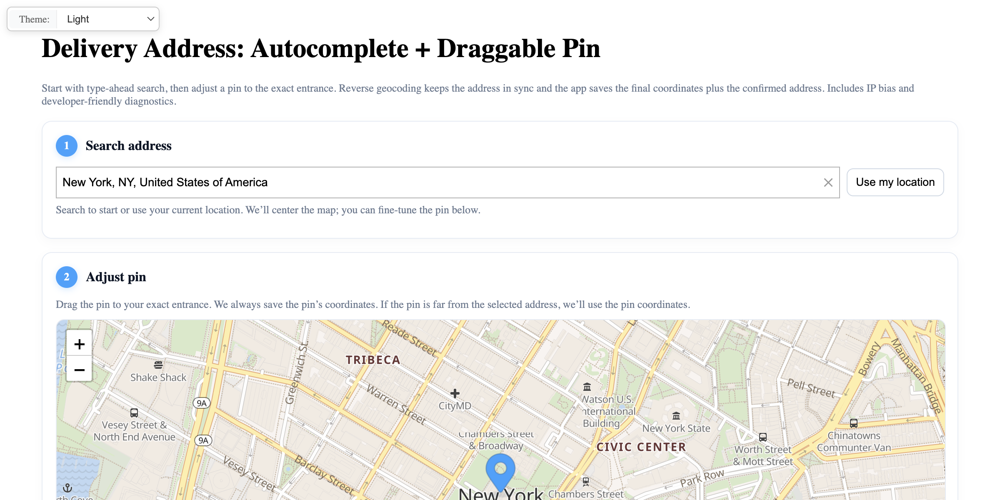

# Address Form with Map: Combined Address Search and Interactive Map

Full-featured address entry with autocomplete, interactive Leaflet map, browser geolocation, draggable marker, and reverse geocoding.

## Quick Summary

- Problem: Build a complete address input experience with map confirmation.
- Solution: Combine autocomplete with interactive map, geolocation, and reverse geocoding.
- Stack: HTML, CSS, JavaScript, Leaflet, Geoapify Geocoder Autocomplete.
- APIs: Geoapify Geocoding API, Geoapify Reverse Geocoding API, Geoapify IP Geolocation API, Geoapify Map Tiles API.

## What This Example Includes

- Address autocomplete with IP-based bias
- Interactive Leaflet map with draggable marker
- Browser geolocation button
- Reverse geocoding on marker drag
- Address confirmation workflow
- Developer panel with API call details
- Theme selector
- Source-based run from `src/index.html` (no build step)

## Use Cases

- Build location confirmation flows for delivery services.
- Create address verification with pin placement.
- Learn to combine multiple Geoapify APIs.

## Live Demo

[](https://codepen.io/team/geoapify/pen/qEZMPqP)

## Screenshot



## Quick Start

Open [`src/index.html`](./src/index.html) in your browser.

No local server is required.

Note: In rare cases, browser policies or extensions can restrict `file://` access. If that happens, run a local static server and open `src/index.html` via `http://localhost`, or use your IDE's "Open with Live Server" (or similar) option.

## Input and Output

- Input: Address search, map clicks, marker drags, geolocation button, Geoapify API key.
- Output: Confirmed address with coordinates, reverse geocoded address updates.

## Project Structure

| File | Purpose |
|------|---------|
| `src/index.html` | Source HTML |
| `src/script.js` | Source JavaScript (autocomplete, map, geocoding) |
| `src/style.css` | Source CSS |

## Code Samples

### Minimal HTML

```html
<!DOCTYPE html>
<html lang="en">
<head>
  <meta charset="UTF-8">
  <title>Address Form + Map</title>
  <link rel="stylesheet" href="https://unpkg.com/leaflet@1.9.4/dist/leaflet.css">
  <link rel="stylesheet" href="https://cdn.jsdelivr.net/npm/@geoapify/geocoder-autocomplete@3.0.1/styles/minimal.css">
  <style>
    #map { height: 400px; }
    #autocomplete { position: relative; z-index: 1000; }
  </style>
</head>
<body>
  <div id="autocomplete"></div>
  <button id="geo-btn">Use my location</button>
  <div id="map"></div>
  <script src="https://unpkg.com/leaflet@1.9.4/dist/leaflet.js"></script>
  <script src="https://cdn.jsdelivr.net/npm/@geoapify/geocoder-autocomplete@3.0.1/dist/index.min.js"></script>
  <script src="script.js"></script>
</body>
</html>
```

### Minimal JavaScript

```js
// Demo API key for quickstart only.
// Register for your own free API key at https://myprojects.geoapify.com/.
// Benefits: usage analytics, project-level limits, and reliable access for production use.
// This demo key can be blocked or restricted at any time.
const yourAPIKey = "YOUR_API_KEY";

const map = L.map("map").setView([20, 0], 2);
L.tileLayer(`https://maps.geoapify.com/v1/tile/osm-bright/{z}/{x}/{y}.png?apiKey=${yourAPIKey}`, {
  attribution: 'Powered by <a href="https://www.geoapify.com/">Geoapify</a> | © OpenMapTiles © OpenStreetMap'
}).addTo(map);

const ac = new autocomplete.GeocoderAutocomplete(
  document.getElementById("autocomplete"), yourAPIKey, { skipIcons: true }
);

let marker = null;
ac.on("select", (res) => {
  if (!res) return;
  const p = res.properties;
  if (!marker) {
    marker = L.marker([p.lat, p.lon], { draggable: true }).addTo(map);
    marker.on("dragend", onMarkerDragEnd);
  } else {
    marker.setLatLng([p.lat, p.lon]);
  }
  map.setView([p.lat, p.lon], 16);
});

function onMarkerDragEnd() {
  const { lat, lng } = marker.getLatLng();
  fetch(`https://api.geoapify.com/v1/geocode/reverse?lat=${lat}&lon=${lng}&apiKey=${yourAPIKey}`)
    .then((r) => r.json())
    .then((data) => {
      const pr = data.features[0]?.properties || {};
      if (pr.formatted) ac.setValue(pr.formatted);
    });
}

fetch(`https://api.geoapify.com/v1/ipinfo?apiKey=${yourAPIKey}`)
  .then((r) => r.json())
  .then((ip) => {
    if (ip.location) {
      map.setView([ip.location.latitude, ip.location.longitude], 12);
      ac.addBiasByProximity({ lat: ip.location.latitude, lon: ip.location.longitude });
    }
  });
```

## Customize

1. Open [`src/script.js`](./src/script.js).
2. Set your own API key in `yourAPIKey`.
3. Modify `MAX_LOCATION_TO_ADDRESS_ERROR` for address update threshold.
4. Adjust map initial view and zoom levels.
5. Customize marker icon via Marker Icon API.

API documentation:
- [Geoapify Address Autocomplete API](https://apidocs.geoapify.com/docs/geocoding/address-autocomplete/)
- [Geoapify Reverse Geocoding API](https://apidocs.geoapify.com/docs/geocoding/reverse-geocoding/)
- [Geoapify IP Geolocation API](https://apidocs.geoapify.com/docs/ip-geolocation/)
- [Geoapify Map Tiles API](https://apidocs.geoapify.com/docs/maps/map-tiles/)
- [Geoapify Marker Icon API](https://apidocs.geoapify.com/docs/icon/)

No build step is required. Edit files in `src/` and refresh the browser.

## Troubleshooting

| Problem | Likely Cause | What to Do |
|---------|--------------|------------|
| Autocomplete/Map not loading | CSS/JS files failed to load | Open browser DevTools (`Console` + `Network`) and confirm CDN files load without errors. |
| Map does not load data / API responds `403` | API key is invalid, restricted, or over limits | Get your own free key at `https://myprojects.geoapify.com/`, then update `yourAPIKey` in `src/script.js`. |
| Works inconsistently from local file | Browser policy blocks some `file://` behavior | Open with IDE Live Server (or any local static server) and run from `http://localhost`. |
| Output differs from expected | Local edits introduced a regression | Compare your files with the [CodePen demo](https://codepen.io/team/geoapify/pen/qEZMPqP) and align differences step by step. |

## APIs and Libraries

| Type | Name | Link | API Endpoint Used |
|------|------|------|-------------------|
| API | Geoapify Geocoding API | [Geocoding API](https://www.geoapify.com/geocoding-api/) | `https://api.geoapify.com/v1/geocode/autocomplete?...` |
| API | Geoapify Reverse Geocoding API | [Reverse Geocoding](https://www.geoapify.com/reverse-geocoding-api/) | `https://api.geoapify.com/v1/geocode/reverse?lat=...&lon=...&apiKey=...` |
| API | Geoapify IP Geolocation API | [IP Geolocation](https://www.geoapify.com/ip-geolocation-api/) | `https://api.geoapify.com/v1/ipinfo?apiKey=...` |
| API | Geoapify Map Tiles API | [Map Tiles](https://www.geoapify.com/map-tiles/) | `https://maps.geoapify.com/v1/tile/osm-bright/{z}/{x}/{y}.png?apiKey=...` |
| Library | Leaflet | [leafletjs.com](https://leafletjs.com/) | Not applicable |
| Library | Geoapify Geocoder Autocomplete | [npm](https://www.npmjs.com/package/@geoapify/geocoder-autocomplete) | Not applicable |

## Related Examples

| Example | Description | Link |
|---------|-------------|------|
| One-Field Form | Single field autocomplete | [Open](../one-field-address-form-single-field-autocomplete-input) |
| Leaflet Integration | Address search with markers | [Open](../leaflet-integration-address-search-and-markers-on-interactive-map) |
| MapLibre Integration | Vector maps with reverse geocoding | [Open](../maplibre-gl-integration-vector-maps-and-reverse-geocoding-on-click) |

## Useful Links

- Geoapify API docs: [https://apidocs.geoapify.com/](https://apidocs.geoapify.com/)
- CodePen demo: [https://codepen.io/team/geoapify/pen/qEZMPqP](https://codepen.io/team/geoapify/pen/qEZMPqP)
- Geoapify CodePen profile: [https://codepen.io/team/geoapify](https://codepen.io/team/geoapify)

## License

MIT

**Keywords**: address form, interactive map, draggable marker, reverse geocoding, geolocation, address confirmation
