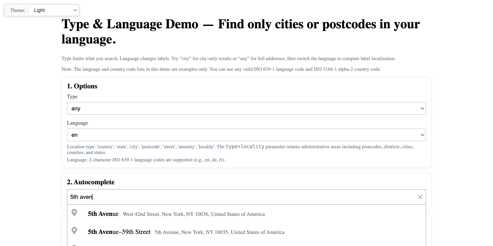

# Autocomplete Types: Filter Results by Location Type

Filter autocomplete suggestions by location type (city, street, postcode, etc.) with language selection and country filtering for postcodes.

## Quick Summary

- Problem: Filter autocomplete results to specific location types for targeted searches.
- Solution: Use Geocoder Autocomplete type filter to show only cities, streets, postcodes, etc.
- Stack: HTML, CSS, JavaScript, Geoapify Geocoder Autocomplete.
- APIs: Geoapify Geocoding API.

## What This Example Includes

- Type selector (city, street, postcode, country, amenity, locality)
- Language selector for localized results
- Country filter for postcode searches
- Selected result display with parsed fields
- Developer panel with JSON response
- Theme selector
- Source-based run from `src/index.html` (no build step)

## Use Cases

- Build city-only search for location selectors.
- Create postcode lookup forms with country filtering.
- Filter to streets only for address entry.

## Live Demo

[](https://codepen.io/team/geoapify/pen/MYyqEEe)

## Screenshot



## Quick Start

Open [`src/index.html`](./src/index.html) in your browser.

No local server is required.

Note: In rare cases, browser policies or extensions can restrict `file://` access. If that happens, run a local static server and open `src/index.html` via `http://localhost`, or use your IDE's "Open with Live Server" (or similar) option.

## Input and Output

- Input: Type selection, optional country filter, user text input, Geoapify API key.
- Output: Filtered autocomplete suggestions by location type, parsed result details.

## Project Structure

| File | Purpose |
|------|---------|
| `src/index.html` | Source HTML |
| `src/script.js` | Source JavaScript (type filtering, language, display) |
| `src/style.css` | Source CSS |

## Code Samples

### Minimal HTML

```html
<!DOCTYPE html>
<html lang="en">
<head>
  <meta charset="UTF-8">
  <title>Autocomplete Types</title>
  <link rel="stylesheet" href="https://cdn.jsdelivr.net/npm/@geoapify/geocoder-autocomplete@3.0.1/styles/minimal.css">
  <script src="https://cdn.jsdelivr.net/npm/@geoapify/geocoder-autocomplete@3.0.1/dist/index.min.js"></script>
  <style>
    #ac { position: relative; }
  </style>
</head>
<body>
  <select id="type-select">
    <option value="">any</option>
    <option value="city">city</option>
    <option value="postcode">postcode</option>
    <option value="street">street</option>
  </select>
  <select id="lang-select">
    <option value="en">en</option>
    <option value="de">de</option>
    <option value="fr">fr</option>
  </select>
  <div id="ac"></div>
  <script src="script.js"></script>
</body>
</html>
```

### Minimal JavaScript

```js
// Demo API key for quickstart only.
// Register for your own free API key at https://myprojects.geoapify.com/.
// Benefits: usage analytics, project-level limits, and reliable access for production use.
// This demo key can be blocked or restricted at any time.
const yourAPIKey = "YOUR_API_KEY";

const ac = new autocomplete.GeocoderAutocomplete(
  document.getElementById("ac"),
  yourAPIKey,
  { skipIcons: false, placeholder: "Start typing…" }
);

document.getElementById("type-select").addEventListener("change", (e) => {
  ac.setType(e.target.value || null);
});

document.getElementById("lang-select").addEventListener("change", (e) => {
  ac.setLang(e.target.value);
});

ac.on("select", (feature) => {
  console.log("Selected:", feature?.properties?.formatted);
});
```

## Customize

1. Open [`src/script.js`](./src/script.js).
2. Set your own API key in `yourAPIKey`.
3. Modify type options in the HTML select element.
4. Add more language options to the language selector.
5. Extend country filter options for postcode searches.

API documentation:
- [Geoapify Address Autocomplete API](https://apidocs.geoapify.com/docs/geocoding/address-autocomplete/)

No build step is required. Edit files in `src/` and refresh the browser.

## Troubleshooting

| Problem | Likely Cause | What to Do |
|---------|--------------|------------|
| Autocomplete not loading | Geocoder Autocomplete CSS/JS failed to load | Open browser DevTools (`Console` + `Network`) and confirm CDN files load without errors. |
| Map does not load data / API responds `403` | API key is invalid, restricted, or over limits | Get your own free key at `https://myprojects.geoapify.com/`, then update `yourAPIKey` in `src/script.js`. |
| Works inconsistently from local file | Browser policy blocks some `file://` behavior | Open with IDE Live Server (or any local static server) and run from `http://localhost`. |
| Output differs from expected | Local edits introduced a regression | Compare your files with the [CodePen demo](https://codepen.io/team/geoapify/pen/MYyqEEe) and align differences step by step. |

## APIs and Libraries

| Type | Name | Link | API Endpoint Used |
|------|------|------|-------------------|
| API | Geoapify Geocoding API | [Geocoding API](https://www.geoapify.com/geocoding-api/) | `https://api.geoapify.com/v1/geocode/autocomplete?type=...&lang=...&apiKey=...` |
| Library | Geoapify Geocoder Autocomplete | [npm](https://www.npmjs.com/package/@geoapify/geocoder-autocomplete) | Not applicable |

## Related Examples

| Example | Description | Link |
|---------|-------------|------|
| Filters and Bias | Country filtering and proximity bias | [Open](../filters-bias-demonstrates-filter-and-bias-customization) |
| Events Showcase | Available events and callbacks | [Open](../events-showcase-demonstrates-available-events-and-callbacks) |
| One-Field Form | Single field autocomplete | [Open](../one-field-address-form-single-field-autocomplete-input) |

## Useful Links

- Geoapify API docs: [https://apidocs.geoapify.com/](https://apidocs.geoapify.com/)
- CodePen demo: [https://codepen.io/team/geoapify/pen/MYyqEEe](https://codepen.io/team/geoapify/pen/MYyqEEe)
- Geoapify CodePen profile: [https://codepen.io/team/geoapify](https://codepen.io/team/geoapify)

## License

MIT

**Keywords**: autocomplete type filter, location type, city search, postcode lookup, language selection, geocoding filter
