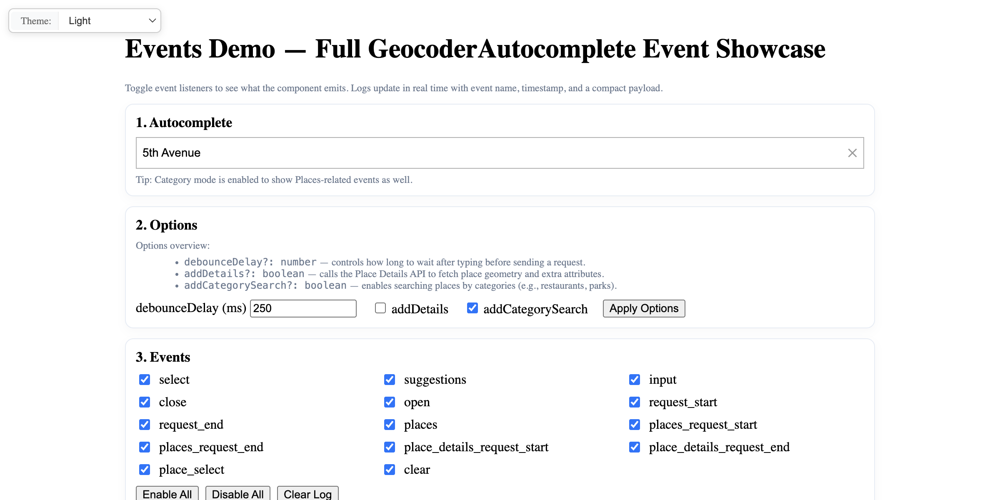

# Events Showcase: Available Events and Callbacks

Interactive demonstration of all Geocoder Autocomplete events with real-time logging, event toggles, and configuration options.

## Quick Summary

- Problem: Understand all available events in Geocoder Autocomplete for custom integrations.
- Solution: Display real-time event logging with toggle controls for each event type.
- Stack: HTML, CSS, JavaScript, Geoapify Geocoder Autocomplete.
- APIs: Geoapify Geocoding API, Geoapify Places API.

## What This Example Includes

- All 13+ autocomplete events displayed
- Toggle checkboxes to enable/disable event listeners
- Real-time console log with timestamps
- Configuration options (debounce, details, categories)
- Select all/deselect all buttons
- Clear log button
- Theme selector
- Source-based run from `src/index.html` (no build step)

## Use Cases

- Learn available events for custom autocomplete integrations.
- Debug autocomplete behavior in development.
- Understand event timing and payloads.

## Live Demo

[](https://codepen.io/team/geoapify/pen/MYyqEGj)

## Screenshot



## Quick Start

Open [`src/index.html`](./src/index.html) in your browser.

No local server is required.

Note: In rare cases, browser policies or extensions can restrict `file://` access. If that happens, run a local static server and open `src/index.html` via `http://localhost`, or use your IDE's "Open with Live Server" (or similar) option.

## Input and Output

- Input: User types in autocomplete, toggles event listeners, changes options, Geoapify API key.
- Output: Real-time event log showing event names, timestamps, and payloads.

## Project Structure

| File | Purpose |
|------|---------|
| `src/index.html` | Source HTML |
| `src/script.js` | Source JavaScript (event handlers, logging, toggles) |
| `src/style.css` | Source CSS |

## Code Samples

### Minimal HTML

```html
<!DOCTYPE html>
<html lang="en">
<head>
  <meta charset="UTF-8">
  <title>Events Showcase</title>
  <link rel="stylesheet" href="https://cdn.jsdelivr.net/npm/@geoapify/geocoder-autocomplete@3.0.1/styles/minimal.css">
  <script src="https://cdn.jsdelivr.net/npm/@geoapify/geocoder-autocomplete@3.0.1/dist/index.min.js"></script>
  <style>
    #ac { position: relative; }
  </style>
</head>
<body>
  <div id="ac"></div>
  <div id="console"></div>
  <script src="script.js"></script>
</body>
</html>
```

### Minimal JavaScript

```js
// Demo API key for quickstart only.
// Register for your own free API key at https://myprojects.geoapify.com/.
// Benefits: usage analytics, project-level limits, and reliable access for production use.
// This demo key can be blocked or restricted at any time.
const yourAPIKey = "YOUR_API_KEY";

const ac = new autocomplete.GeocoderAutocomplete(
  document.getElementById("ac"),
  yourAPIKey,
  { placeholder: "Type to search…", showPlacesList: true, addCategorySearch: true }
);

ac.on("select", (feature) => {
  console.log("select:", feature?.properties?.formatted);
});

ac.on("suggestions", (items) => {
  console.log("suggestions:", items.length);
});

ac.on("input", (text) => {
  console.log("input:", text);
});

ac.on("open", () => console.log("open"));
ac.on("close", () => console.log("close"));
```

## Customize

1. Open [`src/script.js`](./src/script.js).
2. Set your own API key in `yourAPIKey`.
3. Add more event handlers for additional events.
4. Modify logging format in `showLine()` and `fmt()`.
5. Adjust configuration options (debounce, details, categories).

API documentation:
- [Geoapify Address Autocomplete API](https://apidocs.geoapify.com/docs/geocoding/address-autocomplete/)
- [Geoapify Places API](https://apidocs.geoapify.com/docs/places/)
- [Geocoder Autocomplete Library](https://www.npmjs.com/package/@geoapify/geocoder-autocomplete)

No build step is required. Edit files in `src/` and refresh the browser.

## Troubleshooting

| Problem | Likely Cause | What to Do |
|---------|--------------|------------|
| Autocomplete not loading | Geocoder Autocomplete CSS/JS failed to load | Open browser DevTools (`Console` + `Network`) and confirm CDN files load without errors. |
| Map does not load data / API responds `403` | API key is invalid, restricted, or over limits | Get your own free key at `https://myprojects.geoapify.com/`, then update `yourAPIKey` in `src/script.js`. |
| Works inconsistently from local file | Browser policy blocks some `file://` behavior | Open with IDE Live Server (or any local static server) and run from `http://localhost`. |
| Output differs from expected | Local edits introduced a regression | Compare your files with the [CodePen demo](https://codepen.io/team/geoapify/pen/MYyqEGj) and align differences step by step. |

## APIs and Libraries

| Type | Name | Link | API Endpoint Used |
|------|------|------|-------------------|
| API | Geoapify Geocoding API | [Geocoding API](https://www.geoapify.com/geocoding-api/) | `https://api.geoapify.com/v1/geocode/autocomplete?...&apiKey=...` |
| API | Geoapify Places API | [Places API](https://www.geoapify.com/places-api/) | `https://api.geoapify.com/v2/places?categories=...&apiKey=...` |
| Library | Geoapify Geocoder Autocomplete | [npm](https://www.npmjs.com/package/@geoapify/geocoder-autocomplete) | Not applicable |

## Related Examples

| Example | Description | Link |
|---------|-------------|------|
| Autocomplete Types | Filter by location type | [Open](../autocomplete-types-filter-results-by-location-type) |
| Filters and Bias | Country filtering and proximity bias | [Open](../filters-bias-demonstrates-filter-and-bias-customization) |
| Places Search | Category search with built-in list | [Open](../places-search-no-map-category-search-with-built-in-list) |

## Useful Links

- Geoapify API docs: [https://apidocs.geoapify.com/](https://apidocs.geoapify.com/)
- CodePen demo: [https://codepen.io/team/geoapify/pen/MYyqEGj](https://codepen.io/team/geoapify/pen/MYyqEGj)
- Geoapify CodePen profile: [https://codepen.io/team/geoapify](https://codepen.io/team/geoapify)

## License

MIT

**Keywords**: autocomplete events, callbacks, event logging, debug, request tracking, places events
