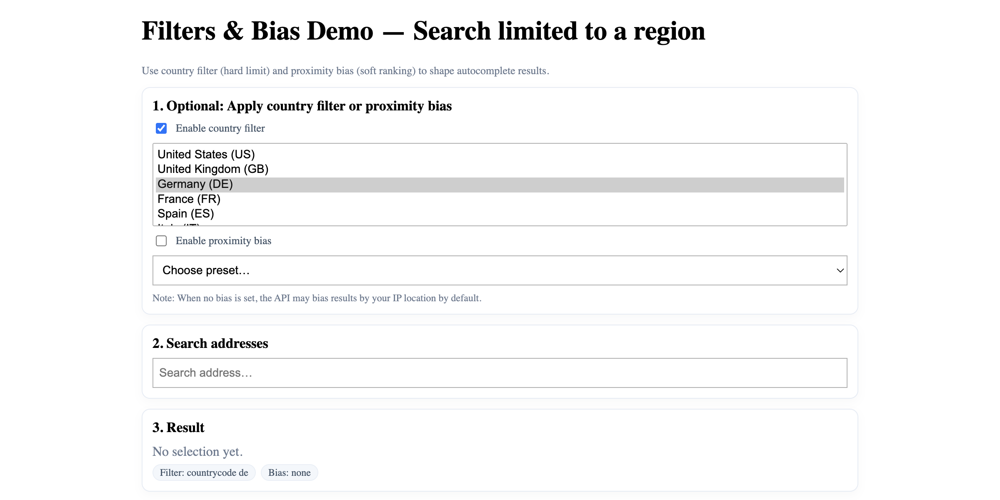

# Filters and Bias: Filter and Bias Customization

Demonstrate country filtering and proximity bias to customize autocomplete search results by geographic constraints.

## Quick Summary

- Problem: Limit and prioritize autocomplete results by country and location.
- Solution: Use country filters and proximity bias to focus search results.
- Stack: HTML, CSS, JavaScript, Geoapify Geocoder Autocomplete.
- APIs: Geoapify Geocoding API.

## What This Example Includes

- Country filter with multi-select
- Proximity bias with preset locations
- Toggle controls for filter/bias activation
- Status chips showing active constraints
- Developer panel with API URL and suggestions
- Selected result display
- Theme selector
- Source-based run from `src/index.html` (no build step)

## Use Cases

- Restrict address search to specific countries.
- Prioritize results near user's location.
- Build region-specific address forms.

## Live Demo

[](https://codepen.io/team/geoapify/pen/pvyOWag)

## Screenshot



## Quick Start

Open [`src/index.html`](./src/index.html) in your browser.

No local server is required.

Note: In rare cases, browser policies or extensions can restrict `file://` access. If that happens, run a local static server and open `src/index.html` via `http://localhost`, or use your IDE's "Open with Live Server" (or similar) option.

## Input and Output

- Input: Country selection, bias location preset, user text input, Geoapify API key.
- Output: Filtered and biased autocomplete suggestions, status chips.

## Project Structure

| File | Purpose |
|------|---------|
| `src/index.html` | Source HTML |
| `src/script.js` | Source JavaScript (filters, bias, status display) |
| `src/style.css` | Source CSS |

## Code Samples

### Minimal HTML

```html
<!DOCTYPE html>
<html lang="en">
<head>
  <meta charset="UTF-8">
  <title>Filters and Bias</title>
  <link rel="stylesheet" href="https://cdn.jsdelivr.net/npm/@geoapify/geocoder-autocomplete@3.0.1/styles/minimal.css">
  <script src="https://cdn.jsdelivr.net/npm/@geoapify/geocoder-autocomplete@3.0.1/dist/index.min.js"></script>
</head>
<body>
  <select id="countries" multiple>
    <option value="us">United States</option>
    <option value="de">Germany</option>
    <option value="fr">France</option>
  </select>
  <select id="bias-preset">
    <option value="52.52,13.405">Berlin</option>
    <option value="48.8566,2.3522">Paris</option>
    <option value="40.7128,-74.006">New York</option>
  </select>
  <div id="search"></div>
  <script src="script.js"></script>
</body>
</html>
```

### Minimal JavaScript

```js
// Demo API key for quickstart only.
// Register for your own free API key at https://myprojects.geoapify.com/.
// Benefits: usage analytics, project-level limits, and reliable access for production use.
// This demo key can be blocked or restricted at any time.
const yourAPIKey = "YOUR_API_KEY";

const ac = new autocomplete.GeocoderAutocomplete(
  document.getElementById("search"),
  yourAPIKey,
  { placeholder: "Search address…" }
);

document.getElementById("countries").addEventListener("change", (e) => {
  ac.clearFilters();
  const codes = Array.from(e.target.selectedOptions).map((o) => o.value);
  if (codes.length) ac.addFilterByCountry(codes);
});

document.getElementById("bias-preset").addEventListener("change", (e) => {
  const [lat, lon] = e.target.value.split(",").map(Number);
  ac.clearBias();
  ac.addBiasByProximity({ lat, lon });
});

ac.on("select", (res) => {
  console.log("Selected:", res?.properties?.formatted);
});
```

## Customize

1. Open [`src/script.js`](./src/script.js).
2. Set your own API key in `yourAPIKey`.
3. Add more countries to the country select options.
4. Add more bias preset locations.
5. Combine with type filtering for advanced constraints.

API documentation:
- [Geoapify Address Autocomplete API](https://apidocs.geoapify.com/docs/geocoding/address-autocomplete/)

No build step is required. Edit files in `src/` and refresh the browser.

## Troubleshooting

| Problem | Likely Cause | What to Do |
|---------|--------------|------------|
| Autocomplete not loading | Geocoder Autocomplete CSS/JS failed to load | Open browser DevTools (`Console` + `Network`) and confirm CDN files load without errors. |
| Map does not load data / API responds `403` | API key is invalid, restricted, or over limits | Get your own free key at `https://myprojects.geoapify.com/`, then update `yourAPIKey` in `src/script.js`. |
| Works inconsistently from local file | Browser policy blocks some `file://` behavior | Open with IDE Live Server (or any local static server) and run from `http://localhost`. |
| Output differs from expected | Local edits introduced a regression | Compare your files with the [CodePen demo](https://codepen.io/team/geoapify/pen/pvyOWag) and align differences step by step. |

## APIs and Libraries

| Type | Name | Link | API Endpoint Used |
|------|------|------|-------------------|
| API | Geoapify Geocoding API | [Geocoding API](https://www.geoapify.com/geocoding-api/) | `https://api.geoapify.com/v1/geocode/autocomplete?filter=countrycode:...&bias=proximity:...&apiKey=...` |
| Library | Geoapify Geocoder Autocomplete | [npm](https://www.npmjs.com/package/@geoapify/geocoder-autocomplete) | Not applicable |

## Related Examples

| Example | Description | Link |
|---------|-------------|------|
| Autocomplete Types | Filter by location type | [Open](../autocomplete-types-filter-results-by-location-type) |
| Events Showcase | Available events and callbacks | [Open](../events-showcase-demonstrates-available-events-and-callbacks) |
| Address Form Map | Address search with map | [Open](../address-form-map-combined-address-search-with-interactive-map) |

## Useful Links

- Geoapify API docs: [https://apidocs.geoapify.com/](https://apidocs.geoapify.com/)
- CodePen demo: [https://codepen.io/team/geoapify/pen/pvyOWag](https://codepen.io/team/geoapify/pen/pvyOWag)
- Geoapify CodePen profile: [https://codepen.io/team/geoapify](https://codepen.io/team/geoapify)

## License

MIT

**Keywords**: country filter, proximity bias, geocoding filter, location bias, multi-country, search constraints
