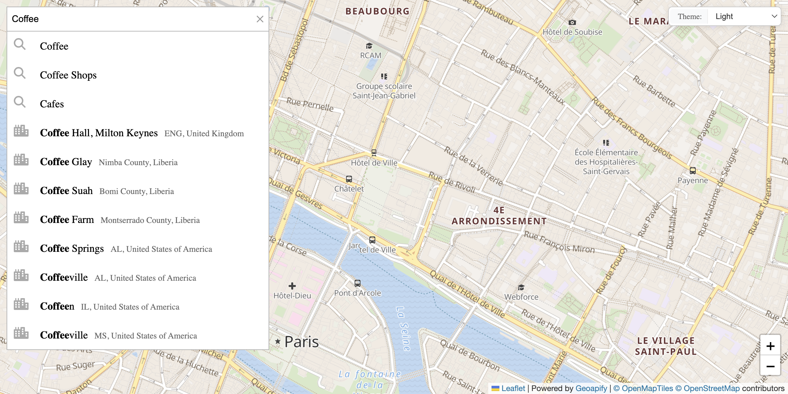

# Leaflet Built-in Places List: Category Search with Default UI

Search for places by category with the built-in places list UI, automatic map markers, and viewport-based search updates.

## Quick Summary

- Problem: Add category search with places list to an address autocomplete.
- Solution: Enable built-in places list with map-synchronized markers and viewport bias.
- Stack: HTML, CSS, JavaScript, Leaflet, Geoapify Geocoder Autocomplete.
- APIs: Geoapify Geocoding API, Geoapify Places API, Geoapify Map Tiles API.

## What This Example Includes

- Address autocomplete with category search
- Built-in places list UI
- Map markers for all places
- Viewport-based bias and filtering
- Automatic search on map pan (when category active)
- Place selection with popup
- Loading indicator for places requests
- Theme-aware map tiles
- Source-based run from `src/index.html` (no build step)

## Use Cases

- Build location finders with category exploration.
- Create "near me" search experiences.
- Add places discovery to address forms.

## Live Demo

[](https://codepen.io/team/geoapify/pen/yyOxzdM)

## Screenshot



## Quick Start

Open [`src/index.html`](./src/index.html) in your browser.

No local server is required.

Note: In rare cases, browser policies or extensions can restrict `file://` access. If that happens, run a local static server and open `src/index.html` via `http://localhost`, or use your IDE's "Open with Live Server" (or similar) option.

## Input and Output

- Input: Address text or category selection, map pan/zoom, Geoapify API key.
- Output: Autocomplete suggestions, places list, map markers with popups.

## Project Structure

| File | Purpose |
|------|---------|
| `src/index.html` | Source HTML |
| `src/script.js` | Source JavaScript (places, markers, viewport sync) |
| `src/style.css` | Source CSS |

## Code Samples

### Minimal HTML

```html
<!DOCTYPE html>
<html lang="en">
<head>
  <meta charset="UTF-8">
  <title>Category Search with Built-in List</title>
  <link rel="stylesheet" href="https://unpkg.com/leaflet@1.9.4/dist/leaflet.css">
  <link rel="stylesheet" href="https://cdn.jsdelivr.net/npm/@geoapify/geocoder-autocomplete@3.0.1/styles/minimal.css">
  <style>
    #map { height: 500px; }
  </style>
</head>
<body>
  <div id="autocomplete"></div>
  <div id="map"></div>
  <script src="https://unpkg.com/leaflet@1.9.4/dist/leaflet.js"></script>
  <script src="https://cdn.jsdelivr.net/npm/@geoapify/geocoder-autocomplete@3.0.1/dist/index.min.js"></script>
  <script src="script.js"></script>
</body>
</html>
```

### Minimal JavaScript

```js
// Demo API key for quickstart only.
// Register for your own free API key at https://myprojects.geoapify.com/.
// Benefits: usage analytics, project-level limits, and reliable access for production use.
// This demo key can be blocked or restricted at any time.
const yourAPIKey = "YOUR_API_KEY";

const map = L.map("map").setView([48.8566, 2.3522], 14);
L.tileLayer(`https://maps.geoapify.com/v1/tile/osm-bright/{z}/{x}/{y}.png?apiKey=${yourAPIKey}`, {
  attribution: 'Powered by <a href="https://www.geoapify.com/">Geoapify</a>'
}).addTo(map);

const ac = new autocomplete.GeocoderAutocomplete(
  document.getElementById("autocomplete"), yourAPIKey,
  { addCategorySearch: true, showPlacesList: true, limit: 8 }
);

let markers = [];
ac.on("places", (places) => {
  markers.forEach((m) => m.remove());
  markers = [];
  places.forEach((place, i) => {
    const m = L.marker([place.properties.lat, place.properties.lon]).addTo(map);
    m.bindPopup(place.properties.name);
    m.on("click", () => ac.selectPlace(i));
    markers.push(m);
  });
});

map.on("moveend", () => {
  const center = map.getCenter();
  ac.addBiasByProximity({ lat: center.lat, lon: center.lng });
});
```

## Customize

1. Open [`src/script.js`](./src/script.js).
2. Set your own API key in `yourAPIKey`.
3. Modify initial map center and zoom.
4. Adjust requery distance threshold (currently 500m).
5. Customize marker icon via Marker Icon API.

API documentation:
- [Geoapify Address Autocomplete API](https://apidocs.geoapify.com/docs/geocoding/address-autocomplete/)
- [Geoapify Places API](https://apidocs.geoapify.com/docs/places/)
- [Geoapify Map Tiles API](https://apidocs.geoapify.com/docs/maps/map-tiles/)
- [Geoapify Marker Icon API](https://apidocs.geoapify.com/docs/icon/)

No build step is required. Edit files in `src/` and refresh the browser.

## Troubleshooting

| Problem | Likely Cause | What to Do |
|---------|--------------|------------|
| Autocomplete/Map not loading | CSS/JS files failed to load | Open browser DevTools (`Console` + `Network`) and confirm CDN files load without errors. |
| Map does not load data / API responds `403` | API key is invalid, restricted, or over limits | Get your own free key at `https://myprojects.geoapify.com/`, then update `yourAPIKey` in `src/script.js`. |
| Works inconsistently from local file | Browser policy blocks some `file://` behavior | Open with IDE Live Server (or any local static server) and run from `http://localhost`. |
| Output differs from expected | Local edits introduced a regression | Compare your files with the [CodePen demo](https://codepen.io/team/geoapify/pen/yyOxzdM) and align differences step by step. |

## APIs and Libraries

| Type | Name | Link | API Endpoint Used |
|------|------|------|-------------------|
| API | Geoapify Geocoding API | [Geocoding API](https://www.geoapify.com/geocoding-api/) | `https://api.geoapify.com/v1/geocode/autocomplete?...&apiKey=...` |
| API | Geoapify Places API | [Places API](https://www.geoapify.com/places-api/) | `https://api.geoapify.com/v2/places?categories=...&filter=rect:...&apiKey=...` |
| API | Geoapify Map Tiles API | [Map Tiles](https://www.geoapify.com/map-tiles/) | `https://maps.geoapify.com/v1/tile/osm-bright/{z}/{x}/{y}.png?apiKey=...` |
| Library | Leaflet | [leafletjs.com](https://leafletjs.com/) | Not applicable |
| Library | Geoapify Geocoder Autocomplete | [npm](https://www.npmjs.com/package/@geoapify/geocoder-autocomplete) | Not applicable |

## Related Examples

| Example | Description | Link |
|---------|-------------|------|
| Custom Places List | Custom UI for places results | [Open](../leaflet-custom-places-list-custom-ui-for-places-results) |
| Leaflet Integration | Address search with markers | [Open](../leaflet-integration-address-search-and-markers-on-interactive-map) |
| Places Search | Category search without map | [Open](../places-search-no-map-category-search-with-built-in-list) |

## Useful Links

- Geoapify API docs: [https://apidocs.geoapify.com/](https://apidocs.geoapify.com/)
- CodePen demo: [https://codepen.io/team/geoapify/pen/yyOxzdM](https://codepen.io/team/geoapify/pen/yyOxzdM)
- Geoapify CodePen profile: [https://codepen.io/team/geoapify](https://codepen.io/team/geoapify)

## License

MIT

**Keywords**: places list, category search, viewport bias, map markers, built-in UI, places API
