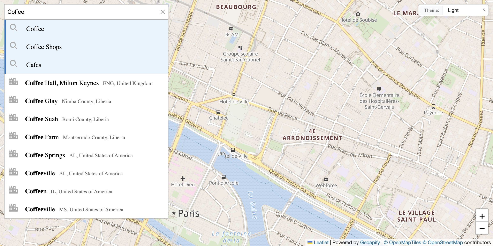

# Leaflet Custom Places List: Custom UI for Places Results

Create a custom places list UI with your own styling while using Geocoder Autocomplete for category search.

## Quick Summary

- Problem: Build a custom-designed places list instead of the built-in UI.
- Solution: Use places events to render custom list items with your own styling.
- Stack: HTML, CSS, JavaScript, Leaflet, Geoapify Geocoder Autocomplete.
- APIs: Geoapify Geocoding API, Geoapify Places API, Geoapify Map Tiles API.

## What This Example Includes

- Address autocomplete with category search
- Custom places list UI with card-style items
- Map markers synchronized with list
- Highlight on hover/selection
- Category badges and distance display
- Responsive layout
- Theme selector
- Source-based run from `src/index.html` (no build step)

## Use Cases

- Brand places lists with custom styling.
- Add additional information to place cards.
- Create unique UX for location discovery.

## Live Demo

[](https://codepen.io/team/geoapify/pen/yyOxzwg)

## Screenshot



## Quick Start

Open [`src/index.html`](./src/index.html) in your browser.

No local server is required.

Note: In rare cases, browser policies or extensions can restrict `file://` access. If that happens, run a local static server and open `src/index.html` via `http://localhost`, or use your IDE's "Open with Live Server" (or similar) option.

## Input and Output

- Input: Address text or category selection, Geoapify API key.
- Output: Custom-styled places list, map markers, selection highlighting.

## Project Structure

| File | Purpose |
|------|---------|
| `src/index.html` | Source HTML |
| `src/script.js` | Source JavaScript (places rendering, list interaction) |
| `src/style.css` | Source CSS |

## Code Samples

### Minimal HTML

```html
<!DOCTYPE html>
<html lang="en">
<head>
  <meta charset="UTF-8">
  <title>Custom Places List</title>
  <link rel="stylesheet" href="https://unpkg.com/leaflet@1.9.4/dist/leaflet.css">
  <link rel="stylesheet" href="https://cdn.jsdelivr.net/npm/@geoapify/geocoder-autocomplete@3.0.1/styles/minimal.css">
  <style>
    #map { height: 400px; }
    .place-card { padding: 10px; border-bottom: 1px solid #eee; cursor: pointer; }
    .place-card.selected { background: #e3f2fd; }
  </style>
</head>
<body>
  <div id="autocomplete"></div>
  <div id="places-list"></div>
  <div id="map"></div>
  <script src="https://unpkg.com/leaflet@1.9.4/dist/leaflet.js"></script>
  <script src="https://cdn.jsdelivr.net/npm/@geoapify/geocoder-autocomplete@3.0.1/dist/index.min.js"></script>
  <script src="script.js"></script>
</body>
</html>
```

### Minimal JavaScript

```js
// Demo API key for quickstart only.
// Register for your own free API key at https://myprojects.geoapify.com/.
// Benefits: usage analytics, project-level limits, and reliable access for production use.
// This demo key can be blocked or restricted at any time.
const yourAPIKey = "YOUR_API_KEY";

const map = L.map("map").setView([48.8566, 2.3522], 14);
L.tileLayer(`https://maps.geoapify.com/v1/tile/osm-bright/{z}/{x}/{y}.png?apiKey=${yourAPIKey}`).addTo(map);

const ac = new autocomplete.GeocoderAutocomplete(
  document.getElementById("autocomplete"), yourAPIKey,
  { addCategorySearch: true, showPlacesList: false }
);

let markers = [], places = [];
ac.on("places", (data) => {
  places = data;
  markers.forEach((m) => m.remove());
  markers = [];
  document.getElementById("places-list").innerHTML = "";
  
  data.forEach((place, i) => {
    const m = L.marker([place.properties.lat, place.properties.lon]).addTo(map);
    m.bindPopup(place.properties.name);
    markers.push(m);
    
    const card = document.createElement("div");
    card.className = "place-card";
    card.textContent = place.properties.name;
    card.onclick = () => {
      document.querySelectorAll(".place-card").forEach((c) => c.classList.remove("selected"));
      card.classList.add("selected");
      map.panTo([place.properties.lat, place.properties.lon]);
      m.openPopup();
    };
    document.getElementById("places-list").appendChild(card);
  });
});
```

## Customize

1. Open [`src/script.js`](./src/script.js).
2. Set your own API key in `yourAPIKey`.
3. Modify card HTML structure in the places handler.
4. Adjust CSS styling for place cards.
5. Add more place details (hours, rating, etc.).

API documentation:
- [Geoapify Address Autocomplete API](https://apidocs.geoapify.com/docs/geocoding/address-autocomplete/)
- [Geoapify Places API](https://apidocs.geoapify.com/docs/places/)
- [Geoapify Map Tiles API](https://apidocs.geoapify.com/docs/maps/map-tiles/)
- [Geoapify Marker Icon API](https://apidocs.geoapify.com/docs/icon/)

No build step is required. Edit files in `src/` and refresh the browser.

## Troubleshooting

| Problem | Likely Cause | What to Do |
|---------|--------------|------------|
| Autocomplete/Map not loading | CSS/JS files failed to load | Open browser DevTools (`Console` + `Network`) and confirm CDN files load without errors. |
| Map does not load data / API responds `403` | API key is invalid, restricted, or over limits | Get your own free key at `https://myprojects.geoapify.com/`, then update `yourAPIKey` in `src/script.js`. |
| Works inconsistently from local file | Browser policy blocks some `file://` behavior | Open with IDE Live Server (or any local static server) and run from `http://localhost`. |
| Output differs from expected | Local edits introduced a regression | Compare your files with the [CodePen demo](https://codepen.io/team/geoapify/pen/yyOxzwg) and align differences step by step. |

## APIs and Libraries

| Type | Name | Link | API Endpoint Used |
|------|------|------|-------------------|
| API | Geoapify Geocoding API | [Geocoding API](https://www.geoapify.com/geocoding-api/) | `https://api.geoapify.com/v1/geocode/autocomplete?...&apiKey=...` |
| API | Geoapify Places API | [Places API](https://www.geoapify.com/places-api/) | `https://api.geoapify.com/v2/places?categories=...&apiKey=...` |
| API | Geoapify Map Tiles API | [Map Tiles](https://www.geoapify.com/map-tiles/) | `https://maps.geoapify.com/v1/tile/osm-bright/{z}/{x}/{y}.png?apiKey=...` |
| Library | Leaflet | [leafletjs.com](https://leafletjs.com/) | Not applicable |
| Library | Geoapify Geocoder Autocomplete | [npm](https://www.npmjs.com/package/@geoapify/geocoder-autocomplete) | Not applicable |

## Related Examples

| Example | Description | Link |
|---------|-------------|------|
| Built-in Places List | Default places list UI | [Open](../leaflet-built-in-places-list-category-search-with-default-ui) |
| Leaflet Integration | Address search with markers | [Open](../leaflet-integration-address-search-and-markers-on-interactive-map) |
| Places Category Search | Dynamic markers by category | [Open](../../places-api/leaflet-demo-geoapify-places-api-category-search-with-dynamic-markers) |

## Useful Links

- Geoapify API docs: [https://apidocs.geoapify.com/](https://apidocs.geoapify.com/)
- CodePen demo: [https://codepen.io/team/geoapify/pen/yyOxzwg](https://codepen.io/team/geoapify/pen/yyOxzwg)
- Geoapify CodePen profile: [https://codepen.io/team/geoapify](https://codepen.io/team/geoapify)

## License

MIT

**Keywords**: custom places list, custom UI, places cards, category search, styled list, places API
