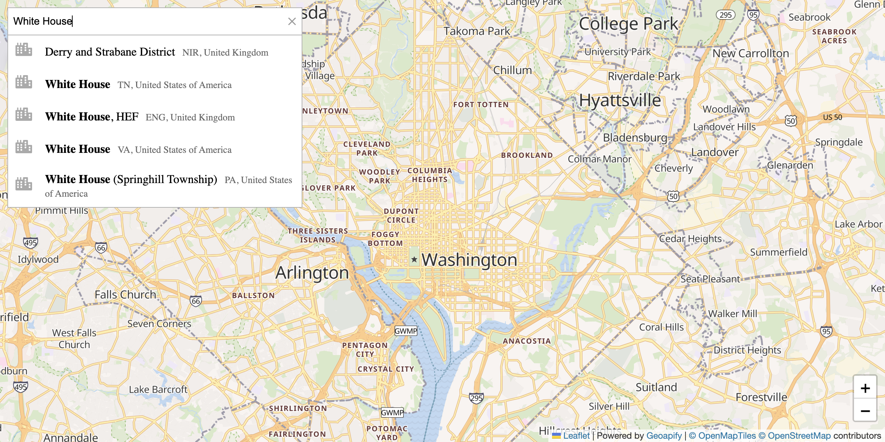

# Leaflet Integration: Address Search and Markers on Interactive Map

Integrate Geocoder Autocomplete with Leaflet to display search results as markers on an interactive map.

## Quick Summary

- Problem: Add address search with map marker display to a Leaflet application.
- Solution: Connect autocomplete selection to Leaflet marker placement and map centering.
- Stack: HTML, CSS, JavaScript, Leaflet, Geoapify Geocoder Autocomplete.
- APIs: Geoapify Geocoding API, Geoapify Marker Icon API, Geoapify Map Tiles API.

## What This Example Includes

- Address autocomplete integrated with Leaflet
- Marker placement on selection
- Map centering on selected location
- Custom marker icon from Marker Icon API
- Popup with address information
- Theme selector
- Source-based run from `src/index.html` (no build step)

## Use Cases

- Build location search for web applications.
- Add address lookup to mapping tools.
- Create store locators with search.

## Live Demo

[](https://codepen.io/team/geoapify/pen/qEZMPLY)

## Screenshot



## Quick Start

Open [`src/index.html`](./src/index.html) in your browser.

No local server is required.

Note: In rare cases, browser policies or extensions can restrict `file://` access. If that happens, run a local static server and open `src/index.html` via `http://localhost`, or use your IDE's "Open with Live Server" (or similar) option.

## Input and Output

- Input: User types address in autocomplete, selects from suggestions, Geoapify API key.
- Output: Marker placed on map at selected location, map centered on marker.

## Project Structure

| File | Purpose |
|------|---------|
| `src/index.html` | Source HTML |
| `src/script.js` | Source JavaScript (autocomplete, marker, map) |
| `src/style.css` | Source CSS |

## Code Samples

### Minimal HTML

```html
<!DOCTYPE html>
<html lang="en">
<head>
  <meta charset="UTF-8">
  <title>Leaflet Address Search</title>
  <link rel="stylesheet" href="https://unpkg.com/leaflet@1.9.4/dist/leaflet.css">
  <link rel="stylesheet" href="https://cdn.jsdelivr.net/npm/@geoapify/geocoder-autocomplete@3.0.1/styles/minimal.css">
  <style>
    #map { height: 500px; }
  </style>
</head>
<body>
  <div id="autocomplete"></div>
  <div id="map"></div>
  <script src="https://unpkg.com/leaflet@1.9.4/dist/leaflet.js"></script>
  <script src="https://cdn.jsdelivr.net/npm/@geoapify/geocoder-autocomplete@3.0.1/dist/index.min.js"></script>
  <script src="script.js"></script>
</body>
</html>
```

### Minimal JavaScript

```js
// Demo API key for quickstart only.
// Register for your own free API key at https://myprojects.geoapify.com/.
// Benefits: usage analytics, project-level limits, and reliable access for production use.
// This demo key can be blocked or restricted at any time.
const yourAPIKey = "YOUR_API_KEY";

const map = L.map("map").setView([48.8566, 2.3522], 12);
L.tileLayer(`https://maps.geoapify.com/v1/tile/osm-bright/{z}/{x}/{y}.png?apiKey=${yourAPIKey}`, {
  attribution: 'Powered by <a href="https://www.geoapify.com/">Geoapify</a>'
}).addTo(map);

const ac = new autocomplete.GeocoderAutocomplete(
  document.getElementById("autocomplete"), yourAPIKey, {}
);

const markerIcon = L.icon({
  iconUrl: `https://api.geoapify.com/v1/icon/?type=awesome&color=%232ea2ff&size=large&scaleFactor=2&apiKey=${yourAPIKey}`,
  iconSize: [38, 56],
  iconAnchor: [19, 51]
});

let marker;
ac.on("select", (location) => {
  if (marker) marker.remove();
  if (location) {
    marker = L.marker([location.properties.lat, location.properties.lon], { icon: markerIcon }).addTo(map);
    map.panTo([location.properties.lat, location.properties.lon]);
  }
});
```

## Customize

1. Open [`src/script.js`](./src/script.js).
2. Set your own API key in `yourAPIKey`.
3. Modify initial map center and zoom.
4. Customize marker icon (color, type, size).
5. Add bias based on map viewport.

API documentation:
- [Geoapify Address Autocomplete API](https://apidocs.geoapify.com/docs/geocoding/address-autocomplete/)
- [Geoapify Marker Icon API](https://apidocs.geoapify.com/docs/icon/)
- [Geoapify Map Tiles API](https://apidocs.geoapify.com/docs/maps/map-tiles/)

No build step is required. Edit files in `src/` and refresh the browser.

## Troubleshooting

| Problem | Likely Cause | What to Do |
|---------|--------------|------------|
| Autocomplete/Map not loading | CSS/JS files failed to load | Open browser DevTools (`Console` + `Network`) and confirm CDN files load without errors. |
| Map does not load data / API responds `403` | API key is invalid, restricted, or over limits | Get your own free key at `https://myprojects.geoapify.com/`, then update `yourAPIKey` in `src/script.js`. |
| Works inconsistently from local file | Browser policy blocks some `file://` behavior | Open with IDE Live Server (or any local static server) and run from `http://localhost`. |
| Output differs from expected | Local edits introduced a regression | Compare your files with the [CodePen demo](https://codepen.io/team/geoapify/pen/qEZMPLY) and align differences step by step. |

## APIs and Libraries

| Type | Name | Link | API Endpoint Used |
|------|------|------|-------------------|
| API | Geoapify Geocoding API | [Geocoding API](https://www.geoapify.com/geocoding-api/) | `https://api.geoapify.com/v1/geocode/autocomplete?...&apiKey=...` |
| API | Geoapify Marker Icon API | [Marker Icon API](https://www.geoapify.com/map-marker-icon-api/) | `https://api.geoapify.com/v1/icon/?type=awesome&...&apiKey=...` |
| API | Geoapify Map Tiles API | [Map Tiles](https://www.geoapify.com/map-tiles/) | `https://maps.geoapify.com/v1/tile/osm-bright/{z}/{x}/{y}.png?apiKey=...` |
| Library | Leaflet | [leafletjs.com](https://leafletjs.com/) | Not applicable |
| Library | Geoapify Geocoder Autocomplete | [npm](https://www.npmjs.com/package/@geoapify/geocoder-autocomplete) | Not applicable |

## Related Examples

| Example | Description | Link |
|---------|-------------|------|
| MapLibre Integration | Vector maps with reverse geocoding | [Open](../maplibre-gl-integration-vector-maps-and-reverse-geocoding-on-click) |
| Address Form Map | Full address form with map | [Open](../address-form-map-combined-address-search-with-interactive-map) |
| Built-in Places List | Category search with places list | [Open](../leaflet-built-in-places-list-category-search-with-default-ui) |

## Useful Links

- Geoapify API docs: [https://apidocs.geoapify.com/](https://apidocs.geoapify.com/)
- CodePen demo: [https://codepen.io/team/geoapify/pen/qEZMPLY](https://codepen.io/team/geoapify/pen/qEZMPLY)
- Geoapify CodePen profile: [https://codepen.io/team/geoapify](https://codepen.io/team/geoapify)

## License

MIT

**Keywords**: Leaflet integration, address search, map marker, autocomplete map, location search, geocoding
