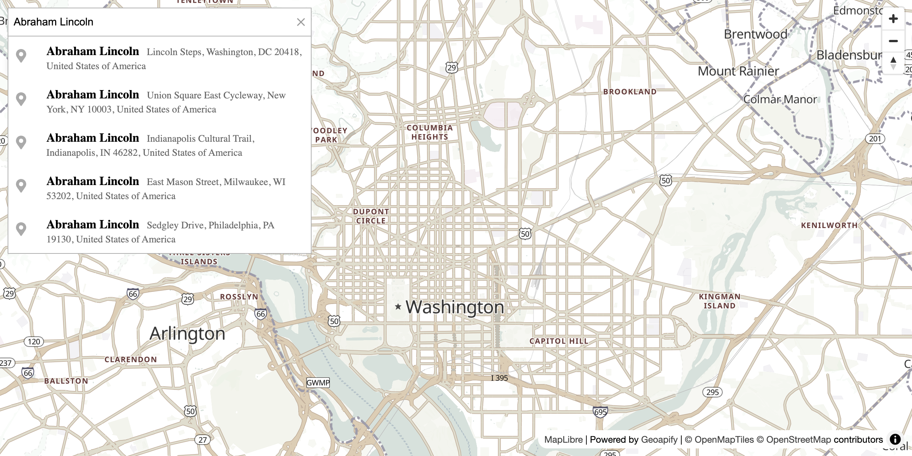

# MapLibre GL Integration: Vector Maps and Reverse Geocoding on Click

Integrate Geocoder Autocomplete with MapLibre GL JS, featuring vector tiles and reverse geocoding when clicking the map.

## Quick Summary

- Problem: Combine address search with vector maps and click-to-reverse-geocode functionality.
- Solution: Use MapLibre GL with autocomplete and reverse geocoding on map clicks.
- Stack: HTML, CSS, JavaScript, MapLibre GL JS, Geoapify Geocoder Autocomplete.
- APIs: Geoapify Geocoding API, Geoapify Reverse Geocoding API, Geoapify Marker Icon API, Geoapify Map Tiles API.

## What This Example Includes

- Address autocomplete with MapLibre GL JS
- Vector tile map rendering
- Marker placement on selection
- Reverse geocoding on map click
- Auto-fill autocomplete from reverse geocode
- Custom DOM-based markers
- Theme selector
- Source-based run from `src/index.html` (no build step)

## Use Cases

- Build address lookup with click-to-select on map.
- Create location pickers with reverse geocoding.
- Integrate smooth vector maps with address search.

## Live Demo

[](https://codepen.io/team/geoapify/pen/yyOxPBM)

## Screenshot



## Quick Start

Open [`src/index.html`](./src/index.html) in your browser.

No local server is required.

Note: In rare cases, browser policies or extensions can restrict `file://` access. If that happens, run a local static server and open `src/index.html` via `http://localhost`, or use your IDE's "Open with Live Server" (or similar) option.

## Input and Output

- Input: User types address or clicks map location, Geoapify API key.
- Output: Marker placed, autocomplete filled with reverse geocoded address.

## Project Structure

| File | Purpose |
|------|---------|
| `src/index.html` | Source HTML |
| `src/script.js` | Source JavaScript (MapLibre, autocomplete, reverse geocoding) |
| `src/style.css` | Source CSS |

## Code Samples

### Minimal HTML

```html
<!DOCTYPE html>
<html lang="en">
<head>
  <meta charset="UTF-8">
  <title>MapLibre Address Search</title>
  <link href="https://unpkg.com/maplibre-gl@latest/dist/maplibre-gl.css" rel="stylesheet">
  <link rel="stylesheet" href="https://cdn.jsdelivr.net/npm/@geoapify/geocoder-autocomplete@3.0.1/styles/minimal.css">
  <style>
    #map { height: 500px; }
  </style>
</head>
<body>
  <div id="autocomplete"></div>
  <div id="map"></div>
  <script src="https://unpkg.com/maplibre-gl@latest/dist/maplibre-gl.js"></script>
  <script src="https://cdn.jsdelivr.net/npm/@geoapify/geocoder-autocomplete@3.0.1/dist/index.min.js"></script>
  <script src="script.js"></script>
</body>
</html>
```

### Minimal JavaScript

```js
// Demo API key for quickstart only.
// Register for your own free API key at https://myprojects.geoapify.com/.
// Benefits: usage analytics, project-level limits, and reliable access for production use.
// This demo key can be blocked or restricted at any time.
const yourAPIKey = "YOUR_API_KEY";

const map = new maplibregl.Map({
  container: "map",
  style: `https://maps.geoapify.com/v1/styles/osm-bright/style.json?apiKey=${yourAPIKey}`,
  center: [2.3522, 48.8566],
  zoom: 12
});

const ac = new autocomplete.GeocoderAutocomplete(
  document.getElementById("autocomplete"), yourAPIKey, {}
);

let marker;
ac.on("select", (location) => {
  if (marker) marker.remove();
  if (location) {
    const el = document.createElement("img");
    el.src = `https://api.geoapify.com/v1/icon/?type=awesome&color=%232ea2ff&apiKey=${yourAPIKey}`;
    el.style.width = "38px";
    marker = new maplibregl.Marker({ element: el, anchor: "bottom" })
      .setLngLat([location.properties.lon, location.properties.lat])
      .addTo(map);
    map.flyTo({ center: [location.properties.lon, location.properties.lat], zoom: 14 });
  }
});

map.on("click", async (e) => {
  const res = await fetch(`https://api.geoapify.com/v1/geocode/reverse?lat=${e.lngLat.lat}&lon=${e.lngLat.lng}&apiKey=${yourAPIKey}`);
  const data = await res.json();
  if (data.features?.[0]) ac.setValue(data.features[0].properties.formatted);
});
```

## Customize

1. Open [`src/script.js`](./src/script.js).
2. Set your own API key in `yourAPIKey`.
3. Change map style in the style URL.
4. Modify marker appearance via Marker Icon API.
5. Add bias based on map center.

API documentation:
- [Geoapify Address Autocomplete API](https://apidocs.geoapify.com/docs/geocoding/address-autocomplete/)
- [Geoapify Reverse Geocoding API](https://apidocs.geoapify.com/docs/geocoding/reverse-geocoding/)
- [Geoapify Map Tiles API](https://apidocs.geoapify.com/docs/maps/map-tiles/)
- [Geoapify Marker Icon API](https://apidocs.geoapify.com/docs/icon/)

No build step is required. Edit files in `src/` and refresh the browser.

## Troubleshooting

| Problem | Likely Cause | What to Do |
|---------|--------------|------------|
| Autocomplete/Map not loading | CSS/JS files failed to load | Open browser DevTools (`Console` + `Network`) and confirm CDN files load without errors. |
| Map does not load data / API responds `403` | API key is invalid, restricted, or over limits | Get your own free key at `https://myprojects.geoapify.com/`, then update `yourAPIKey` in `src/script.js`. |
| Works inconsistently from local file | Browser policy blocks some `file://` behavior | Open with IDE Live Server (or any local static server) and run from `http://localhost`. |
| Output differs from expected | Local edits introduced a regression | Compare your files with the [CodePen demo](https://codepen.io/team/geoapify/pen/yyOxPBM) and align differences step by step. |

## APIs and Libraries

| Type | Name | Link | API Endpoint Used |
|------|------|------|-------------------|
| API | Geoapify Geocoding API | [Geocoding API](https://www.geoapify.com/geocoding-api/) | `https://api.geoapify.com/v1/geocode/autocomplete?...&apiKey=...` |
| API | Geoapify Reverse Geocoding API | [Reverse Geocoding](https://www.geoapify.com/reverse-geocoding-api/) | `https://api.geoapify.com/v1/geocode/reverse?lat=...&lon=...&apiKey=...` |
| API | Geoapify Marker Icon API | [Marker Icon API](https://www.geoapify.com/map-marker-icon-api/) | `https://api.geoapify.com/v1/icon/?type=awesome&...&apiKey=...` |
| API | Geoapify Map Tiles API | [Map Tiles](https://www.geoapify.com/map-tiles/) | `https://maps.geoapify.com/v1/styles/osm-bright/style.json?apiKey=...` |
| Library | MapLibre GL JS | [maplibre.org](https://maplibre.org/) | Not applicable |
| Library | Geoapify Geocoder Autocomplete | [npm](https://www.npmjs.com/package/@geoapify/geocoder-autocomplete) | Not applicable |

## Related Examples

| Example | Description | Link |
|---------|-------------|------|
| Leaflet Integration | Address search with Leaflet | [Open](../leaflet-integration-address-search-and-markers-on-interactive-map) |
| Address Form Map | Full address form with map | [Open](../address-form-map-combined-address-search-with-interactive-map) |
| MapLibre Starter | MapLibre with Geoapify tiles | [Open](../../maps/maplibre-geoapify-map-tiles-starter) |

## Useful Links

- Geoapify API docs: [https://apidocs.geoapify.com/](https://apidocs.geoapify.com/)
- CodePen demo: [https://codepen.io/team/geoapify/pen/yyOxPBM](https://codepen.io/team/geoapify/pen/yyOxPBM)
- Geoapify CodePen profile: [https://codepen.io/team/geoapify](https://codepen.io/team/geoapify)

## License

MIT

**Keywords**: MapLibre integration, vector maps, reverse geocoding, click to geocode, address search, location picker
