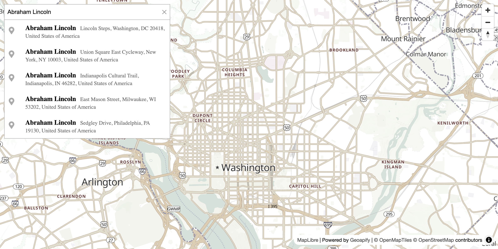

# MapLibre GL Address Autocomplete with Reverse Geocoding on Click

Add Geoapify Address Autocomplete to a MapLibre GL JS vector map. Select an address to place a custom marker, or click the map to reverse geocode the clicked coordinates and fill the autocomplete input.

## Quick Summary

- Problem: Build a MapLibre GL JS location picker with address autocomplete and click-to-select map interaction.
- Solution: Use Geoapify Address Autocomplete API for typed address search and Geoapify Reverse Geocoding API for clicked map coordinates.
- Stack: HTML, CSS, JavaScript, MapLibre GL JS, Geoapify Geocoder Autocomplete.
- Uses: [Geoapify Address Autocomplete API](https://apidocs.geoapify.com/docs/geocoding/address-autocomplete/), [Geoapify Reverse Geocoding API](https://apidocs.geoapify.com/docs/geocoding/reverse-geocoding/), [Geoapify Map Tiles API](https://apidocs.geoapify.com/docs/maps/map-tiles/), [Geoapify Marker Icon API](https://apidocs.geoapify.com/docs/icon/), and [MapLibre GL JS](https://maplibre.org/).

## What This Code Sample Shows

This code sample demonstrates a MapLibre GL JS location picker with Geoapify Address Autocomplete, vector map tiles, custom markers, and reverse geocoding on map click.

It shows how to:

- Add Geoapify Address Autocomplete to a MapLibre GL JS map.
- Render Geoapify vector map tiles with MapLibre GL JS.
- Place a custom DOM marker after selecting an address.
- Reverse geocode clicked map coordinates.
- Fill the autocomplete input with the reverse geocoded address.
- Switch between light and dark map/autocomplete themes.
- Run from `src/index.html` with no build step.

## Live Demo

[](https://codepen.io/geoapify/pen/PwWqzjL)

## Screenshot



## Quick Start

For the most reliable result, run this example with a local static server and open [`src/index.html`](./src/index.html) from `http://localhost`.

For example:

```bash
python3 -m http.server
```

Then open `http://localhost:8000/src/`.

You can also try opening `src/index.html` directly in your browser, but some browsers, extensions, or security policies may restrict `file://` pages that load external scripts, styles, or API requests.

## Important Files

| File | Purpose |
|------|---------|
| [`src/index.html`](./src/index.html) | Loads MapLibre GL JS, Geoapify Geocoder Autocomplete, the map container, and the theme selector. |
| [`src/script.js`](./src/script.js) | Initializes the MapLibre map, address autocomplete, custom marker, reverse geocoding, and theme switching. |
| [`src/style.css`](./src/style.css) | Styles the full-page map, autocomplete panel, and theme selector. |

## Code Samples

Replace `YOUR_API_KEY` in the code samples with your own Geoapify API key. You can create one in [Geoapify My Projects](https://myprojects.geoapify.com/); Geoapify includes a free tier for getting started.

### 1. Create a MapLibre Map with Geoapify Map Tiles

Add a map container to your HTML:

```html
<div id="map"></div>
```

Initialize MapLibre GL JS with a Geoapify vector map style:

```js
const yourAPIKey = "YOUR_API_KEY";

const map = new maplibregl.Map({
  container: "map",
  style: `https://maps.geoapify.com/v1/styles/osm-bright-grey/style.json?apiKey=${yourAPIKey}`,
  center: [-77.02346458179596, 38.908838755401035],
  zoom: 12,
  maxZoom: 20
});
```

Key options:

| Option | Purpose |
|--------|---------|
| `container` | The `id` of the HTML element where MapLibre renders the map. |
| `style` | Geoapify vector map style URL. The `apiKey` query parameter authorizes access to Geoapify map tiles. |
| `center` | Initial map center in `[longitude, latitude]` format. |
| `zoom` | Initial zoom level. Higher values show a more detailed, closer view. |
| `maxZoom` | Maximum zoom level allowed for the map. |

### 2. Add Geoapify Geocoder Autocomplete

Load the Geoapify Geocoder Autocomplete CSS and JavaScript files:

```html
<link
  rel="stylesheet"
  href="https://cdn.jsdelivr.net/npm/@geoapify/geocoder-autocomplete@3.0.1/styles/minimal.css"
>

<script src="https://cdn.jsdelivr.net/npm/@geoapify/geocoder-autocomplete@3.0.1/dist/index.min.js"></script>
```

Add a container for the autocomplete input:

```html
<div id="autocomplete"></div>
```

Initialize the autocomplete component with your Geoapify API key:

```js
const autocompleteInput = new autocomplete.GeocoderAutocomplete(
  document.getElementById("autocomplete"),
  yourAPIKey,
  {
    /* Geocoder options */
  }
);
```

Listen for the `select` event to get the selected address result:

```js
autocompleteInput.on("select", (location) => {
  if (!location) {
    return;
  }

  console.log(location.properties.formatted);
  console.log(location.properties.lon, location.properties.lat);
});
```

Key parts:

| Part | Purpose |
|------|---------|
| `@geoapify/geocoder-autocomplete` | Browser library that adds Geoapify address autocomplete UI and suggestions. |
| `minimal.css` | Default autocomplete theme stylesheet. |
| `#autocomplete` | HTML element where the autocomplete input is rendered. |
| `yourAPIKey` | Geoapify API key used for autocomplete requests. |
| Geocoder options | Optional configuration for filters, bias, language, result types, and other autocomplete behavior. |
| `select` event | Fires when the user selects an autocomplete result. The selected feature contains address text and coordinates in `location.properties`. |

### 3. Create a Custom Marker

Create a marker icon element with the Geoapify Marker Icon API:

```js
const markerShadowOffset = 5;

function createMarkerIcon() {
  const img = document.createElement("img");
  img.src = `https://api.geoapify.com/v2/icon/?type=awesome&color=%23ff5b5f&size=50&scaleFactor=2&apiKey=${yourAPIKey}`;
  img.style.width = "38px";
  img.style.height = "55px";
  return img;
}
```

The marker icon size is `50`, but the generated image is displayed as `55px` high because it also includes a shadow. Add a small marker offset when placing the icon so the visual pin point aligns with the selected map coordinate.

Place the marker on the map with MapLibre GL JS:

```js
let marker;

function updateSelection(location) {
  if (!location) {
    return;
  }

  if (marker) {
    marker.remove();
  }

  marker = new maplibregl.Marker({
    element: createMarkerIcon(),
    anchor: "bottom",
    offset: [0, markerShadowOffset]
  })
    .setLngLat([location.properties.lon, location.properties.lat])
    .addTo(map);
}
```

Key parts:

| Part | Purpose |
|------|---------|
| `createMarkerIcon()` | Creates a custom DOM marker image with the Geoapify Marker Icon API. |
| `marker.remove()` | Removes the previous marker before adding a new one. |
| `anchor: "bottom"` | Aligns the bottom of the marker icon with the selected map coordinate. |
| `offset: [0, markerShadowOffset]` | Moves the marker slightly to account for the icon shadow. |
| `setLngLat()` | Places the marker at `[longitude, latitude]`. |

### 4. Reverse Geocode Map Clicks

Listen for clicks on the MapLibre map and read the clicked coordinates:

```js
map.on("click", function (e) {
  const lat = e.lngLat.lat;
  const lon = e.lngLat.lng;

  getAddressByLatLon(lat, lon)
    .then((location) => {
      updateSelection(location);
    })
    .catch((error) => {
      console.error("Reverse geocoding failed:", error);
    });
});
```

Call the Geoapify Reverse Geocoding API with the clicked latitude and longitude:

```js
function getAddressByLatLon(lat, lon) {
  return fetch(
    `https://api.geoapify.com/v1/geocode/reverse?lat=${lat}&lon=${lon}&apiKey=${yourAPIKey}`
  )
    .then((result) => {
      if (!result.ok) {
        throw new Error(`Reverse geocoding request failed with status ${result.status}`);
      }

      return result.json();
    })
    .then((result) => {
      if (result && result.features && result.features.length) {
        return result.features[0];
      }

      return null;
    });
}
```

Key parts:

| Part | Purpose |
|------|---------|
| `map.on("click", ...)` | Runs when the user clicks the map. |
| `e.lngLat.lat` / `e.lngLat.lng` | Latitude and longitude of the clicked map point. |
| Reverse Geocoding API | Converts clicked coordinates into the nearest address or place. |
| `result.ok` | Checks whether the HTTP request succeeded before reading JSON. |
| `result.features[0]` | First reverse geocoding result returned by Geoapify. |
| `updateSelection(location)` | Reuses the marker placement logic from the previous sample. |

## Troubleshooting

| Problem | Likely Cause | What to Do |
|---------|--------------|------------|
| Autocomplete/Map not loading | CSS/JS files failed to load | Open browser DevTools (`Console` + `Network`) and confirm CDN files load without errors. |
| Map does not load data / API responds `403` | API key is invalid, restricted, or over limits | Get your own free key at `https://myprojects.geoapify.com/`, then update `yourAPIKey` in `src/script.js`. |
| Works inconsistently from local file | Browser policy blocks some `file://` behavior | Open with IDE Live Server (or any local static server) and run from `http://localhost`. |

## APIs and Libraries

| Type | API or Library | Docs | Endpoint Used |
|------|----------------|------|---------------|
| API | [Geoapify Address Autocomplete API](https://www.geoapify.com/geocoding-api/) | [Docs](https://apidocs.geoapify.com/docs/geocoding/address-autocomplete/) | `https://api.geoapify.com/v1/geocode/autocomplete?...&apiKey=...` |
| API | [Geoapify Reverse Geocoding API](https://www.geoapify.com/reverse-geocoding-api/) | [Docs](https://apidocs.geoapify.com/docs/geocoding/reverse-geocoding/) | `https://api.geoapify.com/v1/geocode/reverse?lat=...&lon=...&apiKey=...` |
| API | [Geoapify Marker Icon API](https://www.geoapify.com/map-marker-icon-api/) | [Docs](https://apidocs.geoapify.com/docs/icon/) | `https://api.geoapify.com/v2/icon/?type=awesome&...&apiKey=...` |
| API | [Geoapify Map Tiles API](https://www.geoapify.com/map-tiles/) | [Docs](https://apidocs.geoapify.com/docs/maps/map-tiles/) | `https://maps.geoapify.com/v1/styles/osm-bright/style.json?apiKey=...` |
| Library | [MapLibre GL JS](https://maplibre.org/) | [Docs](https://maplibre.org/maplibre-gl-js/docs/) | Not applicable |
| Library | [Geoapify Geocoder Autocomplete](https://www.npmjs.com/package/@geoapify/geocoder-autocomplete) | [Docs](https://www.npmjs.com/package/@geoapify/geocoder-autocomplete) | Not applicable |

## Related Examples

| Example | Why It Is Related | Link |
|---------|-------------------|------|
| Leaflet Address Autocomplete Integration | Shows the same Geoapify Address Autocomplete workflow with Leaflet instead of MapLibre GL JS. | [Open](https://github.com/geoapify/geoapify-quickstart-examples/tree/main/geocoder-autocomplete/leaflet-integration-address-search-and-markers-on-interactive-map) |
| Address Form with Interactive Map | Extends address autocomplete into a full address form and map-based location picker. | [Open](https://github.com/geoapify/geoapify-quickstart-examples/tree/main/geocoder-autocomplete/address-form-map-combined-address-search-with-interactive-map) |
| Autocomplete Type Filters | Shows how to filter autocomplete suggestions by result type, such as city, street, postcode, or address. | [Open](https://github.com/geoapify/geoapify-quickstart-examples/tree/main/geocoder-autocomplete/autocomplete-types-filter-results-by-location-type) |
| Geocoder Autocomplete Events | Shows available autocomplete events and callbacks for custom integrations. | [Open](https://github.com/geoapify/geoapify-quickstart-examples/tree/main/geocoder-autocomplete/events-showcase-demonstrates-available-events-and-callbacks) |
| Reverse Geocoding by Coordinates | Focuses on reverse geocoding clicked coordinates and comparing returned address levels. | [Open](https://github.com/geoapify/geoapify-quickstart-examples/tree/main/geocoding-api/how-to-get-city-postcode-street-address-by-coordinates) |
| MapLibre Custom Markers and Popups | Shows more advanced custom marker and popup handling with MapLibre GL JS. | [Open](https://github.com/geoapify/geoapify-quickstart-examples/tree/main/maps/maplibre-custom-markers-popups-with-geoapify-place-details) |
| MapLibre Map Tiles Starter | Shows the minimal MapLibre GL JS setup with Geoapify vector map tiles. | [Open](https://github.com/geoapify/geoapify-quickstart-examples/tree/main/maps/maplibre-geoapify-map-tiles-starter) |

## Useful Links

- [Geoapify account and API keys](https://myprojects.geoapify.com/)
- [Geoapify API documentation](https://apidocs.geoapify.com/)
- [CodePen demo](https://codepen.io/geoapify/pen/PwWqzjL)
- [Geoapify CodePen profile](https://codepen.io/team/geoapify)

## License

MIT

**Keywords**: Geoapify MapLibre example, MapLibre address search, MapLibre GL JS address autocomplete, Geoapify geocoder autocomplete, MapLibre reverse geocoding on click, JavaScript location picker, Geoapify vector map tiles, custom marker MapLibre GL JS, coordinates to address, click map to get address
