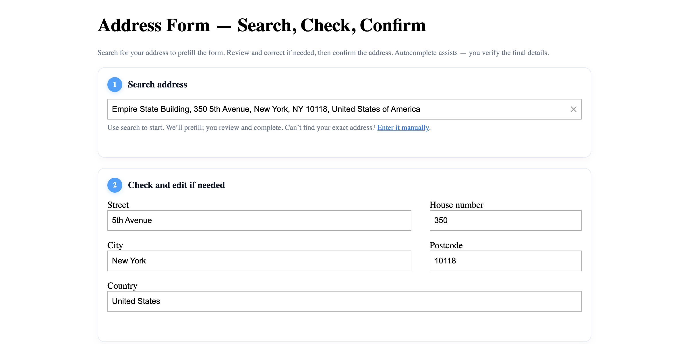

# One-Field Address Form with Single-Field Autocomplete Input

A streamlined address input using Geoapify Geocoder Autocomplete that auto-fills address fields and validates with the Geocoding API.

## Quick Summary

- Problem: Simplify address entry with autocomplete while providing structured field access.
- Solution: Use Geocoder Autocomplete with auto-fill for individual address fields.
- Stack: HTML, CSS, JavaScript, Geoapify Geocoder Autocomplete.
- APIs: Geoapify Geocoding API.

## What This Example Includes

- Single address search field with autocomplete
- Auto-fill of individual address fields (street, house number, city, postcode, country)
- Match level badge (building/street/city/ambiguous)
- Confirm button with validation
- Developer panel showing API response
- Theme selector
- Source-based run from `src/index.html` (no build step)

## Use Cases

- Build streamlined address entry forms for e-commerce checkout.
- Create address verification workflows.
- Learn how to parse autocomplete responses into structured fields.

## Live Demo

[](https://codepen.io/team/geoapify/pen/QwNVgXQ)

## Screenshot



## Quick Start

Open [`src/index.html`](./src/index.html) in your browser.

No local server is required.

Note: In rare cases, browser policies or extensions can restrict `file://` access. If that happens, run a local static server and open `src/index.html` via `http://localhost`, or use your IDE's "Open with Live Server" (or similar) option.

## Input and Output

- Input: User types address in autocomplete field, selects from suggestions, Geoapify API key.
- Output: Auto-filled address fields, match level indicator, geocoding verification result.

## Project Structure

| File | Purpose |
|------|---------|
| `src/index.html` | Source HTML |
| `src/script.js` | Source JavaScript (autocomplete, field filling, verification) |
| `src/style.css` | Source CSS |

## Code Samples

### Minimal HTML

```html
<!DOCTYPE html>
<html lang="en">
<head>
  <meta charset="UTF-8">
  <title>One-Field Address Form</title>
  <link rel="stylesheet" href="https://cdn.jsdelivr.net/npm/@geoapify/geocoder-autocomplete@3.0.1/styles/minimal.css">
  <script src="https://cdn.jsdelivr.net/npm/@geoapify/geocoder-autocomplete@3.0.1/dist/index.min.js"></script>
</head>
<body>
  <div id="address-search"></div>
  <input id="street" placeholder="Street">
  <input id="housenumber" placeholder="House number">
  <input id="city" placeholder="City">
  <input id="postcode" placeholder="Postcode">
  <input id="country" placeholder="Country">
  <button onclick="confirmAddress()">Confirm</button>
  <script src="script.js"></script>
</body>
</html>
```

### Minimal JavaScript

```js
// Demo API key for quickstart only.
// Register for your own free API key at https://myprojects.geoapify.com/.
// Benefits: usage analytics, project-level limits, and reliable access for production use.
// This demo key can be blocked or restricted at any time.
const yourAPIKey = "YOUR_API_KEY";

const ac = new autocomplete.GeocoderAutocomplete(
  document.getElementById("address-search"), yourAPIKey,
  { skipIcons: true, allowNonVerifiedHouseNumber: true }
);

ac.on("select", (res) => {
  if (!res) return;
  const p = res.properties;
  document.getElementById("street").value = p.street || "";
  document.getElementById("housenumber").value = p.housenumber || "";
  document.getElementById("city").value = p.city || p.town || "";
  document.getElementById("postcode").value = p.postcode || "";
  document.getElementById("country").value = p.country || "";
});

function confirmAddress() {
  const params = new URLSearchParams({
    street: document.getElementById("street").value,
    housenumber: document.getElementById("housenumber").value,
    city: document.getElementById("city").value,
    postcode: document.getElementById("postcode").value,
    country: document.getElementById("country").value,
    apiKey: yourAPIKey
  });
  fetch(`https://api.geoapify.com/v1/geocode/search?${params}`)
    .then((r) => r.json())
    .then((data) => console.log("Verified:", data.features[0]?.properties));
}
```

## Customize

1. Open [`src/script.js`](./src/script.js).
2. Set your own API key in `yourAPIKey`.
3. Adjust autocomplete options (placeholder, icons, etc.).
4. Modify field mapping in the `select` event handler.
5. Customize match level thresholds in `matchLevel()`.

API documentation:
- [Geoapify Address Autocomplete API](https://apidocs.geoapify.com/docs/geocoding/address-autocomplete/)
- [Geoapify Forward Geocoding API](https://apidocs.geoapify.com/docs/geocoding/forward-geocoding/)

No build step is required. Edit files in `src/` and refresh the browser.

## Troubleshooting

| Problem | Likely Cause | What to Do |
|---------|--------------|------------|
| Autocomplete not loading | Geocoder Autocomplete CSS/JS failed to load | Open browser DevTools (`Console` + `Network`) and confirm CDN files load without errors. |
| Map does not load data / API responds `403` | API key is invalid, restricted, or over limits | Get your own free key at `https://myprojects.geoapify.com/`, then update `yourAPIKey` in `src/script.js`. |
| Works inconsistently from local file | Browser policy blocks some `file://` behavior | Open with IDE Live Server (or any local static server) and run from `http://localhost`. |
| Output differs from expected | Local edits introduced a regression | Compare your files with the [CodePen demo](https://codepen.io/team/geoapify/pen/QwNVgXQ) and align differences step by step. |

## APIs and Libraries

| Type | Name | Link | API Endpoint Used |
|------|------|------|-------------------|
| API | Geoapify Geocoding API | [Geocoding API](https://www.geoapify.com/geocoding-api/) | `https://api.geoapify.com/v1/geocode/search?...&apiKey=...` |
| Library | Geoapify Geocoder Autocomplete | [npm](https://www.npmjs.com/package/@geoapify/geocoder-autocomplete) | Not applicable |

## Related Examples

| Example | Description | Link |
|---------|-------------|------|
| Address Form Map | Address search with interactive map | [Open](../address-form-map-combined-address-search-with-interactive-map) |
| Filters and Bias | Country filtering and proximity bias | [Open](../filters-bias-demonstrates-filter-and-bias-customization) |
| Autocomplete Types | Filter by location type | [Open](../autocomplete-types-filter-results-by-location-type) |

## Useful Links

- Geoapify API docs: [https://apidocs.geoapify.com/](https://apidocs.geoapify.com/)
- CodePen demo: [https://codepen.io/team/geoapify/pen/QwNVgXQ](https://codepen.io/team/geoapify/pen/QwNVgXQ)
- Geoapify CodePen profile: [https://codepen.io/team/geoapify](https://codepen.io/team/geoapify)

## License

MIT

**Keywords**: address autocomplete, single field, auto-fill, address verification, geocoding, match level
