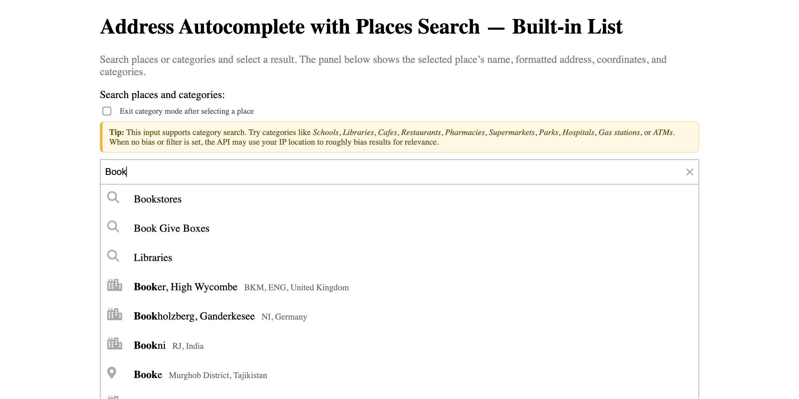

# Places Search: Category Search with Built-in List (No Map)

Search for places by category using the built-in places list UI without a map component.

## Quick Summary

- Problem: Add category-based places search without requiring a map.
- Solution: Use Geocoder Autocomplete with category search and built-in places list.
- Stack: HTML, CSS, JavaScript, Geoapify Geocoder Autocomplete.
- APIs: Geoapify Geocoding API, Geoapify Places API.

## What This Example Includes

- Address autocomplete with category search
- Built-in places list UI
- Place details on selection
- Location bias for relevant results
- Theme selector
- Source-based run from `src/index.html` (no build step)

## Use Cases

- Build lightweight places finders without map overhead.
- Create category search widgets for sidebars.
- Add places discovery to forms without maps.

## Live Demo

[](https://codepen.io/team/geoapify/pen/vEGzeaQ)

## Screenshot



## Quick Start

Open [`src/index.html`](./src/index.html) in your browser.

No local server is required.

Note: In rare cases, browser policies or extensions can restrict `file://` access. If that happens, run a local static server and open `src/index.html` via `http://localhost`, or use your IDE's "Open with Live Server" (or similar) option.

## Input and Output

- Input: User types address or selects category, Geoapify API key.
- Output: Places list with name, address, and category; selected place details.

## Project Structure

| File | Purpose |
|------|---------|
| `src/index.html` | Source HTML |
| `src/script.js` | Source JavaScript (autocomplete, places events) |
| `src/style.css` | Source CSS |

## Code Samples

### Minimal HTML

```html
<!DOCTYPE html>
<html lang="en">
<head>
  <meta charset="UTF-8">
  <title>Places Search</title>
  <link rel="stylesheet" href="https://cdn.jsdelivr.net/npm/@geoapify/geocoder-autocomplete@3.0.1/styles/minimal.css">
  <script src="https://cdn.jsdelivr.net/npm/@geoapify/geocoder-autocomplete@3.0.1/dist/index.min.js"></script>
</head>
<body>
  <div id="places"></div>
  <div id="result"></div>
  <script src="script.js"></script>
</body>
</html>
```

### Minimal JavaScript

```js
// Demo API key for quickstart only.
// Register for your own free API key at https://myprojects.geoapify.com/.
// Benefits: usage analytics, project-level limits, and reliable access for production use.
// This demo key can be blocked or restricted at any time.
const yourAPIKey = "YOUR_API_KEY";

const ac = new autocomplete.GeocoderAutocomplete(
  document.getElementById("places"),
  yourAPIKey,
  {
    placeholder: "Search places or categories...",
    addCategorySearch: true,
    showPlacesList: true,
    limit: 8
  }
);

ac.addBiasByProximity({ lat: 48.8566, lon: 2.3522 });

ac.on("place_select", (place) => {
  const p = place.properties;
  document.getElementById("result").innerHTML = `
    <strong>${p.name || p.formatted}</strong><br>
    ${p.address_line2 || ""}<br>
    Coords: ${p.lat}, ${p.lon}
  `;
});

ac.on("places", (places) => {
  console.log(`Found ${places.length} places`);
});
```

## Customize

1. Open [`src/script.js`](./src/script.js).
2. Set your own API key in `yourAPIKey`.
3. Modify proximity bias location.
4. Adjust `limit` for number of results.
5. Add rectangle filter to restrict search area.

API documentation:
- [Geoapify Address Autocomplete API](https://apidocs.geoapify.com/docs/geocoding/address-autocomplete/)
- [Geoapify Places API](https://apidocs.geoapify.com/docs/places/)

No build step is required. Edit files in `src/` and refresh the browser.

## Troubleshooting

| Problem | Likely Cause | What to Do |
|---------|--------------|------------|
| Autocomplete not loading | Geocoder Autocomplete CSS/JS failed to load | Open browser DevTools (`Console` + `Network`) and confirm CDN files load without errors. |
| Map does not load data / API responds `403` | API key is invalid, restricted, or over limits | Get your own free key at `https://myprojects.geoapify.com/`, then update `yourAPIKey` in `src/script.js`. |
| Works inconsistently from local file | Browser policy blocks some `file://` behavior | Open with IDE Live Server (or any local static server) and run from `http://localhost`. |
| Output differs from expected | Local edits introduced a regression | Compare your files with the [CodePen demo](https://codepen.io/team/geoapify/pen/vEGzeaQ) and align differences step by step. |

## APIs and Libraries

| Type | Name | Link | API Endpoint Used |
|------|------|------|-------------------|
| API | Geoapify Geocoding API | [Geocoding API](https://www.geoapify.com/geocoding-api/) | `https://api.geoapify.com/v1/geocode/autocomplete?...&apiKey=...` |
| API | Geoapify Places API | [Places API](https://www.geoapify.com/places-api/) | `https://api.geoapify.com/v2/places?categories=...&apiKey=...` |
| Library | Geoapify Geocoder Autocomplete | [npm](https://www.npmjs.com/package/@geoapify/geocoder-autocomplete) | Not applicable |

## Related Examples

| Example | Description | Link |
|---------|-------------|------|
| Built-in Places List | Places list with Leaflet map | [Open](../leaflet-built-in-places-list-category-search-with-default-ui) |
| Events Showcase | Available events and callbacks | [Open](../events-showcase-demonstrates-available-events-and-callbacks) |
| Custom Places List | Custom UI for places | [Open](../leaflet-custom-places-list-custom-ui-for-places-results) |

## Useful Links

- Geoapify API docs: [https://apidocs.geoapify.com/](https://apidocs.geoapify.com/)
- CodePen demo: [https://codepen.io/team/geoapify/pen/vEGzeaQ](https://codepen.io/team/geoapify/pen/vEGzeaQ)
- Geoapify CodePen profile: [https://codepen.io/team/geoapify](https://codepen.io/team/geoapify)

## License

MIT

**Keywords**: places search, category search, no map, places list, lightweight search, proximity bias
