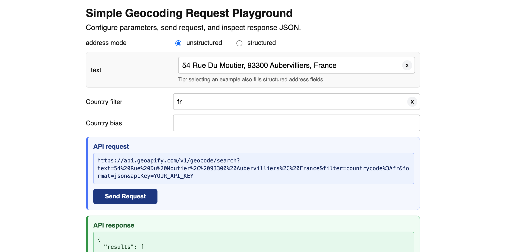
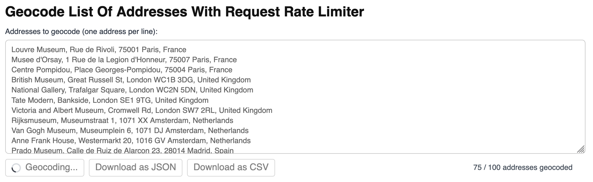
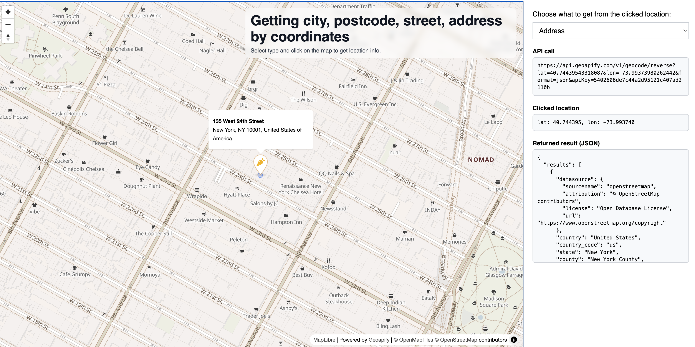
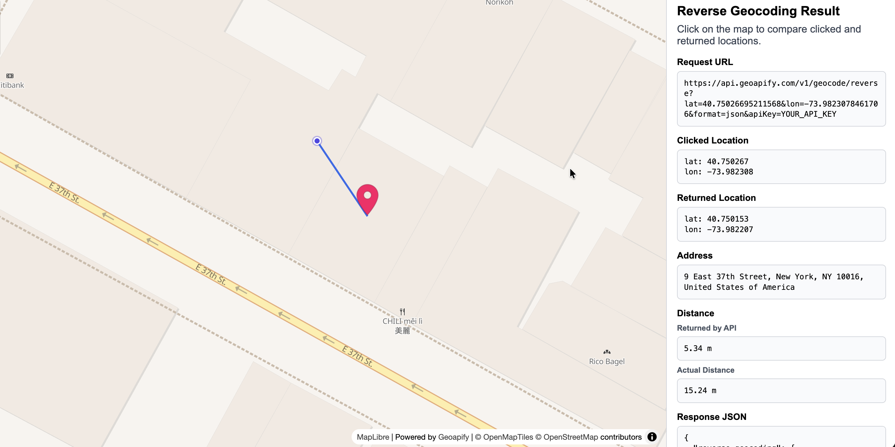
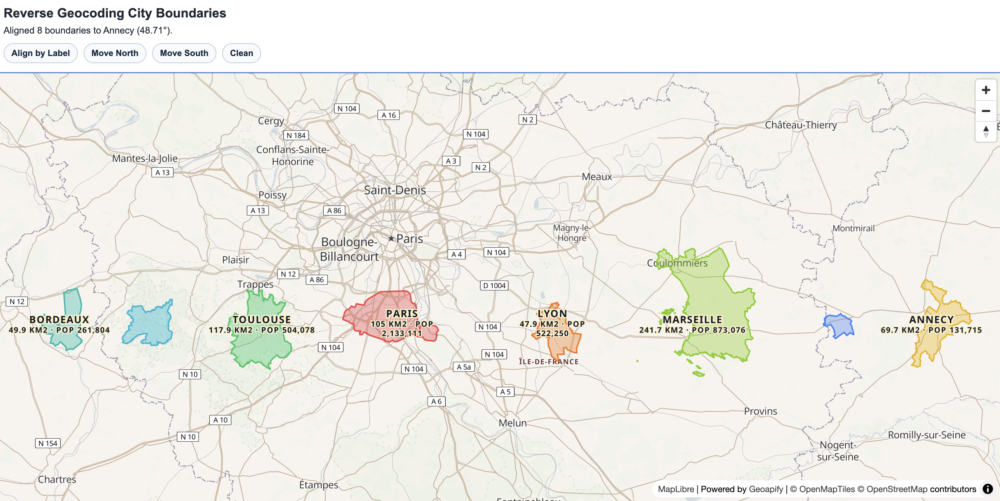

# Geoapify Geocoding API Code Examples

Use Geoapify Geocoding API examples to convert addresses to coordinates, convert coordinates to addresses, inspect reverse geocoding behavior, and build UI tools around address search workflows.

## Overview

This folder contains browser-based JavaScript examples for forward geocoding, reverse geocoding, address lookup by coordinates, rate-limited batch geocoding, and city boundary exploration. Each example includes source code, a screenshot, and a focused README with setup notes and code samples.

## API Resources

## Live Demo

Each CodePen demo is linked from the `Live Demo` column in the code examples table.

## Code Examples

| Screenshot | Example | Description | Source Code | Live Demo |
|------------|---------|-------------|-------------|-----------|
|  | Simple Geocoding Request Playground | Build a forward geocoding request from UI fields, send it, and inspect the JSON response. | [Open example](https://github.com/geoapify/geoapify-quickstart-examples/tree/main/geocoding-api/simple-geocoding-request/) | [CodePen](https://codepen.io/editor/team/geoapify/pen/019dbf0d-fbbf-7f67-8675-ad0484b66010) |
|  | Geocode List Of Addresses With Request Rate Limiter | Geocode many addresses with controlled request throughput, progress updates, and JSON/CSV export. | [Open example](https://github.com/geoapify/geoapify-quickstart-examples/tree/main/geocoding-api/geocode-list-of-addresses-with-request-rate-limiter/) | [CodePen](https://codepen.io/team/geoapify/pen/MYbgqOO) |
|  | How To Get City Postcode Street Address By Coordinates | Click a map to run reverse geocoding at different result levels such as city, postcode, street, and address. | [Open example](https://github.com/geoapify/geoapify-quickstart-examples/tree/main/geocoding-api/how-to-get-city-postcode-street-address-by-coordinates/) | [CodePen](https://codepen.io/team/geoapify/pen/raMdrar) |
|  | Returned Address Can Differ Slightly From Clicked Map Point | Compare clicked coordinates with returned reverse geocoding coordinates and inspect distance values. | [Open example](https://github.com/geoapify/geoapify-quickstart-examples/tree/main/geocoding-api/why-can-returned-address-differ-slightly-from-clicked-map-point/) | [CodePen](https://codepen.io/editor/team/geoapify/pen/019d8e47-9b0b-70c9-921a-07c5565e0694) |
|  | Reverse Geocoding City Boundaries Size Comparison Drag | Reverse geocode cities, load boundary geometry, and drag polygons to compare apparent size at different latitudes. | [Open example](https://github.com/geoapify/geoapify-quickstart-examples/tree/main/geocoding-api/reverse-geocoding-city-boundaries-size-comparison-drag/) | [CodePen](https://codepen.io/editor/geoapify/pen/019d8439-8e04-70fb-8b1e-4963ef451a20) |

## Geoapify API Key

These examples include demo Geoapify API keys for quick testing. For your own project, create a free API key at [myprojects.geoapify.com](https://myprojects.geoapify.com/) and replace the example key in the relevant `src/script.js` file.

## APIs and Libraries

| Name | Description | Documentation | Used In This Example |
|------|-------------|---------------|----------------------|
| Geoapify Forward Geocoding API | Converts addresses and place names into coordinates. | [Forward geocoding docs](https://apidocs.geoapify.com/docs/geocoding/forward-geocoding/) | [Simple Geocoding Request Playground](./simple-geocoding-request/), [Geocode List Of Addresses With Request Rate Limiter](./geocode-list-of-addresses-with-request-rate-limiter/) |
| Geoapify Reverse Geocoding API | Converts coordinates into addresses, places, and administrative results. | [Reverse geocoding docs](https://apidocs.geoapify.com/docs/geocoding/reverse-geocoding/) | [How To Get City Postcode Street Address By Coordinates](./how-to-get-city-postcode-street-address-by-coordinates/), [Returned Address Can Differ Slightly From Clicked Map Point](./why-can-returned-address-differ-slightly-from-clicked-map-point/), [Reverse Geocoding City Boundaries Size Comparison Drag](./reverse-geocoding-city-boundaries-size-comparison-drag/) |
| Geoapify Place Details API | Returns place metadata and geometry by `place_id`. | [Place Details docs](https://apidocs.geoapify.com/docs/place-details/) | [Reverse Geocoding City Boundaries Size Comparison Drag](./reverse-geocoding-city-boundaries-size-comparison-drag/) |
| Geoapify Map Tiles API | Provides map styles and tiles for MapLibre-based examples. | [Map Tiles docs](https://apidocs.geoapify.com/docs/maps/map-tiles/) | [How To Get City Postcode Street Address By Coordinates](./how-to-get-city-postcode-street-address-by-coordinates/), [Returned Address Can Differ Slightly From Clicked Map Point](./why-can-returned-address-differ-slightly-from-clicked-map-point/), [Reverse Geocoding City Boundaries Size Comparison Drag](./reverse-geocoding-city-boundaries-size-comparison-drag/) |
| Geoapify Marker Icon API | Generates marker icons for returned address points. | [Marker Icon docs](https://apidocs.geoapify.com/docs/icon/) | [How To Get City Postcode Street Address By Coordinates](./how-to-get-city-postcode-street-address-by-coordinates/), [Returned Address Can Differ Slightly From Clicked Map Point](./why-can-returned-address-differ-slightly-from-clicked-map-point/) |
| Geoapify Geometry Operation API | Calculates distances and builds great-circle lines for geospatial visualization. | [Geometry Operation docs](https://apidocs.geoapify.com/docs/geometry-operations/) | [Returned Address Can Differ Slightly From Clicked Map Point](./why-can-returned-address-differ-slightly-from-clicked-map-point/) |
| Geoapify Request Rate Limiter | Schedules API requests with configurable throughput limits. | [NPM package](https://www.npmjs.com/package/@geoapify/request-rate-limiter) | [Geocode List Of Addresses With Request Rate Limiter](./geocode-list-of-addresses-with-request-rate-limiter/) |
| MapLibre GL JS | Renders interactive vector maps in browser examples. | [MapLibre GL JS docs](https://maplibre.org/maplibre-gl-js/docs/) | [How To Get City Postcode Street Address By Coordinates](./how-to-get-city-postcode-street-address-by-coordinates/), [Returned Address Can Differ Slightly From Clicked Map Point](./why-can-returned-address-differ-slightly-from-clicked-map-point/), [Reverse Geocoding City Boundaries Size Comparison Drag](./reverse-geocoding-city-boundaries-size-comparison-drag/) |
| Turf.js | Calculates geometry metrics such as polygon area. | [Turf.js docs](https://turfjs.org/docs/) | [Reverse Geocoding City Boundaries Size Comparison Drag](./reverse-geocoding-city-boundaries-size-comparison-drag/) |

## Useful Links

- Geoapify API documentation: [https://apidocs.geoapify.com/](https://apidocs.geoapify.com/)
- Geoapify projects and API keys: [https://myprojects.geoapify.com/](https://myprojects.geoapify.com/)
- Geoapify CodePen examples: [https://codepen.io/geoapify](https://codepen.io/geoapify)
