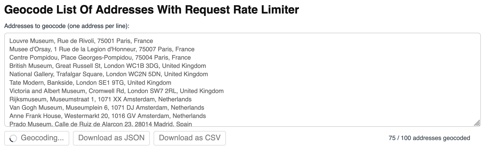

# Geocode List Of Addresses With Request Rate Limiter

Geocode a large list of addresses with controlled request throughput, live progress, and result export to JSON/CSV.

## Quick Summary

- Problem: You need to geocode many addresses without sending too many requests at once.
- Solution: Use `@geoapify/request-rate-limiter` with deferred request functions and progress callbacks.
- Stack: HTML, CSS, JavaScript.
- APIs: Geoapify Geocoding API.

## What This Example Includes

- Address list textarea (one address per line)
- `Geocode` button with loading spinner and in-progress label
- Progress indicator: `XX / YY addresses geocoded`
- Request throttling via `@geoapify/request-rate-limiter`
- `Download as JSON` export
- `Download as CSV` export (includes `rank.confidence`)

## Live Demo

[](https://codepen.io/team/geoapify/pen/MYbgqOO)

## Screenshot



## Quick Start

Open [`src/index.html`](./src/index.html) in your browser.

No build step is required.

## Input and Output

- Input: Multiline address list.
- Output:
  - Geocoded results in memory
  - Progress text while processing
  - Downloadable JSON file
  - Downloadable CSV file

## Project Structure

| File | Purpose |
|------|---------|
| `src/index.html` | Source HTML |
| `src/script.js` | Source JavaScript (rate-limited requests, progress updates, exports) |
| `src/style.css` | Source CSS |

## Code Samples

### 1. Sending with Rate Limiter

This part runs geocoding requests using request-throttling and updates progress during execution.

```js
async function geocodeWithRateLimits(addresses) {
  const totalAddresses = addresses.length;

  geocodingResults = null;

  if (totalAddresses === 0) {
    setGeocodeButtonLoading(false);
    setGeocodingControlsDisabled(false);
    return;
  }

  try {
    const requests = addresses.map((address) => createGeocodingRequest(address));

    const rateLimitedResults = await RequestRateLimiter.rateLimitedRequests(
      requests,
      MAX_REQUESTS_PER_INTERVAL,
      RATE_LIMIT_INTERVAL_MS,
      {
        onProgress: ({ completedRequests, totalRequests }) => {
          // log geocoding progress
        },
      }
    );

    if (!Array.isArray(rateLimitedResults)) {
      throw new Error("Unexpected rate-limiter result format.");
    }

    geocodingResults = rateLimitedResults;
  } catch (error) {
    console.error("Geocoding failed:", error);
  }
}

function getAddressesToGeocode() {
  return String(addressesTextarea.value)
    .split(/\r?\n/)
    .map((line) => line.trim())
    .filter((line) => line.length > 0);
}

function createGeocodingRequest(address) {
  return async () => {
    try {
      const response = await fetch(buildGeocodingRequestUrl(address));

      if (!response.ok) {
        return {
          address,
          error: `Request failed with status ${response.status}`,
        };
      }

      const data = await response.json();
      return {
        address,
        result: data.results && data.results.length ? data.results[0] : null,
      };
    } catch (error) {
      return {
        address,
        error: String(error),
      };
    }
  };
}

function buildGeocodingRequestUrl(address) {
  const params = new URLSearchParams();
  params.set("text", address);
  params.set("limit", "1");
  params.set("format", "json");
  params.set("apiKey", API_KEY_EXECUTION);
  return `${GEOCODING_SEARCH_URL}?${params.toString()}`;
}

```

Why deferred request functions are used:

- `createGeocodingRequest()` returns functions so requests start only when the limiter schedules them.
- This lets `rateLimitedRequests(...)` enforce per-interval request limits.

### 2. Save as JSON

This part serializes all geocoding results and saves them as a timestamped JSON file.

```js
function downloadGeocodingResultsAsJson() {
  if (!Array.isArray(geocodingResults)) {
    return;
  }

  const payload = {
    totalAddresses: geocodingResults.length,
    geocodedAt: new Date().toISOString(),
    results: geocodingResults,
  };

  downloadFile(
    JSON.stringify(payload, null, 2),
    "application/json",
    `geocoding-results-${buildTimestampForFileName()}.json`
  );
}

function downloadFile(contents, mimeType, fileName) {
  const blob = new Blob([contents], { type: mimeType });
  const blobUrl = URL.createObjectURL(blob);
  const downloadLink = document.createElement("a");
  downloadLink.href = blobUrl;
  downloadLink.download = fileName;
  document.body.append(downloadLink);
  downloadLink.click();
  downloadLink.remove();
  URL.revokeObjectURL(blobUrl);
}

function buildTimestampForFileName() {
  const now = new Date();
  const year = now.getFullYear();
  const month = String(now.getMonth() + 1).padStart(2, "0");
  const day = String(now.getDate()).padStart(2, "0");
  const hours = String(now.getHours()).padStart(2, "0");
  const minutes = String(now.getMinutes()).padStart(2, "0");
  const seconds = String(now.getSeconds()).padStart(2, "0");
  return `${year}${month}${day}-${hours}${minutes}${seconds}`;
}
```

### 3. Save as CSV

This part flattens geocoding fields into CSV rows and exports them as a `.csv` file.

```js
function downloadGeocodingResultsAsCsv() {
  if (!Array.isArray(geocodingResults)) {
    return;
  }

  const csvRows = [
    [
      "input_address",
      "status",
      "error",
      "confidence",
      "formatted",
      "lat",
      "lon",
      "country",
      "city",
      "postcode",
    ],
  ];

  for (const geocodingItem of geocodingResults) {
    const result = geocodingItem && geocodingItem.result ? geocodingItem.result : null;
    const status = geocodingItem && geocodingItem.error ? "error" : "ok";

    csvRows.push([
      geocodingItem && geocodingItem.address ? geocodingItem.address : "",
      status,
      geocodingItem && geocodingItem.error ? geocodingItem.error : "",
      result && result.rank && result.rank.confidence != null ? result.rank.confidence : "",
      result && result.formatted ? result.formatted : "",
      result && result.lat != null ? result.lat : "",
      result && result.lon != null ? result.lon : "",
      result && result.country ? result.country : "",
      result && result.city ? result.city : "",
      result && result.postcode ? result.postcode : "",
    ]);
  }

  downloadFile(
    convertRowsToCsv(csvRows),
    "text/csv;charset=utf-8",
    `geocoding-results-${buildTimestampForFileName()}.csv`
  );
}

function convertRowsToCsv(rows) {
  return rows
    .map((row) => row.map((value) => escapeCsvCell(value)).join(","))
    .join("\n");
}

function escapeCsvCell(value) {
  const text = String(value);
  const escaped = text.replaceAll('"', '""');
  return `"${escaped}"`;
}
```

CSV fields include:

- Input address
- Status (`ok` or `error`)
- Error text (if any)
- Confidence (`result.rank.confidence`)
- Formatted address
- Coordinates
- Country, city, postcode

## API Endpoint Used

`https://api.geoapify.com/v1/geocode/search?...`

## APIs and Libraries

| Type | Name | Link | API Endpoint Used |
|------|------|------|-------------------|
| API | Geoapify Geocoding API | [Geocoding API](https://www.geoapify.com/geocoding-api/) | `https://api.geoapify.com/v1/geocode/search?...` |
| Library | Geoapify Request Rate Limiter | [NPM package](https://www.npmjs.com/package/@geoapify/request-rate-limiter) | Not applicable |
| Library | Browser Fetch API | [MDN Fetch API](https://developer.mozilla.org/en-US/docs/Web/API/Fetch_API) | Not applicable |

## Related Examples

| Example | Description | Link |
|---------|-------------|------|
| Simple Geocoding Request Playground | Build and execute single geocoding requests from UI fields | [Open](../simple-geocoding-request) |
| Returned Address Can Differ Slightly From Clicked Map Point | Inspect reverse geocoding request/response behavior | [Open](../why-can-returned-address-differ-slightly-from-clicked-map-point) |

## Useful Links

- Geoapify API docs: [https://apidocs.geoapify.com/](https://apidocs.geoapify.com/)
- Geoapify Geocoding docs: [https://apidocs.geoapify.com/docs/geocoding/](https://apidocs.geoapify.com/docs/geocoding/)
- Geoapify Playground (Geocoding): [https://apidocs.geoapify.com/playground/geocoding/](https://apidocs.geoapify.com/playground/geocoding/)
- Request Rate Limiter package: [https://www.npmjs.com/package/@geoapify/request-rate-limiter](https://www.npmjs.com/package/@geoapify/request-rate-limiter)

## License

MIT
