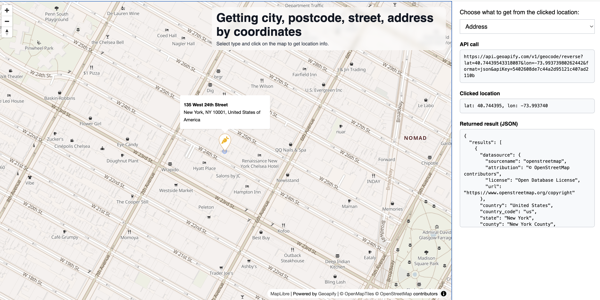

# How To Get City Postcode Street Address By Coordinates

Click on the map to run Geoapify reverse geocoding and inspect what was requested and returned.

## Quick Summary

- Problem: You need to get location information from map click coordinates at different geocoding levels.
- Solution: Use Geoapify Reverse Geocoding API with a selectable `type` and visualize both clicked and returned points.
- Stack: HTML, CSS, JavaScript, MapLibre GL JS.
- APIs: Geoapify Reverse Geocoding API, Geoapify Icon API (marker icon), Geoapify Map Tiles API.

## What This Example Includes

- MapLibre GL map with Geoapify vector tiles
- Type selector for reverse geocoding (`country`, `state`, `city`, `postcode`, `street`, `address`)
- Click-to-reverse-geocode workflow
- Coordinate normalization before request (`lon` wrap, `lat` clamp)
- Returned-point marker (Geoapify icon) + initial click-point marker (small circle)
- Popup with `address_line1` and `address_line2`
- Side panel with:
  - Exact API URL
  - Clicked coordinates
  - Raw JSON response
- Automatic map adjustment when the returned point is outside the visible viewport

## Use Cases

- Build location pickers for map-click workflows.
- Debug and compare different reverse geocoding `type` filters.
- Inspect how returned coordinates differ from clicked coordinates.

## Live Demo

## Screenshot

## Quick Start

Open [`src/index.html`](./src/index.html) in your browser.

No local server is required.

Note: In rare cases, browser policies or extensions can restrict `file://` access. If that happens, run a local static server and open `src/index.html` via `http://localhost`, or use your IDE's "Open with Live Server" (or similar) option.

## Input and Output

- Input: Map click coordinates, selected reverse geocoding `type`, Geoapify API key.
- Output: Returned address popup, markers for clicked/returned points, request URL, clicked location, and raw response JSON.

## Project Structure

| File | Purpose |
|------|---------|
| `src/index.html` | Source HTML |
| `src/script.js` | Source JavaScript (map, requests, markers, popup, viewport adjustment) |
| `src/style.css` | Source CSS |

## Customize

1. Open [`src/script.js`](./src/script.js).
2. Set your own API key in `apiKey`.
3. Change default map center/zoom in the `maplibregl.Map` constructor.
4. Adjust marker icon parameters in `createGeoapifyMarkerElement()`.
5. Change viewport adjustment behavior in `ensureReturnedPositionVisible()`.

API documentation:
- [Geoapify Reverse Geocoding API](https://apidocs.geoapify.com/docs/geocoding/reverse-geocoding/)
- [Geoapify Icon API](https://apidocs.geoapify.com/docs/icon/)
- [Geoapify Map Tiles API](https://apidocs.geoapify.com/docs/maps/map-tiles/)

No build step is required. Edit files in `src/` and refresh the browser.

## Troubleshooting

| Problem | Likely Cause | What to Do |
|---------|--------------|------------|
| API responds with `400` and invalid longitude/latitude | Raw coordinates are outside valid API ranges | This example normalizes request coordinates. If you modified the code, ensure `normalizeLongitude()` and `clampLatitude()` are used before calling the API. |
| Map does not load data / API responds `403` | API key is invalid, restricted, or over limits | Get your own free key at `https://myprojects.geoapify.com/`, then update `apiKey` in `src/script.js`. |
| Returned point marker appears off-screen | Returned coordinates are outside current viewport | The example calls `ensureReturnedPositionVisible()` and fits bounds. Verify this function still runs after marker update. |
| Works inconsistently from local file | Browser policy blocks some `file://` behavior | Open with IDE Live Server (or any local static server) and run from `http://localhost`. |

## APIs and Libraries

| Type | Name | Link | API Endpoint Used |
|------|------|------|-------------------|
| API | Geoapify Reverse Geocoding API | [Geocoding API](https://www.geoapify.com/geocoding-api/) | `https://api.geoapify.com/v1/geocode/reverse?lat=...&lon=...&type=...&apiKey=...` |
| API | Geoapify Icon API | [Icon API](https://www.geoapify.com/map-marker-icon-api/) | `https://api.geoapify.com/v2/icon/?...&apiKey=...` |
| API | Geoapify Map Tiles API | [Map Tiles API](https://www.geoapify.com/map-tiles/) | `https://maps.geoapify.com/v1/styles/osm-bright-smooth/style.json?apiKey=...` |
| Library | MapLibre GL JS | [maplibre.org](https://maplibre.org/) | Not applicable |

## Related Examples

| Example | Description | Link |
|---------|-------------|------|
| MapLibre Integration | Reverse geocoding on click with autocomplete | [Open](../../geocoder-autocomplete/maplibre-gl-integration-vector-maps-and-reverse-geocoding-on-click) |
| MapLibre Starter | Basic MapLibre map with Geoapify tiles | [Open](../../maps/maplibre-geoapify-map-tiles-starter) |

## Useful Links

- Geoapify API docs: [https://apidocs.geoapify.com/](https://apidocs.geoapify.com/)
- Geoapify Playground: [https://apidocs.geoapify.com/playground/geocoding/](https://apidocs.geoapify.com/playground/geocoding/)
- Geoapify CodePen profile: [https://codepen.io/geoapify](https://codepen.io/geoapify)

## License

MIT

**Keywords**: reverse geocoding, map click, MapLibre GL, Geoapify, address lookup, coordinates to address, marker icon API
