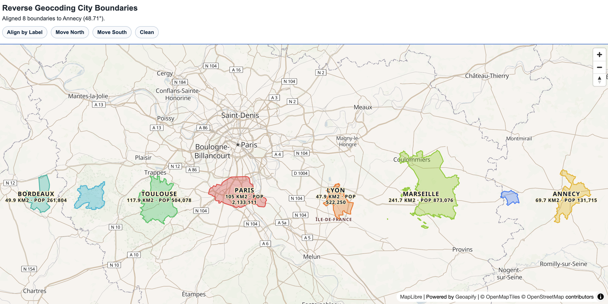

# Reverse Geocoding City Boundaries Size Comparison Drag

Click on the map to reverse geocode a city, load its boundary geometry, and drag it to compare apparent size at different latitudes.

## Quick Summary

- Problem: Compare city boundary size visually across map positions.
- Solution: Reverse geocode click coordinates (`type=city`), load place details geometry, render GeoJSON, and support drag/move controls.
- Stack: HTML, CSS, JavaScript, MapLibre GL JS, Turf.js.
- APIs: Geoapify Reverse Geocoding API, Geoapify Place Details API, Geoapify Map Tiles API.

## What This Example Includes

- Reverse geocoding by map click (`type=city`)
- Place details fetch for polygon boundary geometry
- GeoJSON city boundary rendering (fill + outline)
- Drag-to-move city geometries
- Press-and-hold Move North / Move South controls
- Align-by-label control and Clean control
- Per-city labels with area (`km2`) and population (when available)

## Use Cases

- Projection education and map distortion demos
- Comparing apparent city size by latitude
- Reverse geocoding + place details integration reference

## Live Demo

[](https://codepen.io/editor/geoapify/pen/019d8439-8e04-70fb-8b1e-4963ef451a20)

## Screenshot



## Quick Start

Open [`src/index.html`](./src/index.html) in your browser.

No local server is required.

Note: In rare cases, browser policies or extensions can restrict `file://` access. If that happens, run a local static server and open `src/index.html` via `http://localhost`, or use your IDE's "Open with Live Server" (or similar) option.

## Input and Output

- Input: Map clicks, drag gestures, Move North/South button hold, Align/Clean actions.
- Output: City boundary overlays with labels and metrics, moved in real time on the map.

## Project Structure

| File | Purpose |
|------|---------|
| `src/index.html` | HTML layout and controls |
| `src/script.js` | Reverse geocoding flow, GeoJSON rendering, movement interactions |
| `src/style.css` | Layout and control styling |
| `screenshots/` | Example screenshot assets |

## Code Samples

### 1. Get City by Coordinate + Get Details (On Map Click)

This part resolves map click coordinates into a city boundary. First, reverse geocoding identifies the nearest city feature at clicked `lat/lon`. Then, place details fetches full geometry (polygon or multipolygon) by `place_id`, which is used later for rendering and movement.

```js
// 1) Reverse geocode the clicked coordinates to find the nearest city feature.
async function fetchCityByReverseGeocode(lngLat) {
  const params = new URLSearchParams({
    lon: lngLat.lng.toString(),
    lat: lngLat.lat.toString(),
    type: "city",
    format: "geojson",
    apiKey: yourAPIKey
  });

  const response = await fetch(
    `https://api.geoapify.com/v1/geocode/reverse?${params.toString()}`
  );
  const data = await response.json();
  return data.features?.[0] ?? null;
}

// 2) Request place details to get city boundary geometry (Polygon / MultiPolygon).
async function fetchCityDetails(placeId, lngLat) {
  const params = new URLSearchParams({ apiKey: yourAPIKey });
  if (placeId) params.set("id", placeId);
  else {
    params.set("lat", lngLat.lat.toString());
    params.set("lon", lngLat.lng.toString());
  }

  const response = await fetch(
    `https://api.geoapify.com/v2/place-details?${params.toString()}`
  );
  const data = await response.json();
  return data.features?.[0] ?? null;
}

// 3) On map click: resolve city + details, then pass geometry to drawing flow.
map.on("click", async (event) => {
  const lngLat = event.lngLat.wrap();
  const reverseFeature = await fetchCityByReverseGeocode(lngLat);
  if (!reverseFeature) return;

  const placeId = reverseFeature.properties?.place_id;
  const detailsFeature = await fetchCityDetails(placeId, lngLat);
  // use detailsFeature.geometry for drawing
});
```

### 2. Draw GeoJSON

This part transforms in-memory city objects into GeoJSON sources for MapLibre layers. Boundary geometry is pushed into the fill/outline source, and label features are updated separately so rendering stays synchronized with state changes.

```js
// Build GeoJSON for the boundary source (fill + outline layers).
function toBoundaryFeatureCollection() {
  return {
    type: "FeatureCollection",
    features: cityGeometryStore.map((entry) => ({
      type: "Feature",
      id: entry.id,
      geometry: entry.geometry,
      properties: {
        cityId: entry.id,
        name: entry.name,
        color: entry.color
      }
    }))
  };
}

// Build GeoJSON for label points (name + subtitle metrics).
function toLabelFeatureCollection() {
  return {
    type: "FeatureCollection",
    features: cityGeometryStore
      .map((entry) => {
        const center = getGeometryCenter(entry.geometry);
        if (!center) return null;

        return {
          type: "Feature",
          id: `label-${entry.id}`,
          geometry: {
            type: "Point",
            coordinates: center
          },
          properties: {
            cityId: entry.id,
            name: entry.name,
            subtitle: getLabelSubtitle(entry)
          }
        };
      })
      .filter(Boolean)
  };
}

// Push the latest in-memory geometry state into map sources.
function updateCitySource(options = {}) {
  const { updateLabels = true } = options;
  map.getSource("city-boundaries")?.setData(toBoundaryFeatureCollection());
  if (updateLabels) {
    map.getSource("city-boundaries-labels")?.setData(toLabelFeatureCollection());
  }
}
```

### 3. Move GeoJSON

This part applies interactive movement. During drag, pointer movement is converted into longitude/latitude deltas, then every polygon coordinate is shifted by that delta. The updated geometry is written back to map sources for real-time visual feedback.

```js
// Shift every coordinate by the computed lng/lat delta.
function shiftGeometry(geometry, deltaLng, deltaLat) {
  const shiftPoint = (point) => {
    const [lng, lat, ...rest] = point;
    return [lng + deltaLng, lat + deltaLat, ...rest];
  };

  if (geometry.type === "Polygon") {
    return { type: "Polygon", coordinates: geometry.coordinates.map((ring) => ring.map(shiftPoint)) };
  }
  if (geometry.type === "MultiPolygon") {
    return {
      type: "MultiPolygon",
      coordinates: geometry.coordinates.map((polygon) =>
        polygon.map((ring) => ring.map(shiftPoint))
      )
    };
  }
  return geometry;
}

// During drag: compute deltas from pointer position and update geometry on map.
function onDragMove(event) {
  const currentLngLat = event.lngLat.wrap();
  const deltaLng = getDeltaLngAcrossAntimeridian(dragState.startLngLat.lng, currentLngLat.lng);
  const deltaLat = currentLngLat.lat - dragState.startLngLat.lat;
  city.geometry = shiftGeometry(dragState.baseGeometry, deltaLng, deltaLat);
  updateCitySource({ updateLabels: false });
}
```

### 4. How to calculate boundary area

This part calculates city boundary area from GeoJSON geometry. [`turf.area`](https://turfjs.org/docs/#area) returns square meters, so convert to square kilometers for label display.

```js
// Compute polygon area from the city geometry.
const areaSqMeters = turf.area({
  type: "Feature",
  geometry: detailsFeature.geometry,
  properties: {}
});

// Convert m2 to km2 for UI.
const areaKm2 = areaSqMeters / 1e6;
```

### 5. Getting population

Population can come from multiple fields depending on provider response. This helper checks preferred fields in order and returns the first valid numeric value.

```js
function parsePopulationFromDetails(detailsFeature, reverseFeature) {
  const detailsProps = detailsFeature?.properties ?? {};
  const reverseProps = reverseFeature?.properties ?? {};

  const candidates = [
    detailsProps.population,
    detailsProps.datasource?.raw?.population
  ];

  for (const candidate of candidates) {
    const parsed = Number(candidate);
    if (Number.isFinite(parsed) && parsed > 0) {
      return parsed;
    }
  }

  return null;
}
```

## Customize

1. Open [`src/script.js`](./src/script.js).
2. Replace `yourAPIKey` with your own key.
3. Tune movement speed via `MOVE_BUTTON_PIXELS_PER_SECOND`.
4. Adjust map defaults (`center`, `zoom`) in map initialization.
5. Change boundary colors in `cityColors`.

## Troubleshooting

| Problem | Likely Cause | What to Do |
|---------|--------------|------------|
| No city boundary appears | No city polygon for selected point | Try clicking central urban areas at medium zoom. |
| API error (`403`/`401`) | Invalid or restricted API key | Update `yourAPIKey` with your own Geoapify key. |
| Map is blank | MapLibre assets or style not loaded | Check DevTools `Console` and `Network` for failed requests. |
| Drag feels laggy | Many complex polygons loaded | Use Clean, load fewer cities, and test at lower zoom. |

## APIs and Libraries

| Type | Name | Link | API Endpoint Used |
|------|------|------|-------------------|
| API | Geoapify Reverse Geocoding API | [Geocoding API](https://www.geoapify.com/geocoding-api/) | `https://api.geoapify.com/v1/geocode/reverse?...&type=city` |
| API | Geoapify Place Details API | [Place Details API](https://www.geoapify.com/place-details-api/) | `https://api.geoapify.com/v2/place-details?id=...` |
| API | Geoapify Map Tiles API | [Map Tiles API](https://www.geoapify.com/map-tiles/) | `https://maps.geoapify.com/v1/styles/.../style.json` |
| Library | MapLibre GL JS | [maplibre.org](https://maplibre.org/) | Not applicable |
| Library | Turf.js | [turfjs.org](https://turfjs.org/) | Not applicable |

## Related Examples

| Example | Description | Link |
|---------|-------------|------|
| City, Postcode, Street, Address by Coordinates | Reverse geocoding by coordinate levels | [Open](../how-to-get-city-postcode-street-address-by-coordinates) |
| Country Geometry & Projection | Drag and compare polygon projection distortion | [Open](../../maps/maplibre-country-geometry-projection-drag) |

## Useful Links

- Geoapify API docs: [https://apidocs.geoapify.com/](https://apidocs.geoapify.com/)
- Geoapify projects and API keys: [https://myprojects.geoapify.com/](https://myprojects.geoapify.com/)
- CodePen demo: [https://codepen.io/editor/geoapify/pen/019d8439-8e04-70fb-8b1e-4963ef451a20](https://codepen.io/editor/geoapify/pen/019d8439-8e04-70fb-8b1e-4963ef451a20)

## License

MIT

**Keywords**: reverse geocoding, city boundaries, maplibre, geojson, drag and drop, place details, geospatial visualization
