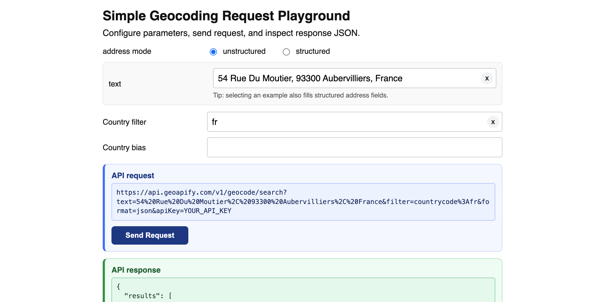

# Simple Geocoding Request Playground

Build a Geoapify Geocoding API request from UI fields, send it, and inspect the JSON response.

## Quick Summary

- Problem: You need a minimal playground to understand how geocoding query parameters are composed and sent.
- Solution: Provide unstructured/structured input modes, build a request URL with encoded params, and execute it with `fetch`.
- Stack: HTML, CSS, JavaScript.
- APIs: Geoapify Geocoding API.

## What This Example Includes

- Address mode switcher:
  - unstructured (`text`)
  - structured (`housenumber`, `street`, `postcode`, `city`, `country`)
- Country filter and country bias selectors
- Live API request preview block
- `Send Request` button
- Highlighted API response JSON block
- Text examples with auto-fill of structured fields on exact match

## Live Demo

[](https://codepen.io/editor/team/geoapify/pen/019dbf0d-fbbf-7f67-8675-ad0484b66010)

## Screenshot



## Quick Start

Open [`src/index.html`](./src/index.html) in your browser.

No build step is required.

## Input and Output

- Input: Address mode, address fields, country filter, country bias.
- Output:
  - Generated request URL (preview uses `YOUR_API_KEY`)
  - Raw response JSON (from executed request)

## Project Structure

| File | Purpose |
|------|---------|
| `src/index.html` | Source HTML |
| `src/script.js` | Source JavaScript (query building, request execution, response rendering) |
| `src/style.css` | Source CSS |

## Code Samples

### 1. URI Encode Query Parameters

This example builds the query string manually and encodes each key/value with `encodeURIComponent`.

Why this step is important:

- Query values often contain spaces, commas, non-Latin characters, or reserved URL characters (`&`, `?`, `#`, `=`).
- Encoding guarantees each field is transmitted as data, not interpreted as URL syntax.
- It prevents accidental query corruption when users type real-world addresses.

What can happen if you skip encoding:

- Address text can be truncated or split into unintended parameters (for example, because of `&`).
- The server can receive wrong input and return irrelevant geocoding results.
- Requests can fail with `400` (malformed URL) or `401/403` (unauthorized/forbidden).

JavaScript docs:

- `encodeURIComponent()` (MDN): [https://developer.mozilla.org/en-US/docs/Web/JavaScript/Reference/Global_Objects/encodeURIComponent](https://developer.mozilla.org/en-US/docs/Web/JavaScript/Reference/Global_Objects/encodeURIComponent)
- URI concepts and encoding (MDN): [https://developer.mozilla.org/en-US/docs/Web/JavaScript/Reference/Global_Objects/decodeURIComponent#description](https://developer.mozilla.org/en-US/docs/Web/JavaScript/Reference/Global_Objects/decodeURIComponent#description)

```js
function pushEncodedParam(queryParts, key, value) {
  const encodedKey = encodeURIComponent(String(key));
  const encodedValue = encodeURIComponent(String(value));
  queryParts.push(`${encodedKey}=${encodedValue}`);
}
```

### 2. Send Request

This example builds the request URL, sends it, and prints JSON response (or error details).

```js
function buildGeocodingRequestUrl(apiKeyValue) {
  const queryParts = [];

  pushEncodedParam(queryParts, "text", textValue);
  pushEncodedParam(queryParts, "format", "json");
  pushEncodedParam(queryParts, "apiKey", apiKeyValue);

  return `https://api.geoapify.com/v1/geocode/search?${queryParts.join("&")}`;
}

async function sendGeocodingRequest() {
  const executionRequestUrl = buildGeocodingRequestUrl(API_KEY_EXECUTION);
  const response = await fetch(executionRequestUrl);
  const responseText = await response.text();

  if (!response.ok) {
    throw new Error(`Request failed with status ${response.status}. ${responseText}`);
  }

  const data = JSON.parse(responseText);
  responseOutput.textContent = JSON.stringify(data, null, 2);
}
```

## API Endpoint Used

`https://api.geoapify.com/v1/geocode/search?...`

## APIs and Libraries

| Type | Name | Link | API Endpoint Used |
|------|------|------|-------------------|
| API | Geoapify Geocoding API | [Geocoding API](https://www.geoapify.com/geocoding-api/) | `https://api.geoapify.com/v1/geocode/search?...` |
| Library | Browser Fetch API | [MDN Fetch API](https://developer.mozilla.org/en-US/docs/Web/API/Fetch_API) | Not applicable |

## Related Examples

| Example | Description | Link |
|---------|-------------|------|
| City, Postcode, Street, Address By Coordinates | Reverse geocoding levels with request and JSON inspector | [Open](../how-to-get-city-postcode-street-address-by-coordinates) |
| Returned Address Can Differ Slightly From Clicked Map Point | Reverse geocoding with request/response inspection | [Open](../why-can-returned-address-differ-slightly-from-clicked-map-point) |

## Useful Links

- Geoapify API docs: [https://apidocs.geoapify.com/](https://apidocs.geoapify.com/)
- Geoapify Geocoding docs: [https://apidocs.geoapify.com/docs/geocoding/](https://apidocs.geoapify.com/docs/geocoding/)
- Geoapify Playground (Geocoding): [https://apidocs.geoapify.com/playground/geocoding/](https://apidocs.geoapify.com/playground/geocoding/)
- JavaScript `encodeURIComponent()` docs (MDN): [https://developer.mozilla.org/en-US/docs/Web/JavaScript/Reference/Global_Objects/encodeURIComponent](https://developer.mozilla.org/en-US/docs/Web/JavaScript/Reference/Global_Objects/encodeURIComponent)
- Fetch API docs (MDN): [https://developer.mozilla.org/en-US/docs/Web/API/Fetch_API](https://developer.mozilla.org/en-US/docs/Web/API/Fetch_API)
- JSON docs (MDN): [https://developer.mozilla.org/en-US/docs/Web/JavaScript/Reference/Global_Objects/JSON](https://developer.mozilla.org/en-US/docs/Web/JavaScript/Reference/Global_Objects/JSON)

## License

MIT
