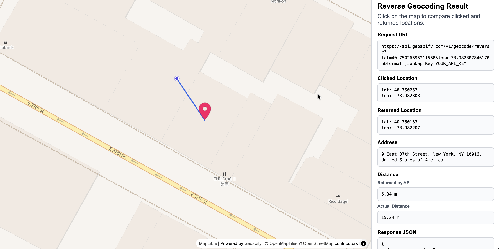

# Returned Address Can Differ Slightly From Clicked Map Point

Click on the map to compare the clicked coordinates with the coordinates returned by Geoapify Reverse Geocoding.

## Quick Summary

- Problem: The clicked map point and returned address point are often close, but not always identical.
- Solution: Reverse geocode on click, show both markers, and compare API distance vs geometry distance.
- Stack: HTML, CSS, JavaScript, MapLibre GL JS.
- APIs: Geoapify Reverse Geocoding API, Geometry Operation API, Marker Icon API, Map Tiles API.

## Live Demo

[](https://codepen.io/editor/team/geoapify/pen/019d8e47-9b0b-70c9-921a-07c5565e0694)

## Screenshot



## What This Example Includes

- MapLibre map with Geoapify `osm-bright` style
- Click-to-reverse-geocode flow
- Two markers:
  - clicked location (circle)
  - returned location (Geoapify marker icon)
- Side panel with:
  - request URL
  - clicked and returned coordinates
  - `formatted` address
  - two distance fields:
    - returned by API (`properties.distance`)
    - actual distance from Geometry API
- Path rendering between clicked and returned points:
  - direct line for short distance (`< 1000 m`)
  - great-circle geometry for longer distance (`>= 1000 m`)

## Quick Start

Open [`src/index.html`](./src/index.html) in your browser.

No build step is required.

## Code Samples

### 1. Get Address On Click

```js
map.on("click", async (event) => {
  const { lng, lat } = event.lngLat;
  const url = `https://api.geoapify.com/v1/geocode/reverse?lat=${lat}&lon=${lng}&format=json&apiKey=${yourAPIKey}`;
  const data = await (await fetch(url)).json();
  const result = data?.results?.[0];
  if (!result) return;

  const address = result.formatted || "-";
  const returnedLon = result.lon;
  const returnedLat = result.lat;
});
```

### 2. What does `property.distance` mean?

`distance` is the distance (meters) between the original requested coordinate and the returned object.  
If the returned object is an area (for example a building or boundary polygon), `distance` is `0` when the original coordinate is inside that polygon.  
In `format=json` responses it is `result.distance`. In GeoJSON responses it is typically `feature.properties.distance`.

```js
const result = data?.results?.[0];
const distanceReturnedByApiMeters =
  typeof result?.distance === "number" ? result.distance : null;
```

### 3. How To Get Distance Between Initial and Returned Coordinates?

Use Geometry Operation API with `operation: "distance"` and `units: "meters"`:

```js
const body = {
  operation: "distance",
  point1: { type: "Point", coordinates: [clickedLon, clickedLat] },
  point2: { type: "Point", coordinates: [returnedLon, returnedLat] },
  params: { units: "meters" },
};

const response = await fetch(
  `https://api.geoapify.com/v1/geometry/operation?apiKey=${yourAPIKey}`,
  {
    method: "POST",
    headers: { "Content-Type": "application/json" },
    body: JSON.stringify(body),
  },
);
const geometryDistanceResponse = await response.json();

if (
  geometryDistanceResponse?.type === "number" &&
  typeof geometryDistanceResponse?.data === "number"
) {
  const actualDistanceMeters = geometryDistanceResponse.data;
}
```

### 4. Draw Line Between Initial Coordinates And Returned (2 Variants)

#### Variant A: Direct Line (`LineString`)

Use when points are close (for example `< 1 km`).

```js
const featureCollection = {
  type: "FeatureCollection",
  features: [
    {
      type: "Feature",
      properties: {},
      geometry: {
        type: "LineString",
        coordinates: [
          [clickedLon, clickedLat],
          [returnedLon, returnedLat],
        ],
      },
    },
  ],
};

map.getSource("great-circle-source")?.setData(featureCollection);
```

#### Variant B: Great Circle (`operation: "greatCircle"`)

Use for longer distances for better geodesic representation.

```js
const body = {
  operation: "greatCircle",
  point1: { type: "Point", coordinates: [clickedLon, clickedLat] },
  point2: { type: "Point", coordinates: [returnedLon, returnedLat] },
  params: { npoints: 100 },
};

const response = await fetch(
  `https://api.geoapify.com/v1/geometry/operation?apiKey=${yourAPIKey}`,
  {
    method: "POST",
    headers: { "Content-Type": "application/json" },
    body: JSON.stringify(body),
  },
);
const greatCircleResponse = await response.json();

// Expected shape: { type: "geojson", data: ... }
if (greatCircleResponse?.type === "geojson" && greatCircleResponse?.data) {
  const geometry = greatCircleResponse.data;
  const featureCollection =
    geometry.type === "FeatureCollection"
      ? geometry
      : {
          type: "FeatureCollection",
          features: [
            geometry.type === "Feature"
              ? geometry
              : { type: "Feature", properties: {}, geometry },
          ],
        };
  map.getSource("great-circle-source")?.setData(featureCollection);
}
```

## APIs and Libraries

| Type | Name | Link | API Endpoint Used |
|------|------|------|-------------------|
| API | Geoapify Reverse Geocoding API | [Geocoding API](https://www.geoapify.com/geocoding-api/) | `https://api.geoapify.com/v1/geocode/reverse?...` |
| API | Geoapify Geometry Operation API | [Geometry API](https://apidocs.geoapify.com/docs/geometry/geometry-operation/) | `https://api.geoapify.com/v1/geometry/operation?apiKey=...` |
| API | Geoapify Marker Icon API | [Marker Icon API](https://www.geoapify.com/map-marker-icon-api/) | `https://api.geoapify.com/v2/icon/?...` |
| API | Geoapify Map Tiles API | [Map Tiles API](https://www.geoapify.com/map-tiles/) | `https://maps.geoapify.com/v1/styles/osm-bright/style.json?apiKey=...` |
| Library | MapLibre GL JS | [maplibre.org](https://maplibre.org/) | Not applicable |

## Related Examples

| Example | Description | Link |
|---------|-------------|------|
| Reverse Geocoding City Boundaries Size Comparison | Reverse geocode city boundaries, drag them, and compare apparent size | [Open](../reverse-geocoding-city-boundaries-size-comparison-drag) |

## License

MIT
