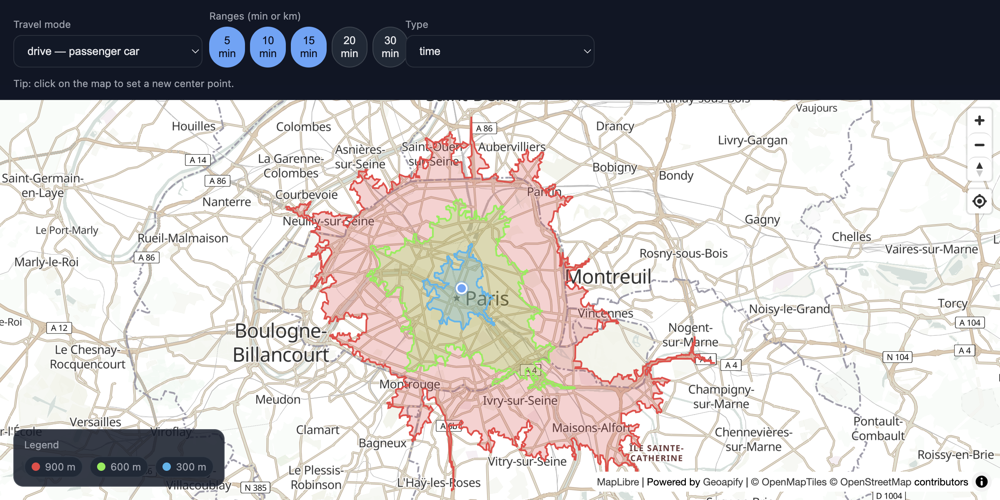
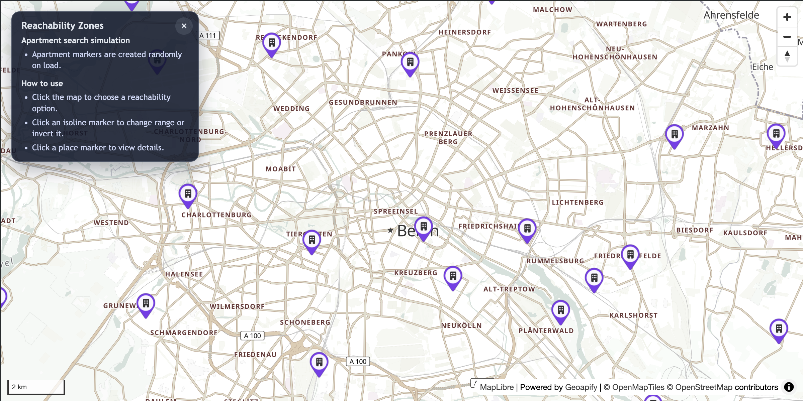
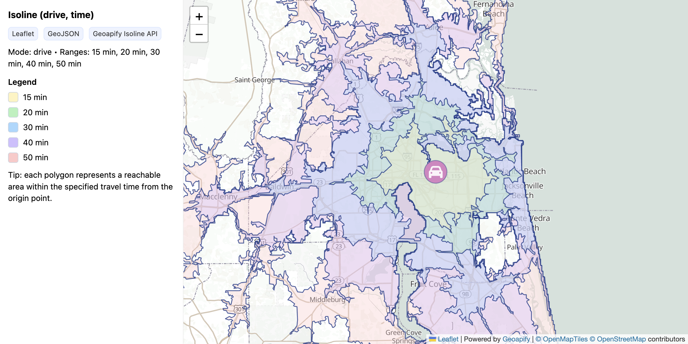

# Geoapify Isoline API Code Examples

Use Geoapify Isoline API examples to calculate isochrones and isodistances, render reachable areas on maps, and combine reachability polygons with places search.

## Overview

This folder contains browser-based JavaScript examples for visualizing reachable areas with Leaflet and MapLibre GL JS. Each example includes source code, a screenshot, and a focused README with setup notes and code samples.

## API Resources

## Live Demo

Each CodePen demo is linked from the `Live Demo` column in the code examples table.

## Code Examples

| Screenshot | Example | Description | Source Code | Live Demo |
|------------|---------|-------------|-------------|-----------|
|  | Geoapify Isoline API with MapLibre GL - Multi-Range Isochrones with Toggle | Explore reachable areas with selectable time or distance ranges, a draggable origin marker, and click-to-move map interaction. | [Open example](https://github.com/geoapify/geoapify-quickstart-examples/tree/main/isoline-api/geoapify-isoline-api-maplibre-gl-multi-range-isochrones-with-toggle-ranges/) | [CodePen](https://codepen.io/geoapify/pen/ByoegYO) |
|  | Reachability Zones + Places (MapLibre + Geoapify) | Combine isochrone reachability zones with Places API queries, multi-range selection, and dynamic place markers. | [Open example](https://github.com/geoapify/geoapify-quickstart-examples/tree/main/isoline-api/reachability-zones-places-maplibre-gl/) | [CodePen](https://codepen.io/geoapify/pen/qENxoLv) |
|  | Visualizing GeoJSON Polygons with Leaflet and Geoapify Isoline API | Display isochrone and isodistance polygons on a Leaflet map with color-coded ranges and an interactive legend. | [Open example](https://github.com/geoapify/geoapify-quickstart-examples/tree/main/isoline-api/visualizing-geojson-polygons-with-leaflet-and-geoapify-isoline-api/) | [CodePen](https://codepen.io/geoapify/pen/EaPROwQ) |

## Geoapify API Key

These examples include demo Geoapify API keys for quick testing. For your own project, create a free API key at [myprojects.geoapify.com](https://myprojects.geoapify.com/) and replace the example key in the relevant `src/script.js` file.

## APIs and Libraries

| Name | Description | Documentation | Used In This Example |
|------|-------------|---------------|----------------------|
| Geoapify Isoline API | Calculates reachable areas as isochrone or isodistance GeoJSON polygons. | [Isoline API docs](https://apidocs.geoapify.com/docs/isolines/) | [Multi-Range Isochrones](./geoapify-isoline-api-maplibre-gl-multi-range-isochrones-with-toggle-ranges/), [Reachability Zones + Places](./reachability-zones-places-maplibre-gl/), [Visualizing GeoJSON Polygons](./visualizing-geojson-polygons-with-leaflet-and-geoapify-isoline-api/) |
| Geoapify Places API | Searches places and points of interest inside reachable areas. | [Places API docs](https://apidocs.geoapify.com/docs/places/) | [Reachability Zones + Places](./reachability-zones-places-maplibre-gl/) |
| Geoapify Reverse Geocoding API | Converts selected map coordinates into address context. | [Reverse geocoding docs](https://apidocs.geoapify.com/docs/geocoding/reverse-geocoding/) | [Reachability Zones + Places](./reachability-zones-places-maplibre-gl/) |
| Geoapify Marker Icon API | Generates marker icons for map origins and places. | [Marker Icon docs](https://apidocs.geoapify.com/docs/icon/) | [Reachability Zones + Places](./reachability-zones-places-maplibre-gl/), [Visualizing GeoJSON Polygons](./visualizing-geojson-polygons-with-leaflet-and-geoapify-isoline-api/) |
| Geoapify Map Tiles API | Provides map styles and tiles for Leaflet and MapLibre examples. | [Map Tiles docs](https://apidocs.geoapify.com/docs/maps/map-tiles/) | [Multi-Range Isochrones](./geoapify-isoline-api-maplibre-gl-multi-range-isochrones-with-toggle-ranges/), [Reachability Zones + Places](./reachability-zones-places-maplibre-gl/), [Visualizing GeoJSON Polygons](./visualizing-geojson-polygons-with-leaflet-and-geoapify-isoline-api/) |
| MapLibre GL JS | Renders interactive vector maps in browser examples. | [MapLibre GL JS docs](https://maplibre.org/maplibre-gl-js/docs/) | [Multi-Range Isochrones](./geoapify-isoline-api-maplibre-gl-multi-range-isochrones-with-toggle-ranges/), [Reachability Zones + Places](./reachability-zones-places-maplibre-gl/) |
| Leaflet | Renders interactive raster-tile maps and GeoJSON overlays. | [Leaflet docs](https://leafletjs.com/) | [Visualizing GeoJSON Polygons](./visualizing-geojson-polygons-with-leaflet-and-geoapify-isoline-api/) |

## Useful Links

- Geoapify API documentation: [https://apidocs.geoapify.com/](https://apidocs.geoapify.com/)
- Geoapify projects and API keys: [https://myprojects.geoapify.com/](https://myprojects.geoapify.com/)
- Geoapify CodePen examples: [https://codepen.io/geoapify](https://codepen.io/geoapify)
