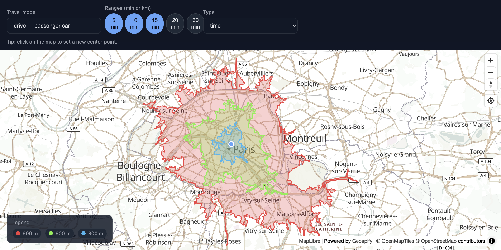

# Geoapify Isoline API with MapLibre GL - Multi-Range Isochrones with Toggle

Interactive isochrone visualization with MapLibre GL, featuring toggle buttons for range selection, draggable origin marker, and click-to-move functionality.

## Quick Summary

- Problem: Create an interactive tool to explore reachable areas with selectable time/distance ranges.
- Solution: Use MapLibre GL with Isoline API, toggle buttons for range selection, and draggable origin.
- Stack: HTML, CSS, JavaScript, MapLibre GL JS.
- APIs: Geoapify Isoline API, Geoapify Map Tiles API.

## What This Example Includes

- MapLibre GL JS map with Geoapify vector tiles
- Toggle buttons for selecting time or distance ranges
- Mode selector (drive, walk, bicycle, transit)
- Type selector (time vs distance)
- Draggable origin marker
- Click map to move origin
- Color-coded isochrone layers with filtering
- Dynamic legend
- Source-based run from `src/index.html` (no build step)

## Use Cases

- Explore travel time coverage from multiple locations.
- Compare walking vs driving accessibility.
- Build interactive location analysis dashboards.

## Live Demo

[](https://codepen.io/geoapify/pen/ByoegYO)

## Screenshot



## Quick Start

Open [`src/index.html`](./src/index.html) in your browser.

No local server is required.

Note: In rare cases, browser policies or extensions can restrict `file://` access. If that happens, run a local static server and open `src/index.html` via `http://localhost`, or use your IDE's "Open with Live Server" (or similar) option.

## Input and Output

- Input: Origin coordinates (click or drag), travel mode, type (time/distance), selected ranges, Geoapify API key.
- Output: Multiple colored isochrone polygons, interactive legend, fit-to-bounds visualization.

## Project Structure

| File | Purpose |
|------|---------|
| `src/index.html` | Source HTML |
| `src/script.js` | Source JavaScript (Isoline API, MapLibre layers, toggles) |
| `src/style.css` | Source CSS |

## Code Samples

### Minimal HTML

```html
<!DOCTYPE html>
<html lang="en">
<head>
  <meta charset="UTF-8">
  <title>Multi-Range Isochrones</title>
  <link href="https://unpkg.com/maplibre-gl@latest/dist/maplibre-gl.css" rel="stylesheet">
  <script src="https://unpkg.com/maplibre-gl@latest/dist/maplibre-gl.js"></script>
  <style>
    #map { height: 500px; }
  </style>
</head>
<body>
  <select id="mode"><option value="drive">Drive</option><option value="walk">Walk</option></select>
  <div id="rangesToggle"></div>
  <div id="map"></div>
  <script src="script.js"></script>
</body>
</html>
```

### Minimal JavaScript

```js
// Demo API key for quickstart only.
// Register for your own free API key at https://myprojects.geoapify.com/.
// Benefits: usage analytics, project-level limits, and reliable access for production use.
// This demo key can be blocked or restricted at any time.
const yourAPIKey = "YOUR_API_KEY";

const map = new maplibregl.Map({
  container: "map",
  style: `https://maps.geoapify.com/v1/styles/osm-bright-grey/style.json?apiKey=${yourAPIKey}`,
  center: [2.351, 48.857],
  zoom: 11
});

let lat = 48.857, lon = 2.351;
const ranges = [5, 10, 15]; // minutes

async function getIsoline() {
  const rangeSeconds = ranges.map((r) => r * 60).join(",");
  const url = `https://api.geoapify.com/v1/isoline?lat=${lat}&lon=${lon}&type=time&mode=drive&range=${rangeSeconds}&apiKey=${yourAPIKey}`;
  const res = await fetch(url);
  const data = await res.json();

  if (map.getSource("isoline")) map.getSource("isoline").setData(data);
  else {
    map.addSource("isoline", { type: "geojson", data });
    map.addLayer({ id: "isoline-fill", type: "fill", source: "isoline", paint: { "fill-color": "#3b82f6", "fill-opacity": 0.2 } });
    map.addLayer({ id: "isoline-line", type: "line", source: "isoline", paint: { "line-color": "#3b82f6", "line-width": 2 } });
  }
}

map.on("load", getIsoline);
map.on("click", (e) => { lat = e.lngLat.lat; lon = e.lngLat.lng; getIsoline(); });
```

## Customize

1. Open [`src/script.js`](./src/script.js).
2. Set your own API key in `yourAPIKey`.
3. Modify `initialCenter` for a different starting location.
4. Adjust `RANGES_PRESETS` for different time/distance options.
5. Change `colorForIndex()` function for different color schemes.

API documentation:
- [Geoapify Isoline API](https://apidocs.geoapify.com/docs/isolines/)
- [Geoapify Map Tiles API](https://apidocs.geoapify.com/docs/maps/map-tiles/)

No build step is required. Edit files in `src/` and refresh the browser.

## Troubleshooting

| Problem | Likely Cause | What to Do |
|---------|--------------|------------|
| Map is blank or unstyled | MapLibre assets failed to load | Open browser DevTools (`Console` + `Network`) and confirm CDN files load without errors. |
| Map does not load data / API responds `403` | API key is invalid, restricted, or over limits | Get your own free key at `https://myprojects.geoapify.com/`, then update `yourAPIKey` in `src/script.js`. |
| Works inconsistently from local file | Browser policy blocks some `file://` behavior | Open with IDE Live Server (or any local static server) and run from `http://localhost`. |
| Output differs from expected | Local edits introduced a regression | Compare your files with the [CodePen demo](https://codepen.io/geoapify/pen/ByoegYO) and align differences step by step. |

## APIs and Libraries

| Type | Name | Link | API Endpoint Used |
|------|------|------|-------------------|
| API | Geoapify Isoline API | [Isoline API](https://www.geoapify.com/isoline-api/) | `https://api.geoapify.com/v1/isoline?lat=...&lon=...&type=time&mode=drive&range=...&apiKey=...` |
| API | Geoapify Map Tiles API | [Map Tiles API](https://www.geoapify.com/map-tiles/) | `https://maps.geoapify.com/v1/styles/osm-bright-grey/style.json?apiKey=...` |
| Library | MapLibre GL JS | [maplibre.org](https://maplibre.org/) | Not applicable |

## Related Examples

| Example | Description | Link |
|---------|-------------|------|
| Isoline Leaflet | Basic isochrone visualization with Leaflet | [Open](../visualizing-geojson-polygons-with-leaflet-and-geoapify-isoline-api) |
| MapLibre Starter | MapLibre GL JS with Geoapify tiles | [Open](../../maps/maplibre-geoapify-map-tiles-starter) |
| Route Visualization | Display driving routes | [Open](../../routing-api/visualizing-geojson-routes-with-leaflet-and-geoapify-routing-api) |

## Useful Links

- Geoapify API docs: [https://apidocs.geoapify.com/](https://apidocs.geoapify.com/)
- CodePen demo: [https://codepen.io/geoapify/pen/ByoegYO](https://codepen.io/geoapify/pen/ByoegYO)
- Geoapify CodePen profile: [https://codepen.io/geoapify](https://codepen.io/geoapify)

## License

MIT

**Keywords**: isochrone, isodistance, multi-range, MapLibre GL, toggle controls, travel time, reachability, draggable marker
