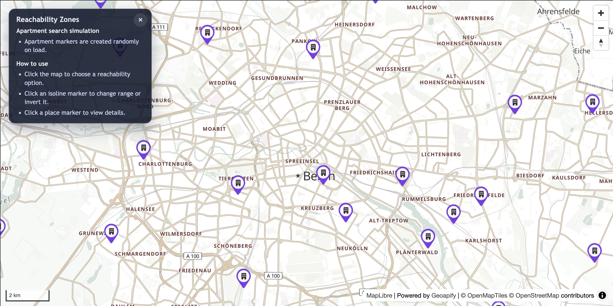

# Reachability Zones + Places (MapLibre + Geoapify)

Interactive apartment search simulation combining isochrone reachability zones with places API queries, featuring hole visualization, multi-range selection, and dynamic place markers.

## Quick Summary

- Problem: Visualize what areas are reachable from a location and find relevant places within those zones.
- Solution: Combine Isoline API for reachability polygons with Places API for POI queries, using MapLibre GL for visualization.
- Stack: HTML, CSS, JavaScript, MapLibre GL JS.
- APIs: Geoapify Isoline API, Geoapify Places API, Geoapify Reverse Geocoding API, Geoapify Marker Icon API, Geoapify Map Tiles API.

## What This Example Includes

- MapLibre GL JS map with Geoapify vector tiles
- Multiple travel mode options (bike, car, transit)
- Click-to-place isochrone origin markers
- Multi-range selection with dynamic updates
- Hole visualization (invert isochrone to show unreachable areas)
- Query places inside isochrone boundaries (supermarkets, parks, transit)
- Simulated apartment markers with reverse geocoding
- Custom travel mode icons with range badges
- Info panel with usage instructions
- Loading indicator for async operations
- Source-based run from `src/index.html` (no build step)

## Use Cases

- Build apartment or property search tools with commute analysis.
- Create location intelligence dashboards showing accessibility.
- Explore neighborhoods and find amenities within travel time limits.
- Compare reachability across different travel modes.

## Live Demo

[](https://codepen.io/geoapify/pen/qENxoLv)

## Screenshot



## Quick Start

Open [`src/index.html`](./src/index.html) in your browser.

No local server is required.

Note: In rare cases, browser policies or extensions can restrict `file://` access. If that happens, run a local static server and open `src/index.html` via `http://localhost`, or use your IDE's "Open with Live Server" (or similar) option.

## Input and Output

- Input: Click location, travel mode, range selection, place category, Geoapify API key.
- Output: Isochrone polygon layers, travel mode markers with range badges, place markers with popups, apartment markers with addresses.

## Project Structure

| File | Purpose |
|------|---------|
| `src/index.html` | Source HTML |
| `src/script.js` | Source JavaScript (Isoline API, Places API, MapLibre layers, markers) |
| `src/style.css` | Source CSS |

## Code Samples

### Minimal HTML

```html
<!DOCTYPE html>
<html lang="en">
<head>
  <meta charset="UTF-8">
  <title>Reachability Zones</title>
  <link href="https://unpkg.com/maplibre-gl@latest/dist/maplibre-gl.css" rel="stylesheet">
  <script src="https://unpkg.com/maplibre-gl@latest/dist/maplibre-gl.js"></script>
  <style>
    #map { height: 500px; }
  </style>
</head>
<body>
  <div id="map"></div>
  <script src="script.js"></script>
</body>
</html>
```

### Minimal JavaScript

```js
// Demo API key for quickstart only.
// Register for your own free API key at https://myprojects.geoapify.com/.
// Benefits: usage analytics, project-level limits, and reliable access for production use.
// This demo key can be blocked or restricted at any time.
const yourAPIKey = "YOUR_API_KEY";

const map = new maplibregl.Map({
  container: "map",
  style: `https://maps.geoapify.com/v1/styles/osm-bright-grey/style.json?apiKey=${yourAPIKey}`,
  center: [13.405, 52.52],
  zoom: 11
});

async function fetchIsoline(lat, lon, type, mode, range) {
  const params = new URLSearchParams({ lat, lon, type, mode, range, apiKey: yourAPIKey });
  const res = await fetch(`https://api.geoapify.com/v1/isoline?${params}`);
  return res.json();
}

async function queryPlaces(geometryId, categories) {
  const params = new URLSearchParams({
    categories: categories.join(","),
    filter: `geometry:${geometryId}`,
    limit: "50",
    apiKey: yourAPIKey
  });
  const res = await fetch(`https://api.geoapify.com/v2/places?${params}`);
  return res.json();
}

map.on("click", async (e) => {
  const data = await fetchIsoline(e.lngLat.lat, e.lngLat.lng, "time", "drive", 1200);

  if (map.getSource("isoline")) map.getSource("isoline").setData(data);
  else {
    map.addSource("isoline", { type: "geojson", data });
    map.addLayer({ id: "isoline-fill", type: "fill", source: "isoline", paint: { "fill-color": "#3b82f6", "fill-opacity": 0.2 } });
    map.addLayer({ id: "isoline-line", type: "line", source: "isoline", paint: { "line-color": "#3b82f6", "line-width": 2 } });
  }

  const geometryId = data.features?.[0]?.properties?.id;
  if (geometryId) {
    const places = await queryPlaces(geometryId, ["commercial.supermarket"]);
    places.features?.forEach((f) => {
      new maplibregl.Marker().setLngLat(f.geometry.coordinates).addTo(map);
    });
  }
});
```

## Customize

1. Open [`src/script.js`](./src/script.js).
2. Set your own API key in `yourAPIKey`.
3. Modify `initialCenter` for a different starting location.
4. Adjust `REACHABILITY_OPTIONS` for different travel modes and ranges.
5. Change `PLACES_QUERY_OPTIONS` to query different place categories.
6. Modify `APARTMENT_COUNT` and `APARTMENT_RADIUS_METERS` for simulation settings.

API documentation:
- [Geoapify Isoline API](https://apidocs.geoapify.com/docs/isolines/)
- [Geoapify Places API](https://apidocs.geoapify.com/docs/places/)
- [Geoapify Reverse Geocoding API](https://apidocs.geoapify.com/docs/geocoding/reverse-geocoding/)
- [Geoapify Marker Icon API](https://apidocs.geoapify.com/docs/icon/)
- [Geoapify Map Tiles API](https://apidocs.geoapify.com/docs/maps/map-tiles/)

No build step is required. Edit files in `src/` and refresh the browser.

## Troubleshooting

| Problem | Likely Cause | What to Do |
|---------|--------------|------------|
| Map is blank or unstyled | MapLibre assets failed to load | Open browser DevTools (`Console` + `Network`) and confirm CDN files load without errors. |
| Map does not load data / API responds `403` | API key is invalid, restricted, or over limits | Get your own free key at `https://myprojects.geoapify.com/`, then update `yourAPIKey` in `src/script.js`. |
| Works inconsistently from local file | Browser policy blocks some `file://` behavior | Open with IDE Live Server (or any local static server) and run from `http://localhost`. |
| Output differs from expected | Local edits introduced a regression | Compare your files with the [CodePen demo](https://codepen.io/geoapify/pen/qENxoLv) and align differences step by step. |
| Apartment markers don't appear | Reverse geocoding requests may be rate limited | Wait a moment and reload; reduce `APARTMENT_COUNT` if needed. |

## APIs and Libraries

| Type | Name | Link | API Endpoint Used |
|------|------|------|-------------------|
| API | Geoapify Isoline API | [Isoline API](https://www.geoapify.com/isoline-api/) | `https://api.geoapify.com/v1/isoline?lat=...&lon=...&type=...&mode=...&range=...&apiKey=...` |
| API | Geoapify Places API | [Places API](https://www.geoapify.com/places-api/) | `https://api.geoapify.com/v2/places?categories=...&filter=geometry:...&apiKey=...` |
| API | Geoapify Reverse Geocoding API | [Reverse Geocoding](https://www.geoapify.com/reverse-geocoding-api/) | `https://api.geoapify.com/v1/geocode/reverse?lat=...&lon=...&apiKey=...` |
| API | Geoapify Marker Icon API | [Marker Icon API](https://www.geoapify.com/map-marker-icon-api/) | `https://api.geoapify.com/v2/icon/?type=awesome&...&apiKey=...` |
| API | Geoapify Map Tiles API | [Map Tiles API](https://www.geoapify.com/map-tiles/) | `https://maps.geoapify.com/v1/styles/osm-bright-grey/style.json?apiKey=...` |
| Library | MapLibre GL JS | [maplibre.org](https://maplibre.org/) | Not applicable |

## Related Examples

| Example | Description | Link |
|---------|-------------|------|
| Multi-Range Isochrones | Isochrone with toggle ranges | [Open](../geoapify-isoline-api-maplibre-gl-multi-range-isochrones-with-toggle-ranges) |
| Isoline Leaflet | Basic isochrone visualization | [Open](../visualizing-geojson-polygons-with-leaflet-and-geoapify-isoline-api) |
| Places Category Search | Dynamic markers by category | [Open](../../places-api/leaflet-demo-geoapify-places-api-category-search-with-dynamic-markers) |
| Custom Markers MapLibre | Place details with popups | [Open](../../maps/maplibre-custom-markers-popups-with-geoapify-place-details) |

## Useful Links

- Geoapify API docs: [https://apidocs.geoapify.com/](https://apidocs.geoapify.com/)
- CodePen demo: [https://codepen.io/geoapify/pen/qENxoLv](https://codepen.io/geoapify/pen/qENxoLv)
- Geoapify CodePen profile: [https://codepen.io/geoapify](https://codepen.io/geoapify)

## License

MIT

**Keywords**: isochrone, reachability zones, apartment search, places API, hole visualization, MapLibre GL, travel mode, commute analysis, location intelligence
