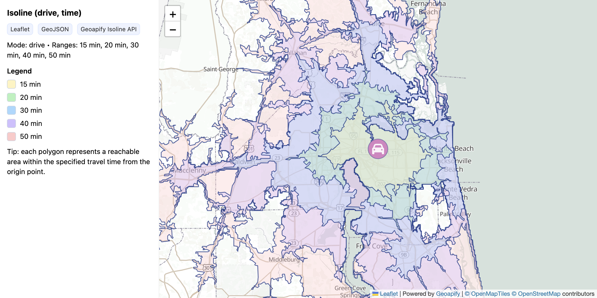

# Visualizing GeoJSON Polygons with Leaflet and Geoapify Isoline API

Display isochrone (travel time) and isodistance polygons on a Leaflet map with color-coded ranges and interactive legend.

## Quick Summary

- Problem: Visualize reachable areas from a point based on travel time or distance.
- Solution: Use Geoapify Isoline API to fetch polygons and render with Leaflet GeoJSON layers.
- Stack: HTML, CSS, JavaScript, Leaflet.
- APIs: Geoapify Isoline API, Geoapify Marker Icon API, Geoapify Map Tiles API.

## What This Example Includes

- Leaflet map with Geoapify raster tiles
- Isoline API call with multiple range values
- Color-coded polygon fills with outlines
- Interactive legend showing range values
- Origin marker with popup
- Pane-based z-index control
- Source-based run from `src/index.html` (no build step)

## Use Cases

- Show delivery coverage areas based on drive time.
- Visualize walking distance to public transit stations.
- Build location analysis tools for real estate.

## Live Demo

[](https://codepen.io/geoapify/pen/EaPROwQ)

## Screenshot



## Quick Start

Open [`src/index.html`](./src/index.html) in your browser.

No local server is required.

Note: In rare cases, browser policies or extensions can restrict `file://` access. If that happens, run a local static server and open `src/index.html` via `http://localhost`, or use your IDE's "Open with Live Server" (or similar) option.

## Input and Output

- Input: Origin coordinates (lat, lon), travel mode, range values (seconds/meters), Geoapify API key.
- Output: Colored polygon overlays showing reachable areas, legend with range labels.

## Project Structure

| File | Purpose |
|------|---------|
| `src/index.html` | Source HTML |
| `src/script.js` | Source JavaScript (Isoline API, rendering, legend) |
| `src/style.css` | Source CSS |

## Code Samples

### Minimal HTML

```html
<!DOCTYPE html>
<html lang="en">
<head>
  <meta charset="UTF-8">
  <title>Isoline Visualization</title>
  <link rel="stylesheet" href="https://unpkg.com/leaflet@1.9.4/dist/leaflet.css">
  <style>
    #map { height: 500px; }
    .legend { padding: 10px; background: white; }
    .swatch { display: inline-block; width: 16px; height: 16px; margin-right: 8px; }
  </style>
</head>
<body>
  <div id="map"></div>
  <div id="legend" class="legend"></div>
  <script src="https://unpkg.com/leaflet@1.9.4/dist/leaflet.js"></script>
  <script src="script.js"></script>
</body>
</html>
```

### Minimal JavaScript

```js
// Demo API key for quickstart only.
// Register for your own free API key at https://myprojects.geoapify.com/.
// Benefits: usage analytics, project-level limits, and reliable access for production use.
// This demo key can be blocked or restricted at any time.
const yourAPIKey = "YOUR_API_KEY";

const lat = 30.332, lon = -81.601;
const map = L.map("map").setView([lat, lon], 10);

L.tileLayer(`https://maps.geoapify.com/v1/tile/osm-bright-grey/{z}/{x}/{y}.png?apiKey=${yourAPIKey}`, {
  attribution: 'Powered by <a href="https://www.geoapify.com/">Geoapify</a>'
}).addTo(map);

const palette = ["#fff3bf", "#b2f2bb", "#a5d8ff", "#d0bfff", "#ffc9c9"];

fetch(`https://api.geoapify.com/v1/isoline?lat=${lat}&lon=${lon}&type=time&mode=drive&range=900,1200,1800,2400,3000&apiKey=${yourAPIKey}`)
  .then((r) => r.json())
  .then((data) => {
    data.features.sort((a, b) => b.properties.range - a.properties.range);
    L.geoJSON(data, {
      style: (f, i) => ({
        fillColor: palette[data.features.indexOf(f) % palette.length],
        fillOpacity: 0.35,
        color: "#1e3a8a",
        weight: 1.5
      }),
      onEachFeature: (f, layer) => layer.bindPopup(`${f.properties.range / 60} min`)
    }).addTo(map);
  });
```

## Customize

1. Open [`src/script.js`](./src/script.js).
2. Set your own API key in `yourAPIKey`.
3. Change `lat` and `lon` for a different origin point.
4. Modify `range` parameter (comma-separated values in seconds for time, meters for distance).
5. Adjust `palette` array for different colors.

API documentation:
- [Geoapify Isoline API](https://apidocs.geoapify.com/docs/isolines/)
- [Geoapify Map Tiles API](https://apidocs.geoapify.com/docs/maps/map-tiles/)
- [Geoapify Marker Icon API](https://apidocs.geoapify.com/docs/icon/)

No build step is required. Edit files in `src/` and refresh the browser.

## Troubleshooting

| Problem | Likely Cause | What to Do |
|---------|--------------|------------|
| Map is blank or tiles missing | Leaflet CSS/JS failed to load | Open browser DevTools (`Console` + `Network`) and confirm CDN files load without errors. |
| Map does not load data / API responds `403` | API key is invalid, restricted, or over limits | Get your own free key at `https://myprojects.geoapify.com/`, then update `yourAPIKey` in `src/script.js`. |
| Works inconsistently from local file | Browser policy blocks some `file://` behavior | Open with IDE Live Server (or any local static server) and run from `http://localhost`. |
| Output differs from expected | Local edits introduced a regression | Compare your files with the [CodePen demo](https://codepen.io/geoapify/pen/EaPROwQ) and align differences step by step. |

## APIs and Libraries

| Type | Name | Link | API Endpoint Used |
|------|------|------|-------------------|
| API | Geoapify Isoline API | [Isoline API](https://www.geoapify.com/isoline-api/) | `https://api.geoapify.com/v1/isoline?lat=...&lon=...&type=time&mode=drive&range=...&apiKey=...` |
| API | Geoapify Marker Icon API | [Marker Icon API](https://www.geoapify.com/map-marker-icon-api/) | `https://api.geoapify.com/v2/icon/?type=circle&...&apiKey=...` |
| API | Geoapify Map Tiles API | [Map Tiles API](https://www.geoapify.com/map-tiles/) | `https://maps.geoapify.com/v1/tile/osm-bright-grey/{z}/{x}/{y}.png?apiKey=...` |
| Library | Leaflet | [leafletjs.com](https://leafletjs.com/) | Not applicable |

## Related Examples

| Example | Description | Link |
|---------|-------------|------|
| Isochrones MapLibre | Multi-range isochrones with toggle controls | [Open](../geoapify-isoline-api-maplibre-gl-multi-range-isochrones-with-toggle-ranges) |
| Route Visualization | Display driving routes with turn-by-turn | [Open](../../routing-api/visualizing-geojson-routes-with-leaflet-and-geoapify-routing-api) |
| Places API Demo | Search places by category | [Open](../../places-api/leaflet-demo-geoapify-places-api-category-search-with-dynamic-markers) |

## Useful Links

- Geoapify API docs: [https://apidocs.geoapify.com/](https://apidocs.geoapify.com/)
- CodePen demo: [https://codepen.io/geoapify/pen/EaPROwQ](https://codepen.io/geoapify/pen/EaPROwQ)
- Geoapify CodePen profile: [https://codepen.io/geoapify](https://codepen.io/geoapify)

## License

MIT

**Keywords**: isoline, isochrone, isodistance, travel time polygon, reachability area, Leaflet GeoJSON, Geoapify API
