# Geoapify Maps Code Examples

Use these browser-based JavaScript examples to build interactive maps, load Geoapify map tiles, work with markers, understand tile coordinates, and compare map projections.

## Overview

This folder contains focused examples for MapLibre GL JS, Leaflet, OpenLayers, and D3 Geo. Each example can be opened from its `src/index.html` file without a build step.

## API Resources

## Code Examples

| Screenshot | Example | Description | Source Code |
|------------|---------|-------------|-------------|
| 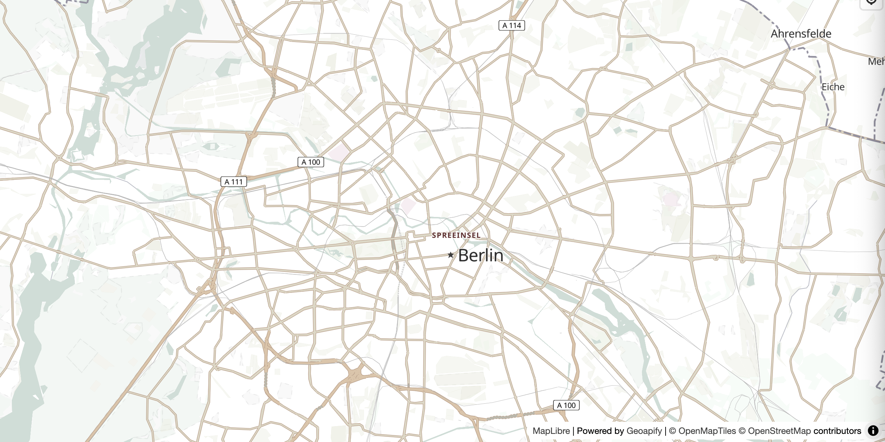 | MapLibre Map Tiles Starter | Create a basic MapLibre map with Geoapify tiles. | [Open example](./maplibre-geoapify-map-tiles-starter/) |
| 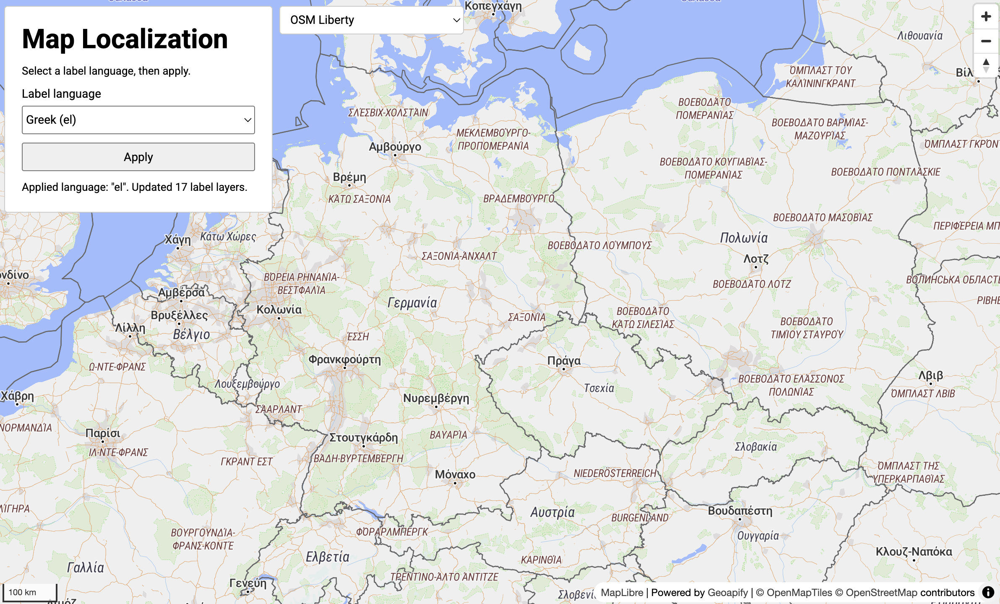 | MapLibre Vector Map Localization | Switch map styles and localize vector labels. | [Open example](./maplibre-vector-map-localization/) |
| 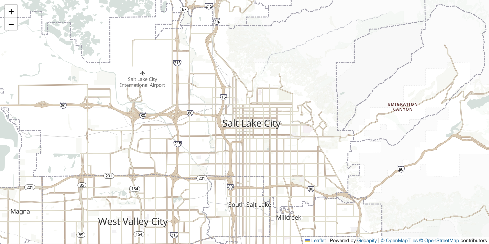 | Leaflet OSM Tiles | Display Geoapify raster tiles with Leaflet. | [Open example](./leaflet-map-with-osm-map-tiles-by-geoapify/) |
|  | Leaflet Priority Markers | Show multi-level flag markers. | [Open example](./leaflet-priority-markers-with-geoapify-marker-icon-api/) |
| 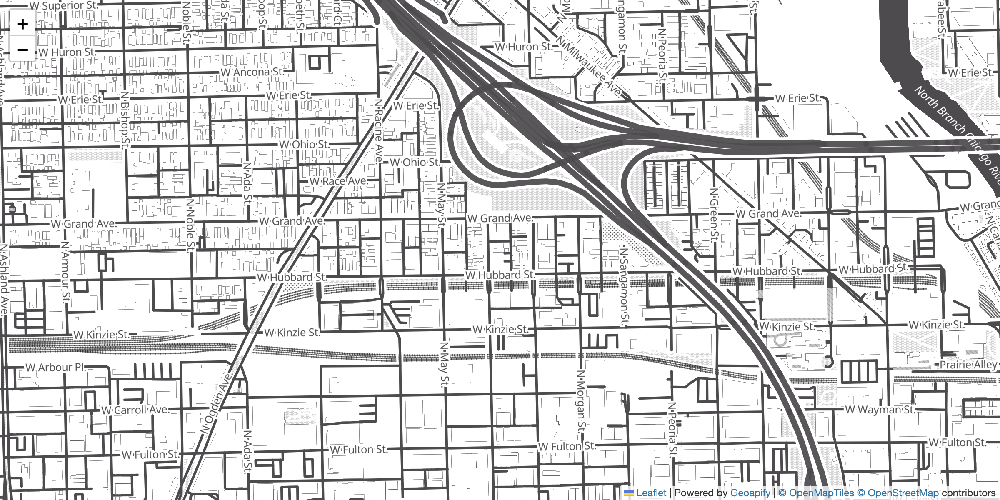 | Leaflet Vector Tiles | Add a MapLibre vector layer to Leaflet. | [Open example](./leaflet-vector-map-tiles-geoapify-maplibre-plugin/) |
| 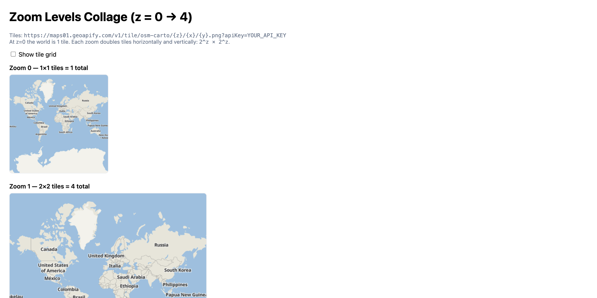 | Understanding Map Zoom Levels | Explore the XYZ tile grid. | [Open example](./understanding-map-zoom-levels-and-the-xyz-tile-system/) |
| 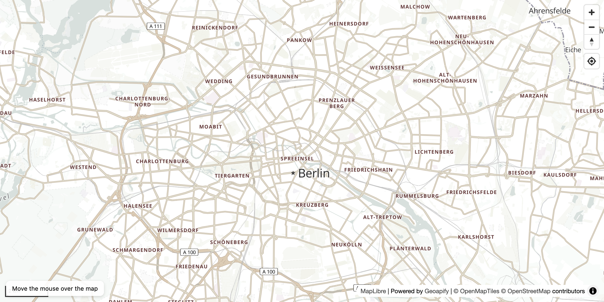 | Latitude and Longitude to Pixels | Convert geographic coordinates into screen pixels. | [Open example](./maplibre-geoapify-lat-lon-to-pixels-with-map-project/) |
| 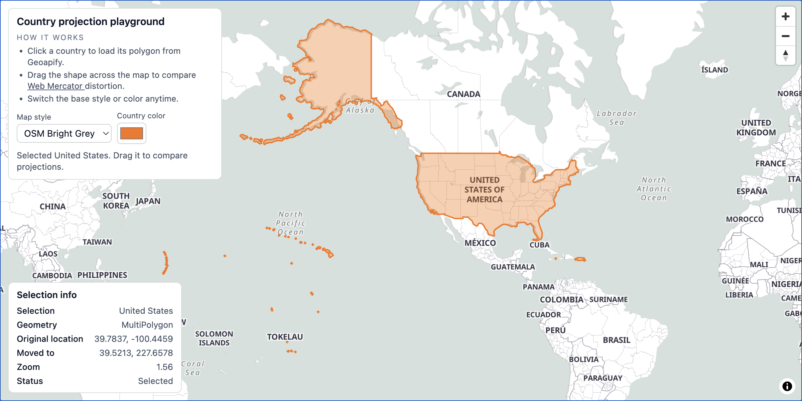 | Country Geometry and Projection | Drag and compare projected country boundaries. | [Open example](./maplibre-country-geometry-projection-drag/) |
| 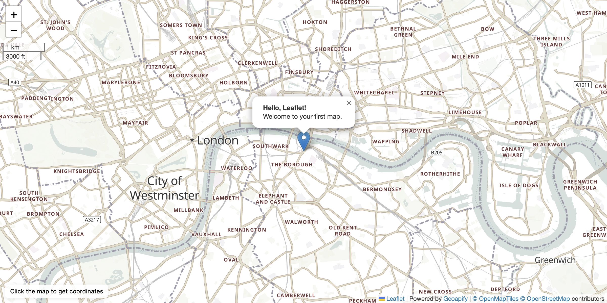 | Leaflet First Map | Build a basic interactive Leaflet map. | [Open example](./leaflet-first-interactive-map-with-geoapify-tiles/) |
| 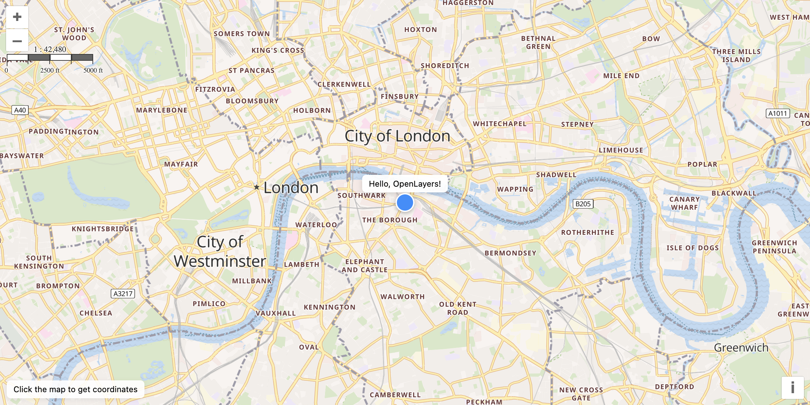 | OpenLayers First Map | Build a basic interactive OpenLayers map. | [Open example](./openlayers-first-interactive-map-with-geoapify-tiles/) |
| — | OpenLayers Projection Switcher | Reproject Web Mercator raster tiles into global and country-specific CRSs. | [Open example](./openlayers-geoapify-map-projection-switcher/) |
| — | D3 Geo Projection Explorer | Compare cartographic projections and show Geoapify raster tiles in Mercator. | [Open example](./d3-geo-projection-switcher/) |
| 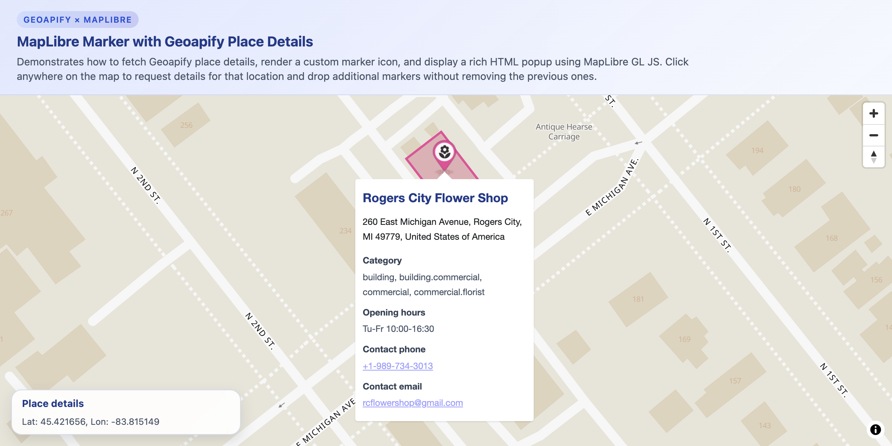 | Custom Markers and Popups | Display richer place details in MapLibre popups. | [Open example](./maplibre-custom-markers-popups-with-geoapify-place-details/) |
| 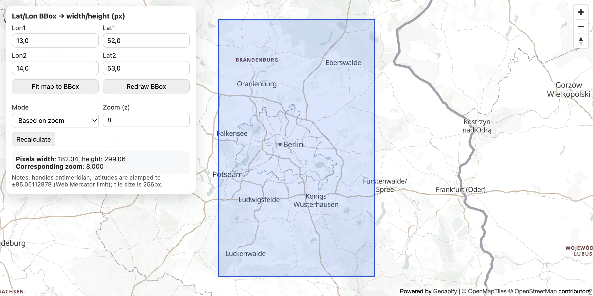 | Bounding Box Calculator | Calculate bounding-box dimensions in Web Mercator. | [Open example](./bbox-width-height-calculator-in-web-mercator-maplibre-geoapify/) |

## Geoapify API Key

Examples that load Geoapify map tiles include a demo key for quick testing. For your own project, create a free API key at [myprojects.geoapify.com](https://myprojects.geoapify.com/) and replace the key in the relevant `src/script.js` file.

The D3 Geo example requires a key for its Mercator raster tiles; its other projections use Natural Earth vector data without a Geoapify API key.

## APIs and Libraries

| Name | Description | Documentation | Used In This Example |
|------|-------------|---------------|----------------------|
| Geoapify Map Tiles API | Provides raster tiles and MapLibre-compatible vector styles. | [Map Tiles docs](https://apidocs.geoapify.com/docs/maps/map-tiles/) | Basemap examples and the OpenLayers and D3 projection switchers |
| Geoapify Marker Icon API | Generates configurable map marker images. | [Marker Icon docs](https://apidocs.geoapify.com/docs/icon/) | Leaflet Priority Markers |
| Geoapify Place Details API | Returns details for a selected place. | [Place Details docs](https://apidocs.geoapify.com/docs/place-details/) | Custom Markers and Popups |
| MapLibre GL JS | Renders interactive WebGL vector maps. | [MapLibre GL JS docs](https://maplibre.org/maplibre-gl-js/docs/) | MapLibre examples and Leaflet vector tiles |
| Leaflet | Renders interactive maps and vector overlays. | [Leaflet docs](https://leafletjs.com/reference.html) | Leaflet examples |
| OpenLayers | Renders maps and can reproject raster sources in the browser. | [OpenLayers docs](https://openlayers.org/en/latest/apidoc/) | OpenLayers examples |
| Proj4js | Transforms coordinates between coordinate reference systems. | [Proj4js](https://proj4js.org/) | OpenLayers Projection Switcher |
| D3 Geo | Projects GeoJSON into SVG paths. | [D3 Geo docs](https://d3js.org/d3-geo) | D3 Geo Projection Explorer |

## Useful Links

- Geoapify API documentation: [https://apidocs.geoapify.com/](https://apidocs.geoapify.com/)
- Geoapify projects and API keys: [https://myprojects.geoapify.com/](https://myprojects.geoapify.com/)
- Geoapify CodePen examples: [https://codepen.io/geoapify](https://codepen.io/geoapify)
