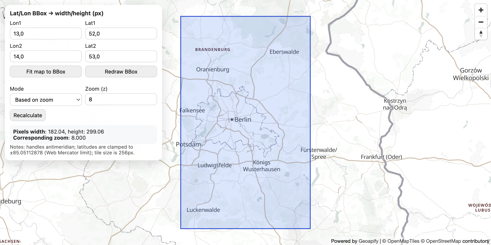

# BBox Width/Height Calculator in Web Mercator (MapLibre + Geoapify)

Calculate the pixel width and height of a geographic bounding box at different zoom levels using Web Mercator projection math.

## Quick Summary

- Problem: Determine pixel dimensions for a geographic bounding box at a specific zoom level.
- Solution: Apply Web Mercator projection formulas to calculate pixel width/height from coordinates.
- Stack: HTML, CSS, JavaScript, MapLibre GL JS.
- APIs: Geoapify Map Tiles API.

## What This Example Includes

- MapLibre GL JS map with bounding box visualization
- Three calculation modes: from zoom, from known width, from known height
- Web Mercator projection math implementation
- Interactive bbox drawing on map
- Fit-to-bounds functionality
- Source-based run from `src/index.html` (no build step)

## Use Cases

- Calculate static map image dimensions for a given area.
- Understand Web Mercator projection distortion at different latitudes.
- Plan map viewport sizes for specific geographic regions.

## Live Demo

[](https://codepen.io/geoapify/pen/dPYLYpZ)

## Screenshot



## Quick Start

Open [`src/index.html`](./src/index.html) in your browser.

No local server is required.

Note: In rare cases, browser policies or extensions can restrict `file://` access. If that happens, run a local static server and open `src/index.html` via `http://localhost`, or use your IDE's "Open with Live Server" (or similar) option.

## Input and Output

- Input: Bounding box coordinates (lon1, lat1, lon2, lat2), calculation mode (zoom/width/height), Geoapify API key.
- Output: Pixel width and height of the bounding box, corresponding zoom level, visual bbox overlay on map.

## Project Structure

| File | Purpose |
|------|---------|
| `src/index.html` | Source HTML |
| `src/script.js` | Source JavaScript (Web Mercator math, bbox drawing) |
| `src/style.css` | Source CSS |

## Code Samples

### Minimal HTML

```html
<!DOCTYPE html>
<html lang="en">
<head>
  <meta charset="UTF-8">
  <title>BBox Calculator</title>
  <link href="https://unpkg.com/maplibre-gl@latest/dist/maplibre-gl.css" rel="stylesheet">
  <script src="https://unpkg.com/maplibre-gl@latest/dist/maplibre-gl.js"></script>
  <style>
    #map { height: 500px; }
  </style>
</head>
<body>
  <div id="map"></div>
  <div id="output"></div>
  <script src="script.js"></script>
</body>
</html>
```

### Minimal JavaScript

```js
// Demo API key for quickstart only.
// Register for your own free API key at https://myprojects.geoapify.com/.
// Benefits: usage analytics, project-level limits, and reliable access for production use.
// This demo key can be blocked or restricted at any time.
const yourAPIKey = "YOUR_API_KEY";

const map = new maplibregl.Map({
  container: "map",
  style: `https://maps.geoapify.com/v1/styles/osm-bright-grey/style.json?apiKey=${yourAPIKey}`,
  center: [13.405, 52.52],
  zoom: 6
});

const MAX_LAT = 85.05112878;
const TILE_SIZE = 256;

function lonToX(lon) { return (lon + 180) / 360; }
function latToY(lat) {
  const φ = (Math.max(Math.min(lat, MAX_LAT), -MAX_LAT) * Math.PI) / 180;
  return 0.5 - Math.log((1 + Math.sin(φ)) / (1 - Math.sin(φ))) / (4 * Math.PI);
}
function worldSizePx(z) { return TILE_SIZE * Math.pow(2, z); }

function calcBboxDimensions(lon1, lat1, lon2, lat2, z) {
  const dx = Math.abs(lonToX(lon2) - lonToX(lon1));
  const dy = Math.abs(latToY(lat2) - latToY(lat1));
  const ws = worldSizePx(z);
  return { widthPx: dx * ws, heightPx: dy * ws };
}

map.on("moveend", () => {
  const bounds = map.getBounds();
  const dims = calcBboxDimensions(bounds.getWest(), bounds.getSouth(), bounds.getEast(), bounds.getNorth(), map.getZoom());
  document.getElementById("output").textContent = `Width: ${dims.widthPx.toFixed(0)}px, Height: ${dims.heightPx.toFixed(0)}px`;
});
```

## Customize

1. Open [`src/script.js`](./src/script.js).
2. Set your own API key in `yourAPIKey`.
3. Change `initialCenter` and `initialZoom` for a different starting view.
4. Modify `TILE_SIZE` if using non-standard tile sizes (default: 256).
5. Add custom calculation modes by extending the `calculate()` function.

API documentation:
- [Geoapify Map Tiles API](https://apidocs.geoapify.com/docs/maps/map-tiles/)

No build step is required. Edit files in `src/` and refresh the browser.

## Troubleshooting

| Problem | Likely Cause | What to Do |
|---------|--------------|------------|
| Map is blank or unstyled | MapLibre assets failed to load | Open browser DevTools (`Console` + `Network`) and confirm CDN files load without errors. |
| Map does not load data / API responds `403` | API key is invalid, restricted, or over limits | Get your own free key at `https://myprojects.geoapify.com/`, then update `yourAPIKey` in `src/script.js`. |
| Works inconsistently from local file | Browser policy blocks some `file://` behavior | Open with IDE Live Server (or any local static server) and run from `http://localhost`. |
| Output differs from expected | Local edits introduced a regression | Compare your files with the [CodePen demo](https://codepen.io/geoapify/pen/dPYLYpZ) and align differences step by step. |

## APIs and Libraries

| Type | Name | Link | API Endpoint Used |
|------|------|------|-------------------|
| API | Geoapify Map Tiles API | [Map Tiles API](https://www.geoapify.com/map-tiles/) | `https://maps.geoapify.com/v1/styles/osm-bright-grey/style.json?apiKey=...` |
| Library | MapLibre GL JS | [maplibre.org](https://maplibre.org/) | Not applicable |

## Related Examples

| Example | Description | Link |
|---------|-------------|------|
| Lat/Lon to Pixels | Convert coordinates to screen pixels | [Open](../maplibre-geoapify-lat-lon-to-pixels-with-map-project) |
| Zoom Levels Demo | Visualize XYZ tile system at different zoom levels | [Open](../understanding-map-zoom-levels-and-the-xyz-tile-system) |
| MapLibre Starter | MapLibre GL JS with Geoapify vector tiles | [Open](../maplibre-geoapify-map-tiles-starter) |

## Useful Links

- Geoapify API docs: [https://apidocs.geoapify.com/](https://apidocs.geoapify.com/)
- CodePen demo: [https://codepen.io/geoapify/pen/dPYLYpZ](https://codepen.io/geoapify/pen/dPYLYpZ)
- Geoapify CodePen profile: [https://codepen.io/geoapify](https://codepen.io/geoapify)

## License

MIT

**Keywords**: Web Mercator, bounding box, pixel dimensions, zoom calculation, map projection, static map sizing
