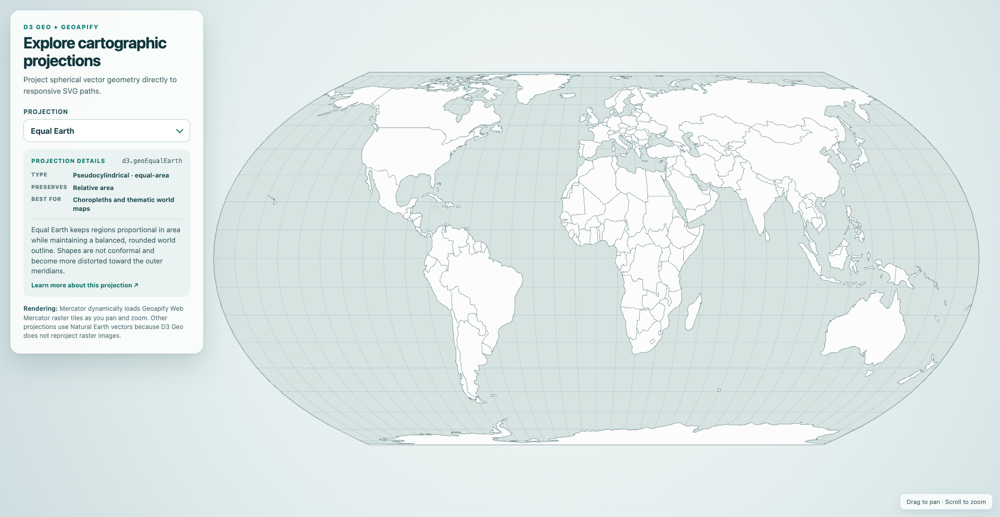

# D3 Geo Map Projection Explorer with Geoapify Raster Tiles

Use [D3 Geo](https://d3js.org/d3-geo) to compare interactive world map projections, render Natural Earth boundaries as responsive SVG paths, and load [Geoapify raster map tiles](https://www.geoapify.com/map-tiles/) dynamically in the Mercator view.

## Overview

This browser-only example includes Mercator, Equal Earth, Natural Earth, Robinson, Mollweide, Equirectangular, Cassini, Miller, Behrmann, Eckert IV, Loximuthal, and an AuthaGraph-like Imago projection. Selecting an option refits the world geometry while D3 Zoom provides pan and zoom interaction. The information panel explains each projection's type, preserved property, recommended use, and principal distortion tradeoffs.

AuthaGraph is not implemented directly by D3. The example uses `d3.geoImago().k(0.68)` from d3-geo-polygon, whose documentation describes that configuration as the closest available AuthaGraph approximation. The selector and description identify it as an approximation rather than the original projection.

The Mercator option uses d3-tile to calculate the visible Geoapify `osm-bright` `@2x` raster tiles on every pan and zoom. It requests new `{z}/{x}/{y}` tiles as the view changes instead of enlarging a fixed set of images. Other projections use Natural Earth vectors because D3 Geo does not reproject raster tiles into a different coordinate system.

D3 Geo projects spherical vector geometry; it is not an arbitrary EPSG coordinate-system engine. Use Proj4js with OpenLayers or Proj4Leaflet when a map must follow a specific EPSG definition.

## Live Demo

[](https://codepen.io/editor/geoapify/pen/01a0c3f8-c122-75c9-93bb-617919b90dad)

## Screenshot



## Projection Catalog

| Projection | D3 Factory | Type | Preserves | Best For |
|------------|------------|------|-----------|----------|
| [Mercator](https://en.wikipedia.org/wiki/Mercator_projection) | `d3.geoMercator()` | Cylindrical, conformal | Local angles and shapes | Interactive web maps and navigation |
| [Equal Earth](https://en.wikipedia.org/wiki/Equal_Earth_projection) | `d3.geoEqualEarth()` | Pseudocylindrical, equal-area | Relative area | Choropleths and thematic world maps |
| [Natural Earth](https://en.wikipedia.org/wiki/Natural_Earth_projection) | `d3.geoNaturalEarth1()` | Pseudocylindrical, compromise | No property exactly | General-purpose reference maps |
| [Robinson](https://en.wikipedia.org/wiki/Robinson_projection) | `d3.geoRobinson()` | Pseudocylindrical, compromise | No property exactly | Visually balanced world maps |
| [Mollweide](https://en.wikipedia.org/wiki/Mollweide_projection) | `d3.geoMollweide()` | Pseudocylindrical, equal-area | Relative area | Global distributions and density maps |
| [Equirectangular](https://en.wikipedia.org/wiki/Equirectangular_projection) | `d3.geoEquirectangular()` | Cylindrical, equidistant | Distance along meridians and the equator | Coordinate grids and simple global data |
| [Cassini](https://en.wikipedia.org/wiki/Cassini_projection) | Rotated `d3.geoEquirectangular()` | Transverse cylindrical | Scale along the central meridian | Narrow north-south regions |
| [Miller](https://en.wikipedia.org/wiki/Miller_cylindrical_projection) | `d3.geoMiller()` | Cylindrical, compromise | No property exactly | Familiar rectangular reference maps |
| [Behrmann](https://en.wikipedia.org/wiki/Behrmann_projection) | `d3.geoCylindricalEqualArea().parallel(30)` | Cylindrical, equal-area | Relative area | Mid-latitude thematic maps |
| [Eckert IV](https://en.wikipedia.org/wiki/Eckert_IV_projection) | `d3.geoEckert4()` | Pseudocylindrical, equal-area | Relative area | Statistical and thematic world maps |
| [Loximuthal](https://en.wikipedia.org/wiki/Loximuthal_projection) | `d3.geoLoximuthal()` | Pseudocylindrical, loxodromic | Rhumb lines from the central point | Direction and distance from one origin |
| [AuthaGraph-like Imago approximation](https://en.wikipedia.org/wiki/AuthaGraph_projection) | `d3.geoImago().k(0.68)` | Tetrahedral, polyhedral approximation | No property exactly in this approximation | Experimental whole-world layouts |

## Rendering Modes

The example deliberately uses two rendering strategies:

- **Mercator:** Geoapify `osm-bright` retina raster tiles are calculated dynamically with d3-tile. Panning or zooming updates the visible XYZ tile indexes and requests new images.
- **Every other projection:** Natural Earth country boundaries are converted from TopoJSON to GeoJSON and projected into SVG paths. The sphere, graticule, and countries all use the selected D3 projection.

Raster tiles are pre-rendered for Web Mercator. D3 Geo can project vector coordinates, but it does not warp raster tile pixels into Equal Earth, Robinson, Mollweide, or another target projection. Keeping Geoapify raster tiles in Mercator avoids presenting an incorrectly projected basemap.

## Quick Start

Serve the repository with any static web server. For example, from the repository root run:

```bash
python3 -m http.server 8000
```

Then open:

```text
http://localhost:8000/maps/d3-geo-projection-switcher/src/
```

No build step or package installation is required. You can also open [`src/index.html`](./src/index.html) directly, but a local server provides a consistent origin for the Natural Earth request and CDN-hosted libraries.

## Project Structure

| File | Purpose |
|------|---------|
| [`src/index.html`](./src/index.html) | Loads D3, d3-tile, d3-geo-projection, d3-geo-polygon, TopoJSON, and the SVG map shell |
| [`src/script.js`](./src/script.js) | Defines projections, updates visible Mercator raster tiles, loads country boundaries, and renders SVG paths |
| [`src/style.css`](./src/style.css) | Styles the responsive SVG map and projection controls |

## Geoapify API Key

This example includes a demo Geoapify API key for quick testing. For your own project, create a free key at [myprojects.geoapify.com](https://myprojects.geoapify.com/) and replace `yourAPIKey` in [`src/script.js`](./src/script.js).

The raster tiles appear only with `d3.geoMercator()`. Natural Earth remains the vector source for every other projection.

## Key Code Samples

### Load visible Geoapify raster tiles

Use d3-tile with the current D3 Zoom transform to calculate and render only the visible XYZ tiles. In the full source, `rasterGroup` is the SVG layer behind the vectors, while `mercatorView` stores the fitted viewport size, world size, and world center returned by `fitProjection()`.

```js
const yourAPIKey = "YOUR_API_KEY";
const rasterTileLayout = d3.tile().tileSize(256);

function getMercatorTileUrl([tileX, tileY, tileZoom]) {
  return (
    "https://maps.geoapify.com/v1/tile/osm-bright/" +
    `${tileZoom}/${tileX}/${tileY}@2x.png?apiKey=${yourAPIKey}`
  );
}

function updateMercatorRasterTiles(transform) {
  const tiles = rasterTileLayout
    .size([mercatorView.width, mercatorView.height])
    .scale(mercatorView.worldSize * transform.k)
    .translate([
      transform.applyX(mercatorView.worldCenterX),
      transform.applyY(mercatorView.worldCenterY),
    ])();

  rasterGroup
    .selectAll("image.mercator-raster-tile")
    .data(tiles, (tile) => tile.join("/"))
    .join("image")
    .attr("class", "mercator-raster-tile")
    .attr("href", getMercatorTileUrl)
    .attr("x", (tile) =>
      (tile[0] + tiles.translate[0]) * tiles.scale
    )
    .attr("y", (tile) =>
      (tile[1] + tiles.translate[1]) * tiles.scale
    )
    .attr("width", tiles.scale + 0.5)
    .attr("height", tiles.scale + 0.5)
    .attr("preserveAspectRatio", "none");
}
```

How it works:

- The fitted Mercator world size and the current zoom transform define the tile layout.
- d3-tile returns the visible tile indexes, rendered scale, and translation.
- The data join removes tiles that leave the viewport and requests newly visible `{z}/{x}/{y}` images.
- Each `@2x` PNG is placed behind the graticule and country outlines.

### Configure the added world projections

Cassini is the transverse aspect of Equirectangular, while Behrmann is the cylindrical equal-area projection configured with 30° standard parallels. Imago with `k = 0.68` supplies the AuthaGraph approximation.

```js
const cassini = d3
  .geoEquirectangular()
  .rotate([0, -90, 90])
  .center([90, 0])
  .angle(-90);

const behrmann = d3.geoCylindricalEqualArea().parallel(30);
const authaGraphApproximation = d3.geoImago().k(0.68);
```

How it works:

- Three-axis spherical rotation turns Equirectangular into its transverse Cassini aspect; the planar angle keeps north at the top.
- `parallel(30)` configures cylindrical equal-area as the Behrmann projection.
- d3-geo-polygon documents Imago's `k(0.68)` setting as its closest AuthaGraph approximation.

### Fit and draw the selected geometry

Fit the projection inside the available panel-aware viewport, then convert GeoJSON into SVG path data. This excerpt assumes the responsive `width`, `height`, and `padding` values have been calculated and `countries.features` contains the converted Natural Earth GeoJSON.

```js
projection.fitExtent(
  [
    [padding.left, padding.top],
    [width - padding.right, height - padding.bottom],
  ],
  { type: "Sphere" }
);

const path = d3.geoPath(projection);

mapGroup
  .selectAll("path.country")
  .data(countries.features)
  .join("path")
  .attr("class", "country")
  .attr("d", path);
```

How it works:

- `fitExtent()` calculates scale and translation from the selected geometry.
- `geoPath()` converts projected coordinates into SVG path commands.
- The same rendering pipeline works for every global projection in the selector.

### Keep Pan and Zoom Synchronized

Apply the same D3 Zoom transform to the projected vector group and the Mercator tile calculation. This excerpt assumes `svg`, `mapGroup`, and `updateMercatorRasterTiles()` have been initialized as shown elsewhere in the example. Resetting the transform after a projection is redrawn returns every option to its fitted initial view.

```js
const zoom = d3
  .zoom()
  .scaleExtent([1, 12])
  .on("zoom", (event) => {
    mapGroup.attr("transform", event.transform);
    updateMercatorRasterTiles(event.transform);
  });

svg.call(zoom);

function renderProjection(option) {
  // Fit the projection and redraw the map paths here.
  svg.call(zoom.transform, d3.zoomIdentity);
}
```

How it works:

- D3 Zoom emits a two-dimensional transform for pointer dragging and wheel zooming.
- Vector paths share one SVG group, so a single `transform` attribute moves and scales them together.
- Mercator raster tiles are recalculated from the same transform instead of stretching a fixed tile set.
- The full source resets the transform at the end of `renderProjection()` after fitting the selected projection.

## Limitations and Design Notes

- Geoapify raster tiles are shown only in Mercator because their pixels and XYZ grid were created for Web Mercator.
- The non-Mercator views use generalized 1:110m Natural Earth boundaries. They are suitable for global visualization, not street-level mapping or authoritative boundary work.
- D3 Geo projection factories operate on spherical longitude/latitude coordinates. They are not replacements for EPSG definitions, datum transformations, or survey-grade coordinate operations.
- Pan and zoom apply a planar SVG transform after projection. They do not rotate the globe or change a projection parameter.
- The AuthaGraph option is an Imago approximation configured with `k(0.68)`, not the original AuthaGraph implementation.
- The page loads JavaScript libraries and country data from CDNs, so the initial load requires an internet connection.

## APIs and Libraries

| Name | Description | Documentation | Used In This Example |
|------|-------------|---------------|----------------------|
| [Geoapify Map Tiles API](https://www.geoapify.com/map-tiles/) | Provides styled raster map tiles in the XYZ scheme. | [Map Tiles documentation](https://apidocs.geoapify.com/docs/maps/map-tiles/) | `osm-bright` Web Mercator PNG tiles at `@2x` density |
| [D3 Geo](https://d3js.org/d3-geo) | Provides spherical projections, GeoJSON paths, graticules, and geographic fitting. | [D3 Geo API](https://d3js.org/d3-geo) | Core projection and SVG path rendering |
| [d3-tile](https://github.com/d3/d3-tile) | Calculates visible XYZ tiles from the current scale and translation. | [d3-tile README](https://github.com/d3/d3-tile) | Dynamic Mercator raster tile loading |
| [d3-geo-projection](https://github.com/d3/d3-geo-projection) | Adds projections such as Robinson, Mollweide, Miller, and Eckert IV. | [Projection reference](https://github.com/d3/d3-geo-projection) | Additional world projection factories |
| [d3-geo-polygon](https://github.com/d3/d3-geo-polygon) | Adds polyhedral projections, including Imago. | [d3-geo-polygon README](https://github.com/d3/d3-geo-polygon) | AuthaGraph-like Imago approximation |
| [D3 Zoom](https://d3js.org/d3-zoom) | Adds pointer pan and wheel zoom behavior. | [D3 Zoom API](https://d3js.org/d3-zoom) | Interactive SVG navigation |
| [Natural Earth via world-atlas](https://github.com/topojson/world-atlas) | Supplies simplified country boundaries as TopoJSON. | [world-atlas README](https://github.com/topojson/world-atlas) | World vector geometry at 1:110m resolution |
| [TopoJSON Client](https://github.com/topojson/topojson-client) | Converts TopoJSON objects into GeoJSON features. | [TopoJSON Client API](https://github.com/topojson/topojson-client) | Country data conversion |

## Related Code Samples

| Code Sample | Why It Is Related |
|-------------|-------------------|
| [OpenLayers Projection Switcher](https://github.com/geoapify/geoapify-quickstart-examples/tree/main/maps/openlayers-geoapify-map-projection-switcher) | Reprojects Geoapify raster tiles in the browser and supports registered coordinate reference systems |
| [Understanding Map Zoom Levels and the XYZ Tile System](https://github.com/geoapify/geoapify-quickstart-examples/tree/main/maps/understanding-map-zoom-levels-and-the-xyz-tile-system) | Explains the tile coordinates and zoom model used by the Mercator raster layer |
| [MapLibre Map Tiles Starter](https://github.com/geoapify/geoapify-quickstart-examples/tree/main/maps/maplibre-geoapify-map-tiles-starter) | Shows the standard interactive-map approach for Geoapify map tiles |

## Useful Links

- [Geoapify Maps API](https://www.geoapify.com/maps-api/)
- [Geoapify projects and API keys](https://myprojects.geoapify.com/)
- [Observable projection transitions](https://observablehq.com/@d3/projection-transitions)
- [Map projection overview](https://en.wikipedia.org/wiki/Map_projection)

## License

MIT
