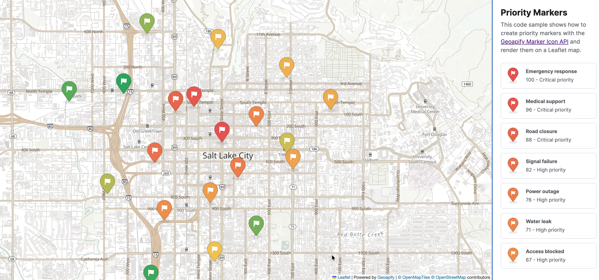

# Priority Markers on a Leaflet Map with Geoapify Marker Icon API

Display color-coded, priority-based custom Leaflet markers using flag marker icons generated by Geoapify Marker Icon API.

## Overview

Use this example to build color-coded Leaflet markers for priority-based workflows with the Geoapify Marker Icon API.

How it works:

- Each location has a numeric priority from `0` to `1`.
- The priority value is converted into a marker color.
- The sample builds a custom flag marker URL with the [Geoapify Marker Icon API](https://www.geoapify.com/map-marker-icon-api/).
- Leaflet renders the generated marker icons on a [Geoapify raster tile map](https://www.geoapify.com/map-tiles/).

What the demo includes:

- Static `locations` data with sample titles, descriptions, coordinates, and priority values, such as `Emergency response` with priority `1` and `Watch area` with priority `0`.
- A priority-to-color gradient helper that maps low priority values to green, mid-range values to yellow/orange, and high priority values to red.
- A Marker Icon API URL builder that creates flag marker PNGs with parameters like `type=awesome`, `icon=flag`, `content=75`, `contentColor=#ffffff`, and `scaleFactor=2`.
- Leaflet popups that show each location title, priority score, priority label, and description.
- A scrollable side list with matching marker previews, so users can compare all locations without searching the map manually.
- Hover interaction that highlights a list item, opens the corresponding map popup, and closes the popup when the pointer leaves the item.

Use this pattern for incident severity maps, delivery or service priority dashboards, inspection planning, and other workflows where markers need to communicate relative urgency.

## Live Demo

[](https://codepen.io/geoapify/pen/bNgBPNV)

## Screenshot



## Quick Start

Open [`src/index.html`](./src/index.html) in your browser.

No local server is required.

Note: In rare cases, browser policies or extensions can restrict `file://` access. If that happens, run a local static server and open `src/index.html` via `http://localhost`, or use your IDE's "Open with Live Server" (or similar) option.

## Geoapify API Key

This example includes a demo API key for quick preview. For your own projects, create a free Geoapify account and generate an API key in [Geoapify My Projects](https://myprojects.geoapify.com/).

After creating a key:

1. Open [`src/script.js`](./src/script.js).
2. Replace the value of `yourAPIKey` with your API key.
3. Refresh [`src/index.html`](./src/index.html).

Using your own key gives you access to project settings, usage statistics, and production-ready request limits.

## Code Samples

### 1. Initialize a Leaflet Map with Geoapify Tiles

This code creates a Leaflet map and adds a Geoapify raster tile layer. It also switches to retina tiles when the browser runs on a high-density display.

```js
const yourAPIKey = "YOUR_API_KEY";

const map = L.map("my-map").setView([40.760189, -111.892655], 12);

const isRetina = L.Browser.retina;
const baseUrl = "https://maps.geoapify.com/v1/tile/osm-bright-grey/{z}/{x}/{y}.png?apiKey={apiKey}";
const retinaUrl = "https://maps.geoapify.com/v1/tile/osm-bright-grey/{z}/{x}/{y}@2x.png?apiKey={apiKey}";

L.tileLayer(isRetina ? retinaUrl : baseUrl, {
  attribution:
    'Powered by <a href="https://www.geoapify.com/" target="_blank">Geoapify</a> | © OpenMapTiles © OpenStreetMap contributors',
  apiKey: yourAPIKey,
  maxZoom: 20
}).addTo(map);
```

How it works:

- `L.map("my-map")` connects Leaflet to the HTML element where the map is rendered.
- `setView()` defines the initial center coordinates and zoom level.
- `L.tileLayer()` loads Geoapify map tiles and injects the API key through the `{apiKey}` template variable.
- The retina URL uses `@2x` tiles, which keeps the map sharp on high-density screens.

### 2. Convert Priority to Marker Color

This helper converts a numeric priority from `0` to `1` into a color. Low values become green, middle values move through yellow and orange, and high values become red.

```js
function priorityToColor(priority) {
  const value = Math.max(0, Math.min(1, priority));
  const stops = [
    { value: 0, color: { r: 39, g: 174, b: 96 } },
    { value: 0.33, color: { r: 242, g: 201, b: 76 } },
    { value: 0.66, color: { r: 242, g: 153, b: 74 } },
    { value: 1, color: { r: 235, g: 87, b: 87 } }
  ];

  const endIndex = stops.findIndex((stop) => value <= stop.value);
  const end = stops[endIndex];
  const start = stops[Math.max(0, endIndex - 1)];
  const ratio = (value - start.value) / (end.value - start.value || 1);
  const r = Math.round(start.color.r + (end.color.r - start.color.r) * ratio);
  const g = Math.round(start.color.g + (end.color.g - start.color.g) * ratio);
  const b = Math.round(start.color.b + (end.color.b - start.color.b) * ratio);

  return `#${[r, g, b].map((color) => color.toString(16).padStart(2, "0")).join("")}`;
}
```

How it works:

- The priority is clamped to the `0` to `1` range so marker colors stay inside the defined gradient.
- The `stops` array defines the color ramp: green, yellow, orange, and red.
- The function finds the two color stops surrounding the current priority value.
- It interpolates the red, green, and blue channels separately, then returns a hex color string for the marker API.

### 3. Build a Geoapify Flag Marker URL

This code creates the Marker Icon API URL for a priority marker. The generated URL returns a flag-style PNG marker with a color and numeric label based on the priority value.

```js
function priorityToMarkerContent(priority) {
  return String(Math.round(priority * 100));
}

function buildMarkerIconUrl(priority) {
  const params = new URLSearchParams({
    type: "awesome",
    color: priorityToColor(priority),
    size: "60",
    icon: "flag",
    content: priorityToMarkerContent(priority),
    contentSize: "18",
    contentColor: "#ffffff"
  });

  return `https://api.geoapify.com/v2/icon/?${params.toString()}&noWhiteCircle&scaleFactor=2&apiKey=${encodeURIComponent(yourAPIKey)}`;
}
```

How it works:

- `priorityToMarkerContent()` converts a priority like `0.76` into marker text like `76`.
- `URLSearchParams` keeps the marker URL readable and correctly encodes values such as colors.
- `icon=flag` selects the flag marker shape, while `content` places the priority score on the marker.
- `noWhiteCircle` removes the default white icon background, and `scaleFactor=2` requests a high-resolution marker image.

### 4. Create a Leaflet Icon from the Marker URL

This code wraps the generated Geoapify marker URL in a Leaflet icon. Leaflet uses this icon object when it renders each marker on the map.

```js
function createPriorityIcon(priority) {
  return L.icon({
    iconUrl: buildMarkerIconUrl(priority),
    // Generated icon is 46x67px; the bottom 7px are shadow, so anchor at the marker tip above it.
    iconSize: [46, 67],
    iconAnchor: [23, 60],
    popupAnchor: [0, -60]
  });
}
```

How it works:

- `iconUrl` points Leaflet to the PNG generated by the Geoapify Marker Icon API.
- `iconSize` tells Leaflet the exact rendered image size, which is `46x67` pixels in this example.
- `iconAnchor` sets the point that touches the map coordinate; here it is centered horizontally and placed above the shadow.
- `popupAnchor` moves the popup upward so it opens above the marker instead of covering it.

### 5. Render Locations as Markers

This code loops through location data and adds one Leaflet marker per location. Each marker receives a custom priority icon and is included in map bounds.

```js
const locations = [
  {
    title: "Emergency response",
    priority: 1,
    description: "Immediate response required at the downtown transit center.",
    coordinates: [40.761935, -111.888201]
  },
  {
    title: "Delivery delay",
    priority: 0.58,
    description: "Warehouse loading bay is operating with reduced capacity.",
    coordinates: [40.750779, -111.891047]
  }
];

const markerBounds = L.latLngBounds();
const markers = [];

locations.forEach((location) => {
  const marker = L.marker(location.coordinates, {
    icon: createPriorityIcon(location.priority),
    title: location.title
  }).addTo(map);

  markers.push(marker);
  markerBounds.extend(location.coordinates);
});

map.fitBounds(markerBounds, {
  padding: [48, 48],
  maxZoom: 14
});
```

How it works:

- Each location stores the marker title, priority, description, and coordinates.
- `createPriorityIcon(location.priority)` creates a different marker color and label for each priority value.
- The `markers` array keeps references to the Leaflet marker objects for later interactions.
- `fitBounds()` adjusts the map viewport so all rendered priority markers are visible.

### 6. Add Popups to Priority Markers

This code creates popup HTML for each location and attaches it to the marker. Add the `bindPopup()` call to the marker creation loop from the previous section.

```js
function priorityToLabel(priority) {
  if (priority >= 0.85) {
    return "Critical";
  }

  if (priority >= 0.66) {
    return "High";
  }

  if (priority >= 0.33) {
    return "Medium";
  }

  return "Low";
}

function createPopupContent(location) {
  const priorityPercent = priorityToMarkerContent(location.priority);
  const priorityLabel = priorityToLabel(location.priority);

  return `
    <article class="popup-content">
      <h2>${location.title}</h2>
      <p><strong>${priorityPercent} - ${priorityLabel} priority</strong></p>
      <p>${location.description}</p>
    </article>
  `;
}

const marker = L.marker(location.coordinates, {
  icon: createPriorityIcon(location.priority),
  title: location.title
})
  .bindPopup(createPopupContent(location))
  .addTo(map);
```

How it works:

- `priorityToLabel()` turns a numeric priority into a readable label such as `Critical`, `High`, `Medium`, or `Low`.
- `createPopupContent()` builds the content shown when a marker popup opens.
- `bindPopup()` attaches that content to the marker created in the `locations.forEach()` loop.
- This keeps map markers compact while still giving users detailed information on demand.

### 7. Connect the Side List with Map Popups

This code creates a list item for each location and connects it to the matching marker. Hovering over a list item opens the corresponding popup, then closes it when the pointer leaves.

```js
function renderPriorityList(locations, markers) {
  const list = document.getElementById("priority-list");

  locations.forEach((location, index) => {
    const priorityPercent = priorityToMarkerContent(location.priority);
    const priorityLabel = priorityToLabel(location.priority);
    const marker = markers[index];
    const item = document.createElement("li");
    item.className = "priority-item";
    item.innerHTML = `
      
      <span>
        <strong>${location.title}</strong>
        <span>${priorityPercent} - ${priorityLabel} priority</span>
      </span>
    `;

    item.addEventListener("mouseenter", () => {
      item.classList.add("is-active");
      marker.openPopup();
    });

    item.addEventListener("mouseleave", () => {
      item.classList.remove("is-active");
      marker.closePopup();
    });

    list.appendChild(item);
  });
}

renderPriorityList(locations, markers);
```

How it works:

- The list and marker arrays use the same order, so each list item can reference its matching marker by index.
- Each row displays the same generated marker image used on the map, keeping the list visually aligned with the map.
- `mouseenter` applies the active list style and opens the map popup for the matching marker.
- `mouseleave` removes the active style and closes the popup, keeping the map state synchronized with the side list.

## Troubleshooting

| Problem | Likely Cause | What to Do |
|---------|--------------|------------|
| Map is blank or tiles missing | Leaflet CSS/JS failed to load | Open browser DevTools (`Console` + `Network`) and confirm CDN files load without errors. |
| Icons or tiles return `403` | API key is invalid, restricted, or over limits | Get your own free key at `https://myprojects.geoapify.com/`, then update `yourAPIKey` in `src/script.js`. |
| Markers appear offset | Icon size and anchor do not match the generated flag dimensions | Tune `iconSize` and `iconAnchor` in `createPriorityIcon()`. |
| Works inconsistently from local file | Browser policy blocks some `file://` behavior | Open with IDE Live Server (or any local static server) and run from `http://localhost`. |

## APIs and Libraries

| Name | Description | Documentation | Used In This Example |
|------|-------------|---------------|----------------------|
| [Geoapify Marker Icon API](https://www.geoapify.com/map-marker-icon-api/) | Generates custom PNG marker icons from URL parameters such as color, size, icon, text content, and scale factor. | [Docs](https://apidocs.geoapify.com/docs/icon/) | Creates flag icons with priority color and numeric priority content. |
| [Geoapify Map Tiles API](https://www.geoapify.com/map-tiles/) | Provides raster and vector map tiles for web maps. | [Docs](https://apidocs.geoapify.com/docs/maps/map-tiles/) | Provides the Leaflet base map via `osm-bright-grey` raster tiles. |
| [Leaflet](https://leafletjs.com/) | JavaScript library for interactive web maps. | [Docs](https://leafletjs.com/reference.html) | Renders the map, tile layer, custom marker icons, and popups. |

## Related Examples

| Example | Description | Link |
|---------|-------------|------|
| Leaflet OSM Tiles | Basic Leaflet map with Geoapify raster tiles | [Open](https://github.com/geoapify/geoapify-quickstart-examples/tree/main/maps/leaflet-map-with-osm-map-tiles-by-geoapify) |
| Leaflet First Map | Leaflet setup with marker and click interaction | [Open](https://github.com/geoapify/geoapify-quickstart-examples/tree/main/maps/leaflet-first-interactive-map-with-geoapify-tiles) |
| Places GeoJSON Points | Places API results rendered as Leaflet markers | [Open](https://github.com/geoapify/geoapify-quickstart-examples/tree/main/places-api/visualizing-geojson-points-with-leaflet-and-geoapify-places-api) |

## Useful Links

- [Geoapify API documentation](https://apidocs.geoapify.com/)
- [Geoapify Maps API](https://www.geoapify.com/maps-api/)
- [Geoapify My Projects: get an API key](https://myprojects.geoapify.com/)
- [Geoapify CodePen profile](https://codepen.io/geoapify)

## License

MIT
