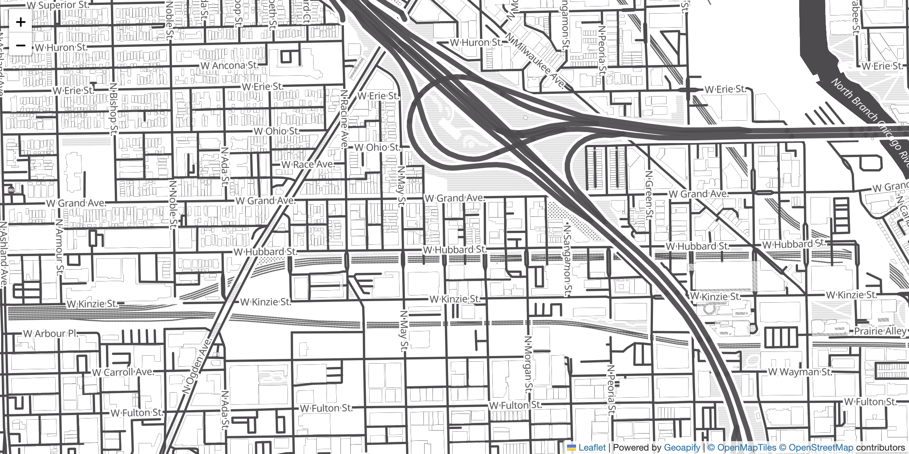

# Leaflet Vector Map Tiles with Geoapify MapLibre Plugin

Use Geoapify vector tiles in Leaflet via the maplibre-gl-leaflet plugin for smooth, crisp maps at any zoom level.

## Quick Summary

- Problem: Use vector tiles (style.json) in a Leaflet application.
- Solution: Integrate maplibre-gl-leaflet plugin to render Geoapify vector styles in Leaflet.
- Stack: HTML, CSS, JavaScript, Leaflet, MapLibre GL JS.
- APIs: Geoapify Map Tiles API.

## What This Example Includes

- Leaflet map with vector tile layer via MapLibre GL
- Geoapify style.json integration
- Proper attribution for vector tiles
- High-zoom rendering without pixelation
- Source-based run from `src/index.html` (no build step)

## Use Cases

- Get vector tile quality in an existing Leaflet codebase.
- Combine Leaflet's ecosystem with MapLibre's vector rendering.
- Build maps that stay crisp at high zoom levels.

## Live Demo

[](https://codepen.io/geoapify/pen/vENzqWX)

## Screenshot



## Quick Start

Open [`src/index.html`](./src/index.html) in your browser.

No local server is required.

Note: In rare cases, browser policies or extensions can restrict `file://` access. If that happens, run a local static server and open `src/index.html` via `http://localhost`, or use your IDE's "Open with Live Server" (or similar) option.

## Input and Output

- Input: Map container element, center coordinates, zoom level, Geoapify API key, style.json URL.
- Output: Interactive vector map rendered via MapLibre GL inside Leaflet.

## Project Structure

| File | Purpose |
|------|---------|
| `src/index.html` | Source HTML |
| `src/script.js` | Source JavaScript (Leaflet + MapLibre GL layer) |
| `src/style.css` | Source CSS |

## Code Samples

### Minimal HTML

```html
<!DOCTYPE html>
<html lang="en">
<head>
  <meta charset="UTF-8">
  <title>Leaflet Vector Tiles</title>
  <link rel="stylesheet" href="https://unpkg.com/leaflet@1.9.4/dist/leaflet.css">
  <link href="https://unpkg.com/maplibre-gl@latest/dist/maplibre-gl.css" rel="stylesheet">
  <style>
    html, body { height: 100%; margin: 0; }
    #map { height: 100%; }
  </style>
</head>
<body>
  <div id="map"></div>
  <script src="https://unpkg.com/leaflet@1.9.4/dist/leaflet.js"></script>
  <script src="https://unpkg.com/maplibre-gl@latest/dist/maplibre-gl.js"></script>
  <script src="https://unpkg.com/@maplibre/maplibre-gl-leaflet@latest/leaflet-maplibre-gl.js"></script>
  <script src="script.js"></script>
</body>
</html>
```

### Minimal JavaScript

```js
// Demo API key for quickstart only.
// Register for your own free API key at https://myprojects.geoapify.com/.
// Benefits: usage analytics, project-level limits, and reliable access for production use.
// This demo key can be blocked or restricted at any time.
const yourAPIKey = "YOUR_API_KEY";

const map = L.map("map").setView([41.890491, -87.654306], 16);

L.maplibreGL({
  style: `https://maps.geoapify.com/v1/styles/toner-grey/style.json?apiKey=${yourAPIKey}`
}).addTo(map);

map.attributionControl.addAttribution(
  'Powered by <a href="https://www.geoapify.com/">Geoapify</a> | © OpenMapTiles © OpenStreetMap'
);
```

## Customize

1. Open [`src/script.js`](./src/script.js).
2. Set your own API key in `yourAPIKey`.
3. Change map center in `setView([lat, lon], zoom)`.
4. Replace `toner-grey` in the style URL with another Geoapify style.

API documentation:
- [Geoapify Map Tiles API](https://apidocs.geoapify.com/docs/maps/map-tiles/)

No build step is required. Edit files in `src/` and refresh the browser.

## Troubleshooting

| Problem | Likely Cause | What to Do |
|---------|--------------|------------|
| Map is blank or unstyled | Leaflet/MapLibre assets failed to load | Open browser DevTools (`Console` + `Network`) and confirm CDN files load without errors. |
| Map does not load data / API responds `403` | API key is invalid, restricted, or over limits | Get your own free key at `https://myprojects.geoapify.com/`, then update `apiKey` in `src/script.js`. |
| Works inconsistently from local file | Browser policy blocks some `file://` behavior | Open with IDE Live Server (or any local static server) and run from `http://localhost`. |
| Output differs from expected | Local edits introduced a regression | Compare your files with the [CodePen demo](https://codepen.io/geoapify/pen/vENzqWX) and align differences step by step. |

## APIs and Libraries

| Type | Name | Link | API Endpoint Used |
|------|------|------|-------------------|
| API | Geoapify Map Tiles API | [Map Tiles API](https://www.geoapify.com/map-tiles/) | `https://maps.geoapify.com/v1/styles/toner-grey/style.json?apiKey=...` |
| Library | Leaflet | [leafletjs.com](https://leafletjs.com/) | Not applicable |
| Library | MapLibre GL JS | [maplibre.org](https://maplibre.org/) | Not applicable |
| Library | maplibre-gl-leaflet | [GitHub](https://github.com/maplibre/maplibre-gl-leaflet) | Not applicable |

## Related Examples

| Example | Description | Link |
|---------|-------------|------|
| Leaflet OSM Tiles | Leaflet map with raster OSM tiles | [Open](../leaflet-map-with-osm-map-tiles-by-geoapify) |
| Leaflet Interactive Map | Leaflet with markers and click interaction | [Open](../leaflet-first-interactive-map-with-geoapify-tiles) |
| MapLibre Starter | MapLibre GL JS with Geoapify vector tiles | [Open](../maplibre-geoapify-map-tiles-starter) |

## Useful Links

- Geoapify API docs: [https://apidocs.geoapify.com/](https://apidocs.geoapify.com/)
- CodePen demo: [https://codepen.io/geoapify/pen/vENzqWX](https://codepen.io/geoapify/pen/vENzqWX)
- Geoapify CodePen profile: [https://codepen.io/geoapify](https://codepen.io/geoapify)

## License

MIT

**Keywords**: Leaflet vector tiles, MapLibre GL Leaflet, Geoapify style.json, vector map, maplibre-gl-leaflet plugin
