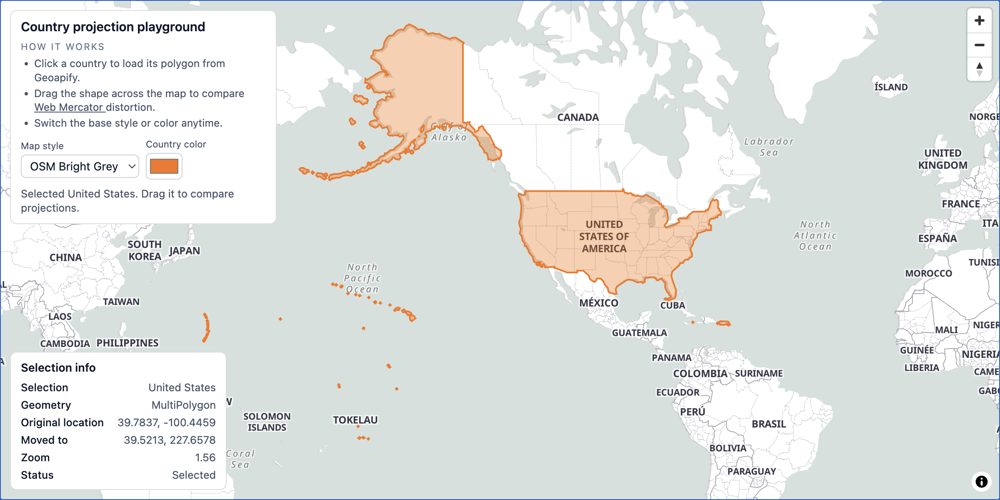

# MapLibre Country Geometry Projection Drag

Click any country to load its geometry, then drag it across the map to visually compare Web Mercator projection distortion at different latitudes.

## Quick Summary

- Problem: Visualize how Web Mercator projection distorts country sizes at different latitudes.
- Solution: Fetch country geometry via Geoapify APIs and allow dragging to compare apparent sizes.
- Stack: HTML, CSS, JavaScript, MapLibre GL JS.
- APIs: Geoapify Reverse Geocoding API, Geoapify Place Details API, Geoapify Map Tiles API.

## What This Example Includes

- MapLibre GL JS map with multiple style options
- Click-to-select country functionality
- Drag-and-drop country geometry repositioning
- Real-time geometry coordinate updates
- Web Mercator latitude clamping
- Color picker for geometry styling
- Source-based run from `src/index.html` (no build step)

## Use Cases

- Educational tool for understanding map projection distortion.
- Demonstrate how Greenland compares to Africa when moved to the equator.
- Learn about Geoapify Place Details API and reverse geocoding.

## Live Demo

[](https://codepen.io/geoapify/pen/zxBpZeq)

## Screenshot



## Quick Start

Open [`src/index.html`](./src/index.html) in your browser.

No local server is required.

Note: In rare cases, browser policies or extensions can restrict `file://` access. If that happens, run a local static server and open `src/index.html` via `http://localhost`, or use your IDE's "Open with Live Server" (or similar) option.

## Input and Output

- Input: Click coordinates on the map, drag gestures, color selection, Geoapify API key.
- Output: Country polygon overlay that can be dragged to any location, showing projection distortion.

## Project Structure

| File | Purpose |
|------|---------|
| `src/index.html` | Source HTML |
| `src/script.js` | Source JavaScript (API calls, drag logic, geometry handling) |
| `src/style.css` | Source CSS |

## Code Samples

### Minimal HTML

```html
<!DOCTYPE html>
<html lang="en">
<head>
  <meta charset="UTF-8">
  <title>Country Drag Demo</title>
  <link href="https://unpkg.com/maplibre-gl@latest/dist/maplibre-gl.css" rel="stylesheet">
  <script src="https://unpkg.com/maplibre-gl@latest/dist/maplibre-gl.js"></script>
  <style>
    html, body { height: 100%; margin: 0; }
    #map { height: 100%; }
  </style>
</head>
<body>
  <div id="map"></div>
  <script src="script.js"></script>
</body>
</html>
```

### Minimal JavaScript

```js
// Demo API key for quickstart only.
// Register for your own free API key at https://myprojects.geoapify.com/.
// Benefits: usage analytics, project-level limits, and reliable access for production use.
// This demo key can be blocked or restricted at any time.
const yourAPIKey = "YOUR_API_KEY";

const map = new maplibregl.Map({
  container: "map",
  style: `https://maps.geoapify.com/v1/styles/osm-bright/style.json?apiKey=${yourAPIKey}`,
  center: [10, 50],
  zoom: 3
});

let currentFeature = null;

map.on("click", async (e) => {
  const res = await fetch(`https://api.geoapify.com/v1/geocode/reverse?lat=${e.lngLat.lat}&lon=${e.lngLat.lng}&type=country&format=geojson&apiKey=${yourAPIKey}`);
  const data = await res.json();
  currentFeature = data.features?.[0];
  if (!currentFeature) return;

  if (map.getSource("country")) map.getSource("country").setData(currentFeature);
  else {
    map.addSource("country", { type: "geojson", data: currentFeature });
    map.addLayer({ id: "country-fill", type: "fill", source: "country", paint: { "fill-color": "#3b82f6", "fill-opacity": 0.3 } });
    map.addLayer({ id: "country-line", type: "line", source: "country", paint: { "line-color": "#1e40af", "line-width": 2 } });
  }
});
```

## Customize

1. Open [`src/script.js`](./src/script.js).
2. Set your own API key in `yourAPIKey`.
3. Modify `styleOptions` array to add or remove map styles.
4. Change initial map center and zoom in the `maplibregl.Map` constructor.
5. Adjust `MAX_MERCATOR_LAT` for different latitude clamping behavior.

API documentation:
- [Geoapify Map Tiles API](https://apidocs.geoapify.com/docs/maps/map-tiles/)
- [Geoapify Place Details API](https://apidocs.geoapify.com/docs/place-details/)
- [Geoapify Reverse Geocoding API](https://apidocs.geoapify.com/docs/geocoding/reverse-geocoding/)

No build step is required. Edit files and refresh the browser.

## Troubleshooting

| Problem | Likely Cause | What to Do |
|---------|--------------|------------|
| Map is blank or unstyled | MapLibre assets failed to load | Open browser DevTools (`Console` + `Network`) and confirm CDN files load without errors. |
| Map does not load data / API responds `403` | API key is invalid, restricted, or over limits | Get your own free key at `https://myprojects.geoapify.com/`, then update `yourAPIKey` in `src/script.js`. |
| Works inconsistently from local file | Browser policy blocks some `file://` behavior | Open with IDE Live Server (or any local static server) and run from `http://localhost`. |
| Output differs from expected | Local edits introduced a regression | Compare your files with the [CodePen demo](https://codepen.io/geoapify/pen/zxBpZeq) and align differences step by step. |

## APIs and Libraries

| Type | Name | Link | API Endpoint Used |
|------|------|------|-------------------|
| API | Geoapify Reverse Geocoding API | [Geocoding API](https://www.geoapify.com/geocoding-api/) | `https://api.geoapify.com/v1/geocode/reverse?lat=...&lon=...&type=country&apiKey=...` |
| API | Geoapify Place Details API | [Place Details API](https://www.geoapify.com/place-details-api/) | `https://api.geoapify.com/v2/place-details?id=...&apiKey=...` |
| API | Geoapify Map Tiles API | [Map Tiles API](https://www.geoapify.com/map-tiles/) | `https://maps.geoapify.com/v1/styles/{style}/style.json?apiKey=...` |
| Library | MapLibre GL JS | [maplibre.org](https://maplibre.org/) | Not applicable |

## Related Examples

| Example | Description | Link |
|---------|-------------|------|
| MapLibre Starter | MapLibre GL JS with Geoapify vector tiles | [Open](../maplibre-geoapify-map-tiles-starter) |
| Custom Markers | Place details with custom markers and popups | [Open](../maplibre-custom-markers-popups-with-geoapify-place-details) |
| Zoom Levels Demo | Visualize XYZ tile system at different zoom levels | [Open](../understanding-map-zoom-levels-and-the-xyz-tile-system) |

## Useful Links

- Geoapify API docs: [https://apidocs.geoapify.com/](https://apidocs.geoapify.com/)
- CodePen demo: [https://codepen.io/geoapify/pen/zxBpZeq](https://codepen.io/geoapify/pen/zxBpZeq)
- Geoapify CodePen profile: [https://codepen.io/geoapify](https://codepen.io/geoapify)

## License

MIT

**Keywords**: Web Mercator projection, country geometry, drag and drop, map distortion, Geoapify Place Details, reverse geocoding
