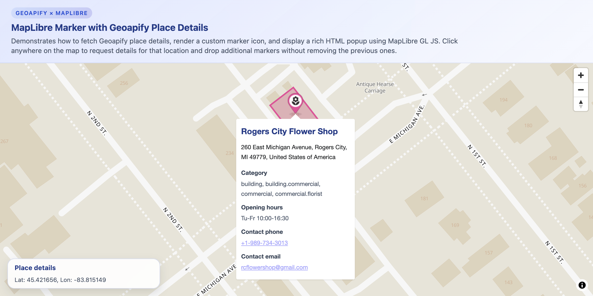

# MapLibre Custom Markers and Popups with Geoapify Place Details

Click anywhere on the map to fetch place details from Geoapify and display custom markers with rich popups showing address, categories, and contact info.

## Quick Summary

- Problem: Display detailed place information with custom markers on a map.
- Solution: Use Geoapify Place Details API to fetch location info on click, render custom markers with category-based icons, and show rich popups.
- Stack: HTML, CSS, JavaScript, MapLibre GL JS.
- APIs: Geoapify Place Details API, Geoapify Marker Icon API, Geoapify Map Tiles API.

## What This Example Includes

- MapLibre GL JS map initialization
- Click-to-fetch place details functionality
- Custom markers using Geoapify Marker Icon API
- Category-based icon and color assignment
- Rich popups with address, opening hours, and contact info
- Building/place geometry overlay visualization
- Source-based run from `src/index.html` (no build step)

## Use Cases

- Build location inspection tools that show place details on click.
- Create point-of-interest explorers with rich metadata.
- Learn how to integrate Place Details API with custom map markers.

## Live Demo

[](https://codepen.io/geoapify/pen/ZYQOdQw)

## Screenshot



## Quick Start

Open [`src/index.html`](./src/index.html) in your browser.

No local server is required.

Note: In rare cases, browser policies or extensions can restrict `file://` access. If that happens, run a local static server and open `src/index.html` via `http://localhost`, or use your IDE's "Open with Live Server" (or similar) option.

## Input and Output

- Input: Click coordinates on the map, Geoapify API key.
- Output: Custom markers with category-based icons, popups showing place name, address, categories, opening hours, and contact details, plus building geometry overlays.

## Project Structure

| File | Purpose |
|------|---------|
| `src/index.html` | Source HTML |
| `src/script.js` | Source JavaScript (Place Details API, markers, popups) |
| `src/style.css` | Source CSS |

## Code Samples

### Minimal HTML

```html
<!DOCTYPE html>
<html lang="en">
<head>
  <meta charset="UTF-8">
  <title>Custom Markers + Popups</title>
  <link href="https://unpkg.com/maplibre-gl@latest/dist/maplibre-gl.css" rel="stylesheet">
  <script src="https://unpkg.com/maplibre-gl@latest/dist/maplibre-gl.js"></script>
  <style>
    #map { height: 500px; }
  </style>
</head>
<body>
  <div id="map"></div>
  <script src="script.js"></script>
</body>
</html>
```

### Minimal JavaScript

```js
// Demo API key for quickstart only.
// Register for your own free API key at https://myprojects.geoapify.com/.
// Benefits: usage analytics, project-level limits, and reliable access for production use.
// This demo key can be blocked or restricted at any time.
const yourAPIKey = "YOUR_API_KEY";

const map = new maplibregl.Map({
  container: "map",
  style: `https://maps.geoapify.com/v1/styles/osm-bright/style.json?apiKey=${yourAPIKey}`,
  center: [13.405, 52.52],
  zoom: 11
});

map.on("click", async (e) => {
  const { lng, lat } = e.lngLat;
  const res = await fetch(`https://api.geoapify.com/v2/place-details?lon=${lng}&lat=${lat}&apiKey=${yourAPIKey}`);
  const data = await res.json();
  const place = data.features?.[0];
  if (!place) return;

  const iconUrl = `https://api.geoapify.com/v2/icon/?type=awesome&color=%233b82f6&icon=star&scaleFactor=2&apiKey=${yourAPIKey}`;
  const el = document.createElement("img");
  el.src = iconUrl;
  el.style.width = "38px";

  new maplibregl.Marker({ element: el, anchor: "bottom" })
    .setLngLat([lng, lat])
    .setPopup(new maplibregl.Popup().setHTML(`<h3>${place.properties.address_line1}</h3><p>${place.properties.address_line2 || ""}</p>`))
    .addTo(map)
    .togglePopup();
});
```

## Customize

1. Open [`src/script.js`](./src/script.js).
2. Set your own API key in `yourAPIKey`.
3. Change `initialCoordinates` for a different starting location.
4. Modify `iconCatalog` to customize icons for different place categories.
5. Adjust `accentPalette` colors for marker styling.

API documentation:
- [Geoapify Map Tiles API](https://apidocs.geoapify.com/docs/maps/map-tiles/)
- [Geoapify Place Details API](https://apidocs.geoapify.com/docs/place-details/)
- [Geoapify Marker Icon API](https://apidocs.geoapify.com/docs/icon/)

No build step is required. Edit files in `src/` and refresh the browser.

## Troubleshooting

| Problem | Likely Cause | What to Do |
|---------|--------------|------------|
| Map is blank or unstyled | MapLibre assets failed to load | Open browser DevTools (`Console` + `Network`) and confirm CDN files load without errors. |
| Map does not load data / API responds `403` | API key is invalid, restricted, or over limits | Get your own free key at `https://myprojects.geoapify.com/`, then update `yourAPIKey` in `src/script.js`. |
| Works inconsistently from local file | Browser policy blocks some `file://` behavior | Open with IDE Live Server (or any local static server) and run from `http://localhost`. |
| Output differs from expected | Local edits introduced a regression | Compare your files with the [CodePen demo](https://codepen.io/geoapify/pen/ZYQOdQw) and align differences step by step. |

## APIs and Libraries

| Type | Name | Link | API Endpoint Used |
|------|------|------|-------------------|
| API | Geoapify Place Details API | [Place Details API](https://www.geoapify.com/place-details-api/) | `https://api.geoapify.com/v2/place-details?lat=...&lon=...&apiKey=...` |
| API | Geoapify Marker Icon API | [Marker Icon API](https://www.geoapify.com/map-marker-icon-api/) | `https://api.geoapify.com/v2/icon/?type=awesome&color=...&icon=...&apiKey=...` |
| API | Geoapify Map Tiles API | [Map Tiles API](https://www.geoapify.com/map-tiles/) | `https://maps.geoapify.com/v1/styles/klokantech-basic/style.json?apiKey=...` |
| Library | MapLibre GL JS | [maplibre.org](https://maplibre.org/) | Not applicable |

## Related Examples

| Example | Description | Link |
|---------|-------------|------|
| MapLibre Starter | MapLibre GL JS with Geoapify vector tiles | [Open](../maplibre-geoapify-map-tiles-starter) |
| Places API Demo | Search places by category with dynamic markers | [Open](../../places-api/leaflet-demo-geoapify-places-api-category-search-with-dynamic-markers) |
| Geocoder Autocomplete | Address search with reverse geocoding | [Open](../../geocoder-autocomplete/maplibre-gl-integration-vector-maps-and-reverse-geocoding-on-click) |

## Useful Links

- Geoapify API docs: [https://apidocs.geoapify.com/](https://apidocs.geoapify.com/)
- CodePen demo: [https://codepen.io/geoapify/pen/ZYQOdQw](https://codepen.io/geoapify/pen/ZYQOdQw)
- Geoapify CodePen profile: [https://codepen.io/geoapify](https://codepen.io/geoapify)

## License

MIT

**Keywords**: MapLibre markers, Geoapify Place Details, custom popups, category icons, place information, building geometry
