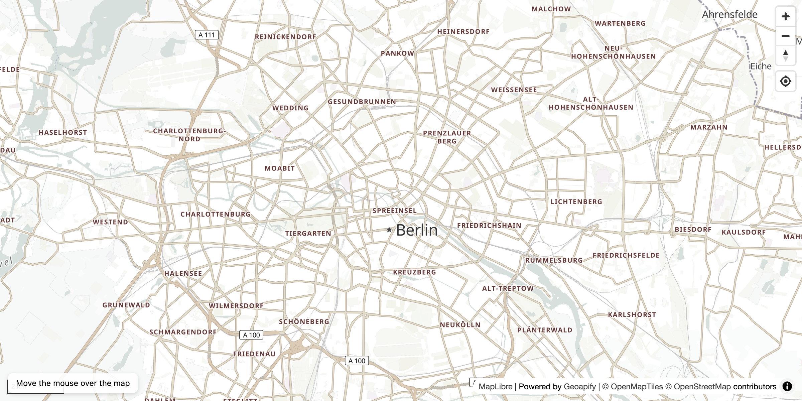

# MapLibre Geoapify Lat/Lon to Pixels with Map Project

Convert geographic coordinates (latitude/longitude) to screen pixel coordinates using MapLibre's `map.project()` method.

## Quick Summary

- Problem: Determine screen pixel positions from geographic coordinates for custom overlays.
- Solution: Use MapLibre's `project()` method to convert lat/lon to x/y pixels in real-time.
- Stack: HTML, CSS, JavaScript, MapLibre GL JS.
- APIs: Geoapify Map Tiles API.

## What This Example Includes

- MapLibre GL JS map initialization
- Real-time coordinate-to-pixel conversion on mouse move
- Floating info panel showing lat/lon and pixel coordinates
- Navigation, scale, and geolocation controls
- Source-based run from `src/index.html` (no build step)

## Use Cases

- Position custom HTML overlays at geographic locations.
- Build coordinate inspection tools for debugging.
- Learn the relationship between geographic and screen coordinates.

## Live Demo

[](https://codepen.io/geoapify/pen/xbweboN)

## Screenshot



## Quick Start

Open [`src/index.html`](./src/index.html) in your browser.

No local server is required.

Note: In rare cases, browser policies or extensions can restrict `file://` access. If that happens, run a local static server and open `src/index.html` via `http://localhost`, or use your IDE's "Open with Live Server" (or similar) option.

## Input and Output

- Input: Mouse position over map, Geoapify API key.
- Output: Real-time display of latitude, longitude, and corresponding screen pixel X/Y coordinates.

## Project Structure

| File | Purpose |
|------|---------|
| `src/index.html` | Source HTML |
| `src/script.js` | Source JavaScript (map init, mouse tracking, projection) |
| `src/style.css` | Source CSS |

## Code Samples

### Minimal HTML

```html
<!DOCTYPE html>
<html lang="en">
<head>
  <meta charset="UTF-8">
  <title>Lat/Lon to Pixels</title>
  <link href="https://unpkg.com/maplibre-gl@latest/dist/maplibre-gl.css" rel="stylesheet">
  <script src="https://unpkg.com/maplibre-gl@latest/dist/maplibre-gl.js"></script>
  <style>
    #map { height: 500px; }
    #info { padding: 10px; background: white; }
  </style>
</head>
<body>
  <div id="map"></div>
  <div id="info"></div>
  <script src="script.js"></script>
</body>
</html>
```

### Minimal JavaScript

```js
// Demo API key for quickstart only.
// Register for your own free API key at https://myprojects.geoapify.com/.
// Benefits: usage analytics, project-level limits, and reliable access for production use.
// This demo key can be blocked or restricted at any time.
const yourAPIKey = "YOUR_API_KEY";

const map = new maplibregl.Map({
  container: "map",
  style: `https://maps.geoapify.com/v1/styles/osm-bright-grey/style.json?apiKey=${yourAPIKey}`,
  center: [13.405, 52.52],
  zoom: 11
});

map.on("mousemove", (e) => {
  const { lng, lat } = e.lngLat;
  const { x, y } = map.project(e.lngLat);
  document.getElementById("info").innerHTML =
    `Lat: ${lat.toFixed(5)}, Lon: ${lng.toFixed(5)} | X: ${Math.round(x)}px, Y: ${Math.round(y)}px`;
});
```

## Customize

1. Open [`src/script.js`](./src/script.js).
2. Set your own API key in `yourAPIKey`.
3. Change `initialCenter` to `[lng, lat]` for a different location.
4. Change `initialZoom` for a different starting zoom level.
5. Use `map.unproject({x, y})` to convert pixels back to coordinates.

API documentation:
- [Geoapify Map Tiles API](https://apidocs.geoapify.com/docs/maps/map-tiles/)

No build step is required. Edit files in `src/` and refresh the browser.

## Troubleshooting

| Problem | Likely Cause | What to Do |
|---------|--------------|------------|
| Map is blank or unstyled | MapLibre assets failed to load | Open browser DevTools (`Console` + `Network`) and confirm CDN files load without errors. |
| Map does not load data / API responds `403` | API key is invalid, restricted, or over limits | Get your own free key at `https://myprojects.geoapify.com/`, then update `yourAPIKey` in `src/script.js`. |
| Works inconsistently from local file | Browser policy blocks some `file://` behavior | Open with IDE Live Server (or any local static server) and run from `http://localhost`. |
| Output differs from expected | Local edits introduced a regression | Compare your files with the [CodePen demo](https://codepen.io/geoapify/pen/xbweboN) and align differences step by step. |

## APIs and Libraries

| Type | Name | Link | API Endpoint Used |
|------|------|------|-------------------|
| API | Geoapify Map Tiles API | [Map Tiles API](https://www.geoapify.com/map-tiles/) | `https://maps.geoapify.com/v1/styles/osm-bright-grey/style.json?apiKey=...` |
| Library | MapLibre GL JS | [maplibre.org](https://maplibre.org/) | Not applicable |

## Related Examples

| Example | Description | Link |
|---------|-------------|------|
| MapLibre Starter | MapLibre GL JS with Geoapify vector tiles | [Open](../maplibre-geoapify-map-tiles-starter) |
| BBox Calculator | Calculate pixel dimensions from geographic bounds | [Open](../bbox-width-height-calculator-in-web-mercator-maplibre-geoapify) |
| Leaflet Interactive Map | Leaflet with markers and click interaction | [Open](../leaflet-first-interactive-map-with-geoapify-tiles) |

## Useful Links

- Geoapify API docs: [https://apidocs.geoapify.com/](https://apidocs.geoapify.com/)
- CodePen demo: [https://codepen.io/geoapify/pen/xbweboN](https://codepen.io/geoapify/pen/xbweboN)
- Geoapify CodePen profile: [https://codepen.io/geoapify](https://codepen.io/geoapify)

## License

MIT

**Keywords**: MapLibre project, lat lon to pixels, coordinate conversion, screen coordinates, map.project, geographic to screen
