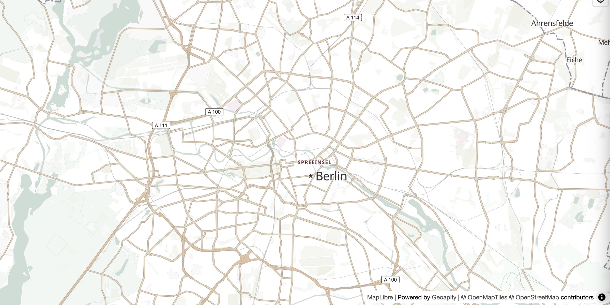

# MapLibre + Geoapify Map Tiles Starter

A minimal starter that shows how to render a Geoapify vector map in MapLibre GL JS, with basic map controls.

## Quick Summary

- Problem: Start a web map quickly with minimal setup.
- Solution: Initialize MapLibre GL JS with a Geoapify style URL and add default controls.
- Stack: HTML, CSS, JavaScript, MapLibre GL JS.
- APIs: Geoapify Map Tiles API.

## What This Example Includes

- MapLibre GL JS map initialization
- Geoapify map style URL
- Navigation, scale, and geolocation controls
- Source-based run from `src/index.html` (no build step)

## Use Cases

- Bootstrap a new map project with MapLibre + Geoapify tiles.
- Create internal demos and proofs of concept for location features.
- Use as a base for adding markers, routes, places, or isolines later.

## Live Demo

[](https://codepen.io/geoapify/pen/GgpLgBo)

## Screenshot



## Quick Start

Open [`src/index.html`](./src/index.html) in your browser.

No local server is required.

Note: In rare cases, browser policies or extensions can restrict `file://` access. If that happens, run a local static server and open `src/index.html` via `http://localhost`, or use your IDE's "Open with Live Server" (or similar) option.

## Input and Output

- Input: map container element, center coordinates, zoom level, Geoapify API key.
- Output: interactive vector map with navigation, scale, and geolocation controls.

## Project Structure

| File | Purpose |
|------|---------|
| `src/index.html` | Source HTML |
| `src/script.js` | Source JavaScript (center, zoom, controls) |
| `src/style.css` | Source CSS |

## Code Samples

### Minimal HTML

```html
<!DOCTYPE html>
<html lang="en">
  <head>
    <meta charset="UTF-8">
    <title>MapLibre + Geoapify Starter</title>
    <link href="https://unpkg.com/maplibre-gl@latest/dist/maplibre-gl.css" rel="stylesheet">
    <script src="https://unpkg.com/maplibre-gl@latest/dist/maplibre-gl.js"></script>
    <style>
      html, body { height: 100%; margin: 0; }
      #map { position: absolute; inset: 0; }
    </style>
  </head>
  <body>
    <div id="map"></div>
    <script src="script.js"></script>
  </body>
</html>
```

### Minimal JavaScript

```js
// Demo API key for quickstart only.
// Register for your own free API key at https://myprojects.geoapify.com/.
// Benefits: usage analytics, project-level limits, and reliable access for production use.
// This demo key can be blocked or restricted at any time.
const yourAPIKey = "YOUR_API_KEY";

const map = new maplibregl.Map({
  container: "map",
  style: `https://maps.geoapify.com/v1/styles/osm-bright-grey/style.json?apiKey=${yourAPIKey}`,
  center: [13.405, 52.52],
  zoom: 11
});

map.addControl(new maplibregl.NavigationControl({ showCompass: true }), "top-right");
map.addControl(new maplibregl.ScaleControl({ unit: "metric" }), "bottom-left");
map.addControl(
  new maplibregl.GeolocateControl({
    positionOptions: { enableHighAccuracy: true },
    trackUserLocation: false,
    showAccuracyCircle: true
  }),
  "top-right"
);
```

## Customize

1. Open [`src/script.js`](./src/script.js).
2. Set your own API key in `yourAPIKey`.
3. Change map start position in `initialCenter` (`[lng, lat]`).
4. Change map zoom level in `initialZoom`.
5. Replace the `style` URL to use a different Geoapify style.

Map styles and tiles documentation:
- [Geoapify Map Tiles](https://www.geoapify.com/map-tiles/)
- [Geoapify Map Styles API Docs](https://apidocs.geoapify.com/docs/maps/map-tiles/)

No build step is required. Edit files in `src/` and refresh the browser.

## Troubleshooting

| Problem | Likely Cause | What to Do |
|---------|--------------|------------|
| Map is blank or unstyled | MapLibre assets failed to load (`maplibre-gl.js` / `maplibre-gl.css`) | Open browser DevTools (`Console` + `Network`) and confirm both CDN files load without errors. |
| Map does not load data / API responds `403` | API key is invalid, restricted, or over limits | Get your own free key at `https://myprojects.geoapify.com/`, then update `yourAPIKey` in `src/script.js`. |
| Works inconsistently from local file | Browser policy blocks some `file://` behavior | Open with IDE Live Server (or any local static server) and run from `http://localhost`. |
| Output differs from expected | Local edits introduced a regression | Compare your files with the [CodePen demo](https://codepen.io/geoapify/pen/GgpLgBo) and align differences step by step. |

## APIs and Libraries

| Type | Name | Link | API Endpoint Used |
|------|------|------|-------------------|
| API | Geoapify Map Tiles API | [Map Tiles API](https://www.geoapify.com/map-tiles/) | `https://maps.geoapify.com/v1/styles/osm-bright-grey/style.json?apiKey=...` |
| Library | MapLibre GL JS | [maplibre.org](https://maplibre.org/) | Not applicable |

## Related Examples

| Example | Description | Link |
|---------|-------------|------|
| Leaflet OSM Tiles | Leaflet map with raster OSM tiles | [Open](../leaflet-map-with-osm-map-tiles-by-geoapify) |
| Leaflet Vector Tiles | Leaflet with vector tiles via MapLibre plugin | [Open](../leaflet-vector-map-tiles-geoapify-maplibre-plugin) |
| Lat/Lon to Pixels | Convert coordinates to screen pixels in MapLibre | [Open](../maplibre-geoapify-lat-lon-to-pixels-with-map-project) |

## Useful Links

- Geoapify API docs: [https://apidocs.geoapify.com/](https://apidocs.geoapify.com/)
- CodePen demo: [https://codepen.io/geoapify/pen/GgpLgBo](https://codepen.io/geoapify/pen/GgpLgBo)
- Geoapify CodePen profile: [https://codepen.io/geoapify](https://codepen.io/geoapify)

## License

MIT

**Keywords**: Geoapify Map Tiles, MapLibre starter, JavaScript map example, vector tiles, interactive web map, quickstart
