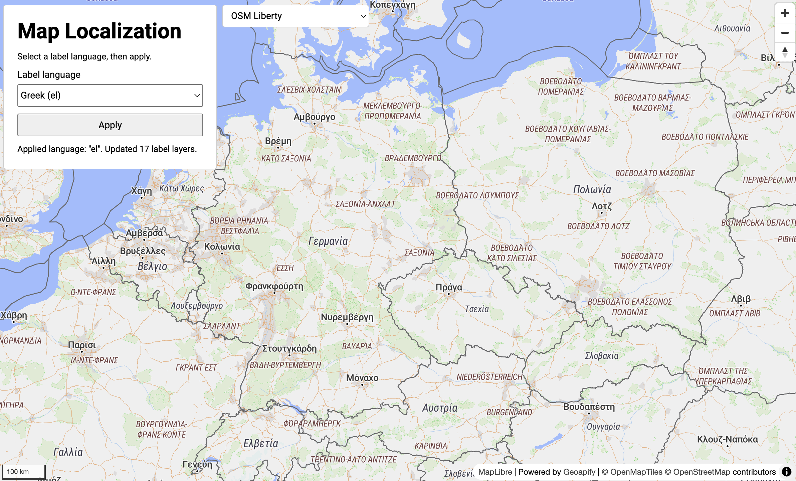

# MapLibre Vector Map Localization for Different Map Styles

Interactive MapLibre GL JS example that localizes vector map labels and lets you switch [Geoapify map styles](https://www.geoapify.com/map-tiles/) instantly.

## Quick Summary

- Problem: Switch map label language without breaking style-specific label formatting.
- Solution: Reapply localization when style changes by preferring localized label fields and falling back to each style's original `text-field` logic.
- Stack: HTML, CSS, JavaScript, MapLibre GL JS.
- APIs: Geoapify Map Tiles API.

Concept: load the active style, iterate its `symbol` layers, and replace each layer's `text-field` with a language-aware expression. The expression tries localized values first, then falls back to the original style `text-field`.

## What This Example Includes

- MapLibre GL JS map initialized with Geoapify vector styles
- Standalone Geoapify style selector (applies on select change)
- Language selector with `Default` restore mode
- Label localization for symbol layers with smart fallback:
  - localized name first (`name:<lang>`, `name_<lang>`)
  - then original style `text-field` expression/template
- Source-based run from `src/index.html` (no build step)

## Use Cases

- Add multilingual label support to vector maps.
- Compare map styles while keeping one localization strategy.
- Learn how to localize without destroying style-specific label formatting.

## Live Demo

[](https://codepen.io/editor/geoapify/pen/019e39c0-337b-7e88-9b80-c3636d41f16e)

## Screenshot



## Quick Start

Open [`src/index.html`](./src/index.html) in your browser.

No local server is required.

Note: In rare cases, browser policies or extensions can restrict `file://` access. If that happens, run a local static server and open `src/index.html` via `http://localhost`, or use your IDE's "Open with Live Server" (or similar) option.

## Input and Output

- Input: selected Geoapify style, selected language, Geoapify API key.
- Output: interactive vector map with localized labels and style-aware fallback rendering.

## Project Structure

| File | Purpose |
|------|---------|
| `src/index.html` | Source HTML with map container and controls |
| `src/script.js` | Source JavaScript (different map styles + localization logic) |
| `src/style.css` | Source CSS |

## Code Samples

### Create a Map with a Specified Map Style

Initialize MapLibre with a Geoapify style URL. Replace `styleId` to switch the initial map appearance.

```js
const yourAPIKey = "YOUR_API_KEY";
const styleId = "osm-bright-grey";

const map = new maplibregl.Map({
  container: "map",
  style: `https://maps.geoapify.com/v1/styles/${styleId}/style.json?apiKey=${yourAPIKey}`,
  center: [13.405, 52.52],
  zoom: 5
});
```

### Change Map Style Dynamically

Update the current map style at runtime (for example, from a dropdown selection).

```js
function getGeoapifyStyleUrl(styleId, apiKey) {
  return `https://maps.geoapify.com/v1/styles/${styleId}/style.json?apiKey=${apiKey}`;
}

function changeMapStyle(styleId) {
  map.setStyle(getGeoapifyStyleUrl(styleId, yourAPIKey));
}

// Example:
changeMapStyle("dark-matter-dark-grey");
```

### Important Events for Style and Localization

Use `style.load` after map creation and after every `setStyle(...)` call. This is the key event for recaching layer `text-field` values and reapplying localization. Use `error` to detect style loading or API key issues.

```js
map.on("style.load", () => {
  cacheOriginalTextFields();
  applyMapLanguage(currentLanguage);
});

map.on("error", (event) => {
  console.error("MapLibre error:", event.error || event);
  updateStatus("Map error: check style URL and API key.");
});
```

### Getting Existing Map Style

Before localizing labels, read the currently active style object from the map. This gives access to `style.layers`, which is required to iterate symbol layers and update their `text-field` values. The guard prevents updates before the style has finished loading.

```js
const style = map.getStyle();
if (!style || !style.layers) {
  updateStatus("Map style is not ready yet.");
  return;
}
```

### Localize Map Layers

Iterate `symbol` layers and replace each `text-field` so localized names are preferred, while preserving the original layer text logic as fallback.

Important: not all label fields should be localized. Some layers use values like road `ref` (route numbers), which should stay unchanged. Review skip rules per map style. The check below works for most Geoapify styles, but style-specific tuning is recommended.

```js
function shouldSkipLocalization(textField) {
  const text = JSON.stringify(textField);
  return text.includes("{ref}") || text.includes("\"get\",\"ref\"");
}

function localizeMapLayers(languageCode) {
  const style = map.getStyle();
  if (!style || !style.layers) return;

  style.layers.forEach((layer) => {
    if (layer.type !== "symbol") return;

    const originalTextField = originalTextFieldsByLayerId.get(layer.id);
    if (originalTextField === undefined) return;
    if (shouldSkipLocalization(originalTextField)) return;

    const localizedTextField = [
      "coalesce",
      ["coalesce", ["get", `name:${languageCode}`], ["get", `name_${languageCode}`], ["get", "name"], ["get", "name_int"]],
      Array.isArray(originalTextField) ? originalTextField : ["to-string", originalTextField]
    ];

    map.setLayoutProperty(layer.id, "text-field", localizedTextField);
  });
}
```

## Customize

1. Open [`src/script.js`](./src/script.js).
2. Set your own API key in `yourAPIKey`.
3. Add or remove items in `mapStyles`.
4. Add or remove language options in `languages`.
5. Change map startup position in `initialCenter` and `initialZoom`.

Map style documentation:
- [Geoapify Map Tiles](https://www.geoapify.com/map-tiles/)
- [Geoapify Map Styles API Docs](https://apidocs.geoapify.com/docs/maps/map-tiles/)

No build step is required. Edit files in `src/` and refresh the browser.

## How to Review Map Style

1. Open the target `style.json` URL in a browser or Postman, then inspect `style.layers` (for example: `https://maps.geoapify.com/v1/styles/osm-bright-grey/style.json?apiKey=YOUR_API_KEY`).
2. Focus on `symbol` layers only.
3. Check each layer `text-field` and identify what it renders.
4. Localize place names (`name`, `name:<lang>`, `name_<lang>`), and skip functional labels (`ref`, route numbers, shield-like identifiers).
5. Apply language logic to safe layers first, then test at multiple zoom levels.
6. Switch between several styles and verify no broken or duplicated labels.

This approach works for most Geoapify styles, but each style can define labels differently, so final skip/include rules should be reviewed per style.

## Troubleshooting

| Problem | Likely Cause | What to Do |
|---------|--------------|------------|
| Labels do not change after apply | `Default` language selected | Select a specific language code (for example `de`, `fr`) and click Apply. |
| Map is blank or unstyled | MapLibre assets failed to load | Open browser DevTools (`Console` + `Network`) and confirm MapLibre JS/CSS load without errors. |
| API responds `403` | API key is invalid, restricted, or over limits | Get your own free key at `https://myprojects.geoapify.com/`, then update `yourAPIKey` in `src/script.js`. |
| Works inconsistently from local file | Browser policy blocks some `file://` behavior | Run from `http://localhost` using a local static server. |

## APIs and Libraries

| Type | Name | Link | API Endpoint Used |
|------|------|------|-------------------|
| API | Geoapify Map Tiles API | [Map Tiles API](https://www.geoapify.com/map-tiles/) | `https://maps.geoapify.com/v1/styles/{style}/style.json?apiKey=...` |
| Library | MapLibre GL JS | [maplibre.org](https://maplibre.org/) | Not applicable |

## Related Examples

| Example | Description | Link |
|---------|-------------|------|
| MapLibre Starter | Basic MapLibre map with Geoapify styles | [Open](../maplibre-geoapify-map-tiles-starter) |
| Custom Markers & Popups | Place markers and details on MapLibre map | [Open](../maplibre-custom-markers-popups-with-geoapify-place-details) |
| Lat/Lon to Pixels | Convert coordinates to pixel positions | [Open](../maplibre-geoapify-lat-lon-to-pixels-with-map-project) |

## Useful Links

- Geoapify API docs: [https://apidocs.geoapify.com/](https://apidocs.geoapify.com/)
- CodePen demo: [https://codepen.io/editor/geoapify/pen/019e39c0-337b-7e88-9b80-c3636d41f16e](https://codepen.io/editor/geoapify/pen/019e39c0-337b-7e88-9b80-c3636d41f16e)
- Geoapify CodePen profile: [https://codepen.io/geoapify](https://codepen.io/geoapify)

## License

MIT

**Keywords**: MapLibre localization, vector map labels, Geoapify map styles, multilingual map, JavaScript map example
