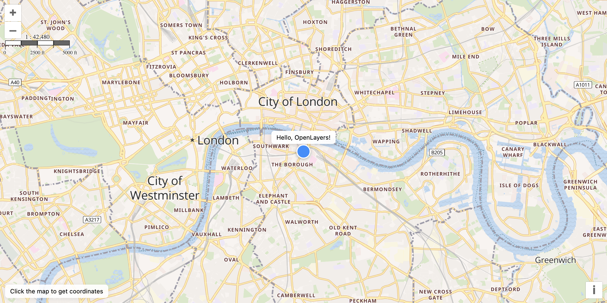

# OpenLayers First Interactive Map with Geoapify Tiles

Build your first interactive web map using OpenLayers and Geoapify raster tiles, with markers, popups, and click interaction.

## Quick Summary

- Problem: Create an interactive map with OpenLayers and custom tiles.
- Solution: Use OpenLayers with Geoapify XYZ raster tiles, add overlays for markers and popups, and handle click events.
- Stack: HTML, CSS, JavaScript, OpenLayers.
- APIs: Geoapify Map Tiles API.

## What This Example Includes

- OpenLayers map initialization with Geoapify raster tiles
- Retina/HiDPI display support
- Overlay-based marker and popup
- Click-to-move marker functionality
- Coordinate display on click
- Scale bar control
- Source-based run from `src/index.html` (no build step)

## Use Cases

- Learn the basics of OpenLayers with Geoapify tiles.
- Build a simple location picker or point-of-interest viewer.
- Integrate Geoapify tiles into an existing OpenLayers project.

## Live Demo

[](https://codepen.io/geoapify/pen/pvgPgbV)

## Screenshot



## Quick Start

Open [`src/index.html`](./src/index.html) in your browser.

No local server is required.

Note: In rare cases, browser policies or extensions can restrict `file://` access. If that happens, run a local static server and open `src/index.html` via `http://localhost`, or use your IDE's "Open with Live Server" (or similar) option.

## Input and Output

- Input: Map container element, center coordinates, zoom level, Geoapify API key.
- Output: Interactive raster map with marker overlay, popup, scale bar, and click coordinate display.

## Project Structure

| File | Purpose |
|------|---------|
| `src/index.html` | Source HTML |
| `src/script.js` | Source JavaScript (map init, overlays, click handler) |
| `src/style.css` | Source CSS |

## Code Samples

### Minimal HTML

```html
<!DOCTYPE html>
<html lang="en">
<head>
  <meta charset="UTF-8">
  <title>OpenLayers + Geoapify</title>
  <link rel="stylesheet" href="https://cdn.jsdelivr.net/npm/ol@latest/ol.css">
  <style>
    html, body { height: 100%; margin: 0; }
    #map { height: 100%; }
  </style>
</head>
<body>
  <div id="map"></div>
  <script src="https://cdn.jsdelivr.net/npm/ol@latest/dist/ol.js"></script>
  <script src="script.js"></script>
</body>
</html>
```

### Minimal JavaScript

```js
// Demo API key for quickstart only.
// Register for your own free API key at https://myprojects.geoapify.com/.
// Benefits: usage analytics, project-level limits, and reliable access for production use.
// This demo key can be blocked or restricted at any time.
const yourAPIKey = "YOUR_API_KEY";

const isRetina = window.devicePixelRatio > 1;
const retinaSuffix = isRetina ? "@2x" : "";

const map = new ol.Map({
  target: "map",
  layers: [
    new ol.layer.Tile({
      source: new ol.source.XYZ({
        url: `https://maps.geoapify.com/v1/tile/osm-bright/{z}/{x}/{y}${retinaSuffix}.png?apiKey=${yourAPIKey}`,
        tilePixelRatio: isRetina ? 2 : 1,
        attributions: 'Powered by <a href="https://www.geoapify.com/">Geoapify</a> | © OpenMapTiles © OpenStreetMap'
      })
    })
  ],
  view: new ol.View({
    center: ol.proj.fromLonLat([-0.09, 51.505]),
    zoom: 13
  })
});

map.on("click", (evt) => {
  const [lon, lat] = ol.proj.toLonLat(evt.coordinate);
  console.log(`Clicked: ${lat.toFixed(5)}, ${lon.toFixed(5)}`);
});
```

## Customize

1. Open [`src/script.js`](./src/script.js).
2. Set your own API key in `yourAPIKey`.
3. Change `center` using `ol.proj.fromLonLat([lon, lat])`.
4. Replace `osm-bright` in the tile URL with another Geoapify style.
5. Customize marker and popup styling in `src/style.css`.

API documentation:
- [Geoapify Map Tiles API](https://apidocs.geoapify.com/docs/maps/map-tiles/)

No build step is required. Edit files in `src/` and refresh the browser.

## Troubleshooting

| Problem | Likely Cause | What to Do |
|---------|--------------|------------|
| Map is blank or tiles missing | OpenLayers CSS/JS failed to load | Open browser DevTools (`Console` + `Network`) and confirm CDN files load without errors. |
| Map does not load data / API responds `403` | API key is invalid, restricted, or over limits | Get your own free key at `https://myprojects.geoapify.com/`, then update `apiKey` in `src/script.js`. |
| Works inconsistently from local file | Browser policy blocks some `file://` behavior | Open with IDE Live Server (or any local static server) and run from `http://localhost`. |
| Output differs from expected | Local edits introduced a regression | Compare your files with the [CodePen demo](https://codepen.io/geoapify/pen/pvgPgbV) and align differences step by step. |

## APIs and Libraries

| Type | Name | Link | API Endpoint Used |
|------|------|------|-------------------|
| API | Geoapify Map Tiles API | [Map Tiles API](https://www.geoapify.com/map-tiles/) | `https://maps.geoapify.com/v1/tile/osm-bright/{z}/{x}/{y}.png?apiKey=...` |
| Library | OpenLayers | [openlayers.org](https://openlayers.org/) | Not applicable |

## Related Examples

| Example | Description | Link |
|---------|-------------|------|
| Leaflet Interactive Map | Leaflet with markers and click interaction | [Open](../leaflet-first-interactive-map-with-geoapify-tiles) |
| MapLibre Starter | MapLibre GL JS with Geoapify vector tiles | [Open](../maplibre-geoapify-map-tiles-starter) |
| Leaflet OSM Tiles | Leaflet map with raster OSM tiles | [Open](../leaflet-map-with-osm-map-tiles-by-geoapify) |

## Useful Links

- Geoapify API docs: [https://apidocs.geoapify.com/](https://apidocs.geoapify.com/)
- CodePen demo: [https://codepen.io/geoapify/pen/pvgPgbV](https://codepen.io/geoapify/pen/pvgPgbV)
- Geoapify CodePen profile: [https://codepen.io/geoapify](https://codepen.io/geoapify)

## License

MIT

**Keywords**: OpenLayers tutorial, Geoapify tiles, XYZ tiles, interactive map, marker overlay, popup, JavaScript map
