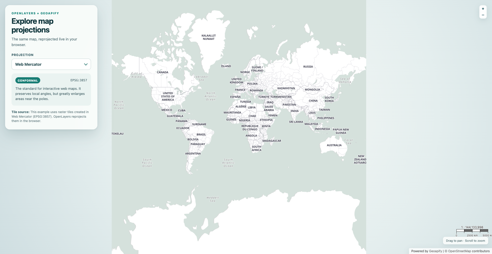

# OpenLayers Raster Tile Reprojection with Geoapify Map Tiles

Use [OpenLayers](https://openlayers.org/) and [Proj4js](https://proj4js.org/) to reproject Geoapify Web Mercator raster tiles in the browser and compare global and regional coordinate reference systems (CRSs).

## Overview

This example uses one [Geoapify raster tile layer](https://www.geoapify.com/map-tiles/) and changes the projection of the OpenLayers view. OpenLayers automatically samples and reprojects the source images from Web Mercator (`EPSG:3857`) into the selected target CRS.

The projection selector includes global CRSs for comparing common world-map distortion patterns and regional CRSs designed for China, Great Britain, France, the contiguous United States, and Australia. The information panel identifies each option by projection type, CRS code, and intended use.

## Live Demo

[](https://codepen.io/editor/geoapify/pen/01a0c3b7-74e3-7d1b-a052-ab0a23aa7938)

## Screenshot



## Projection Catalog

| Projection / CRS | Code | Type | Scope and Typical Use |
|------------------|------|------|-----------------------|
| [Web Mercator](https://epsg.io/3857) | `EPSG:3857` | Conformal cylindrical | Standard slippy maps and interactive web mapping; area distortion increases toward the poles |
| [Equal Earth](https://epsg.io/8857) | `EPSG:8857` | Equal-area pseudocylindrical | World thematic maps where relative area should remain comparable |
| [WGS 84 / Plate Carrée](https://epsg.io/4326) | `EPSG:4326` | Geographic | Displays longitude and latitude directly; useful for coordinate inspection, but stretches high latitudes |
| [Robinson](https://epsg.io/54030) | `ESRI:54030` | Compromise pseudocylindrical | General-purpose world maps that balance shape, area, and distance distortion |
| [Mollweide](https://epsg.io/54009) | `ESRI:54009` | Equal-area pseudocylindrical | Global distributions such as climate, population, and land cover |
| [China Albers Equal Area](https://en.wikipedia.org/wiki/Albers_projection) | `CUSTOM:CHINA_ALBERS` | Equal-area conic | National-scale thematic mapping and area comparison for China |
| [China Geodetic Coordinate System 2000](https://epsg.io/4490) | `EPSG:4490` | Geographic CRS | Longitude and latitude in China's national geodetic reference system; this is a CRS, not a projected map grid |
| [British National Grid](https://epsg.io/27700) | `EPSG:27700` | Conformal Transverse Mercator | Detailed mapping across Great Britain |
| [RGF93 v2b / Lambert-93](https://epsg.io/9794) | `EPSG:9794` | Conformal conic | Official mainland France mapping with low scale distortion |
| [NAD83 / Conus Albers](https://epsg.io/5070) | `EPSG:5070` | Equal-area conic | Analysis and thematic mapping of the contiguous United States |
| [GDA2020 / Australian Albers](https://epsg.io/9473) | `EPSG:9473` | Equal-area conic | Continental Australian mapping and area-based analysis |

## Quick Start

Serve the repository with any static web server. For example, from the repository root run:

```bash
python3 -m http.server 8000
```

Then open the example at:

```text
http://localhost:8000/maps/openlayers-geoapify-map-projection-switcher/src/
```

No build step or package installation is required. You can also open [`src/index.html`](./src/index.html) directly, although a local server gives browsers a consistent origin for loading external assets.

## Project Structure

| File | Purpose |
|------|---------|
| [`src/index.html`](./src/index.html) | Loads OpenLayers and Proj4js and provides the projection controls |
| [`src/script.js`](./src/script.js) | Defines the CRSs, configures Geoapify tiles, changes views, and fits projection extents |
| [`src/style.css`](./src/style.css) | Styles the map, information panel, controls, and responsive layout |

## Geoapify API Key

The source includes a demo key for quick testing. Create a free API key at [myprojects.geoapify.com](https://myprojects.geoapify.com/) and replace the value assigned to `yourAPIKey` in [`src/script.js`](./src/script.js) before using the example in your own project.

## How Raster Reprojection Works

Geoapify raster map tiles use the XYZ tile scheme in Web Mercator. The tile source therefore remains `EPSG:3857` while the OpenLayers view changes to the selected target CRS. OpenLayers calculates a triangulated transformation between the two projections, requests the required source tiles, and resamples their pixels into the target view in the browser.

The source URL requests `@2x` PNG tiles, and `tilePixelRatio: 2` tells OpenLayers that each tile contains twice the normal pixel density. This keeps the relationship between the tile grid and rendered CSS pixels correct.

## Reprojection Limits

- The source tiles only cover the Web Mercator latitude range, approximately `85.0511°S` to `85.0511°N`. Target projections cannot recover polar imagery outside that range.
- Labels, roads, and boundaries are already painted into the PNG tiles, so reprojection bends and resamples them together with the rest of the image. Text can appear softer than in the native Web Mercator view.
- Curved world outlines and strong differences between source and target CRSs can expose transparent no-data areas or small seams near projection boundaries.
- Regional view extents keep country-focused CRSs within their intended area of use. They do not clip or transform the source data into a new authoritative dataset.
- The demo is appropriate for visual comparison. For measurement, analysis, or datum-sensitive work, transform the underlying coordinates with an authoritative operation and render data prepared for the target CRS.

## Key Code Samples

### Configure Geoapify Retina Raster Tiles

Keep the XYZ source explicitly in Web Mercator even when the map view uses another CRS. The full example uses the `osm-bright-grey` Geoapify map style.

```js
const yourAPIKey = "YOUR_API_KEY";
const mapTileUrl =
  `https://maps.geoapify.com/v1/tile/osm-bright-grey/` +
  `{z}/{x}/{y}@2x.png?apiKey=${yourAPIKey}`;

const mapTileLayer = new ol.layer.Tile({
  source: new ol.source.XYZ({
    url: mapTileUrl,
    projection: "EPSG:3857",
    tilePixelRatio: 2,
    maxZoom: 20,
    wrapX: false,
    crossOrigin: "anonymous",
  }),
});
```

How it works:

- `projection: "EPSG:3857"` describes the source tile grid; it does not force the OpenLayers view to stay in Web Mercator.
- OpenLayers reprojects this source when its projection differs from the view projection.
- `tilePixelRatio: 2` matches the `@2x` tile URL, while `wrapX: false` prevents repeated worlds from appearing in bounded regional projections.

### Register a Regional CRS and Set Its Extents

Define the CRS with Proj4js, register the definitions with OpenLayers, and give the projection both a projected validity extent and its geographic area of use.

```js
const code = "CUSTOM:CHINA_ALBERS";
const geographicExtent = [73.5, 18, 135.1, 53.6];

proj4.defs(
  code,
  "+proj=aea +lat_0=0 +lon_0=105 +lat_1=25 +lat_2=47 " +
    "+x_0=0 +y_0=0 +ellps=GRS80 +units=m +no_defs +type=crs"
);

ol.proj.proj4.register(proj4);

const projection = ol.proj.get(code);
projection.setGlobal(false);
projection.setExtent(
  ol.proj.transformExtent(
    geographicExtent,
    "EPSG:4326",
    projection,
    8
  )
);
projection.setWorldExtent(geographicExtent);
```

How it works:

- `proj4.defs()` provides the forward and inverse CRS transformations.
- `ol.proj.proj4.register()` makes that definition available through `ol.proj.get()`.
- `setExtent()` stores the usable bounds in projected coordinates and is used to constrain the regional view.
- `setWorldExtent()` records the same coverage in longitude and latitude for geographic context.

### Replace the View and Fit the Target Projection

Create a new `ol.View` for the selected CRS, replace the map view, and fit either the regional projection extent or the portion of the world covered by Web Mercator tiles. This snippet assumes `map` is an initialized `ol.Map`.

```js
const webMercatorGeographicExtent = [
  -180,
  -85.05112878,
  180,
  85.05112878,
];

function switchProjection(code, centerLonLat) {
  const projection = ol.proj.get(code);
  const view = new ol.View({
    projection,
    center: ol.proj.transform(
      centerLonLat,
      "EPSG:4326",
      projection
    ),
    zoom: 1,
    minZoom: -2,
    maxZoom: 9,
    multiWorld: projection.isGlobal(),
    extent: projection.isGlobal() ? undefined : projection.getExtent(),
    constrainOnlyCenter: true,
    showFullExtent: true,
  });

  map.setView(view);

  const visibleExtent = projection.isGlobal()
    ? ol.proj.transformExtent(
        webMercatorGeographicExtent,
        "EPSG:4326",
        projection,
        8
      )
    : projection.getExtent();

  view.fit(visibleExtent, {
    size: map.getSize(),
    padding: [40, 40, 40, 400],
  });
}
```

How it works:

- OpenLayers views have a fixed projection, so changing CRS means constructing and installing a new view.
- The center is transformed from longitude/latitude into the target CRS before the view is created.
- Regional CRSs use their configured extent; global CRSs fit the valid geographic domain of the Web Mercator source.
- `multiWorld` allows global views to zoom out far enough for the padded fit; the source's `wrapX: false` still prevents repeated tiles. Regional views constrain only the center so their full extent can fit beside the panel.
- The full source calculates responsive padding so the fitted map remains visible beside or below the information panel.

## APIs and Libraries

| Name | Description | Documentation | Used In This Example |
|------|-------------|---------------|----------------------|
| Geoapify Map Tiles API | Provides styled raster map tiles in the XYZ scheme. | [Map Tiles documentation](https://apidocs.geoapify.com/docs/maps/) | `osm-bright-grey` Web Mercator PNG tiles at `@2x` density |
| [OpenLayers](https://openlayers.org/) | Renders the interactive map and reprojects raster sources into the view CRS. | [OpenLayers API](https://openlayers.org/en/latest/apidoc/) | Map, tile layer, XYZ source, projection-aware views, extent fitting, attribution, and scale line |
| [Proj4js](https://proj4js.org/) | Implements transformations for CRSs that are not built into OpenLayers. | [Proj4js documentation](https://proj4js.org/) | Equal Earth, Robinson, Mollweide, and regional CRS definitions |

## Related Code Samples

| Code Sample | Why It Is Related |
|-------------|-------------------|
| [D3 Geo Projection Switcher](https://github.com/geoapify/geoapify-quickstart-examples/tree/main/maps/d3-geo-projection-switcher) | Compares world projections in an SVG-based D3 Geo renderer |
| [OpenLayers First Interactive Map with Geoapify Tiles](https://github.com/geoapify/geoapify-quickstart-examples/tree/main/maps/openlayers-first-interactive-map-with-geoapify-tiles) | Shows the basic OpenLayers and Geoapify raster tile setup without changing projection |
| [Understanding Map Zoom Levels and the XYZ Tile System](https://github.com/geoapify/geoapify-quickstart-examples/tree/main/maps/understanding-map-zoom-levels-and-the-xyz-tile-system) | Explains the tile coordinates and zoom model used by the raster source |

## Useful Links

- [Geoapify Maps API](https://www.geoapify.com/maps-api/)
- [OpenLayers raster reprojection tutorial](https://openlayers.org/doc/tutorials/raster-reprojection.html)
- [OpenLayers raster reprojection example](https://openlayers.org/en/latest/examples/reprojection.html)
- [EPSG Geodetic Parameter Dataset](https://epsg.org/)

## License

MIT
