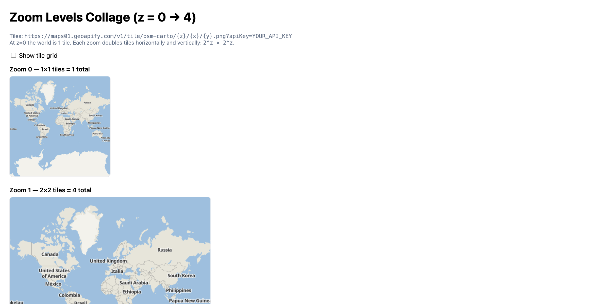

# Understanding Map Zoom Levels and the XYZ Tile System

A visual educational demo showing how web map tiles work across different zoom levels, from a single tile at zoom 0 to 1024 tiles at zoom 4.

## Quick Summary

- Problem: Understand how XYZ tile coordinates and zoom levels work in web maps.
- Solution: Render tile collages for zoom levels 0-4, optionally showing grid lines and tile coordinates.
- Stack: HTML, CSS, JavaScript, Canvas API.
- APIs: Geoapify Map Tiles API.

## What This Example Includes

- Canvas-based tile collage rendering for zoom levels 0-4
- Optional grid overlay showing tile boundaries
- Tile coordinate labels (z/x/y format)
- Progressive tile count visualization (1 → 4 → 16 → 64 → 256 tiles)
- Interactive grid toggle
- Source-based run from `src/index.html` (no build step)

## Use Cases

- Learn how web map tiling systems work.
- Understand the relationship between zoom levels and tile counts.
- Visualize XYZ coordinate addressing for map tiles.

## Live Demo

[](https://codepen.io/geoapify/pen/zxvgKNo)

## Screenshot



## Quick Start

Open [`src/index.html`](./src/index.html) in your browser.

No local server is required.

Note: In rare cases, browser policies or extensions can restrict `file://` access. If that happens, run a local static server and open `src/index.html` via `http://localhost`, or use your IDE's "Open with Live Server" (or similar) option.

## Input and Output

- Input: Geoapify API key, zoom level range (0-4), grid toggle state.
- Output: Visual tile collages showing world maps at each zoom level with optional grid and coordinate labels.

## Project Structure

| File | Purpose |
|------|---------|
| `src/index.html` | Source HTML |
| `src/script.js` | Source JavaScript (tile loading, canvas rendering, grid drawing) |
| `src/style.css` | Source CSS |

## Code Samples

### Minimal HTML

```html
<!DOCTYPE html>
<html lang="en">
<head>
  <meta charset="UTF-8">
  <title>XYZ Tile System</title>
  <style>
    canvas { border: 1px solid #ccc; display: block; margin: 10px 0; }
  </style>
</head>
<body>
  <h1>Zoom Levels 0-2</h1>
  <div id="canvases"></div>
  <script src="script.js"></script>
</body>
</html>
```

### Minimal JavaScript

```js
// Demo API key for quickstart only.
// Register for your own free API key at https://myprojects.geoapify.com/.
// Benefits: usage analytics, project-level limits, and reliable access for production use.
// This demo key can be blocked or restricted at any time.
const yourAPIKey = "YOUR_API_KEY";

const BASE = "https://maps.geoapify.com/v1/tile/klokantech-basic";
const TILE_SIZE = 256;

function loadTile(z, x, y) {
  return new Promise((resolve) => {
    const img = new Image();
    img.crossOrigin = "anonymous";
    img.onload = () => resolve(img);
    img.src = `${BASE}/${z}/${x}/${y}.png?apiKey=${yourAPIKey}`;
  });
}

async function renderZoom(z) {
  const grid = 2 ** z;
  const canvas = document.createElement("canvas");
  canvas.width = canvas.height = grid * TILE_SIZE;
  document.getElementById("canvases").appendChild(canvas);
  const ctx = canvas.getContext("2d");

  for (let y = 0; y < grid; y++) {
    for (let x = 0; x < grid; x++) {
      const img = await loadTile(z, x, y);
      ctx.drawImage(img, x * TILE_SIZE, y * TILE_SIZE);
      ctx.fillText(`${z}/${x}/${y}`, x * TILE_SIZE + 4, y * TILE_SIZE + 16);
    }
  }
}

[0, 1, 2].forEach(renderZoom);
```

## Customize

1. Open [`src/script.js`](./src/script.js).
2. Set your own API key in `yourAPIKey`.
3. Change `ZOOM_LEVELS` to render more or fewer zoom levels.
4. Replace `klokantech-basic` in `BASE` with another Geoapify style.
5. Modify `TILE_SIZE` if using non-standard tile sizes.

API documentation:
- [Geoapify Map Tiles API](https://apidocs.geoapify.com/docs/maps/map-tiles/)

No build step is required. Edit files in `src/` and refresh the browser.

## Troubleshooting

| Problem | Likely Cause | What to Do |
|---------|--------------|------------|
| Canvas is blank | Tiles failed to load (CORS or network error) | Open browser DevTools (`Console` + `Network`) and confirm tile requests succeed. |
| API responds `403` | API key is invalid, restricted, or over limits | Get your own free key at `https://myprojects.geoapify.com/`, then update `yourAPIKey` in `src/script.js`. |
| Works inconsistently from local file | Browser policy blocks some `file://` behavior | Open with IDE Live Server (or any local static server) and run from `http://localhost`. |
| Output differs from expected | Local edits introduced a regression | Compare your files with the [CodePen demo](https://codepen.io/geoapify/pen/zxvgKNo) and align differences step by step. |

## APIs and Libraries

| Type | Name | Link | API Endpoint Used |
|------|------|------|-------------------|
| API | Geoapify Map Tiles API | [Map Tiles API](https://www.geoapify.com/map-tiles/) | `https://maps.geoapify.com/v1/tile/klokantech-basic/{z}/{x}/{y}.png?apiKey=...` |

## Related Examples

| Example | Description | Link |
|---------|-------------|------|
| BBox Calculator | Calculate pixel dimensions from geographic bounds | [Open](../bbox-width-height-calculator-in-web-mercator-maplibre-geoapify) |
| Lat/Lon to Pixels | Convert coordinates to screen pixels | [Open](../maplibre-geoapify-lat-lon-to-pixels-with-map-project) |
| MapLibre Starter | MapLibre GL JS with Geoapify vector tiles | [Open](../maplibre-geoapify-map-tiles-starter) |

## Useful Links

- Geoapify API docs: [https://apidocs.geoapify.com/](https://apidocs.geoapify.com/)
- CodePen demo: [https://codepen.io/geoapify/pen/zxvgKNo](https://codepen.io/geoapify/pen/zxvgKNo)
- Geoapify CodePen profile: [https://codepen.io/geoapify](https://codepen.io/geoapify)

## License

MIT

**Keywords**: XYZ tiles, zoom levels, tile system, web map tiles, tile coordinates, map education, canvas rendering
