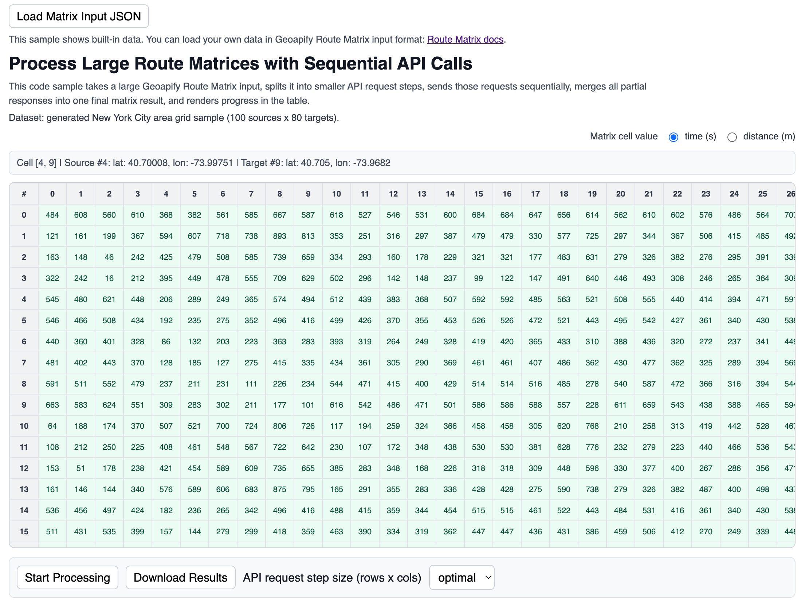

# Geoapify Route Matrix API Code Examples

Use Geoapify Route Matrix API examples to calculate travel time and distance matrices between multiple origins and destinations, then display or process matrix results in browser tools.

## Overview

This folder contains browser-based JavaScript examples for route matrix calculation, large matrix splitting, and map-based source/destination selection. Each example includes source code, a screenshot, and a focused README with setup notes and code samples.

## API Resources

## Live Demo

Each CodePen demo is linked from the `Live Demo` column in the code examples table.

## Code Examples

| Screenshot | Example | Description | Source Code | Live Demo |
|------------|---------|-------------|-------------|-----------|
|  | Calculate Driving Distance Matrix with Geoapify Matrix API and MapLibre | Calculate driving distances and travel times between multiple locations, then visualize a selected source-destination pair on a map. | [Open example](https://github.com/geoapify/geoapify-quickstart-examples/tree/main/matrix-api/calculate-driving-distance-matrix-api/) | [CodePen](https://codepen.io/geoapify/pen/jEyZmOg) |
|  | Process Large Route Matrices with Sequential API Calls | Split large source/target matrices into smaller requests, send them sequentially, and merge partial responses into one result. | [Open example](https://github.com/geoapify/geoapify-quickstart-examples/tree/main/matrix-api/calculate-big-matrices-sequential/) | [CodePen](https://codepen.io/editor/team/geoapify/pen/019e06ca-65c2-7e21-9e3b-7a9659d3913a) |

## Geoapify API Key

These examples include demo Geoapify API keys for quick testing. For your own project, create a free API key at [myprojects.geoapify.com](https://myprojects.geoapify.com/) and replace the example key in the relevant `src/script.js` file.

## APIs and Libraries

| Name | Description | Documentation | Used In This Example |
|------|-------------|---------------|----------------------|
| Geoapify Route Matrix API | Calculates travel time and distance matrices for source and target locations. | [Route Matrix API docs](https://apidocs.geoapify.com/docs/route-matrix/) | [Calculate Driving Distance Matrix](./calculate-driving-distance-matrix-api/), [Process Large Route Matrices](./calculate-big-matrices-sequential/) |
| Geoapify Address Autocomplete | Collects addresses and coordinates for route matrix inputs. | [Address Autocomplete docs](https://apidocs.geoapify.com/docs/geocoding/address-autocomplete/) | [Calculate Driving Distance Matrix](./calculate-driving-distance-matrix-api/) |
| Geoapify Reverse Geocoding API | Converts map-click coordinates into address labels. | [Reverse geocoding docs](https://apidocs.geoapify.com/docs/geocoding/reverse-geocoding/) | [Calculate Driving Distance Matrix](./calculate-driving-distance-matrix-api/) |
| Geoapify Marker Icon API | Generates numbered map markers for source and destination points. | [Marker Icon docs](https://apidocs.geoapify.com/docs/icon/) | [Calculate Driving Distance Matrix](./calculate-driving-distance-matrix-api/) |
| Geoapify Map Tiles API | Provides map styles and tiles for MapLibre-based examples. | [Map Tiles docs](https://apidocs.geoapify.com/docs/maps/map-tiles/) | [Calculate Driving Distance Matrix](./calculate-driving-distance-matrix-api/) |
| MapLibre GL JS | Renders interactive vector maps in browser examples. | [MapLibre GL JS docs](https://maplibre.org/maplibre-gl-js/docs/) | [Calculate Driving Distance Matrix](./calculate-driving-distance-matrix-api/) |
| Browser Fetch API | Sends Route Matrix API requests and reads JSON responses. | [MDN Fetch API](https://developer.mozilla.org/en-US/docs/Web/API/Fetch_API) | [Process Large Route Matrices](./calculate-big-matrices-sequential/) |

## Useful Links

- Geoapify API documentation: [https://apidocs.geoapify.com/](https://apidocs.geoapify.com/)
- Geoapify projects and API keys: [https://myprojects.geoapify.com/](https://myprojects.geoapify.com/)
- Geoapify CodePen examples: [https://codepen.io/geoapify](https://codepen.io/geoapify)
