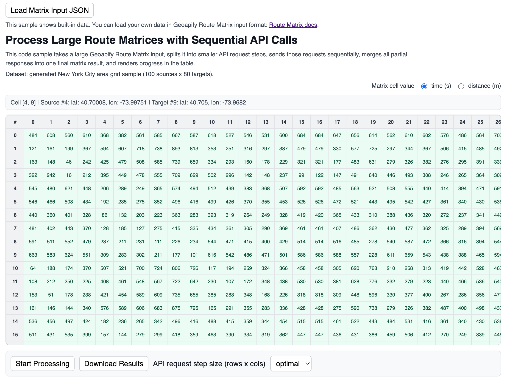

# Process Large Route Matrices with Sequential API Calls

Process large Geoapify Route Matrix inputs by splitting them into smaller API request steps, sending requests sequentially, and combining partial responses into one final matrix result.

## Quick Summary

- Problem: Large source/target matrices can exceed per-request limits. For example, Geoapify Route Matrix API allows up to `1000` matrix elements (`sources x targets`) per request. This limit helps keep request execution predictable, prevents extremely heavy single calls, and supports stable API performance for all users.
- Solution: Split one large matrix into multiple smaller sub-matrices (`rows x cols`), request each sub-matrix sequentially, and merge all partial responses back into one final matrix.
- Stack: HTML, CSS, JavaScript.
- APIs: [Geoapify Route Matrix API](https://www.geoapify.com/route-matrix-api/).

## What This Example Includes

- Built-in generated dataset (NYC area): 100 sources and 80 targets
- Optional JSON input loader (Geoapify Route Matrix request format)
- Matrix step size selector:
  - `optimal` (automatically finds `rows x cols` step sizes with the lowest estimated total API cost under the per-request `1000` element limit)
  - fixed (`10x10`, `20x30`)
  - custom
- Sequential step-by-step matrix processing
- Progress status (`processed / total API calls`) with active API matrix size
- Error logging without stopping the full run
- Matrix cell view switch (`time (s)` / `distance (m)`)
- Cell click-to-copy payload:
  - source
  - destination
  - time
  - distance
- Download final combined result as JSON

## Live Demo

[](https://codepen.io/editor/team/geoapify/pen/019e06ca-65c2-7e21-9e3b-7a9659d3913a)

## Screenshot



## Quick Start

Open [`src/index.html`](./src/index.html) in your browser.

No build step is required.

## Input and Output

- Input:
  - Built-in generated dataset or uploaded JSON in Route Matrix request format
  - Step size strategy (`optimal`, fixed, or custom)
- Output:
  - Live-filled matrix table
  - Per-step progress and API error logs
  - Combined final matrix response
  - Downloadable JSON result

## Matrix Step Size: `optimal`

When `optimal` is selected, the sample evaluates candidate API step sizes and picks the one with the lowest estimated total cost for the full matrix.

Cost per API request is estimated with the Geoapify formula:

`cost = max(sources, targets) × min(sources, targets, 10)`

How it works in this sample:

- Tries many valid `apiRequestRows x apiRequestCols` combinations
- Keeps only combinations where `rows x cols <= 1000`
- Simulates all required sub-matrix requests for each combination
- Sums request costs using the formula above
- Selects the combination with minimal total cost (and prefers larger step area on ties)

## Project Structure

| File | Purpose |
|------|---------|
| `src/index.html` | Source HTML |
| `src/script.js` | Source JavaScript (splitting, sequential calls, merge, progress, exports) |
| `src/style.css` | Source CSS |

## Code Samples

### 1. Process Large Matrix Sequentially

This is the core function that makes the sample work like "one big matrix request", while internally splitting the input into multiple smaller Route Matrix API calls.

What it does:

- Creates a final response skeleton in Route Matrix API response format
- Splits large input into `apiRequestRows x apiRequestCols` sub-matrices
- Sends each sub-matrix request sequentially (`await` in nested loops)
- Merges each partial response into the final matrix
- Calls `onStepProcessed(...)` for UI progress updates
- Calls `onError(...)` for per-step API errors without stopping the full process

```js
async function processLargeMatrixSequential(
  matrixApiRequestData,
  apiRequestRows,
  apiRequestCols,
  onStepProcessed,
  onError
) {
  const combinedResponse = createRouteMatrixResponseSkeleton(matrixApiRequestData);
  const { sources, targets, mode, units } = matrixApiRequestData;
  const rowCount = sources.length;
  const colCount = targets.length;
  let processedSteps = 0;

  for (let sourceIndexStart = 0; sourceIndexStart < rowCount; sourceIndexStart += apiRequestRows) {
    const stepSources = sources.slice(sourceIndexStart, sourceIndexStart + apiRequestRows);

    for (let targetIndexStart = 0; targetIndexStart < colCount; targetIndexStart += apiRequestCols) {
      const stepTargets = targets.slice(targetIndexStart, targetIndexStart + apiRequestCols);
      let stepSourcesToTargets;

      try {
        stepSourcesToTargets = await callGeoapifyRouteMatrixApiSourcesToTargets(
          stepSources,
          stepTargets,
          mode,
          units
        );
      } catch (error) {
        if (typeof onError === "function") {
          onError({
            sourceIndexStart,
            targetIndexStart,
            errorMessage: error.message,
          });
        }
        stepSourcesToTargets = stepSources.map(() => stepTargets.map(() => ({})));
      }

      for (let localSourceIndex = 0; localSourceIndex < stepSourcesToTargets.length; localSourceIndex += 1) {
        const row = stepSourcesToTargets[localSourceIndex];

        for (let localTargetIndex = 0; localTargetIndex < row.length; localTargetIndex += 1) {
          const cell = row[localTargetIndex];
          const globalSourceIndex = sourceIndexStart + localSourceIndex;
          const globalTargetIndex = targetIndexStart + localTargetIndex;

          combinedResponse.sources_to_targets[globalSourceIndex][globalTargetIndex] = {
            distance: cell?.distance ?? null,
            time: cell?.time ?? null,
            source_index: globalSourceIndex,
            target_index: globalTargetIndex,
          };
        }
      }

      processedSteps += 1;
      if (typeof onStepProcessed === "function") {
        onStepProcessed({
          processedSteps,
          sourceIndexStart,
          targetIndexStart,
          stepSourcesToTargets,
        });
      }
    }
  }

  return combinedResponse;
}
```

Related helper functions:

- `createRouteMatrixResponseSkeleton(...)` initializes an empty combined response in Geoapify Route Matrix API response format, so each step can be merged into correct indexes.

```js
function createRouteMatrixResponseSkeleton(matrixInputData) {
  const responseSources = matrixInputData.sources.map((point) => ({
    original_location: [point.lon, point.lat],
    location: [point.lon, point.lat],
  }));

  const responseTargets = matrixInputData.targets.map((point) => ({
    original_location: [point.lon, point.lat],
    location: [point.lon, point.lat],
  }));

  const sourcesToTargets = matrixInputData.sources.map((_, sourceIndex) =>
    matrixInputData.targets.map((__, targetIndex) => ({
      distance: null,
      time: null,
      source_index: sourceIndex,
      target_index: targetIndex,
    }))
  );

  return {
    mode: matrixInputData.mode,
    units: matrixInputData.units,
    distance_units: matrixInputData.units === "imperial" ? "miles" : "meters",
    sources: responseSources,
    targets: responseTargets,
    sources_to_targets: sourcesToTargets,
  };
}
```

### 2. Sending API Request

This function sends one Geoapify Route Matrix API request for a single sub-matrix (`sources` × `targets`) and returns `sources_to_targets`, which is later merged into the final combined matrix.

What it does:

- Builds request payload from source/target points
- Sends `POST` request to `https://api.geoapify.com/v1/routematrix`
- Validates HTTP status and throws detailed errors when request fails
- Parses JSON response
- Validates `sources_to_targets` shape before returning
- Returns only `sources_to_targets` for merge logic in sample `1`

> Note:
> Geoapify Route Matrix API supports additional request parameters and options.
> Examples: `type`, `avoids`, `delay`, `mode`, and other routing options described in the docs.
> Docs: [https://apidocs.geoapify.com/docs/route-matrix/](https://apidocs.geoapify.com/docs/route-matrix/).
> This code sample intentionally uses a minimal request payload to keep focus on the matrix split-and-merge workflow.

```js
async function callGeoapifyRouteMatrixApiSourcesToTargets(
  sources,
  targets,
  mode = "drive",
  units = "metric",
  apiKey = API_KEY_EXECUTION
) {
  const requestBody = {
    mode,
    units,
    sources: sources.map((point) => ({ location: [point.lon, point.lat] })),
    targets: targets.map((point) => ({ location: [point.lon, point.lat] })),
  };

  const requestUrl = `${ROUTE_MATRIX_API_URL}?apiKey=${encodeURIComponent(apiKey)}`;
  const response = await fetch(requestUrl, {
    method: "POST",
    headers: { "Content-Type": "application/json" },
    body: JSON.stringify(requestBody),
  });
  const responseText = await response.text();

  if (!response.ok) {
    throw new Error(`Route Matrix API request failed (${response.status}): ${responseText}`);
  }

  const responseData = JSON.parse(responseText);
  if (!Array.isArray(responseData.sources_to_targets)) {
    throw new Error("Route Matrix API response does not contain 'sources_to_targets'.");
  }

  return responseData.sources_to_targets;
}
```

### 3. Find Optimal Matrix Step Size

This function chooses `apiRequestRows x apiRequestCols` for the `optimal` mode.

It simply sorts through (iterates over) valid step-size combinations, estimates total cost for the full matrix, and picks the cheapest one.

Cost formula used for each API call:

`cost = max(rows, cols) * min(rows, cols, 10)`

What it does:

- Tries candidate `apiRequestRows` values
- Derives the largest valid `apiRequestCols` so `rows * cols <= maxMatrixElements`
- Simulates all sub-matrix requests needed for that candidate
- Sums per-request costs using the formula above
- Keeps the lowest total-cost candidate (tie-breaker: larger step area)

```js
function getOptimalChunkCounts(sourcesCount, targetsCount, maxMatrixElements = 1000) {
  const s = Math.max(1, Math.floor(Number(sourcesCount)));
  const t = Math.max(1, Math.floor(Number(targetsCount)));
  const m = Math.max(1, Math.floor(Number(maxMatrixElements)));

  let best = {
    apiRequestRows: 1,
    apiRequestCols: Math.min(t, m),
    totalCost: Number.POSITIVE_INFINITY,
    stepArea: 0,
  };

  for (let apiRequestRows = 1; apiRequestRows <= Math.min(s, m); apiRequestRows += 1) {
    const apiRequestCols = Math.max(1, Math.min(t, Math.floor(m / apiRequestRows)));
    let totalCost = 0;

    for (let r = 0; r < s; r += apiRequestRows) {
      for (let c = 0; c < t; c += apiRequestCols) {
        const rs = Math.min(apiRequestRows, s - r);
        const cs = Math.min(apiRequestCols, t - c);
        totalCost += Math.max(rs, cs) * Math.min(Math.min(rs, cs), 10);
      }
    }

    const stepArea = apiRequestRows * apiRequestCols;
    if (totalCost < best.totalCost || (totalCost === best.totalCost && stepArea > best.stepArea)) {
      best = { apiRequestRows, apiRequestCols, totalCost, stepArea };
    }
  }

  return { apiRequestRows: best.apiRequestRows, apiRequestCols: best.apiRequestCols };
}
```

## API Endpoint Used

`https://api.geoapify.com/v1/routematrix`

## APIs and Libraries

| Type | Name | Link | API Endpoint Used |
|------|------|------|-------------------|
| API | Geoapify Route Matrix API | [Route Matrix API](https://www.geoapify.com/route-matrix-api/) | `https://api.geoapify.com/v1/routematrix` |
| Library | Browser Fetch API | [MDN Fetch API](https://developer.mozilla.org/en-US/docs/Web/API/Fetch_API) | Not applicable |

## Useful Links

- Geoapify Route Matrix API: [https://www.geoapify.com/route-matrix-api/](https://www.geoapify.com/route-matrix-api/)
- Geoapify API docs: [https://apidocs.geoapify.com/](https://apidocs.geoapify.com/)
- Route Matrix docs: [https://apidocs.geoapify.com/docs/route-matrix/](https://apidocs.geoapify.com/docs/route-matrix/)
- Route Matrix playground: [https://apidocs.geoapify.com/playground/route-matrix/](https://apidocs.geoapify.com/playground/route-matrix/)
- Geoapify CodePen profile: [https://codepen.io/team/geoapify](https://codepen.io/team/geoapify)

## License

MIT
