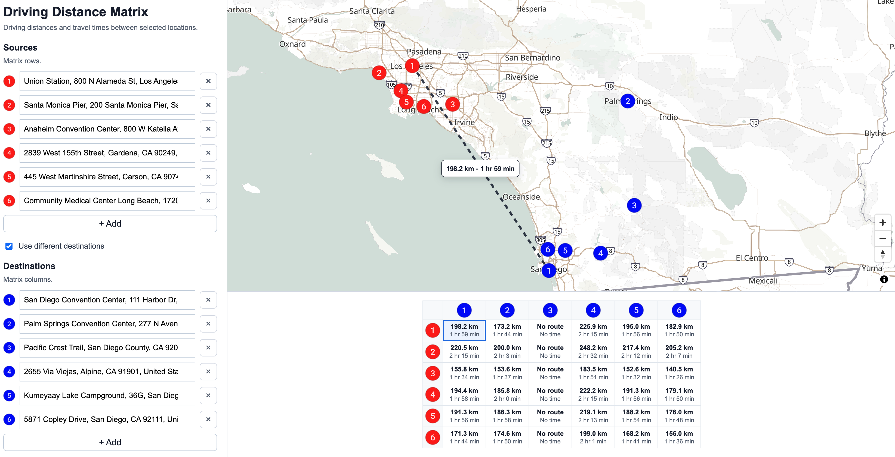

# Calculate Driving Distance Matrix with Geoapify Matrix API and MapLibre

Use Geoapify APIs and MapLibre GL JS to calculate driving distances and travel times between multiple locations, then visualize the selected source-destination pair on an interactive map.

This JavaScript example uses address autocomplete for location input, optional separate destination points, map-click reverse geocoding, Geoapify-generated numbered markers, and a compact distance matrix powered by the Geoapify Matrix API.

## Overview

- Problem: You need driving distance and travel time between several origins and destinations.
- Solution: Use Geoapify Address Autocomplete to collect coordinates, send them to Geoapify Matrix API, and render the returned distance/time values in a matrix table.
- Stack: HTML, CSS, JavaScript, [MapLibre GL JS](https://maplibre.org/maplibre-gl-js/docs/).
- APIs: [Geoapify Matrix API](https://apidocs.geoapify.com/docs/route-matrix/), [Address Autocomplete](https://apidocs.geoapify.com/docs/geocoding/address-autocomplete/), [Reverse Geocoding API](https://apidocs.geoapify.com/docs/geocoding/reverse-geocoding/), [Map Tiles API](https://apidocs.geoapify.com/docs/maps/map-tiles/), [Marker Icon API](https://apidocs.geoapify.com/docs/maps/marker-icon/).

The app supports same-list source-to-source matrices, optional separate destinations, map-click location entry with reverse geocoding, numbered source and destination markers, and matrix cell hover/focus visualization with a dashed line between locations.

## Live Demo

[](https://codepen.io/geoapify/pen/jEyZmOg)

## Screenshot



## Quick Start

Open [`src/index.html`](./src/index.html) in your browser.

No build step is required.

This example includes a demo Geoapify API key. For your own project, create a free API key at [myprojects.geoapify.com](https://myprojects.geoapify.com/) and replace the `yourAPIKey` value in [`src/script.js`](./src/script.js).

## Geoapify API Key

You need a Geoapify API key to use the Matrix API, Address Autocomplete, Reverse Geocoding, Map Tiles, and Marker Icon API.

Create a free API key at [https://myprojects.geoapify.com/](https://myprojects.geoapify.com/), then replace the demo `yourAPIKey` value in [`src/script.js`](./src/script.js).

## Project Structure

| File | Purpose |
|------|---------|
| [`src/index.html`](./src/index.html) | Source HTML |
| [`src/script.js`](./src/script.js) | Source JavaScript for map setup, address inputs, API requests, matrix rendering, and map hover visualization |
| [`src/style.css`](./src/style.css) | Source CSS |

## Key Code Samples

### Create and Send a Matrix API Request

The Matrix API request needs source and target coordinates in `[lon, lat]` order. This snippet builds a driving-distance request from selected locations and sends it to the Geoapify Matrix API.

```js
const apiKey = "YOUR_API_KEY";

async function calculateMatrix(sources, destinations) {
  const requestBody = {
    mode: "drive",
    units: "metric",
    sources: sources.map((location) => ({
      location: [location.lon, location.lat],
    })),
    targets: destinations.map((location) => ({
      location: [location.lon, location.lat],
    })),
  };

  const response = await fetch(`https://api.geoapify.com/v1/routematrix?apiKey=${apiKey}`, {
    method: "POST",
    headers: {
      "Content-Type": "application/json",
    },
    body: JSON.stringify(requestBody),
  });

  if (!response.ok) {
    throw new Error(`Matrix API request failed with status ${response.status}`);
  }

  return response.json();
}
```

How it works:

- `sources` become the matrix rows, and `targets` become the matrix columns.
- `mode: "drive"` tells Geoapify to calculate road-network driving distance and time.
- `units: "metric"` returns distances in meters.
- The response contains `sources_to_targets`, where each cell stores distance and duration for one source-target pair.

### Create Numbered Source and Destination Markers

The example uses Geoapify Marker Icon API to generate numbered circle icons. The same icon URL can be used in the location list, the matrix headers, and MapLibre markers.

```js
const apiKey = "YOUR_API_KEY";

function createMarkerIcon(color, number) {
  const params = new URLSearchParams({
    type: "circle",
    color,
    size: "28",
    contentSize: "16",
    text: String(number),
    scaleFactor: "2",
    apiKey,
  });

  return `https://api.geoapify.com/v2/icon/?${params.toString()}&noShadow&noWhiteCircle`;
}

function createIconImage(iconUrl, altText) {
  const image = document.createElement("img");
  image.src = iconUrl;
  image.alt = altText;
  return image;
}

function addMapMarker(map, location, number, type) {
  const color = type === "destination" ? "blue" : "red";
  const iconUrl = createMarkerIcon(color, number);
  const markerElement = document.createElement("div");

  markerElement.className = "map-marker";
  markerElement.append(createIconImage(iconUrl, `${type} ${number}`));

  return new maplibregl.Marker({
    element: markerElement,
    anchor: "center",
  })
    .setLngLat([location.lon, location.lat])
    .addTo(map);
}
```

How it works:

- Source markers use red icons, and destination markers use blue icons.
- `text` sets the marker number shown inside the generated icon.
- `noShadow` and `noWhiteCircle` keep the icon compact for both the map and matrix headers.
- MapLibre uses the generated image inside a custom DOM marker element.

### Format Distance

The Matrix API returns distance in meters when `units: "metric"` is used. This helper keeps short distances in meters and converts longer distances to kilometers.

```js
function formatDistance(distanceMeters) {
  if (!Number.isFinite(distanceMeters)) {
    return "No route";
  }

  if (distanceMeters >= 1000) {
    return `${(distanceMeters / 1000).toFixed(1)} km`;
  }

  return `${Math.round(distanceMeters)} m`;
}
```

How it works:

- `distanceMeters` comes from a Matrix API cell, for example `matrix.sources_to_targets[sourceIndex][targetIndex].distance`.
- Invalid or missing distances are shown as `No route`.
- Distances below one kilometer are rounded and shown in meters.
- Distances of one kilometer or more are converted to kilometers with one decimal place.

### Format Duration

The Matrix API returns travel time in seconds. This helper formats short trips as minutes and longer trips as hours plus remaining minutes.

```js
function formatDuration(seconds) {
  if (!Number.isFinite(seconds)) {
    return "No time";
  }

  const minutes = Math.round(seconds / 60);
  if (minutes < 60) {
    return `${minutes} min`;
  }

  const hours = Math.floor(minutes / 60);
  const remainingMinutes = minutes % 60;
  return `${hours} hr ${remainingMinutes} min`;
}
```

How it works:

- `seconds` comes from a Matrix API cell, for example `matrix.sources_to_targets[sourceIndex][targetIndex].time`.
- Invalid or missing values are shown as `No time`.
- Values under one hour are rounded to minutes.
- Longer durations are split into whole hours and remaining minutes.

### Add a Location on Map Click and Create Autocomplete Rows

When the user clicks the map, keep the original clicked coordinates for routing calculations and use Geoapify Reverse Geocoding only to create a readable label for the UI. The same list renderer also creates a Geoapify Geocoder Autocomplete control for each location row.

```js
const apiKey = "YOUR_API_KEY";

function renderLocationRows(container, locations) {
  container.replaceChildren();

  locations.forEach((location, index) => {
    const rowElement = document.createElement("div");
    const autocompleteHost = document.createElement("div");

    rowElement.className = "location-row";
    autocompleteHost.className = "autocomplete-host";
    rowElement.append(autocompleteHost);
    container.append(rowElement);

    const autocompleteInput = new autocomplete.GeocoderAutocomplete(
      autocompleteHost,
      apiKey,
      {
        placeholder: "Enter address",
      },
    );

    autocompleteInput.on("select", (selectedLocation) => {
      if (!selectedLocation) {
        return;
      }

      locations[index] = {
        label: selectedLocation.properties.formatted,
        lat: selectedLocation.properties.lat,
        lon: selectedLocation.properties.lon,
      };
    });

    const textInput = autocompleteHost.querySelector("input");
    if (textInput) {
      textInput.value = location.label;
    }
  });
}

async function getAddressForMapClick(lngLat) {
  const clickedPoint = {
    lat: Number(lngLat.lat.toFixed(6)),
    lon: Number(lngLat.lng.toFixed(6)),
  };

  const params = new URLSearchParams({
    lat: String(clickedPoint.lat),
    lon: String(clickedPoint.lon),
    apiKey,
  });

  const response = await fetch(`https://api.geoapify.com/v1/geocode/reverse?${params}`);

  if (!response.ok) {
    throw new Error(`Reverse Geocoding request failed with status ${response.status}`);
  }

  const result = await response.json();
  const feature = result.features && result.features[0];
  const properties = feature && feature.properties;

  return {
    label: properties && (properties.formatted || properties.address_line1)
      || `${clickedPoint.lat.toFixed(5)}, ${clickedPoint.lon.toFixed(5)}`,
    lat: clickedPoint.lat,
    lon: clickedPoint.lon,
  };
}

function addLocationRow(locations, location) {
  const emptyRow = locations.find((row) => !Number.isFinite(row.lat) && !row.label.trim());

  if (emptyRow) {
    emptyRow.label = location.label;
    emptyRow.lat = location.lat;
    emptyRow.lon = location.lon;
    return;
  }

  locations.push(location);
}

map.on("click", async (event) => {
  const location = await getAddressForMapClick(event.lngLat);
  addLocationRow(sourceLocations, location);
  renderLocationRows(sourceListElement, sourceLocations);
});
```

How it works:

- `renderLocationRows()` creates a fresh autocomplete host for each row and attaches `new autocomplete.GeocoderAutocomplete(...)` dynamically.
- The autocomplete `select` event stores the selected address label and coordinates in the matching row.
- `event.lngLat` contains the original map click coordinates.
- Reverse Geocoding turns those coordinates into a display label.
- The returned row keeps the original click coordinates instead of replacing them with reverse-geocoded feature coordinates.
- `addLocationRow()` fills the first empty UI row or appends a new location, then the list is rendered again with autocomplete controls.

## APIs and Libraries

| Name | Description | Documentation | Used In This Example |
|------|-------------|---------------|----------------------|
| Geoapify Matrix API | Calculates driving distance and travel time between source and destination coordinate pairs | [Docs](https://apidocs.geoapify.com/docs/route-matrix/) | Builds the distance/time matrix |
| Geoapify Address Autocomplete | Converts typed address input into selected address features with coordinates | [Docs](https://apidocs.geoapify.com/docs/geocoding/address-autocomplete/) | Powers source and destination address fields |
| Geoapify Reverse Geocoding API | Converts clicked map coordinates into a readable address label | [Docs](https://apidocs.geoapify.com/docs/geocoding/reverse-geocoding/) | Adds map-click locations while preserving clicked coordinates |
| Geoapify Map Tiles API | Provides the MapLibre map style and tiles | [Docs](https://apidocs.geoapify.com/docs/maps/map-tiles/) | Displays the base map |
| Geoapify Marker Icon API | Generates numbered marker icons | [Docs](https://apidocs.geoapify.com/docs/maps/marker-icon/) | Shows matching source/destination icons in the list, matrix, and map |
| MapLibre GL JS | Renders the interactive web map and hover line layer | [Docs](https://maplibre.org/maplibre-gl-js/docs/) | Displays markers and highlights selected matrix pairs |

## Related Code Samples

| Code Sample | Why It Is Related |
|-------------|-------------------|
| [Process Large Route Matrices with Sequential API Calls](https://github.com/geoapify/geoapify-quickstart-examples/tree/main/matrix-api/calculate-big-matrices-sequential) | Shows how to split large Matrix API requests into smaller sequential calls |
| [MapLibre + Geoapify Map Tiles Starter](https://github.com/geoapify/geoapify-quickstart-examples/tree/main/maps/maplibre-geoapify-map-tiles-starter) | Basic MapLibre setup with Geoapify map tiles |
| [MapLibre GL Integration: Vector Maps and Reverse Geocoding on Click](https://github.com/geoapify/geoapify-quickstart-examples/tree/main/geocoder-autocomplete/maplibre-gl-integration-vector-maps-and-reverse-geocoding-on-click) | Demonstrates MapLibre click handling with Geoapify Reverse Geocoding |
| [MapLibre Custom Markers and Popups with Geoapify Place Details](https://github.com/geoapify/geoapify-quickstart-examples/tree/main/maps/maplibre-custom-markers-popups-with-geoapify-place-details) | Shows custom MapLibre markers and popup rendering |

## Useful Links

- [Geoapify Location Platform](https://www.geoapify.com/)
- [Geoapify Matrix API](https://www.geoapify.com/matrix-api/)
- [Geoapify Geocoding API](https://www.geoapify.com/geocoding-api/)
- [Geoapify Map Tiles](https://www.geoapify.com/map-tiles/)
- [Geoapify Pricing](https://www.geoapify.com/pricing/)

## License

MIT
