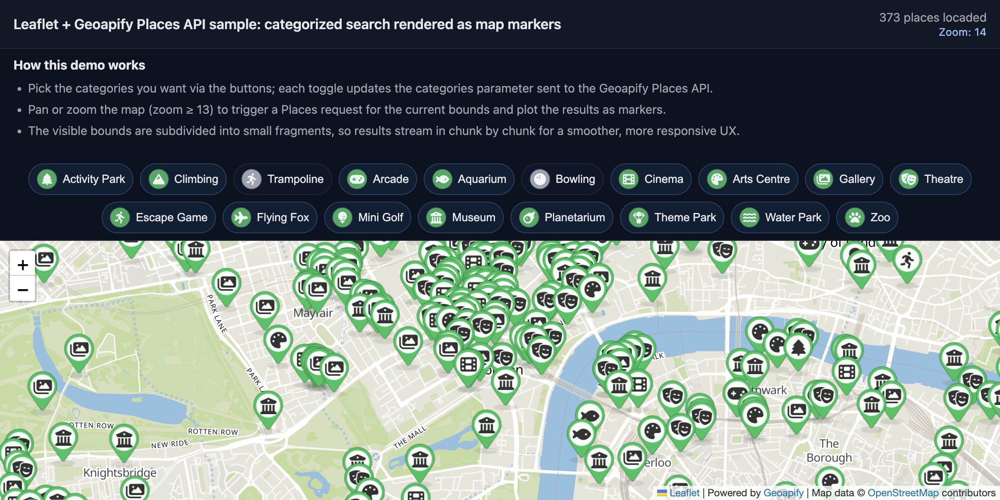
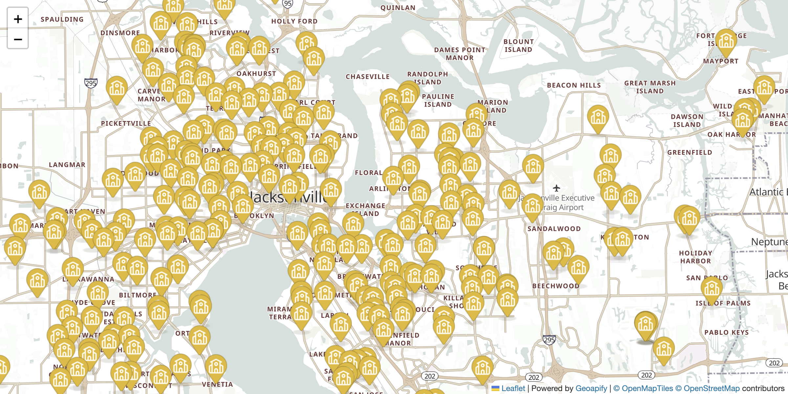

# Geoapify Places API Code Examples

Use Geoapify Places API examples to search points of interest by category, visualize places on maps, and build nearby place search interfaces.

## Overview

This folder contains browser-based JavaScript examples for Places API category search, nearest-place lookup, dynamic markers, and GeoJSON point rendering. Each example includes source code, a screenshot, and a focused README with setup notes and code samples.

## API Resources

## Live Demo

Each CodePen demo is linked from the `Live Demo` column in the code examples table.

## Code Examples

| Screenshot | Example | Description | Source Code | Live Demo |
|------------|---------|-------------|-------------|-----------|
|  | Leaflet Demo: Geoapify Places API Category Search with Dynamic Markers | Search for places by multiple categories on map pan and zoom with toggle buttons, rate-limited requests, and dynamic markers. | [Open example](https://github.com/geoapify/geoapify-quickstart-examples/tree/main/places-api/leaflet-demo-geoapify-places-api-category-search-with-dynamic-markers/) | [CodePen](https://codepen.io/geoapify/pen/MYKRMBr) |
|  | Nearby Restaurant Search on a MapLibre Map with Geoapify Places API | Search the 20 nearest restaurants from a clicked map point and display cuisine-based custom markers with place details. | [Open example](https://github.com/geoapify/geoapify-quickstart-examples/tree/main/places-api/maplibre-nearest-restaurants-with-type-markers/) | [CodePen](https://codepen.io/geoapify/pen/emgBqMw) |
|  | Visualizing GeoJSON Points with Leaflet and Geoapify Places API | Fetch places by category from Geoapify Places API and display them as Leaflet markers with custom icons and popups. | [Open example](https://github.com/geoapify/geoapify-quickstart-examples/tree/main/places-api/visualizing-geojson-points-with-leaflet-and-geoapify-places-api/) | [CodePen](https://codepen.io/geoapify/pen/zxraMEp) |

## Geoapify API Key

These examples include demo Geoapify API keys for quick testing. For your own project, create a free API key at [myprojects.geoapify.com](https://myprojects.geoapify.com/) and replace the example key in the relevant `src/script.js` file.

## APIs and Libraries

| Name | Description | Documentation | Used In This Example |
|------|-------------|---------------|----------------------|
| Geoapify Places API | Searches places and points of interest by category, geometry, radius, and proximity. | [Places API docs](https://apidocs.geoapify.com/docs/places/) | [Leaflet Category Search](./leaflet-demo-geoapify-places-api-category-search-with-dynamic-markers/), [Nearby Restaurant Search](./maplibre-nearest-restaurants-with-type-markers/), [Visualizing GeoJSON Points](./visualizing-geojson-points-with-leaflet-and-geoapify-places-api/) |
| Geoapify Marker Icon API | Generates custom place markers and category icons. | [Marker Icon docs](https://apidocs.geoapify.com/docs/icon/) | [Leaflet Category Search](./leaflet-demo-geoapify-places-api-category-search-with-dynamic-markers/), [Nearby Restaurant Search](./maplibre-nearest-restaurants-with-type-markers/), [Visualizing GeoJSON Points](./visualizing-geojson-points-with-leaflet-and-geoapify-places-api/) |
| Geoapify Map Tiles API | Provides map styles and tiles for Leaflet and MapLibre examples. | [Map Tiles docs](https://apidocs.geoapify.com/docs/maps/map-tiles/) | [Leaflet Category Search](./leaflet-demo-geoapify-places-api-category-search-with-dynamic-markers/), [Nearby Restaurant Search](./maplibre-nearest-restaurants-with-type-markers/), [Visualizing GeoJSON Points](./visualizing-geojson-points-with-leaflet-and-geoapify-places-api/) |
| Leaflet | Renders interactive raster-tile maps and markers. | [Leaflet docs](https://leafletjs.com/) | [Leaflet Category Search](./leaflet-demo-geoapify-places-api-category-search-with-dynamic-markers/), [Visualizing GeoJSON Points](./visualizing-geojson-points-with-leaflet-and-geoapify-places-api/) |
| MapLibre GL JS | Renders interactive vector maps in browser examples. | [MapLibre GL JS docs](https://maplibre.org/maplibre-gl-js/docs/) | [Nearby Restaurant Search](./maplibre-nearest-restaurants-with-type-markers/) |

## Useful Links

- Geoapify API documentation: [https://apidocs.geoapify.com/](https://apidocs.geoapify.com/)
- Geoapify projects and API keys: [https://myprojects.geoapify.com/](https://myprojects.geoapify.com/)
- Geoapify CodePen examples: [https://codepen.io/geoapify](https://codepen.io/geoapify)
