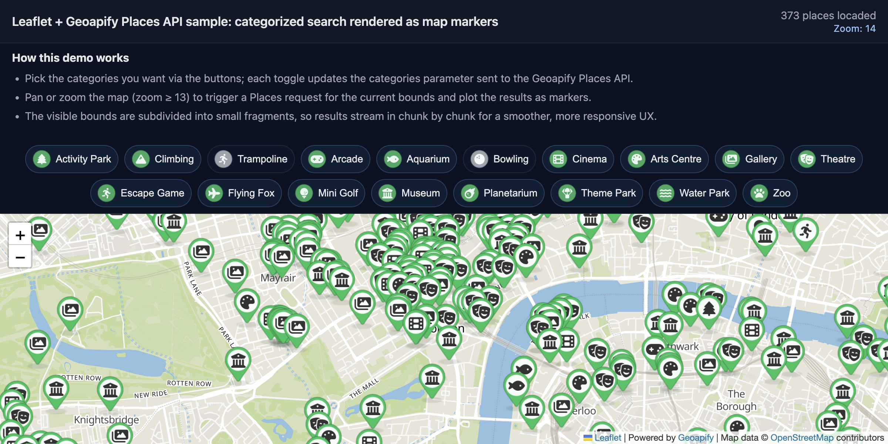

# Leaflet Demo: Geoapify Places API Category Search with Dynamic Markers

Search for places by multiple categories on map pan/zoom with toggle buttons, rate-limited API calls, and dynamic marker rendering.

## Quick Summary

- Problem: Allow users to explore places across multiple categories while panning/zooming the map.
- Solution: Implement category toggles, viewport-based search with grid fragmentation, and rate-limited API calls.
- Stack: HTML, CSS, JavaScript, Leaflet.
- APIs: Geoapify Places API, Geoapify Marker Icon API, Geoapify Map Tiles API.

## What This Example Includes

- Leaflet map with Geoapify raster tiles
- Category toggle buttons with icons
- Viewport-based place search on map move
- Grid fragmentation for large viewports
- Rate-limited concurrent API requests
- Accumulating results (no duplicates)
- Custom markers with category-specific icons
- Popups with place details
- Source-based run from `src/index.html` (no build step)

## Use Cases

- Build interactive POI explorers with multiple categories.
- Create neighborhood discovery tools.
- Learn advanced API integration patterns with rate limiting.

## Live Demo

[](https://codepen.io/geoapify/pen/MYKRMBr)

## Screenshot



## Quick Start

Open [`src/index.html`](./src/index.html) in your browser.

No local server is required.

Note: In rare cases, browser policies or extensions can restrict `file://` access. If that happens, run a local static server and open `src/index.html` via `http://localhost`, or use your IDE's "Open with Live Server" (or similar) option.

## Input and Output

- Input: Selected categories (toggle buttons), map viewport, zoom level, Geoapify API key.
- Output: Markers for places in selected categories, popups with name/address/categories.

## Project Structure

| File | Purpose |
|------|---------|
| `src/index.html` | Source HTML |
| `src/script.js` | Source JavaScript (Places API, rate limiting, rendering) |
| `src/style.css` | Source CSS |

## Code Samples

### Minimal HTML

```html
<!DOCTYPE html>
<html lang="en">
<head>
  <meta charset="UTF-8">
  <title>Places Category Search</title>
  <link rel="stylesheet" href="https://unpkg.com/leaflet@1.9.4/dist/leaflet.css">
  <style>
    #map { height: 500px; }
    .toggle-btn { padding: 8px 16px; margin: 4px; cursor: pointer; }
    .toggle-btn.active { background: #22c55e; color: white; }
  </style>
</head>
<body>
  <div id="controls"></div>
  <div id="map"></div>
  <script src="https://unpkg.com/leaflet@1.9.4/dist/leaflet.js"></script>
  <script src="script.js"></script>
</body>
</html>
```

### Minimal JavaScript

```js
// Demo API key for quickstart only.
// Register for your own free API key at https://myprojects.geoapify.com/.
// Benefits: usage analytics, project-level limits, and reliable access for production use.
// This demo key can be blocked or restricted at any time.
const yourAPIKey = "YOUR_API_KEY";

const map = L.map("map").setView([48.8566, 2.3522], 14);
L.tileLayer(`https://maps.geoapify.com/v1/tile/osm-bright/{z}/{x}/{y}.png?apiKey=${yourAPIKey}`).addTo(map);

const categories = ["entertainment.cinema", "entertainment.museum"];
let markers = [];

function iconUrl(icon, color) {
  return `https://api.geoapify.com/v2/icon/?type=awesome&color=${encodeURIComponent(color)}&icon=${icon}&apiKey=${yourAPIKey}`;
}

async function searchPlaces() {
  markers.forEach((m) => m.remove());
  markers = [];
  const bounds = map.getBounds();
  const rect = `${bounds.getWest()},${bounds.getSouth()},${bounds.getEast()},${bounds.getNorth()}`;
  const url = `https://api.geoapify.com/v2/places?categories=${categories.join(",")}&filter=rect:${rect}&limit=100&apiKey=${yourAPIKey}`;
  const res = await fetch(url);
  const data = await res.json();
  data.features.forEach((f) => {
    const icon = L.icon({ iconUrl: iconUrl("star", "#22c55e"), iconSize: [36, 53], iconAnchor: [18, 48] });
    const m = L.marker([f.properties.lat, f.properties.lon], { icon }).addTo(map);
    m.bindPopup(f.properties.name || f.properties.formatted);
    markers.push(m);
  });
}

map.on("moveend", searchPlaces);
searchPlaces();
```

## Customize

1. Open [`src/script.js`](./src/script.js).
2. Set your own API key in `yourAPIKey`.
3. Modify `CATEGORY_CONFIG` to add/change categories.
4. Adjust `MIN_SEARCH_ZOOM` for different zoom thresholds.
5. Change `SEARCH_DELAY_MS` for different debounce timing.

API documentation:
- [Geoapify Places API](https://apidocs.geoapify.com/docs/places/)
- [Geoapify Map Tiles API](https://apidocs.geoapify.com/docs/maps/map-tiles/)
- [Geoapify Marker Icon API](https://apidocs.geoapify.com/docs/icon/)

No build step is required. Edit files in `src/` and refresh the browser.

## Troubleshooting

| Problem | Likely Cause | What to Do |
|---------|--------------|------------|
| Map is blank or tiles missing | Leaflet CSS/JS failed to load | Open browser DevTools (`Console` + `Network`) and confirm CDN files load without errors. |
| Map does not load data / API responds `403` | API key is invalid, restricted, or over limits | Get your own free key at `https://myprojects.geoapify.com/`, then update `yourAPIKey` in `src/script.js`. |
| Works inconsistently from local file | Browser policy blocks some `file://` behavior | Open with IDE Live Server (or any local static server) and run from `http://localhost`. |
| Output differs from expected | Local edits introduced a regression | Compare your files with the [CodePen demo](https://codepen.io/geoapify/pen/MYKRMBr) and align differences step by step. |

## APIs and Libraries

| Type | Name | Link | API Endpoint Used |
|------|------|------|-------------------|
| API | Geoapify Places API | [Places API](https://www.geoapify.com/places-api/) | `https://api.geoapify.com/v2/places?categories=...&filter=rect:...&limit=...&apiKey=...` |
| API | Geoapify Marker Icon API | [Marker Icon API](https://www.geoapify.com/map-marker-icon-api/) | `https://api.geoapify.com/v2/icon/?type=awesome&...&apiKey=...` |
| API | Geoapify Map Tiles API | [Map Tiles API](https://www.geoapify.com/map-tiles/) | `https://maps.geoapify.com/v1/tile/klokantech-basic/{z}/{x}/{y}.png?apiKey=...` |
| Library | Leaflet | [leafletjs.com](https://leafletjs.com/) | Not applicable |

## Related Examples

| Example | Description | Link |
|---------|-------------|------|
| Places GeoJSON Points | Basic places visualization | [Open](../visualizing-geojson-points-with-leaflet-and-geoapify-places-api) |
| Custom Markers MapLibre | Place details with custom markers | [Open](../../maps/maplibre-custom-markers-popups-with-geoapify-place-details) |
| Geocoder Autocomplete | Address search with places | [Open](../../geocoder-autocomplete/leaflet-built-in-places-list-category-search-with-default-ui) |

## Useful Links

- Geoapify API docs: [https://apidocs.geoapify.com/](https://apidocs.geoapify.com/)
- CodePen demo: [https://codepen.io/geoapify/pen/MYKRMBr](https://codepen.io/geoapify/pen/MYKRMBr)
- Geoapify CodePen profile: [https://codepen.io/geoapify](https://codepen.io/geoapify)

## License

MIT

**Keywords**: Places API, category search, toggle buttons, dynamic markers, viewport search, rate limiting, POI explorer
