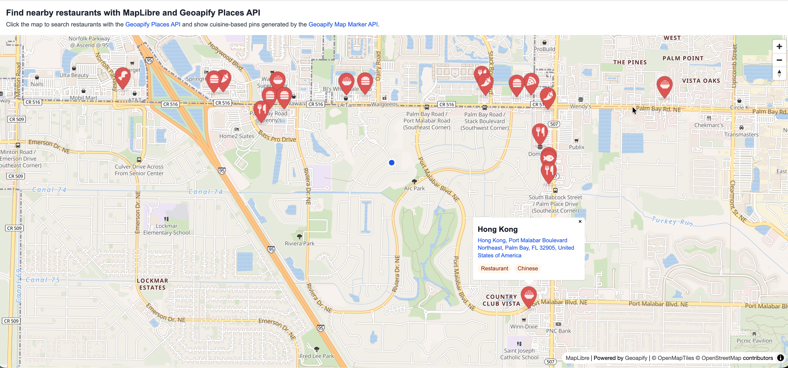

# Nearby Restaurant Search on a MapLibre Map with Geoapify Places API

Build an interactive [MapLibre](https://maplibre.org/) restaurant finder that searches the 20 nearest restaurants with the [Geoapify Places API](https://www.geoapify.com/places-api/) and displays cuisine-based custom markers from the [Geoapify Map Marker API](https://www.geoapify.com/map-marker-icon-api/). Click any point on the map to move the search center, reload nearby restaurant results, and inspect each place with address, categories, and directions links.

## Overview

This example shows how to combine [MapLibre GL JS](https://maplibre.org/maplibre-gl-js/docs/) with Geoapify APIs to create a click-to-search restaurant map.

How it works:

- The map starts at a default location and shows the current search point with a simple blue circle marker.
- When a user clicks the map, the sample moves the search point to the clicked coordinates.
- The app requests the 20 nearest restaurants within a 10 km radius using the [Geoapify Places API](https://www.geoapify.com/places-api/).
- Restaurant categories returned by the Places API are matched to cuisine icons such as burgers, pizza, sushi, seafood, tacos, barbecue, and Asian food.
- The marker images are generated with the [Geoapify Map Marker API](https://www.geoapify.com/map-marker-icon-api/) and rendered as custom MapLibre markers.
- Each restaurant marker opens a popup with the place name, address, category tags, and a Google Maps directions link.
- The map view adjusts when needed so the search point and restaurant results remain visible.

## Live Demo

[](https://codepen.io/geoapify/pen/emgBqMw)

## Screenshot



## Quick Start

Open [`src/index.html`](./src/index.html) in your browser.

No local server is required.

Note: In rare cases, browser policies or extensions can restrict `file://` access. If that happens, run a local static server and open [`src/index.html`](./src/index.html) via `http://localhost`, or use your IDE's "Open with Live Server" option.

## Geoapify API Key

This example includes a demo API key for quick preview. For your own projects, create a free Geoapify API key in [Geoapify My Projects](https://myprojects.geoapify.com/). No credit card is required.

After creating a key:

1. Open [`src/script.js`](./src/script.js).
2. Replace the value of `apiKey` with your API key.
3. Refresh [`src/index.html`](./src/index.html).

Using your own key gives you access to project settings, usage statistics, and production-ready request limits.

## Code Samples

### 1. Initialize a MapLibre Map with Geoapify Tiles

This code creates a MapLibre map and loads a Geoapify vector map style. Add it to [`src/script.js`](./src/script.js) after defining your API key.

```js
const apiKey = "YOUR_API_KEY";
const initialMapCenter = [-80.60447455917023, 28.07327131169214];

const map = new maplibregl.Map({
  container: "map",
  style: `https://maps.geoapify.com/v1/styles/osm-bright/style.json?apiKey=${apiKey}`,
  center: initialMapCenter,
  zoom: 13
});

map.addControl(new maplibregl.NavigationControl(), "top-right");
```

How it works:

- `container: "map"` connects MapLibre to the `<div id="map">` element in [`src/index.html`](./src/index.html).
- The `style` URL loads Geoapify vector map tiles with the `osm-bright` style and passes the API key as a query parameter.
- `center` sets the initial map location as `[longitude, latitude]`.
- `zoom` controls the starting map scale.
- `NavigationControl` adds zoom and rotation controls to the map.

### 2. Search Nearby Restaurants with Geoapify Places API

This code builds a Places API URL for restaurant search around the current search point. It requests up to 20 restaurants within a 10 km radius and biases the results toward the selected location.

```js
let searchCenter = initialMapCenter;

function loadNearbyRestaurants() {
  const requestCenter = [...searchCenter];
  const nearbyRestaurantsUrl = `https://api.geoapify.com/v2/places?categories=catering.restaurant&filter=circle:${requestCenter[0]},${requestCenter[1]},10000&bias=proximity:${requestCenter[0]},${requestCenter[1]}&limit=20&apiKey=${apiKey}`;

  fetch(nearbyRestaurantsUrl)
    .then(response => response.json())
    .then(restaurantsData => {
      showRestaurants(restaurantsData.features || [], requestCenter);
    });
}
```

How it works:

- `categories=catering.restaurant` limits the search to restaurant places.
- `filter=circle:longitude,latitude,10000` searches inside a 10 km circle around the selected point.
- `bias=proximity:longitude,latitude` ranks results closer to the selected point higher.
- `limit=20` keeps the response focused on the nearest 20 restaurants.
- The Places API returns GeoJSON features that can be rendered directly as map markers.

### 3. Build Geoapify Restaurant Marker URLs

This helper creates a Geoapify Map Marker API URL for each restaurant marker. The generated PNG uses a material-style pin and an Awesome icon as the marker content.

```js
function restaurantMarkerIconUrl(iconName) {
  return `https://api.geoapify.com/v2/icon/?type=material&color=%23E35D5B&size=50&iconType=awesome&icon=${iconName}&contentSize=20&scaleFactor=2&noWhiteCircle&apiKey=${apiKey}`;
}
```

How it works:

- `type=material` selects the material pin shape.
- `color=%23E35D5B` sets the marker color. `%23` is the encoded `#` character.
- `size=50` requests the marker size used by this example.
- `iconType=awesome` and `icon=${iconName}` place a Font Awesome-style symbol inside the marker.
- `noWhiteCircle` removes the default white circle behind the content icon.
- `scaleFactor=2` requests a higher-resolution marker image for sharper display.

### 4. Create MapLibre Markers from Restaurant Categories

This code chooses a marker content icon from the restaurant categories returned by the Places API, then creates a custom DOM marker for MapLibre.

```js
const restaurantIconCategories = {
  "burger": [
    "catering.restaurant.american",
    "catering.restaurant.burger"
  ],
  "pizza-slice": [
    "catering.restaurant.italian",
    "catering.restaurant.pizza"
  ],
  "fish": [
    "catering.restaurant.fish",
    "catering.restaurant.japanese",
    "catering.restaurant.sushi"
  ],
  "bowl-rice": [
    "catering.restaurant.asian",
    "catering.restaurant.chinese",
    "catering.restaurant.thai"
  ]
};

function getRestaurantIconName(categories) {
  if (!Array.isArray(categories)) {
    return "utensils";
  }

  const categorySet = new Set(categories);

  for (const iconName of Object.keys(restaurantIconCategories)) {
    const iconCategories = restaurantIconCategories[iconName];

    if (iconCategories.some(category => categorySet.has(category))) {
      return iconName;
    }
  }

  return "utensils";
}

function createRestaurantMarker(categories) {
  const markerElement = document.createElement("div");
  markerElement.className = "restaurant-marker";

  const markerIcon = document.createElement("img");
  markerIcon.src = restaurantMarkerIconUrl(getRestaurantIconName(categories));
  markerIcon.alt = "Restaurant";

  markerElement.appendChild(markerIcon);

  return markerElement;
}
```

How it works:

- `restaurantIconCategories` maps cuisine-related Places API categories to marker content icons.
- `getRestaurantIconName()` checks the categories returned for a place and returns the first matching icon.
- If no specific cuisine category matches, the fallback icon is `utensils`.
- `createRestaurantMarker()` builds the DOM element that MapLibre uses as a custom marker.
- The `` source points to the marker PNG generated by the Geoapify Map Marker API.

### 5. Add Restaurant Popups

This code renders each restaurant as a MapLibre marker and attaches a popup with the restaurant name, address, category tags, and a Google Maps directions link. The address formatting and directions URL helpers are defined in [`src/script.js`](./src/script.js).

```js
function showRestaurants(restaurants, requestCenter) {
  restaurants.forEach(restaurant => {
    const coordinates = restaurant.geometry.coordinates;
    const properties = restaurant.properties || {};
    const markerElement = createRestaurantMarker(properties.categories);

    new maplibregl.Marker({
      element: markerElement,
      anchor: "bottom",
      offset: [0, 5]
    })
      .setLngLat(coordinates)
      .setPopup(
        new maplibregl.Popup({
          offset: 58,
          focusAfterOpen: false
        })
          .setDOMContent(createRestaurantPopup(properties, coordinates, requestCenter))
      )
      .addTo(map);
  });
}

function createRestaurantPopup(properties, coordinates, requestCenter) {
  const popupContent = document.createElement("article");
  popupContent.className = "restaurant-popup";

  const title = document.createElement("h2");
  title.textContent = properties.name || "Restaurant";
  popupContent.appendChild(title);

  const address = document.createElement("a");
  address.className = "restaurant-popup__address";
  address.href = googleMapsDirectionsUrl(coordinates, requestCenter);
  address.target = "_blank";
  address.rel = "noopener";
  address.textContent = getRestaurantAddress(properties);
  popupContent.appendChild(address);

  return popupContent;
}
```

How it works:

- `showRestaurants()` loops through GeoJSON features returned by the Places API.
- `restaurant.geometry.coordinates` provides the marker position as `[longitude, latitude]`.
- `anchor: "bottom"` pins the bottom of the marker image to the restaurant coordinate.
- The popup uses `setDOMContent()` so the sample can create structured popup content with DOM APIs.
- `focusAfterOpen: false` prevents the address link from receiving focus automatically when the popup opens.

### 6. Update the Search Point on Map Click

This code moves the search point when the map is clicked and reloads restaurants around the new coordinates. It ignores clicks on existing markers and popups so opening a popup does not start a new search.

```js
let searchCenter = initialMapCenter;

const centerMarker = document.createElement("div");
centerMarker.className = "center-marker";

const centerLocationMarker = new maplibregl.Marker({
  element: centerMarker,
  anchor: "center"
})
  .setLngLat(searchCenter)
  .addTo(map);

map.on("click", event => {
  if (isMarkerOrPopupClick(event.originalEvent.target)) {
    return;
  }

  searchCenter = [event.lngLat.lng, event.lngLat.lat];
  centerLocationMarker.setLngLat(searchCenter);
  loadNearbyRestaurants();
});

function isMarkerOrPopupClick(target) {
  return target.closest(".maplibregl-marker, .maplibregl-popup");
}
```

How it works:

- `searchCenter` stores the current point used by the Places API request.
- `centerLocationMarker` is a simple custom marker that displays the current search point.
- MapLibre click events provide clicked coordinates through `event.lngLat`.
- The marker is moved with `setLngLat()` before the restaurant search runs again.
- `isMarkerOrPopupClick()` prevents marker and popup clicks from being treated as map-search clicks.

### 7. Fit the Map View to Restaurant Results

This helper checks whether the current search point and restaurant results fit in the visible map. If any point is outside the viewport, it adjusts the map bounds.

```js
function fitMapToPlacesIfNeeded(restaurants, requestCenter) {
  const coordinates = [
    requestCenter,
    ...restaurants.map(restaurant => restaurant.geometry.coordinates)
  ];

  if (coordinates.length < 2 || coordinates.every(coordinate => map.getBounds().contains(coordinate))) {
    return;
  }

  const bounds = coordinates.reduce((mapBounds, coordinate) => {
    return mapBounds.extend(coordinate);
  }, new maplibregl.LngLatBounds(coordinates[0], coordinates[0]));

  map.fitBounds(bounds, {
    padding: 64,
    maxZoom: 14,
    duration: 500
  });
}
```

How it works:

- The `coordinates` array includes both the search point and every returned restaurant coordinate.
- `map.getBounds().contains(coordinate)` checks whether each point is already visible.
- `LngLatBounds` grows to include every coordinate when the current map view is too tight.
- `fitBounds()` pans and zooms the map so the search point and restaurant markers fit with padding.
- `maxZoom: 14` prevents the map from zooming in too far when results are close together.

## Troubleshooting

| Problem | What to Check |
| --- | --- |
| Map is not visible | Check that the MapLibre GL JS library and CSS are loaded, the `#map` element has height, and the Geoapify API key is correct. |
| Map tiles do not load | Inspect the browser network tab for failed `maps.geoapify.com` requests. Verify that the API key is valid and allowed to use Geoapify map tiles. |
| Marker icons look corrupted | Check that the Map Marker API URL parameters are valid. Open the generated icon URL directly in your browser, or test the parameters in the [Geoapify Icon API Playground](https://apidocs.geoapify.com/playground/icon/). |
| No restaurants are shown | Check that the API key is valid and inspect messages in the browser developer tools console and network tab. |
| Places API returns an empty result | Try another map location, increase the search radius, or confirm that `categories=catering.restaurant` is used correctly. |
| Clicking the map does not update results | Check that the click handler is registered and that the browser console has no JavaScript errors. |
| Popups or markers appear in the wrong place | Confirm that coordinates are passed as `[longitude, latitude]`, which is the order expected by MapLibre and GeoJSON. |
| Google Maps directions open from the wrong origin | Confirm that the current search point is passed to the directions URL builder after each map click. |

## APIs and Libraries

| Name | Description | Documentation | Used In This Example |
| --- | --- | --- | --- |
| Geoapify Places API | Searches places and returns restaurant results as GeoJSON features. | [Places API docs](https://apidocs.geoapify.com/docs/places/) | Requests the 20 nearest restaurants within 10 km of the selected map point. |
| Geoapify Map Marker API | Generates custom PNG marker icons from URL parameters such as marker shape, color, content icon, and scale factor. | [Map Marker API docs](https://apidocs.geoapify.com/docs/icon/) | Creates cuisine-based restaurant marker icons with material pins and Awesome content icons. |
| Geoapify Map Tiles | Provides the vector map style used by MapLibre GL JS. | [Map Tiles docs](https://apidocs.geoapify.com/docs/maps/) | Loads the `osm-bright` map style from `maps.geoapify.com`. |
| MapLibre GL JS | Open-source JavaScript library for rendering interactive vector maps in the browser. | [MapLibre GL JS docs](https://maplibre.org/maplibre-gl-js/docs/) | Renders the map, navigation controls, custom markers, popups, click handling, and viewport fitting. |

## Related Examples

| Example | Description | Link |
| --- | --- | --- |
| Places API with Dynamic Markers | Leaflet category search with custom Geoapify marker icons. | [Open](https://github.com/geoapify/geoapify-quickstart-examples/tree/main/places-api/leaflet-demo-geoapify-places-api-category-search-with-dynamic-markers) |
| Visualize GeoJSON Points | Basic Places API GeoJSON point rendering on a Leaflet map. | [Open](https://github.com/geoapify/geoapify-quickstart-examples/tree/main/places-api/visualizing-geojson-points-with-leaflet-and-geoapify-places-api) |
| MapLibre Custom Markers and Popups | MapLibre custom marker and popup patterns with Geoapify place details. | [Open](https://github.com/geoapify/geoapify-quickstart-examples/tree/main/maps/maplibre-custom-markers-popups-with-geoapify-place-details) |
| MapLibre Map Tiles Starter | Minimal MapLibre GL JS setup with Geoapify vector map tiles. | [Open](https://github.com/geoapify/geoapify-quickstart-examples/tree/main/maps/maplibre-geoapify-map-tiles-starter) |
| Leaflet Priority Markers | Custom Geoapify Marker Icon API pins with different marker styles and priorities. | [Open](https://github.com/geoapify/geoapify-quickstart-examples/tree/main/maps/leaflet-priority-markers-with-geoapify-marker-icon-api) |

## Useful Links

- [Geoapify](https://www.geoapify.com/) - learn more about Geoapify APIs and location services
- [Geoapify Places API](https://www.geoapify.com/places-api/)
- [Geoapify Map Marker API](https://www.geoapify.com/map-marker-icon-api/)
- [Geoapify Map Tiles](https://www.geoapify.com/map-tiles/)
- [Geoapify API Playground](https://apidocs.geoapify.com/playground/)
- [Geoapify Places API Playground](https://apidocs.geoapify.com/playground/places/)
- [Geoapify Icon API Playground](https://apidocs.geoapify.com/playground/icon/)
- [Geoapify My Projects](https://myprojects.geoapify.com/) - create and manage API keys
- [MapLibre Project](https://maplibre.org/)
- [Geoapify Quickstart Examples](https://github.com/geoapify/geoapify-quickstart-examples)

## License

MIT
