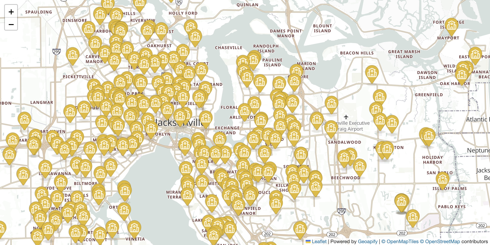

# Visualizing GeoJSON Points with Leaflet and Geoapify Places API

Fetch places by category from Geoapify Places API and display them as markers on a Leaflet map with custom icons and popups.

## Quick Summary

- Problem: Display category-specific places (e.g., schools) on a map with custom markers.
- Solution: Use Geoapify Places API to fetch GeoJSON points and render with Leaflet custom icons.
- Stack: HTML, CSS, JavaScript, Leaflet.
- APIs: Geoapify Places API, Geoapify Marker Icon API, Geoapify Map Tiles API.

## What This Example Includes

- Leaflet map with Geoapify raster tiles
- Places API call with category filter
- Geographic filter using place ID
- Custom marker icons from Marker Icon API
- Popups with place name and address
- GeoJSON layer rendering
- Source-based run from `src/index.html` (no build step)

## Use Cases

- Build POI (point-of-interest) finders by category.
- Display schools, restaurants, or other places on a map.
- Learn how to integrate Places API with Leaflet.

## Live Demo

[](https://codepen.io/geoapify/pen/zxraMEp)

## Screenshot



## Quick Start

Open [`src/index.html`](./src/index.html) in your browser.

No local server is required.

Note: In rare cases, browser policies or extensions can restrict `file://` access. If that happens, run a local static server and open `src/index.html` via `http://localhost`, or use your IDE's "Open with Live Server" (or similar) option.

## Input and Output

- Input: Category filter, geographic filter (place ID or bbox), limit, Geoapify API key.
- Output: Map with markers for each place, popups showing name and address.

## Project Structure

| File | Purpose |
|------|---------|
| `src/index.html` | Source HTML |
| `src/script.js` | Source JavaScript (Places API, marker rendering) |
| `src/style.css` | Source CSS |

## Code Samples

### Minimal HTML

```html
<!DOCTYPE html>
<html lang="en">
<head>
  <meta charset="UTF-8">
  <title>Places GeoJSON</title>
  <link rel="stylesheet" href="https://unpkg.com/leaflet@1.9.4/dist/leaflet.css">
  <style>
    #map { height: 500px; }
  </style>
</head>
<body>
  <div id="map"></div>
  <script src="https://unpkg.com/leaflet@1.9.4/dist/leaflet.js"></script>
  <script src="script.js"></script>
</body>
</html>
```

### Minimal JavaScript

```js
// Demo API key for quickstart only.
// Register for your own free API key at https://myprojects.geoapify.com/.
// Benefits: usage analytics, project-level limits, and reliable access for production use.
// This demo key can be blocked or restricted at any time.
const yourAPIKey = "YOUR_API_KEY";

const map = L.map("map").setView([52.52, 13.405], 11);
L.tileLayer(`https://maps.geoapify.com/v1/tile/osm-bright/{z}/{x}/{y}.png?apiKey=${yourAPIKey}`).addTo(map);

const placeId = "5102f0dceeadd8624059a63ee96f9c9a4b40f00102f9012a20100000000000c00208";
const schoolIcon = L.icon({
  iconUrl: `https://api.geoapify.com/v2/icon/?type=awesome&color=%23e2b928&icon=school&scaleFactor=2&apiKey=${yourAPIKey}`,
  iconSize: [36, 53],
  iconAnchor: [18, 48]
});

fetch(`https://api.geoapify.com/v2/places?categories=education.school&filter=place:${placeId}&limit=500&apiKey=${yourAPIKey}`)
  .then((r) => r.json())
  .then((data) => {
    L.geoJSON(data, {
      pointToLayer: (f, latlng) => L.marker(latlng, { icon: schoolIcon }),
      onEachFeature: (f, layer) => layer.bindPopup(`<strong>${f.properties.address_line1}</strong><br>${f.properties.address_line2 || ""}`)
    }).addTo(map);
  });
```

## Customize

1. Open [`src/script.js`](./src/script.js).
2. Set your own API key in `yourAPIKey`.
3. Change `categories` parameter (e.g., `catering.restaurant`, `healthcare.pharmacy`).
4. Modify `filter` to use a different geographic area (bbox or place ID).
5. Adjust marker icon parameters (color, icon, size).

API documentation:
- [Geoapify Places API](https://apidocs.geoapify.com/docs/places/)
- [Geoapify Map Tiles API](https://apidocs.geoapify.com/docs/maps/map-tiles/)
- [Geoapify Marker Icon API](https://apidocs.geoapify.com/docs/icon/)

No build step is required. Edit files in `src/` and refresh the browser.

## Troubleshooting

| Problem | Likely Cause | What to Do |
|---------|--------------|------------|
| Map is blank or tiles missing | Leaflet CSS/JS failed to load | Open browser DevTools (`Console` + `Network`) and confirm CDN files load without errors. |
| Map does not load data / API responds `403` | API key is invalid, restricted, or over limits | Get your own free key at `https://myprojects.geoapify.com/`, then update `yourAPIKey` in `src/script.js`. |
| Works inconsistently from local file | Browser policy blocks some `file://` behavior | Open with IDE Live Server (or any local static server) and run from `http://localhost`. |
| Output differs from expected | Local edits introduced a regression | Compare your files with the [CodePen demo](https://codepen.io/geoapify/pen/zxraMEp) and align differences step by step. |

## APIs and Libraries

| Type | Name | Link | API Endpoint Used |
|------|------|------|-------------------|
| API | Geoapify Places API | [Places API](https://www.geoapify.com/places-api/) | `https://api.geoapify.com/v2/places?categories=...&filter=...&limit=...&apiKey=...` |
| API | Geoapify Marker Icon API | [Marker Icon API](https://www.geoapify.com/map-marker-icon-api/) | `https://api.geoapify.com/v2/icon/?type=awesome&...&apiKey=...` |
| API | Geoapify Map Tiles API | [Map Tiles API](https://www.geoapify.com/map-tiles/) | `https://maps.geoapify.com/v1/tile/osm-bright-grey/{z}/{x}/{y}.png?apiKey=...` |
| Library | Leaflet | [leafletjs.com](https://leafletjs.com/) | Not applicable |

## Related Examples

| Example | Description | Link |
|---------|-------------|------|
| Places Category Search | Dynamic category search with toggles | [Open](../leaflet-demo-geoapify-places-api-category-search-with-dynamic-markers) |
| Custom Markers | Place details with custom markers | [Open](../../maps/maplibre-custom-markers-popups-with-geoapify-place-details) |
| Route Visualization | Display driving routes | [Open](../../routing-api/visualizing-geojson-routes-with-leaflet-and-geoapify-routing-api) |

## Useful Links

- Geoapify API docs: [https://apidocs.geoapify.com/](https://apidocs.geoapify.com/)
- CodePen demo: [https://codepen.io/geoapify/pen/zxraMEp](https://codepen.io/geoapify/pen/zxraMEp)
- Geoapify CodePen profile: [https://codepen.io/geoapify](https://codepen.io/geoapify)

## License

MIT

**Keywords**: Places API, GeoJSON points, category search, custom markers, POI, Leaflet markers, Geoapify API
