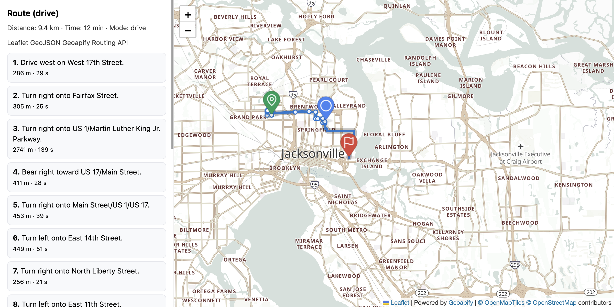
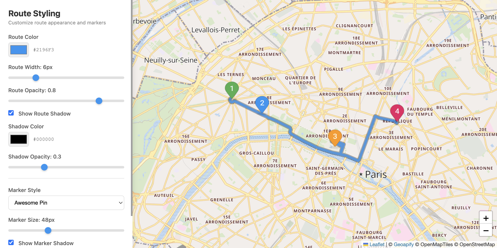
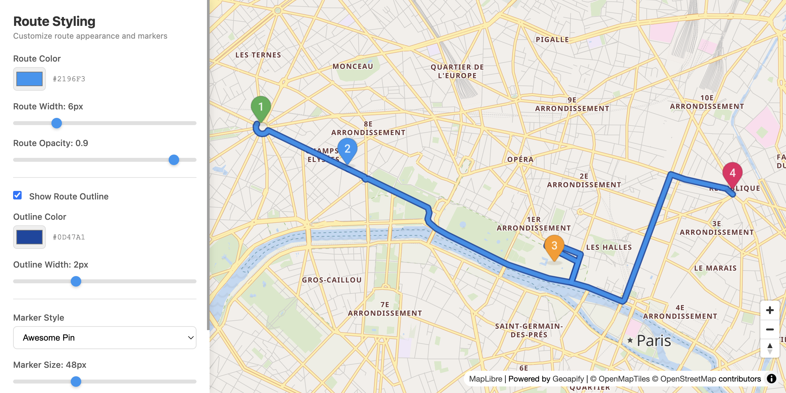
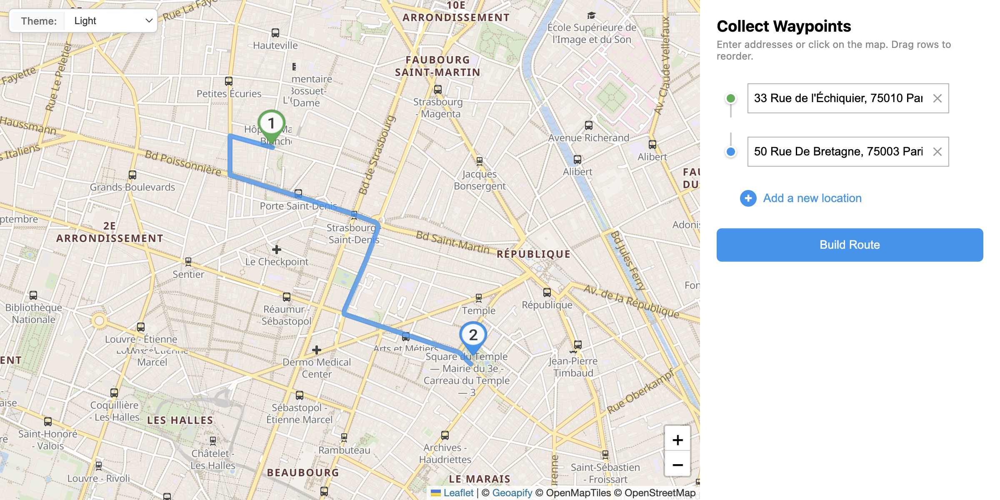
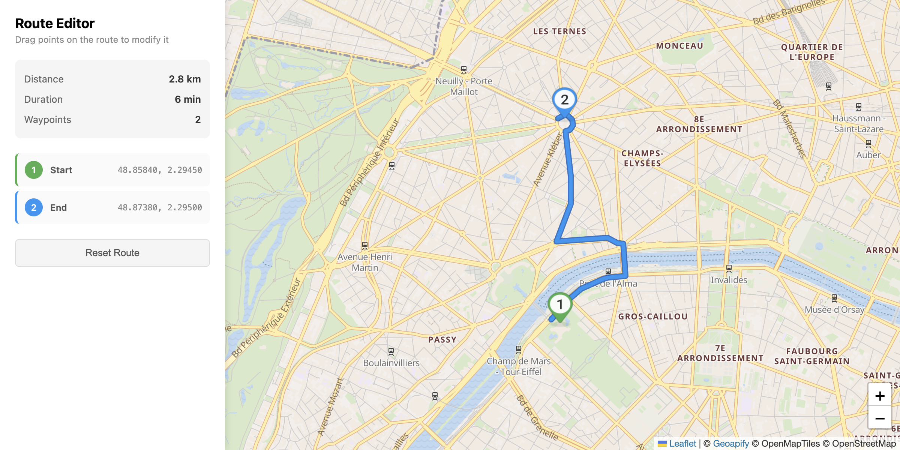
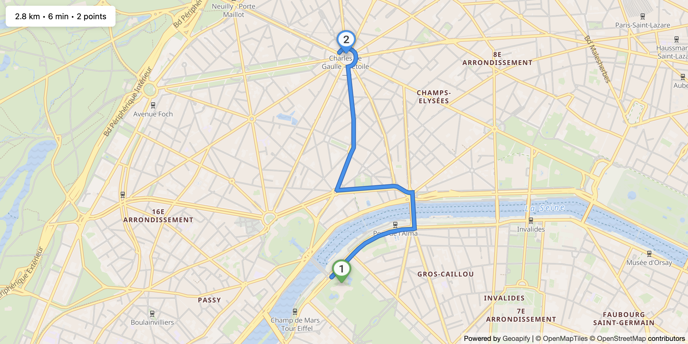
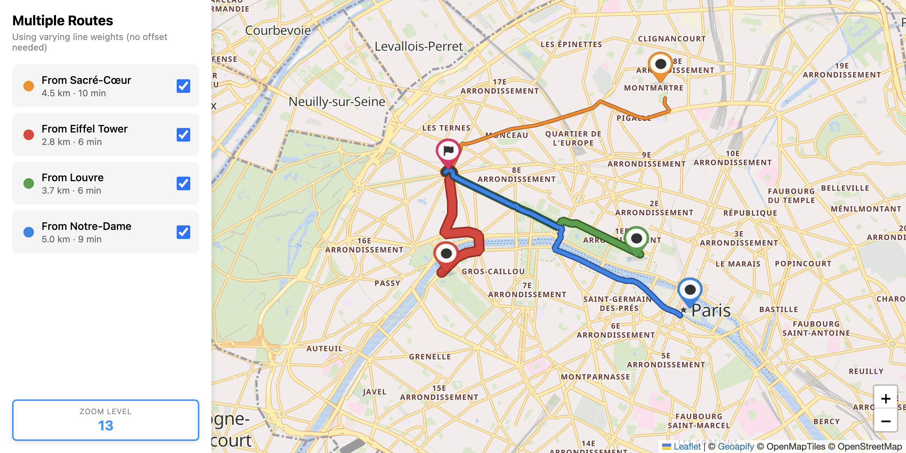
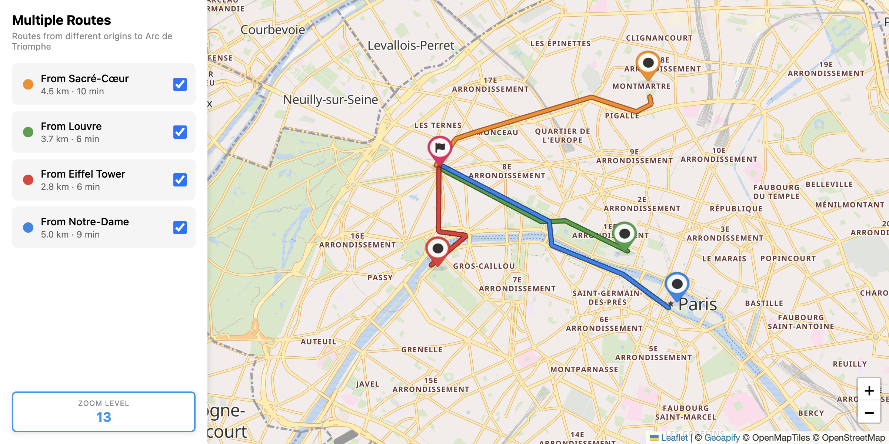
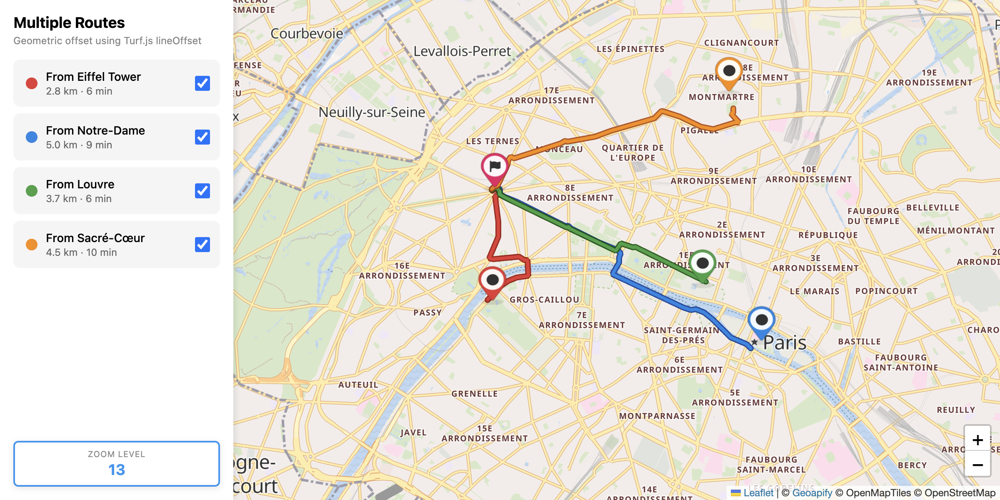
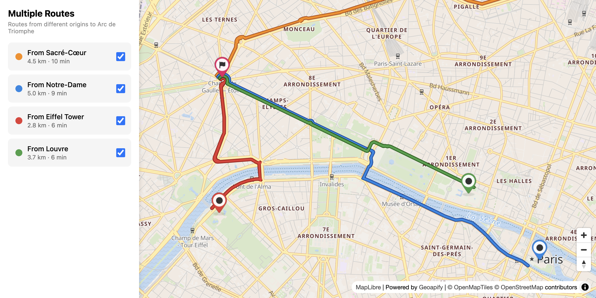

# Geoapify Routing API Code Examples

Use Geoapify Routing API examples to calculate routes, display turn-by-turn directions, compare multiple routes, style route geometry, and build interactive waypoint editing workflows.

## Overview

This folder contains browser-based JavaScript examples for route visualization, multiple-route rendering, waypoint collection, and drag editing with Leaflet and MapLibre GL JS. Each example includes source code, a screenshot, and a focused README with setup notes and code samples.

## API Resources

## Live Demo

Each CodePen demo is linked from the `Live Demo` column in the code examples table.

## Code Examples

| Screenshot | Example | Description | Source Code | Live Demo |
|------------|---------|-------------|-------------|-----------|
|  | Visualizing GeoJSON Routes with Leaflet and Geoapify Routing API | Fetch routes from Geoapify Routing API and render route geometry, waypoint markers, summary, and turn-by-turn instructions. | [Open example](https://github.com/geoapify/geoapify-quickstart-examples/tree/main/routing-api/visualizing-geojson-routes-with-leaflet-and-geoapify-routing-api/) | [CodePen](https://codepen.io/geoapify/pen/ogbyJeN) |
|  | Route Visualization with Leaflet Styling Controls | Customize route appearance with real-time Leaflet controls for line color, width, opacity, shadow effects, and markers. | [Open example](https://github.com/geoapify/geoapify-quickstart-examples/tree/main/routing-api/route-visualization-leaflet-styling/) | [CodePen](https://codepen.io/team/geoapify/pen/OPXPyVr) |
|  | Route Visualization with MapLibre GL Styling Controls | Customize route appearance with MapLibre GL paint properties and smooth vector rendering. | [Open example](https://github.com/geoapify/geoapify-quickstart-examples/tree/main/routing-api/route-visualization-maplibre-gl-styling/) | [CodePen](https://codepen.io/team/geoapify/pen/WbxbQvq) |
|  | Waypoints Collection with Autocomplete and Map | Collect route waypoints using address autocomplete, map clicks, and drag-and-drop reordering, then build routes with the Routing API. | [Open example](https://github.com/geoapify/geoapify-quickstart-examples/tree/main/routing-api/waypoints-collection-autocomplete-map/) | [CodePen](https://codepen.io/team/geoapify/pen/bNeNVNJ) |
|  | Add Route Waypoints with `@geoapify/route-waypoint-selector` and Leaflet | Build a multi-stop route UI with waypoint input, reordering, map-assisted selection, reverse geocoding, and Route Directions output. | [Open example](https://github.com/geoapify/geoapify-quickstart-examples/tree/main/routing-api/route-add-waypoints-leaflet/) | [CodePen](https://codepen.io/editor/geoapify/pen/019e889c-62eb-7336-baa5-3e367b66766f) |
|  | Route Drag Edit with Leaflet | Add via points by hovering and dragging on the route line, and reposition waypoints by dragging markers. | [Open example](https://github.com/geoapify/geoapify-quickstart-examples/tree/main/routing-api/route-drag-edit-leaflet/) | [CodePen](https://codepen.io/team/geoapify/pen/PwzwPPX) |
|  | Route Drag Edit with MapLibre GL | Edit routes in a vector map context by adding via points from route hover interactions and draggable markers. | [Open example](https://github.com/geoapify/geoapify-quickstart-examples/tree/main/routing-api/route-drag-edit-maplibre/) | [CodePen](https://codepen.io/team/geoapify/pen/yyJyYeY) |
|  | Multiple Routes Visualization with Leaflet (Plain) | Display multiple routes from different origins to a common destination using varying line weights for visual distinction. | [Open example](https://github.com/geoapify/geoapify-quickstart-examples/tree/main/routing-api/multiple-routes-leaflet-plain/) | [CodePen](https://codepen.io/team/geoapify/pen/qENEOOP) |
|  | Multiple Routes Visualization with Leaflet Polylineoffset | Display multiple routes with pixel-based offsets using the leaflet-polylineoffset plugin to separate overlapping route lines. | [Open example](https://github.com/geoapify/geoapify-quickstart-examples/tree/main/routing-api/multiple-routes-leaflet-polylineoffset/) | [CodePen](https://codepen.io/team/geoapify/pen/VYjqNBb) |
|  | Multiple Routes Visualization with Leaflet and Turf.js Offset | Display multiple routes with Turf.js line offsets for real-world distance-based separation. | [Open example](https://github.com/geoapify/geoapify-quickstart-examples/tree/main/routing-api/multiple-routes-leaflet-turf-offset/) | [CodePen](https://codepen.io/team/geoapify/pen/NPremzL) |
|  | Multiple Routes Visualization with MapLibre GL | Display multiple routes using MapLibre GL line-offset paint properties for smooth parallel route rendering. | [Open example](https://github.com/geoapify/geoapify-quickstart-examples/tree/main/routing-api/multiple-routes-maplibre-gl-visualization/) | [CodePen](https://codepen.io/team/geoapify/pen/vEKENNr) |

## Geoapify API Key

These examples include demo Geoapify API keys for quick testing. For your own project, create a free API key at [myprojects.geoapify.com](https://myprojects.geoapify.com/) and replace the example key in the relevant `src/script.js` file.

## APIs and Libraries

| Name | Description | Documentation | Used In This Example |
|------|-------------|---------------|----------------------|
| Geoapify Routing API | Calculates routes, route geometry, travel time, distance, and turn-by-turn directions. | [Routing API docs](https://apidocs.geoapify.com/docs/routing/) | [Visualizing GeoJSON Routes](./visualizing-geojson-routes-with-leaflet-and-geoapify-routing-api/), [Route Visualization with Leaflet](./route-visualization-leaflet-styling/), [Route Visualization with MapLibre GL](./route-visualization-maplibre-gl-styling/), [Waypoints Collection](./waypoints-collection-autocomplete-map/), [Add Route Waypoints](./route-add-waypoints-leaflet/), [Route Drag Edit with Leaflet](./route-drag-edit-leaflet/), [Route Drag Edit with MapLibre GL](./route-drag-edit-maplibre/), [Multiple Routes with Leaflet](./multiple-routes-leaflet-plain/), [Multiple Routes Polylineoffset](./multiple-routes-leaflet-polylineoffset/), [Multiple Routes Turf Offset](./multiple-routes-leaflet-turf-offset/), [Multiple Routes MapLibre GL](./multiple-routes-maplibre-gl-visualization/) |
| Geoapify Reverse Geocoding API | Converts map-click coordinates into waypoint labels and addresses. | [Reverse geocoding docs](https://apidocs.geoapify.com/docs/geocoding/reverse-geocoding/) | [Waypoints Collection](./waypoints-collection-autocomplete-map/), [Add Route Waypoints](./route-add-waypoints-leaflet/) |
| Geoapify IP Geolocation API | Provides approximate user location for initial map positioning. | [IP Geolocation docs](https://apidocs.geoapify.com/docs/ip-geolocation/) | [Add Route Waypoints](./route-add-waypoints-leaflet/) |
| Geoapify Marker Icon API | Generates route waypoint and endpoint marker icons. | [Marker Icon docs](https://apidocs.geoapify.com/docs/icon/) | [Visualizing GeoJSON Routes](./visualizing-geojson-routes-with-leaflet-and-geoapify-routing-api/), [Route Visualization with Leaflet](./route-visualization-leaflet-styling/), [Route Visualization with MapLibre GL](./route-visualization-maplibre-gl-styling/), [Waypoints Collection](./waypoints-collection-autocomplete-map/), [Route Drag Edit with Leaflet](./route-drag-edit-leaflet/), [Route Drag Edit with MapLibre GL](./route-drag-edit-maplibre/), [Multiple Routes with Leaflet](./multiple-routes-leaflet-plain/), [Multiple Routes Polylineoffset](./multiple-routes-leaflet-polylineoffset/), [Multiple Routes Turf Offset](./multiple-routes-leaflet-turf-offset/), [Multiple Routes MapLibre GL](./multiple-routes-maplibre-gl-visualization/) |
| Geoapify Map Tiles API | Provides map styles and tiles for Leaflet and MapLibre examples. | [Map Tiles docs](https://apidocs.geoapify.com/docs/maps/map-tiles/) | [All routing examples](./) |
| Geoapify Geocoder Autocomplete | Provides address autocomplete for collecting route waypoints. | [Geocoder Autocomplete package](https://www.npmjs.com/package/@geoapify/geocoder-autocomplete) | [Waypoints Collection](./waypoints-collection-autocomplete-map/) |
| Geoapify Route Waypoint Selector | Provides waypoint input, ordering, and route UI helpers. | [Route Waypoint Selector package](https://www.npmjs.com/package/@geoapify/route-waypoint-selector) | [Add Route Waypoints](./route-add-waypoints-leaflet/) |
| Leaflet | Renders interactive raster-tile maps, route lines, and markers. | [Leaflet docs](https://leafletjs.com/) | [Visualizing GeoJSON Routes](./visualizing-geojson-routes-with-leaflet-and-geoapify-routing-api/), [Route Visualization with Leaflet](./route-visualization-leaflet-styling/), [Waypoints Collection](./waypoints-collection-autocomplete-map/), [Add Route Waypoints](./route-add-waypoints-leaflet/), [Route Drag Edit with Leaflet](./route-drag-edit-leaflet/), [Multiple Routes with Leaflet](./multiple-routes-leaflet-plain/), [Multiple Routes Polylineoffset](./multiple-routes-leaflet-polylineoffset/), [Multiple Routes Turf Offset](./multiple-routes-leaflet-turf-offset/) |
| MapLibre GL JS | Renders interactive vector maps and route layers. | [MapLibre GL JS docs](https://maplibre.org/maplibre-gl-js/docs/) | [Route Visualization with MapLibre GL](./route-visualization-maplibre-gl-styling/), [Route Drag Edit with MapLibre GL](./route-drag-edit-maplibre/), [Multiple Routes MapLibre GL](./multiple-routes-maplibre-gl-visualization/) |
| leaflet-polylineoffset | Separates overlapping route lines with pixel-based offsets. | [leaflet-polylineoffset GitHub](https://github.com/bbecquet/Leaflet.PolylineOffset) | [Multiple Routes Polylineoffset](./multiple-routes-leaflet-polylineoffset/) |
| Turf.js | Offsets route geometry for real-world distance-based separation. | [Turf.js docs](https://turfjs.org/docs/) | [Multiple Routes Turf Offset](./multiple-routes-leaflet-turf-offset/) |

## Useful Links

- Geoapify API documentation: [https://apidocs.geoapify.com/](https://apidocs.geoapify.com/)
- Geoapify projects and API keys: [https://myprojects.geoapify.com/](https://myprojects.geoapify.com/)
- Geoapify CodePen examples: [https://codepen.io/geoapify](https://codepen.io/geoapify)
