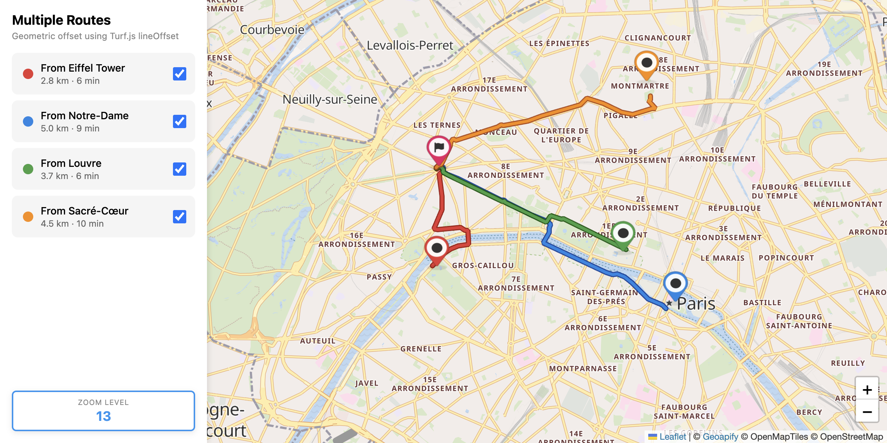

# Multiple Routes Visualization with Leaflet and Turf.js Offset

Display multiple routes with geometric offset using Turf.js lineOffset for real-world distance-based separation.

## Quick Summary

- Problem: Visualize multiple overlapping routes with consistent geographic separation.
- Solution: Use Turf.js lineOffset for geometric (meter-based) route offsetting.
- Stack: HTML, CSS, JavaScript, Leaflet, Turf.js.
- APIs: Geoapify Routing API, Geoapify Marker Icon API, Geoapify Map Tiles API.

## What This Example Includes

- Leaflet map with Geoapify raster tiles
- Multiple concurrent route fetching
- Geometric offset using Turf.js lineOffset
- Route list with toggle visibility
- Route details panel
- Origin and destination markers
- Source-based run from `src/index.html` (no build step)

## Use Cases

- Compare routes with consistent real-world separation at all zoom levels.
- Build transit comparison interfaces with geographic accuracy.
- Display alternative routes with predictable spacing.

## Live Demo

[](https://codepen.io/team/geoapify/pen/NPremzL)

## Screenshot



## Quick Start

Open [`src/index.html`](./src/index.html) in your browser.

No local server is required.

Note: In rare cases, browser policies or extensions can restrict `file://` access. If that happens, run a local static server and open `src/index.html` via `http://localhost`, or use your IDE's "Open with Live Server" (or similar) option.

## Input and Output

- Input: Multiple origin coordinates, single destination, Geoapify API key.
- Output: Multiple geometrically offset route lines, route list with toggles.

## Project Structure

| File | Purpose |
|------|---------|
| `src/index.html` | Source HTML |
| `src/script.js` | Source JavaScript (routing, Turf.js offset, rendering) |
| `src/style.css` | Source CSS |

## Code Samples

### Minimal HTML

```html
<!DOCTYPE html>
<html lang="en">
<head>
  <meta charset="UTF-8">
  <title>Routes with Turf Offset</title>
  <link rel="stylesheet" href="https://unpkg.com/leaflet@1.9.4/dist/leaflet.css">
  <style>
    #map { height: 500px; }
  </style>
</head>
<body>
  <div id="map"></div>
  <script src="https://unpkg.com/leaflet@1.9.4/dist/leaflet.js"></script>
  <script src="https://unpkg.com/@turf/turf@latest/turf.min.js"></script>
  <script src="script.js"></script>
</body>
</html>
```

### Minimal JavaScript

```js
// Demo API key for quickstart only.
// Register for your own free API key at https://myprojects.geoapify.com/.
// Benefits: usage analytics, project-level limits, and reliable access for production use.
// This demo key can be blocked or restricted at any time.
const yourAPIKey = "YOUR_API_KEY";

const map = L.map("map").setView([52.52, 13.405], 12);
L.tileLayer(`https://maps.geoapify.com/v1/tile/osm-bright/{z}/{x}/{y}.png?apiKey=${yourAPIKey}`).addTo(map);

const routes = [
  { from: [52.5, 13.3], to: [52.55, 13.5], color: "#3b82f6", offset: -15 },
  { from: [52.48, 13.35], to: [52.55, 13.5], color: "#22c55e", offset: 15 }
];

routes.forEach((r) => {
  const waypoints = `${r.from[0]},${r.from[1]}|${r.to[0]},${r.to[1]}`;
  fetch(`https://api.geoapify.com/v1/routing?waypoints=${waypoints}&mode=drive&apiKey=${yourAPIKey}`)
    .then((res) => res.json())
    .then((data) => {
      if (!data.features?.[0]) return;
      
      const feature = data.features[0];
      
      // Handle MultiLineString - take first linestring
      let lineFeature = feature;
      if (feature.geometry.type === "MultiLineString") {
        lineFeature = {
          ...feature,
          geometry: {
            type: "LineString",
            coordinates: feature.geometry.coordinates[0]
          }
        };
      }
      
      const offsetFeature = turf.lineOffset(lineFeature, r.offset / 1000, { units: "kilometers" });
      const coords = offsetFeature.geometry.coordinates.map(([lon, lat]) => [lat, lon]);
      L.polyline(coords, { color: r.color, weight: 4 }).addTo(map);
    });
});
```

## Customize

1. Open [`src/script.js`](./src/script.js).
2. Set your own API key in `yourAPIKey`.
3. Modify `ROUTES` array to add/change origins.
4. Adjust `OFFSET_METERS` for different separation distances.
5. Change `DESTINATION` for a different endpoint.

API documentation:
- [Geoapify Routing API](https://apidocs.geoapify.com/docs/routing/)
- [Geoapify Map Tiles API](https://apidocs.geoapify.com/docs/maps/map-tiles/)
- [Geoapify Marker Icon API](https://apidocs.geoapify.com/docs/icon/)
- [Turf.js lineOffset](https://turfjs.org/docs/api/lineOffset)

No build step is required. Edit files in `src/` and refresh the browser.

## Troubleshooting

| Problem | Likely Cause | What to Do |
|---------|--------------|------------|
| Map is blank or tiles missing | Leaflet/Turf.js failed to load | Open browser DevTools (`Console` + `Network`) and confirm CDN files load without errors. |
| Map does not load data / API responds `403` | API key is invalid, restricted, or over limits | Get your own free key at `https://myprojects.geoapify.com/`, then update `yourAPIKey` in `src/script.js`. |
| Works inconsistently from local file | Browser policy blocks some `file://` behavior | Open with IDE Live Server (or any local static server) and run from `http://localhost`. |
| Output differs from expected | Local edits introduced a regression | Compare your files with the [CodePen demo](https://codepen.io/team/geoapify/pen/NPremzL) and align differences step by step. |

## APIs and Libraries

| Type | Name | Link | API Endpoint Used |
|------|------|------|-------------------|
| API | Geoapify Routing API | [Routing API](https://www.geoapify.com/routing-api/) | `https://api.geoapify.com/v1/routing?waypoints=...&mode=drive&apiKey=...` |
| API | Geoapify Marker Icon API | [Marker Icon API](https://www.geoapify.com/map-marker-icon-api/) | `https://api.geoapify.com/v2/icon?type=awesome&...&apiKey=...` |
| API | Geoapify Map Tiles API | [Map Tiles API](https://www.geoapify.com/map-tiles/) | `https://maps.geoapify.com/v1/tile/osm-bright/{z}/{x}/{y}@2x.png?apiKey=...` |
| Library | Leaflet | [leafletjs.com](https://leafletjs.com/) | Not applicable |
| Library | Turf.js | [turfjs.org](https://turfjs.org/) | Not applicable |

## Related Examples

| Example | Description | Link |
|---------|-------------|------|
| Multiple Routes Plain | Routes with varying line weights | [Open](../multiple-routes-leaflet-plain) |
| Multiple Routes Polylineoffset | Routes with pixel-based offset | [Open](../multiple-routes-leaflet-polylineoffset) |
| Multiple Routes MapLibre | Multiple routes with MapLibre GL | [Open](../multiple-routes-maplibre-gl-visualization) |

## Useful Links

- Geoapify API docs: [https://apidocs.geoapify.com/](https://apidocs.geoapify.com/)
- CodePen demo: [https://codepen.io/team/geoapify/pen/NPremzL](https://codepen.io/team/geoapify/pen/NPremzL)
- Geoapify CodePen profile: [https://codepen.io/team/geoapify](https://codepen.io/team/geoapify)

## License

MIT

**Keywords**: multiple routes, Turf.js, geometric offset, lineOffset, route separation, geographic distance
