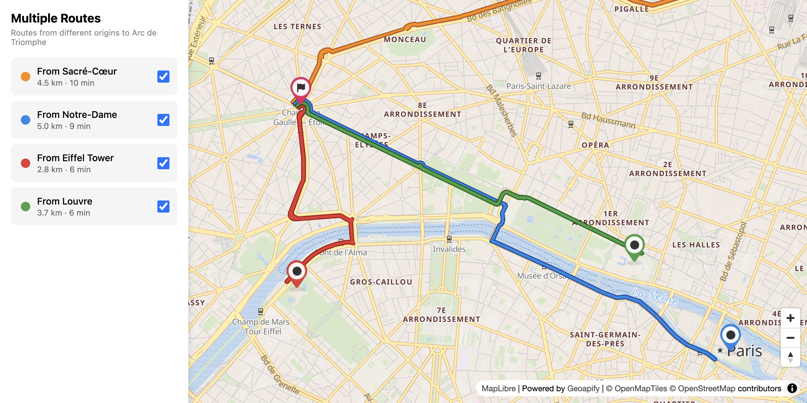

# Multiple Routes Visualization with MapLibre GL

Display multiple routes from different origins using MapLibre GL's line-offset paint property for smooth parallel route rendering.

## Quick Summary

- Problem: Visualize multiple overlapping routes with smooth vector rendering.
- Solution: Use MapLibre GL line-offset paint property for pixel-based separation.
- Stack: HTML, CSS, JavaScript, MapLibre GL JS.
- APIs: Geoapify Routing API, Geoapify Marker Icon API, Geoapify Map Tiles API.

## What This Example Includes

- MapLibre GL JS map with Geoapify vector tiles
- Multiple concurrent route fetching
- Pixel-based line-offset for route separation
- Route list with toggle visibility
- Route details panel
- DOM-based custom markers
- Source-based run from `src/index.html` (no build step)

## Use Cases

- Compare travel times with smooth vector route rendering.
- Build transit comparison interfaces with MapLibre GL.
- Display alternative routes with hardware-accelerated rendering.

## Live Demo

[](https://codepen.io/team/geoapify/pen/vEKENNr)

## Screenshot



## Quick Start

Open [`src/index.html`](./src/index.html) in your browser.

No local server is required.

Note: In rare cases, browser policies or extensions can restrict `file://` access. If that happens, run a local static server and open `src/index.html` via `http://localhost`, or use your IDE's "Open with Live Server" (or similar) option.

## Input and Output

- Input: Multiple origin coordinates, single destination, Geoapify API key.
- Output: Multiple offset vector route lines, route list with toggles, details panel.

## Project Structure

| File | Purpose |
|------|---------|
| `src/index.html` | Source HTML |
| `src/script.js` | Source JavaScript (routing, MapLibre layers, UI) |
| `src/style.css` | Source CSS |

## Code Samples

### Minimal HTML

```html
<!DOCTYPE html>
<html lang="en">
<head>
  <meta charset="UTF-8">
  <title>MapLibre Multiple Routes</title>
  <link href="https://unpkg.com/maplibre-gl@latest/dist/maplibre-gl.css" rel="stylesheet">
  <script src="https://unpkg.com/maplibre-gl@latest/dist/maplibre-gl.js"></script>
  <style>
    #map { height: 500px; }
  </style>
</head>
<body>
  <div id="map"></div>
  <script src="script.js"></script>
</body>
</html>
```

### Minimal JavaScript

```js
// Demo API key for quickstart only.
// Register for your own free API key at https://myprojects.geoapify.com/.
// Benefits: usage analytics, project-level limits, and reliable access for production use.
// This demo key can be blocked or restricted at any time.
const yourAPIKey = "YOUR_API_KEY";

const map = new maplibregl.Map({
  container: "map",
  style: `https://maps.geoapify.com/v1/styles/osm-bright/style.json?apiKey=${yourAPIKey}`,
  center: [13.405, 52.52],
  zoom: 11
});

const routes = [
  { from: [52.5, 13.3], to: [52.55, 13.5], color: "#3b82f6", offset: -4 },
  { from: [52.48, 13.35], to: [52.55, 13.5], color: "#22c55e", offset: 4 }
];

map.on("load", () => {
  routes.forEach((r, i) => {
    const waypoints = `${r.from[0]},${r.from[1]}|${r.to[0]},${r.to[1]}`;
    fetch(`https://api.geoapify.com/v1/routing?waypoints=${waypoints}&mode=drive&apiKey=${yourAPIKey}`)
      .then((res) => res.json())
      .then((data) => {
        if (!data.features?.[0]) return;
        map.addSource(`route-${i}`, { type: "geojson", data: data.features[0] });
        map.addLayer({
          id: `route-${i}`,
          type: "line",
          source: `route-${i}`,
          paint: { "line-color": r.color, "line-width": 4, "line-offset": r.offset }
        });
      });
  });
});
  }

  updateUI();
  renderMarkers();
};
```

### Create DOM-Based Markers

```js
function createMarker(lon, lat, color, iconName, name, label) {
  const el = document.createElement("div");
  el.style.backgroundImage = `url(https://api.geoapify.com/v2/icon?type=awesome&color=${color}&icon=${iconName}&size=48&scaleFactor=2&apiKey=${yourAPIKey})`;
  
  const popup = new maplibregl.Popup({offset: [0, -48]})
    .setHTML(`<strong>${name}</strong><br>${label}`);

  return new maplibregl.Marker({element: el, anchor: "bottom"})
    .setLngLat([lon, lat])
    .setPopup(popup)
    .addTo(map);
}
```

## Customize

1. Open [`src/script.js`](./src/script.js).
2. Set your own API key in `yourAPIKey`.
3. Modify `ROUTES` array to add/change origins.
4. Adjust `OFFSETS` array for different separation distances.
5. Change `DESTINATION` for a different endpoint.

API documentation:
- [Geoapify Routing API](https://apidocs.geoapify.com/docs/routing/)
- [Geoapify Map Tiles API](https://apidocs.geoapify.com/docs/maps/map-tiles/)
- [Geoapify Marker Icon API](https://apidocs.geoapify.com/docs/icon/)
- [MapLibre GL line-offset](https://maplibre.org/maplibre-style-spec/layers/#paint-line-line-offset)

No build step is required. Edit files in `src/` and refresh the browser.

## Troubleshooting

| Problem | Likely Cause | What to Do |
|---------|--------------|------------|
| Map is blank or unstyled | MapLibre assets failed to load | Open browser DevTools (`Console` + `Network`) and confirm CDN files load without errors. |
| Map does not load data / API responds `403` | API key is invalid, restricted, or over limits | Get your own free key at `https://myprojects.geoapify.com/`, then update `yourAPIKey` in `src/script.js`. |
| Works inconsistently from local file | Browser policy blocks some `file://` behavior | Open with IDE Live Server (or any local static server) and run from `http://localhost`. |
| Output differs from expected | Local edits introduced a regression | Compare your files with the [CodePen demo](https://codepen.io/team/geoapify/pen/vEKENNr) and align differences step by step. |

## APIs and Libraries

| Type | Name | Link | API Endpoint Used |
|------|------|------|-------------------|
| API | Geoapify Routing API | [Routing API](https://www.geoapify.com/routing-api/) | `https://api.geoapify.com/v1/routing?waypoints=...&mode=drive&apiKey=...` |
| API | Geoapify Marker Icon API | [Marker Icon API](https://www.geoapify.com/map-marker-icon-api/) | `https://api.geoapify.com/v2/icon?type=awesome&...&apiKey=...` |
| API | Geoapify Map Tiles API | [Map Tiles API](https://www.geoapify.com/map-tiles/) | `https://maps.geoapify.com/v1/styles/osm-bright/style.json?apiKey=...` |
| Library | MapLibre GL JS | [maplibre.org](https://maplibre.org/) | Not applicable |

## Related Examples

| Example | Description | Link |
|---------|-------------|------|
| Multiple Routes Plain | Leaflet with varying line weights | [Open](../multiple-routes-leaflet-plain) |
| Multiple Routes Polylineoffset | Leaflet with pixel offset plugin | [Open](../multiple-routes-leaflet-polylineoffset) |
| Route Styling MapLibre | Route styling controls | [Open](../route-visualization-maplibre-gl-styling) |

## Useful Links

- Geoapify API docs: [https://apidocs.geoapify.com/](https://apidocs.geoapify.com/)
- CodePen demo: [https://codepen.io/team/geoapify/pen/vEKENNr](https://codepen.io/team/geoapify/pen/vEKENNr)
- Geoapify CodePen profile: [https://codepen.io/team/geoapify](https://codepen.io/team/geoapify)

## License

MIT

**Keywords**: multiple routes, MapLibre GL, line-offset, vector routes, route comparison, parallel routes
