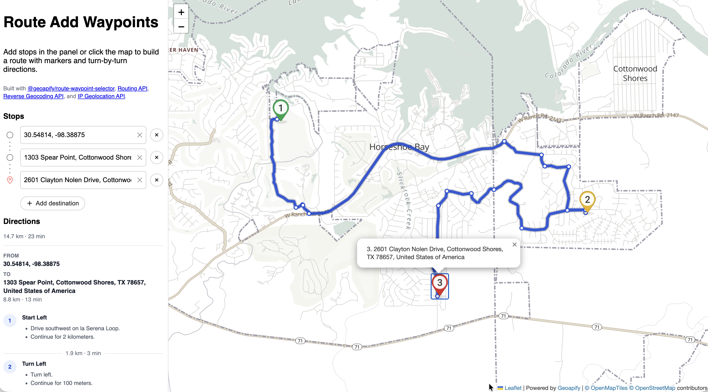

# Add Route Waypoints with `@geoapify/route-waypoint-selector` and Leaflet

This example focuses on the [`@geoapify/route-waypoint-selector`](https://www.npmjs.com/package/@geoapify/route-waypoint-selector) library and shows how to use it to build a multi-stop route UI. The sample combines the waypoint selector with a Leaflet map, reverse geocoding for map clicks, the Geoapify [Routing API](https://apidocs.geoapify.com/docs/routing/), and Route Directions output to display waypoint markers, route geometry, and leg-by-leg turn-by-turn directions.

## Quick Summary

- Problem: Build a multi-stop routing interface with waypoint input, reordering, and map-assisted selection.
- Solution: Use `@geoapify/route-waypoint-selector` with Leaflet, reverse geocoding, and Route Directions to collect waypoints and render the resulting route.
- Stack: HTML, CSS, JavaScript, Leaflet, `@geoapify/route-waypoint-selector`.
- APIs: Geoapify Routing API, Geoapify Reverse Geocoding API, Geoapify IP Geolocation API, Geoapify Marker API, Geoapify Map Tiles API.

## Live Demo

[](https://codepen.io/editor/geoapify/pen/019e889c-62eb-7336-baa5-3e367b66766f)

## Screenshot



## What This Example Includes

- Initializes a Leaflet map with Geoapify `osm-bright-grey` raster tiles and uses Geoapify IP Geolocation to set the first user-facing map view
- Mounts `@geoapify/route-waypoint-selector` in the left panel with the round-borders theme for waypoint entry, autocomplete, and reordering
- On map click, calls the Geoapify Reverse Geocoding API, validates that the result is close enough and resolved at street or building level, and then fills the first unresolved waypoint with `selector.setWaypoint(...)`; otherwise it falls back to `lat, lon`
- Uses `onChange` from `@geoapify/route-waypoint-selector` to sync resolved waypoints to Leaflet markers generated with the Geoapify Marker API
- Uses the same `onChange` event to request a route for the first contiguous sequence of resolved waypoints from the Geoapify Routing API with `details=instruction_details`
- Draws the returned route geometry on the map, builds a directions panel grouped by route legs with distance, duration, and turn-by-turn instructions, and places step points as Leaflet circle markers with instruction tooltips
- Source-based run from `src/index.html` (no build step)

## APIs and Libraries

| API / Library | Purpose | Link |
|---------------|---------|------|
| Leaflet | Map rendering and GeoJSON visualization | [Open](https://leafletjs.com/) |
| `@geoapify/route-waypoint-selector` | Waypoint input, autocomplete integration, and reordering | [Open](https://www.npmjs.com/package/@geoapify/route-waypoint-selector) |
| Geoapify Routing API | Route calculation and route instructions | [Open](https://apidocs.geoapify.com/docs/routing/) |
| Geoapify Reverse Geocoding API | Turn map clicks into address candidates | [Open](https://apidocs.geoapify.com/docs/geocoding/reverse-geocoding/) |
| Geoapify IP Geolocation API | Set the initial user-facing map view | [Open](https://apidocs.geoapify.com/docs/ip-geolocation/) |
| Geoapify Marker API | Generate numbered custom waypoint marker images | [Open](https://apidocs.geoapify.com/docs/maps/marker/) |
| Geoapify Map Tiles API | Provide the `osm-bright-grey` tile layer | [Open](https://apidocs.geoapify.com/docs/maps/map-tiles/) |

## Quick Start

Open [`src/index.html`](./src/index.html) in your browser.

No local server is required.

Note: In rare cases, browser policies or extensions can restrict `file://` access. If that happens, run a local static server and open `src/index.html` via `http://localhost`, or use your IDE's "Open with Live Server" (or similar) option.

> This sample uses a demo Geoapify API key in `src/script.js`. Replace it with your own key for production or long-term use. Geoapify offers a free tier, and you can sign up for an API key at [geoapify.com](https://www.geoapify.com/).

## Project Structure

| File | Purpose |
|------|---------|
| `src/index.html` | Page layout, library includes, and import map |
| `src/script.js` | Waypoint selector integration, reverse geocoding, routing, markers, and route visualization |
| `src/style.css` | Layout and component styling for the panel, directions, and map |

## Code Samples

### Initialize the Map with IP Geolocation API

Start with a standard Leaflet map and Geoapify raster tiles. The initial view is a broad fallback, then the Geoapify IP Geolocation API moves the map closer to the user without waiting for any waypoint input.

```js
const map = L.map("map").setView([20, 0], 4);

const isRetina = L.Browser.retina;
const baseUrl =
  "https://maps.geoapify.com/v1/tile/osm-bright-grey/{z}/{x}/{y}.png?apiKey={apiKey}";
const retinaUrl =
  "https://maps.geoapify.com/v1/tile/osm-bright-grey/{z}/{x}/{y}@2x.png?apiKey={apiKey}";

L.tileLayer(isRetina ? retinaUrl : baseUrl, {
  attribution:
    'Powered by <a href="https://www.geoapify.com/" target="_blank">Geoapify</a> | <a href="https://openmaptiles.org/" target="_blank">© OpenMapTiles</a> <a href="https://www.openstreetmap.org/copyright" target="_blank">© OpenStreetMap</a> contributors',
  maxZoom: 20,
  id: "osm-bright-grey",
  apiKey: yourApiKey
}).addTo(map);

fetch(`https://api.geoapify.com/v1/ipinfo?apiKey=${yourApiKey}`)
  .then((response) => response.json())
  .then((ip) => {
    const loc =
      ip.location &&
      typeof ip.location.latitude === "number" &&
      typeof ip.location.longitude === "number"
        ? { lat: ip.location.latitude, lon: ip.location.longitude }
        : null;

    if (loc && !markersById.size && !latestRouteData) {
      map.setView([loc.lat, loc.lon], 12, { animate: false });
    }
  })
  .catch((error) => {
    console.error("IP geolocation failed", error);
  });
```

The Geoapify IP Geolocation API gives the map a more relevant initial view based on the user’s approximate location. The `!markersById.size && !latestRouteData` check makes sure this automatic recentering happens only before any waypoint markers or route results are already shown.

### Add `@geoapify/route-waypoint-selector`

Mount `@geoapify/route-waypoint-selector` in the left panel and let its `onChange` event drive the rest of the sample. That single event is used to keep markers, viewport updates, and route requests in sync with the current waypoint state.

```js
import { WaypointSelector } from "@geoapify/route-waypoint-selector";

let selector;

selector = new WaypointSelector("#waypoint-selector", yourApiKey, {
  onChange: (waypoints, context) => {
    syncWaypointMarkers(waypoints);
    adjustViewToMarkers();
    fetchRoute(waypoints);
  },
  labels: {
    choose_destination: "Search for a stop or click the map"
  },
  geocoderOptions: {
    skipIcons: true
  }
});
```

`new WaypointSelector(...)` mounts the waypoint UI into the `#waypoint-selector` container and connects it to your Geoapify API key. In this sample, the selector is customized with a user-facing prompt, minimal geocoder options, and an `onChange` callback that lets the rest of the app react to waypoint updates.

### Set a Waypoint on Map Click with Reverse Geocoding

This sample lets the map act as an alternative waypoint input. A click does not create a new stop. Instead, it finds the first unresolved waypoint, reverse geocodes the clicked coordinates, and fills that existing waypoint with `selector.setWaypoint(...)`.

```js
async function setWaypointFromMapClick(lat, lon) {
  const firstUnresolvedWaypoint = selector
    .getWaypoints()
    .find((waypoint) => !selector.isWaypointResolved(waypoint));

  if (!firstUnresolvedWaypoint?.id) {
    return;
  }

  const fallbackLabel = `${lat.toFixed(5)}, ${lon.toFixed(5)}`;

  try {
    const params = new URLSearchParams({
      lat: String(lat),
      lon: String(lon),
      format: "json",
      apiKey: yourApiKey
    });
    const response = await fetch(
      `https://api.geoapify.com/v1/geocode/reverse?${params.toString()}`
    );

    if (!response.ok) {
      throw new Error(`Reverse geocoding failed with status ${response.status}`);
    }

    const data = await response.json();
    const result = data?.results?.[0];
    const hasStreetOrBuildingLevel =
      (typeof result?.result_type === "string" &&
        reverseGeocodeAddressLevels.has(result.result_type)) ||
      !!result?.housenumber ||
      !!result?.street;

    const isCloseEnough =
      result &&
      typeof result.distance === "number" &&
      result.distance <= maxReverseGeocodeDistanceMeters;

    if (isCloseEnough && hasStreetOrBuildingLevel && result.formatted) {
      selector.setWaypoint(
        firstUnresolvedWaypoint.id,
        result.formatted,
        typeof result.lat === "number" ? result.lat : lat,
        typeof result.lon === "number" ? result.lon : lon
      );
      return;
    }
  } catch (error) {
    console.error("Reverse geocoding failed", error);
  }

  selector.setWaypoint(firstUnresolvedWaypoint.id, fallbackLabel, lat, lon);
}

map.on("click", async (event) => {
  await setWaypointFromMapClick(event.latlng.lat, event.latlng.lng);
});
```

The key part here is `selector.setWaypoint(...)`: it updates the first unresolved waypoint instead of adding a new one. When reverse geocoding returns a close enough street- or building-level match, the sample uses that formatted address and coordinates; otherwise it still resolves the waypoint with the clicked `lat, lon` value.

### Create Custom Waypoint Markers with the Geoapify Marker API

Instead of using the default Leaflet marker image, this sample builds numbered waypoint markers with the Geoapify Marker API. The marker URL is generated dynamically so each waypoint can have its own number and color while still being used as a normal Leaflet `L.icon(...)`.

```js
function getWaypointMarkerIcon(index, total) {
  const color = waypointMarkerColors[index % waypointMarkerColors.length];

  return L.icon({
    iconUrl: `https://api.geoapify.com/v2/icon?type=awesome&color=${encodeURIComponent(color)}&text=${index + 1}&size=48&contentSize=20&scaleFactor=2&apiKey=${yourApiKey}`,
    iconSize: [37, 54],
    iconAnchor: [16.5, 48],
    popupAnchor: [0, -48]
  });
}

function syncWaypointMarkers(waypoints) {
  const nextIds = new Set();

  waypoints.forEach((waypoint, index) => {
    if (!waypoint.id || !isWaypointResolved(waypoint)) {
      return;
    }

    nextIds.add(waypoint.id);

    const latLng = [waypoint.lat, waypoint.lon];
    const markerTitle = `${index + 1}. ${waypoint.label ?? "Waypoint"}`;
    const markerIcon = getWaypointMarkerIcon(index, waypoints.length);
    const existingMarker = markersById.get(waypoint.id);

    if (existingMarker) {
      existingMarker
        .setLatLng(latLng)
        .setIcon(markerIcon)
        .bindPopup(markerTitle);
      return;
    }

    const marker = L.marker(latLng, { icon: markerIcon })
      .addTo(map)
      .bindPopup(markerTitle);

    markersById.set(waypoint.id, marker);
  });
}
```

The important part is the `iconUrl` request to `https://api.geoapify.com/v2/icon`. In this sample, the API generates a marker image with a selected color, the waypoint number as text, and a marker size of `48px`.

The Leaflet icon settings need a small adjustment because the generated marker image also includes shadow space:

- `iconSize: [37, 54]` defines the full rendered image box, including the shadow below the main marker shape
- `iconAnchor: [16.5, 48]` places the geographic point at the bottom tip of the marker, not at the bottom of the full shadow box
- `popupAnchor: [0, -48]` moves the popup upward so it opens from the visible marker body instead of the extended image bounds

### Generate a Route with the Geoapify Routing API

The route request is built from the currently resolved waypoints and sent to the Geoapify Routing API as a standard HTTP request. The main parameters in this sample are `waypoints`, which contains the `lat,lon` pairs joined with `|`, `mode=drive`, and `details=instruction_details`, which asks the API to return richer turn-by-turn instruction metadata.

```js
async function fetchRoute(waypoints) {
  const firstUnresolvedIndex = waypoints.findIndex(
    (waypoint) => !isWaypointResolved(waypoint)
  );
  const resolvedWaypoints = waypoints.filter((waypoint, index) => {
    const isBeforeFirstUnresolved =
      firstUnresolvedIndex === -1 || index < firstUnresolvedIndex;

    return isBeforeFirstUnresolved && isWaypointResolved(waypoint);
  });

  if (resolvedWaypoints.length < 2) {
    latestRouteData = null;
    clearRouteVisualization();
    clearRouteInstructions();
    return;
  }

  const requestId = ++latestRoutingRequestId;
  const waypointParam = resolvedWaypoints
    .map((waypoint) => `${waypoint.lat},${waypoint.lon}`)
    .join("|");
  const url = `https://api.geoapify.com/v1/routing?waypoints=${waypointParam}&mode=drive&details=instruction_details&apiKey=${yourApiKey}`;

  try {
    const response = await fetch(url);
    const routeData = await response.json();

    if (requestId !== latestRoutingRequestId) {
      return;
    }

    const hasRouteError =
      !response.ok ||
      (typeof routeData?.statusCode === "number" && routeData.statusCode >= 400) ||
      !!routeData?.error;

    if (hasRouteError) {
      const rawRouteErrorMessage =
        routeData?.message || `Routing request failed with status ${response.status}`;
      const routeErrorMessage =
        rawRouteErrorMessage ===
        "Locations are in unconnected regions. Please check waypoint coordinate order (lat/lon)."
          ? "No route could be found for the selected waypoints."
          : rawRouteErrorMessage;

      latestRouteData = null;
      clearRouteVisualization();
      showRouteError(routeErrorMessage);
      return;
    }

    latestRouteData = routeData;
    visualizeRoute(routeData, resolvedWaypoints);
  } catch (error) {
    if (requestId !== latestRoutingRequestId) {
      return;
    }

    latestRouteData = null;
    clearRouteVisualization();
    clearRouteInstructions();
    console.error("Failed to fetch route", error);
  }
}
```

The `resolvedWaypoints` filtering step ensures that the request only includes the first contiguous sequence of valid stops, so incomplete waypoints later in the list do not break the route request. Once the API responds, the sample either forwards the GeoJSON result to `visualizeRoute(...)` or clears the current route state and shows an error message.

### Visualize the Route GeoJSON in Leaflet

The Geoapify Routing API returns GeoJSON, so the route can be added to Leaflet directly with `L.geoJSON(...)`. In this sample, the route is drawn as two separate styled layers: a wider dark shadow underneath and the main blue route line on top.

```js
function getLegCoordinates(routeFeature, legIndex) {
  const coordinates = routeFeature.geometry?.coordinates;

  if (!coordinates) {
    return [];
  }

  if (routeFeature.geometry.type === "LineString") {
    return coordinates;
  }

  if (routeFeature.geometry.type === "MultiLineString") {
    return coordinates[legIndex] || [];
  }

  return [];
}

function visualizeRoute(routeData, waypoints) {
  const routeFeature = routeData.features?.[0];

  clearRouteVisualization();

  if (!routeFeature) {
    clearRouteInstructions();
    return;
  }

  renderRouteInstructions(routeFeature, waypoints);

  routeShadowLayer = L.geoJSON(routeFeature, {
    pane: "route-shadow",
    style: {
      color: "#000000",
      opacity: 0.18,
      weight: 10,
      lineCap: "round",
      lineJoin: "round"
    }
  }).addTo(map);

  routeLineLayer = L.geoJSON(routeFeature, {
    pane: "route-line",
    style: {
      color: "#1d4ed8",
      opacity: 0.9,
      weight: 6,
      lineCap: "round",
      lineJoin: "round"
    }
  }).addTo(map);

  routeStepLayer = L.layerGroup().addTo(map);

  (routeFeature.properties?.legs || []).forEach((leg, legIndex) => {
    const routeCoordinates = getLegCoordinates(routeFeature, legIndex);

    (leg.steps || []).forEach((step) => {
      const coordinate = routeCoordinates[step.from_index];

      if (!coordinate) {
        return;
      }

      const instructionText = step.instruction?.text || "Route step";
      const tooltipText = `${instructionText} (${Math.round(step.distance)} m)`;

      L.circleMarker([coordinate[1], coordinate[0]], {
        pane: "route-steps",
        radius: 4,
        fillColor: "#ffffff",
        color: "#1d4ed8",
        weight: 2,
        opacity: 1,
        fillOpacity: 0.95
      })
        .addTo(routeStepLayer)
        .bindTooltip(tooltipText);
    });
  });
}
```

Using `L.geoJSON(...)` means the sample does not need to manually decode or transform the returned route geometry before drawing it. The styling is handled directly in the Leaflet layer options, while the step markers are added separately so route instructions can be highlighted at specific points along each leg.

## Related Examples

| Example | Description | Link |
|---------|-------------|------|
| Waypoints Collection with Autocomplete and Map | Collect and reorder multiple route waypoints with map support | [Open](../waypoints-collection-autocomplete-map) |
| Route Drag Edit with Leaflet | Add via points by dragging the route and moving markers | [Open](../route-drag-edit-leaflet) |
| Multiple Routes Visualization with Leaflet (Plain) | Compare several routes on one Leaflet map | [Open](../multiple-routes-leaflet-plain) |

## License

MIT
