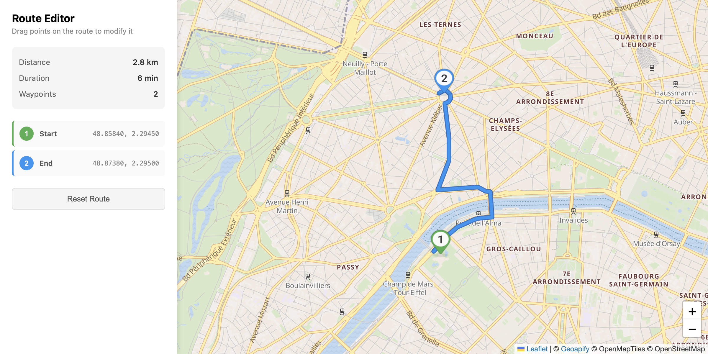

# Route Drag Edit with Leaflet

Interactive route editing demo where you can add via points by hovering and dragging on the route line, and reposition waypoints by dragging markers.

## Quick Summary

- Problem: Allow users to interactively modify routes by adding/removing waypoints.
- Solution: Implement hover detection on route line with floating marker for adding via points.
- Stack: HTML, CSS, JavaScript, Leaflet.
- APIs: Geoapify Routing API, Geoapify Marker Icon API, Geoapify Map Tiles API.

## What This Example Includes

- Leaflet map with Geoapify raster tiles
- Hover-to-reveal floating marker on route line
- Drag floating marker to add via points
- Drag existing markers to reposition waypoints
- Click via markers to remove them
- Real-time route recalculation
- Waypoint list with coordinates
- Source-based run from `src/index.html` (no build step)

## Use Cases

- Build interactive route planners with drag-to-edit functionality.
- Create delivery route optimization interfaces.
- Learn advanced Leaflet interaction patterns.

## Live Demo

[](https://codepen.io/team/geoapify/pen/PwzwPPX)

## Screenshot



## Quick Start

Open [`src/index.html`](./src/index.html) in your browser.

No local server is required.

Note: In rare cases, browser policies or extensions can restrict `file://` access. If that happens, run a local static server and open `src/index.html` via `http://localhost`, or use your IDE's "Open with Live Server" (or similar) option.

## Input and Output

- Input: Initial origin/destination, user drag/click interactions, Geoapify API key.
- Output: Editable route with dynamic via points, updated distance/duration, waypoint list.

## Project Structure

| File | Purpose |
|------|---------|
| `src/index.html` | Source HTML |
| `src/script.js` | Source JavaScript (routing, drag handlers, geometry utils) |
| `src/style.css` | Source CSS |

## Code Samples

### Minimal HTML

```html
<!DOCTYPE html>
<html lang="en">
<head>
  <meta charset="UTF-8">
  <title>Route Drag Edit</title>
  <link rel="stylesheet" href="https://unpkg.com/leaflet@1.9.4/dist/leaflet.css">
  <style>
    #map { height: 500px; }
  </style>
</head>
<body>
  <div id="map"></div>
  <script src="https://unpkg.com/leaflet@1.9.4/dist/leaflet.js"></script>
  <script src="script.js"></script>
</body>
</html>
```

### Minimal JavaScript

```js
// Demo API key for quickstart only.
// Register for your own free API key at https://myprojects.geoapify.com/.
// Benefits: usage analytics, project-level limits, and reliable access for production use.
// This demo key can be blocked or restricted at any time.
const yourAPIKey = "YOUR_API_KEY";

const map = L.map("map").setView([52.52, 13.405], 12);
L.tileLayer(`https://maps.geoapify.com/v1/tile/osm-bright/{z}/{x}/{y}.png?apiKey=${yourAPIKey}`).addTo(map);

let waypoints = [{ lat: 52.5, lon: 13.3 }, { lat: 52.55, lon: 13.5 }];
let routeLine;

async function fetchRoute() {
  const wp = waypoints.map((w) => `${w.lat},${w.lon}`).join("|");
  const res = await fetch(`https://api.geoapify.com/v1/routing?waypoints=${wp}&mode=drive&apiKey=${yourAPIKey}`);
  const data = await res.json();
  if (!data.features?.[0]) return;
  const coords = data.features[0].geometry.coordinates[0].map(([lon, lat]) => [lat, lon]);
  if (routeLine) map.removeLayer(routeLine);
  routeLine = L.polyline(coords, { color: "#3b82f6", weight: 5 }).addTo(map);
}

waypoints.forEach((w, i) => {
  const m = L.marker([w.lat, w.lon], { draggable: true }).addTo(map);
  m.on("dragend", (e) => {
    waypoints[i] = { lat: e.target.getLatLng().lat, lon: e.target.getLatLng().lng };
    fetchRoute();
  });
});

fetchRoute();
```

## Customize

1. Open [`src/script.js`](./src/script.js).
2. Set your own API key in `yourAPIKey`.
3. Modify `INITIAL_WAYPOINTS` for different starting locations.
4. Adjust `ROUTE_STYLES` for different line appearance.
5. Change `MARKER_COLORS` array for custom waypoint colors.

API documentation:
- [Geoapify Routing API](https://apidocs.geoapify.com/docs/routing/)
- [Geoapify Map Tiles API](https://apidocs.geoapify.com/docs/maps/map-tiles/)
- [Geoapify Marker Icon API](https://apidocs.geoapify.com/docs/icon/)

No build step is required. Edit files in `src/` and refresh the browser.

## Troubleshooting

| Problem | Likely Cause | What to Do |
|---------|--------------|------------|
| Map is blank or tiles missing | Leaflet CSS/JS failed to load | Open browser DevTools (`Console` + `Network`) and confirm CDN files load without errors. |
| Map does not load data / API responds `403` | API key is invalid, restricted, or over limits | Get your own free key at `https://myprojects.geoapify.com/`, then update `yourAPIKey` in `src/script.js`. |
| Works inconsistently from local file | Browser policy blocks some `file://` behavior | Open with IDE Live Server (or any local static server) and run from `http://localhost`. |
| Output differs from expected | Local edits introduced a regression | Compare your files with the [CodePen demo](https://codepen.io/team/geoapify/pen/PwzwPPX) and align differences step by step. |

## APIs and Libraries

| Type | Name | Link | API Endpoint Used |
|------|------|------|-------------------|
| API | Geoapify Routing API | [Routing API](https://www.geoapify.com/routing-api/) | `https://api.geoapify.com/v1/routing?waypoints=...&mode=drive&apiKey=...` |
| API | Geoapify Marker Icon API | [Marker Icon API](https://www.geoapify.com/map-marker-icon-api/) | `https://api.geoapify.com/v2/icon?type=awesome&...&apiKey=...` |
| API | Geoapify Map Tiles API | [Map Tiles API](https://www.geoapify.com/map-tiles/) | `https://maps.geoapify.com/v1/tile/osm-bright/{z}/{x}/{y}@2x.png?apiKey=...` |
| Library | Leaflet | [leafletjs.com](https://leafletjs.com/) | Not applicable |

## Related Examples

| Example | Description | Link |
|---------|-------------|------|
| Route Drag Edit MapLibre | Same functionality with MapLibre GL | [Open](../route-drag-edit-maplibre) |
| Route Visualization | Basic route with styling | [Open](../route-visualization-leaflet-styling) |
| Waypoints Collection | Address autocomplete for waypoints | [Open](../waypoints-collection-autocomplete-map) |

## Useful Links

- Geoapify API docs: [https://apidocs.geoapify.com/](https://apidocs.geoapify.com/)
- CodePen demo: [https://codepen.io/team/geoapify/pen/PwzwPPX](https://codepen.io/team/geoapify/pen/PwzwPPX)
- Geoapify CodePen profile: [https://codepen.io/team/geoapify](https://codepen.io/team/geoapify)

## License

MIT

**Keywords**: route editing, drag and drop, via points, interactive routing, Leaflet drag, waypoint management
