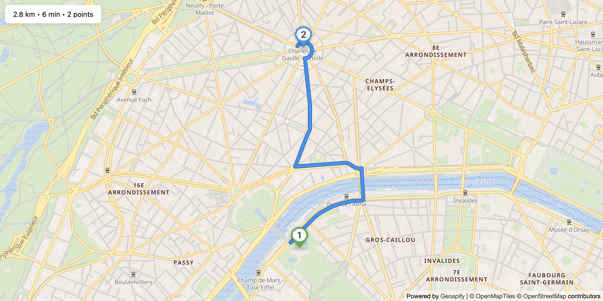

# Route Drag Edit with MapLibre GL

Interactive route editing demo using MapLibre GL JS where you can add via points by hovering and dragging on the route line.

## Quick Summary

- Problem: Allow users to interactively modify routes in a vector map context.
- Solution: Implement route hover detection with floating marker for adding via points using MapLibre GL.
- Stack: HTML, CSS, JavaScript, MapLibre GL JS.
- APIs: Geoapify Routing API, Geoapify Marker Icon API, Geoapify Map Tiles API.

## What This Example Includes

- MapLibre GL JS map with Geoapify vector tiles
- Hover-to-reveal floating marker on route line
- Drag floating marker to add via points
- Drag existing markers to reposition waypoints
- Click via markers to remove them
- Real-time route recalculation
- Route info display (distance, time, waypoint count)
- Source-based run from `src/index.html` (no build step)

## Use Cases

- Build interactive route planners with smooth vector rendering.
- Create delivery route optimization interfaces.
- Learn MapLibre GL interaction patterns for line features.

## Live Demo

[](https://codepen.io/team/geoapify/pen/yyJyYeY)

## Screenshot



## Quick Start

Open [`src/index.html`](./src/index.html) in your browser.

No local server is required.

Note: In rare cases, browser policies or extensions can restrict `file://` access. If that happens, run a local static server and open `src/index.html` via `http://localhost`, or use your IDE's "Open with Live Server" (or similar) option.

## Input and Output

- Input: Initial waypoints, user drag/click interactions, Geoapify API key.
- Output: Editable vector route with dynamic via points, distance/time info.

## Project Structure

| File | Purpose |
|------|---------|
| `src/index.html` | Source HTML |
| `src/script.js` | Source JavaScript (routing, MapLibre layers, drag handlers) |
| `src/style.css` | Source CSS |

## Code Samples

### Minimal HTML

```html
<!DOCTYPE html>
<html lang="en">
<head>
  <meta charset="UTF-8">
  <title>Route Drag Edit - MapLibre</title>
  <link href="https://unpkg.com/maplibre-gl@latest/dist/maplibre-gl.css" rel="stylesheet">
  <script src="https://unpkg.com/maplibre-gl@latest/dist/maplibre-gl.js"></script>
  <style>
    #map { height: 500px; }
  </style>
</head>
<body>
  <div id="map"></div>
  <script src="script.js"></script>
</body>
</html>
```

### Minimal JavaScript

```js
// Demo API key for quickstart only.
// Register for your own free API key at https://myprojects.geoapify.com/.
// Benefits: usage analytics, project-level limits, and reliable access for production use.
// This demo key can be blocked or restricted at any time.
const yourAPIKey = "YOUR_API_KEY";

const map = new maplibregl.Map({
  container: "map",
  style: `https://maps.geoapify.com/v1/styles/osm-bright/style.json?apiKey=${yourAPIKey}`,
  center: [13.405, 52.52],
  zoom: 11
});

let waypoints = [{ lat: 52.5, lon: 13.3 }, { lat: 52.55, lon: 13.5 }];
let markers = [];

async function fetchRoute() {
  const wp = waypoints.map((w) => `${w.lat},${w.lon}`).join("|");
  const res = await fetch(`https://api.geoapify.com/v1/routing?waypoints=${wp}&mode=drive&apiKey=${yourAPIKey}`);
  const data = await res.json();
  if (!data.features?.[0]) return;

  if (map.getSource("route")) map.getSource("route").setData(data.features[0]);
  else {
    map.addSource("route", { type: "geojson", data: data.features[0] });
    map.addLayer({ id: "route", type: "line", source: "route", paint: { "line-color": "#3b82f6", "line-width": 5 } });
  }
}

map.on("load", () => {
  waypoints.forEach((w, i) => {
    const m = new maplibregl.Marker({ draggable: true }).setLngLat([w.lon, w.lat]).addTo(map);
    m.on("dragend", () => {
      const lngLat = m.getLngLat();
      waypoints[i] = { lat: lngLat.lat, lon: lngLat.lng };
      fetchRoute();
    });
    markers.push(m);
  });
  fetchRoute();
});
```

### Find Best Insertion Index

```js
function findBestIndex(lat, lon) {
  let bestIndex = 1;
  let minDist = Infinity;

  for (let i = 0; i < waypoints.length - 1; i++) {
    const dist = distToSegment(
      {lat, lon},
      {lat: waypoints[i].lat, lon: waypoints[i].lon},
      {lat: waypoints[i + 1].lat, lon: waypoints[i + 1].lon}
    );
    if (dist < minDist) {
      minDist = dist;
      bestIndex = i + 1;
    }
  }
  return bestIndex;
}
```

## Customize

1. Open [`src/script.js`](./src/script.js).
2. Set your own API key in `yourAPIKey`.
3. Modify initial `waypoints` array for different starting locations.
4. Adjust `MARKER_COLORS` for custom waypoint colors.
5. Change route layer paint properties for different styling.

API documentation:
- [Geoapify Routing API](https://apidocs.geoapify.com/docs/routing/)
- [Geoapify Map Tiles API](https://apidocs.geoapify.com/docs/maps/map-tiles/)
- [Geoapify Marker Icon API](https://apidocs.geoapify.com/docs/icon/)

No build step is required. Edit files in `src/` and refresh the browser.

## Troubleshooting

| Problem | Likely Cause | What to Do |
|---------|--------------|------------|
| Map is blank or unstyled | MapLibre assets failed to load | Open browser DevTools (`Console` + `Network`) and confirm CDN files load without errors. |
| Map does not load data / API responds `403` | API key is invalid, restricted, or over limits | Get your own free key at `https://myprojects.geoapify.com/`, then update `yourAPIKey` in `src/script.js`. |
| Works inconsistently from local file | Browser policy blocks some `file://` behavior | Open with IDE Live Server (or any local static server) and run from `http://localhost`. |
| Output differs from expected | Local edits introduced a regression | Compare your files with the [CodePen demo](https://codepen.io/team/geoapify/pen/yyJyYeY) and align differences step by step. |

## APIs and Libraries

| Type | Name | Link | API Endpoint Used |
|------|------|------|-------------------|
| API | Geoapify Routing API | [Routing API](https://www.geoapify.com/routing-api/) | `https://api.geoapify.com/v1/routing?waypoints=...&mode=drive&apiKey=...` |
| API | Geoapify Marker Icon API | [Marker Icon API](https://www.geoapify.com/map-marker-icon-api/) | `https://api.geoapify.com/v2/icon?type=awesome&...&apiKey=...` |
| API | Geoapify Map Tiles API | [Map Tiles API](https://www.geoapify.com/map-tiles/) | `https://maps.geoapify.com/v1/styles/osm-bright/style.json?apiKey=...` |
| Library | MapLibre GL JS | [maplibre.org](https://maplibre.org/) | Not applicable |

## Related Examples

| Example | Description | Link |
|---------|-------------|------|
| Route Drag Edit Leaflet | Same functionality with Leaflet | [Open](../route-drag-edit-leaflet) |
| Route Styling MapLibre | Route styling controls | [Open](../route-visualization-maplibre-gl-styling) |
| Multiple Routes MapLibre | Multiple routes with offset | [Open](../multiple-routes-maplibre-gl-visualization) |

## Useful Links

- Geoapify API docs: [https://apidocs.geoapify.com/](https://apidocs.geoapify.com/)
- CodePen demo: [https://codepen.io/team/geoapify/pen/yyJyYeY](https://codepen.io/team/geoapify/pen/yyJyYeY)
- Geoapify CodePen profile: [https://codepen.io/team/geoapify](https://codepen.io/team/geoapify)

## License

MIT

**Keywords**: MapLibre route editing, drag and drop, via points, interactive routing, vector map, waypoint management
