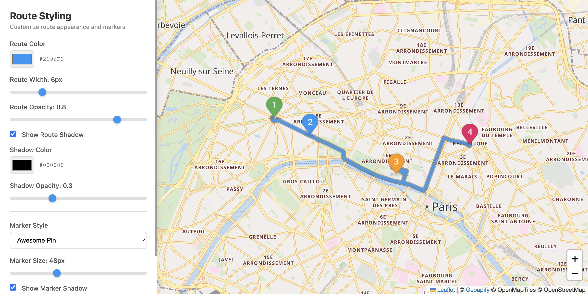

# Route Visualization with Leaflet Styling Controls

Interactive route visualization demo with real-time styling controls for route color, width, opacity, shadow effects, and marker customization.

## Quick Summary

- Problem: Customize route appearance with dynamic styling options.
- Solution: Render Routing API response with adjustable line styles, shadows, and marker icons.
- Stack: HTML, CSS, JavaScript, Leaflet.
- APIs: Geoapify Routing API, Geoapify Marker Icon API, Geoapify Map Tiles API.

## What This Example Includes

- Leaflet map with Geoapify raster tiles
- Real-time route styling controls (color, width, opacity)
- Shadow/outline effect toggle with separate controls
- Multiple marker icon types (awesome, material, circle)
- Marker size and shadow controls
- Reset to defaults functionality
- Source-based run from `src/index.html` (no build step)

## Use Cases

- Build route customization interfaces for navigation apps.
- Learn how to dynamically update Leaflet layer styles.
- Experiment with different route visualization approaches.

## Live Demo

[](https://codepen.io/team/geoapify/pen/OPXPyVr)

## Screenshot



## Quick Start

Open [`src/index.html`](./src/index.html) in your browser.

No local server is required.

Note: In rare cases, browser policies or extensions can restrict `file://` access. If that happens, run a local static server and open `src/index.html` via `http://localhost`, or use your IDE's "Open with Live Server" (or similar) option.

## Input and Output

- Input: Waypoint coordinates, styling parameters (color, width, opacity), marker settings, Geoapify API key.
- Output: Interactive route with real-time styling updates, custom waypoint markers with popups.

## Project Structure

| File | Purpose |
|------|---------|
| `src/index.html` | Source HTML |
| `src/script.js` | Source JavaScript (routing, rendering, UI handlers) |
| `src/style.css` | Source CSS |

## Code Samples

### Minimal HTML

```html
<!DOCTYPE html>
<html lang="en">
<head>
  <meta charset="UTF-8">
  <title>Route Visualization</title>
  <link rel="stylesheet" href="https://unpkg.com/leaflet@1.9.4/dist/leaflet.css">
  <style>
    #map { height: 500px; }
  </style>
</head>
<body>
  <div id="map"></div>
  <script src="https://unpkg.com/leaflet@1.9.4/dist/leaflet.js"></script>
  <script src="script.js"></script>
</body>
</html>
```

### Minimal JavaScript

```js
// Demo API key for quickstart only.
// Register for your own free API key at https://myprojects.geoapify.com/.
// Benefits: usage analytics, project-level limits, and reliable access for production use.
// This demo key can be blocked or restricted at any time.
const yourAPIKey = "YOUR_API_KEY";

const map = L.map("map").setView([52.52, 13.405], 11);
L.tileLayer(`https://maps.geoapify.com/v1/tile/osm-bright/{z}/{x}/{y}.png?apiKey=${yourAPIKey}`).addTo(map);

map.createPane("route-shadow");
map.getPane("route-shadow").style.zIndex = 399;
map.createPane("route-line");
map.getPane("route-line").style.zIndex = 400;

const waypoints = "52.5,13.3|52.55,13.5";
fetch(`https://api.geoapify.com/v1/routing?waypoints=${waypoints}&mode=drive&apiKey=${yourAPIKey}`)
  .then((r) => r.json())
  .then((data) => {
    if (!data.features?.[0]) return;
    L.geoJSON(data.features[0], { pane: "route-shadow", style: { color: "#1e40af", weight: 10, opacity: 0.4 } }).addTo(map);
    L.geoJSON(data.features[0], { pane: "route-line", style: { color: "#3b82f6", weight: 5 } }).addTo(map);
  });
```

## Customize

1. Open [`src/script.js`](./src/script.js).
2. Set your own API key in `yourAPIKey`.
3. Modify `waypoints` array for different locations.
4. Adjust `DEFAULTS` object for different initial styles.
5. Add more marker types by extending `createMarkerIcon()`.

API documentation:
- [Geoapify Routing API](https://apidocs.geoapify.com/docs/routing/)
- [Geoapify Map Tiles API](https://apidocs.geoapify.com/docs/maps/map-tiles/)
- [Geoapify Marker Icon API](https://apidocs.geoapify.com/docs/icon/)

No build step is required. Edit files in `src/` and refresh the browser.

## Troubleshooting

| Problem | Likely Cause | What to Do |
|---------|--------------|------------|
| Map is blank or tiles missing | Leaflet CSS/JS failed to load | Open browser DevTools (`Console` + `Network`) and confirm CDN files load without errors. |
| Map does not load data / API responds `403` | API key is invalid, restricted, or over limits | Get your own free key at `https://myprojects.geoapify.com/`, then update `yourAPIKey` in `src/script.js`. |
| Works inconsistently from local file | Browser policy blocks some `file://` behavior | Open with IDE Live Server (or any local static server) and run from `http://localhost`. |
| Output differs from expected | Local edits introduced a regression | Compare your files with the [CodePen demo](https://codepen.io/team/geoapify/pen/OPXPyVr) and align differences step by step. |

## APIs and Libraries

| Type | Name | Link | API Endpoint Used |
|------|------|------|-------------------|
| API | Geoapify Routing API | [Routing API](https://www.geoapify.com/routing-api/) | `https://api.geoapify.com/v1/routing?waypoints=...&mode=drive&apiKey=...` |
| API | Geoapify Marker Icon API | [Marker Icon API](https://www.geoapify.com/map-marker-icon-api/) | `https://api.geoapify.com/v2/icon?type=...&color=...&text=...&apiKey=...` |
| API | Geoapify Map Tiles API | [Map Tiles API](https://www.geoapify.com/map-tiles/) | `https://maps.geoapify.com/v1/tile/osm-bright/{z}/{x}/{y}@2x.png?apiKey=...` |
| Library | Leaflet | [leafletjs.com](https://leafletjs.com/) | Not applicable |

## Related Examples

| Example | Description | Link |
|---------|-------------|------|
| Route Styling MapLibre | Same controls with MapLibre GL | [Open](../route-visualization-maplibre-gl-styling) |
| Route Visualization | Basic route with turn-by-turn instructions | [Open](../visualizing-geojson-routes-with-leaflet-and-geoapify-routing-api) |
| Route Drag Edit | Add via points by dragging | [Open](../route-drag-edit-leaflet) |

## Useful Links

- Geoapify API docs: [https://apidocs.geoapify.com/](https://apidocs.geoapify.com/)
- CodePen demo: [https://codepen.io/team/geoapify/pen/OPXPyVr](https://codepen.io/team/geoapify/pen/OPXPyVr)
- Geoapify CodePen profile: [https://codepen.io/team/geoapify](https://codepen.io/team/geoapify)

## License

MIT

**Keywords**: route styling, Leaflet customization, route color, marker icons, shadow effect, Geoapify Routing
