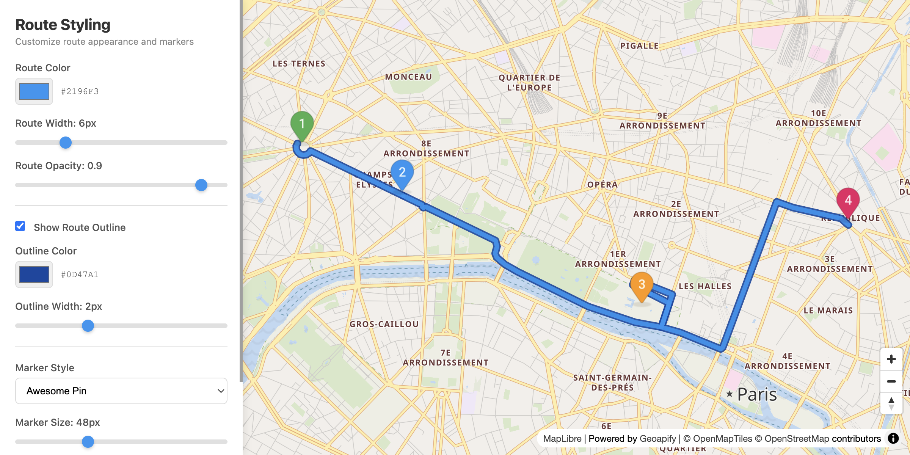

# Route Visualization with MapLibre GL Styling Controls

Interactive route visualization demo with real-time styling controls using MapLibre GL JS for smooth vector rendering.

## Quick Summary

- Problem: Customize route appearance with dynamic styling in a vector map context.
- Solution: Use MapLibre GL paint properties to dynamically update route line styles and offsets.
- Stack: HTML, CSS, JavaScript, MapLibre GL JS.
- APIs: Geoapify Routing API, Geoapify Marker Icon API, Geoapify Map Tiles API.

## What This Example Includes

- MapLibre GL JS map with Geoapify vector tiles
- Real-time route styling controls (color, width, opacity)
- Outline effect with separate color and width controls
- Multiple marker icon types (awesome, material, circle)
- Marker size and shadow controls
- Reset to defaults functionality
- Source-based run from `src/index.html` (no build step)

## Use Cases

- Build route customization interfaces for vector map applications.
- Learn MapLibre GL paint property manipulation.
- Create smooth, scalable route visualizations.

## Live Demo

[](https://codepen.io/team/geoapify/pen/WbxbQvq)

## Screenshot



## Quick Start

Open [`src/index.html`](./src/index.html) in your browser.

No local server is required.

Note: In rare cases, browser policies or extensions can restrict `file://` access. If that happens, run a local static server and open `src/index.html` via `http://localhost`, or use your IDE's "Open with Live Server" (or similar) option.

## Input and Output

- Input: Waypoint coordinates, styling parameters, marker settings, Geoapify API key.
- Output: Interactive vector route with real-time paint property updates, custom DOM-based markers.

## Project Structure

| File | Purpose |
|------|---------|
| `src/index.html` | Source HTML |
| `src/script.js` | Source JavaScript (routing, layer management, UI handlers) |
| `src/style.css` | Source CSS |

## Code Samples

### Minimal HTML

```html
<!DOCTYPE html>
<html lang="en">
<head>
  <meta charset="UTF-8">
  <title>Route Visualization - MapLibre</title>
  <link href="https://unpkg.com/maplibre-gl@latest/dist/maplibre-gl.css" rel="stylesheet">
  <script src="https://unpkg.com/maplibre-gl@latest/dist/maplibre-gl.js"></script>
  <style>
    #map { height: 500px; }
  </style>
</head>
<body>
  <div id="map"></div>
  <script src="script.js"></script>
</body>
</html>
```

### Minimal JavaScript

```js
// Demo API key for quickstart only.
// Register for your own free API key at https://myprojects.geoapify.com/.
// Benefits: usage analytics, project-level limits, and reliable access for production use.
// This demo key can be blocked or restricted at any time.
const yourAPIKey = "YOUR_API_KEY";

const map = new maplibregl.Map({
  container: "map",
  style: `https://maps.geoapify.com/v1/styles/osm-bright/style.json?apiKey=${yourAPIKey}`,
  center: [13.405, 52.52],
  zoom: 11
});

const waypoints = "52.5,13.3|52.55,13.5";

map.on("load", async () => {
  const res = await fetch(`https://api.geoapify.com/v1/routing?waypoints=${waypoints}&mode=drive&apiKey=${yourAPIKey}`);
  const data = await res.json();
  if (!data.features?.[0]) return;

  map.addSource("route", { type: "geojson", data: data.features[0] });
  map.addLayer({
    id: "route-outline", type: "line", source: "route",
    paint: { "line-color": "#1e40af", "line-width": 10, "line-opacity": 0.5 }
  });
  map.addLayer({
    id: "route-line", type: "line", source: "route",
    paint: { "line-color": "#3b82f6", "line-width": 5 }
  });
});
```

### Create DOM-Based Markers

```js
function renderMarkers() {
  waypoints.forEach((wp, idx) => {
    const el = document.createElement("div");
    el.style.backgroundImage = `url(${createMarkerUrl(markerType, color, idx + 1, markerSize)})`;
    
    const popup = new maplibregl.Popup({offset: dimensions.popupOffset})
      .setHTML(`<strong>${wp.name}</strong>`);

    new maplibregl.Marker({element: el, anchor: dimensions.anchor})
      .setLngLat([wp.lon, wp.lat])
      .setPopup(popup)
      .addTo(map);
  });
}
```

## Customize

1. Open [`src/script.js`](./src/script.js).
2. Set your own API key in `yourAPIKey`.
3. Modify `waypoints` array for different locations.
4. Adjust `DEFAULTS` object for different initial styles.
5. Add custom paint properties for advanced styling.

API documentation:
- [Geoapify Routing API](https://apidocs.geoapify.com/docs/routing/)
- [Geoapify Map Tiles API](https://apidocs.geoapify.com/docs/maps/map-tiles/)
- [Geoapify Marker Icon API](https://apidocs.geoapify.com/docs/icon/)

No build step is required. Edit files in `src/` and refresh the browser.

## Troubleshooting

| Problem | Likely Cause | What to Do |
|---------|--------------|------------|
| Map is blank or unstyled | MapLibre assets failed to load | Open browser DevTools (`Console` + `Network`) and confirm CDN files load without errors. |
| Map does not load data / API responds `403` | API key is invalid, restricted, or over limits | Get your own free key at `https://myprojects.geoapify.com/`, then update `yourAPIKey` in `src/script.js`. |
| Works inconsistently from local file | Browser policy blocks some `file://` behavior | Open with IDE Live Server (or any local static server) and run from `http://localhost`. |
| Output differs from expected | Local edits introduced a regression | Compare your files with the [CodePen demo](https://codepen.io/team/geoapify/pen/WbxbQvq) and align differences step by step. |

## APIs and Libraries

| Type | Name | Link | API Endpoint Used |
|------|------|------|-------------------|
| API | Geoapify Routing API | [Routing API](https://www.geoapify.com/routing-api/) | `https://api.geoapify.com/v1/routing?waypoints=...&mode=drive&apiKey=...` |
| API | Geoapify Marker Icon API | [Marker Icon API](https://www.geoapify.com/map-marker-icon-api/) | `https://api.geoapify.com/v2/icon?type=...&color=...&apiKey=...` |
| API | Geoapify Map Tiles API | [Map Tiles API](https://www.geoapify.com/map-tiles/) | `https://maps.geoapify.com/v1/styles/osm-bright/style.json?apiKey=...` |
| Library | MapLibre GL JS | [maplibre.org](https://maplibre.org/) | Not applicable |

## Related Examples

| Example | Description | Link |
|---------|-------------|------|
| Route Styling Leaflet | Same controls with Leaflet | [Open](../route-visualization-leaflet-styling) |
| Route Drag Edit MapLibre | Add via points by dragging | [Open](../route-drag-edit-maplibre) |
| Multiple Routes MapLibre | Multiple routes with offset | [Open](../multiple-routes-maplibre-gl-visualization) |

## Useful Links

- Geoapify API docs: [https://apidocs.geoapify.com/](https://apidocs.geoapify.com/)
- CodePen demo: [https://codepen.io/team/geoapify/pen/WbxbQvq](https://codepen.io/team/geoapify/pen/WbxbQvq)
- Geoapify CodePen profile: [https://codepen.io/team/geoapify](https://codepen.io/team/geoapify)

## License

MIT

**Keywords**: MapLibre route styling, vector route, paint properties, dynamic styling, Geoapify Routing
